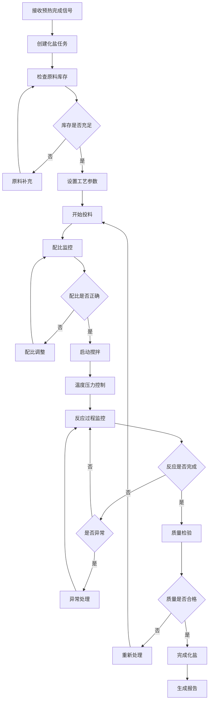
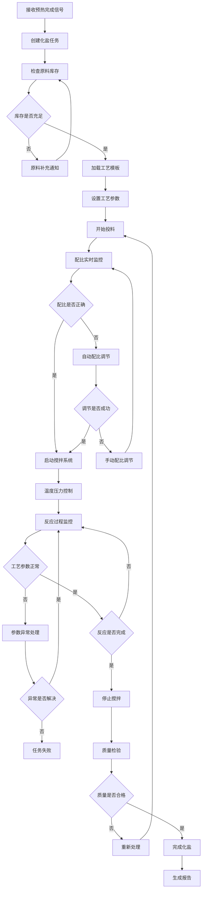

# 化盐工艺管理模块 - 子模块设计文档

## 1. 模块概述

### 1.1 功能定位
化盐工艺管理模块是整个化盐项目工艺流程的核心模块，负责二元化盐和三元化盐工艺的精确控制和管理。该模块在预热完成后接管工艺流程，通过精确的配比控制、温度管理和工艺参数监控，确保化盐工艺的质量和效率。

### 1.2 业务价值
- **工艺精确控制**：实现化盐工艺参数的精确控制和自动化管理
- **配比精度保障**：确保二元化盐和三元化盐的配比精度达到工艺要求
- **质量稳定性**：通过标准化工艺流程保证产品质量的稳定性
- **效率优化**：优化工艺参数和流程，提高化盐效率和产量
- **成本控制**：通过精确配比和工艺优化降低原料消耗和能耗

### 1.3 模块边界
- **上游依赖**：预热管理模块（预热完成信号）、项目管理模块（工艺配置）
- **下游服务**：提温工艺管理模块（化盐完成信号）、质量管理模块（质量检验）
- **外部集成**：配料系统、温控系统、搅拌系统、流量控制系统

## 2. 功能需求清单

### 2.1 化盐任务管理
- **任务创建**：基于项目配置和预热完成信号自动创建化盐任务
- **任务调度**：智能调度化盐任务，优化设备利用率
- **任务监控**：实时监控化盐任务的执行状态和关键参数
- **任务报告**：生成详细的化盐任务执行报告和分析

### 2.2 工艺参数控制
- **温度控制**：精确控制化盐过程中的温度参数
  - 支持分段温度控制（初始温度、反应温度、稳定温度）
  - 温度梯度控制（升温速率、降温速率）
  - 温度均匀性监控（多点温度监测）
  - 温度异常自动调节和报警
- **压力控制**：监控和控制化盐过程中的压力变化
  - 反应压力监控（0.1-4.0MPa范围）
  - 压力稳定性控制（±0.05MPa精度）
  - 压力异常预警和保护
- **搅拌控制**：控制搅拌速度和搅拌时间
  - 分阶段搅拌控制（慢速混合、快速反应、稳定搅拌）
  - 搅拌功率监控
  - 搅拌均匀性检测
- **流量控制**：控制原料投入的流量和速度
  - 精确流量计量（±1%精度）
  - 流量曲线控制
  - 流量异常检测和处理

### 2.3 配比管理
- **二元化盐配比**：NaNO3 + KNO3 配比管理
  - 标准配比：60% NaNO3 + 40% KNO3
  - 配比容差：±0.5%
  - 实时配比监控和调整
- **三元化盐配比**：NaNO3 + KNO3 + Ca(NO3)2 配比管理
  - 标准配比：54% NaNO3 + 35% KNO3 + 11% Ca(NO3)2
  - 配比容差：±0.3%
  - 三元配比精度控制
- **配比验证**：配比精度验证和偏差分析
- **自动调节**：配比偏差自动调节和补偿

### 2.4 化盐巡检管理
- **巡检计划**：制定化盐过程的巡检计划和检查点
- **现场巡检**：支持移动端现场巡检和数据录入
- **异常记录**：记录巡检过程中发现的异常情况
- **处理跟踪**：跟踪异常处理过程和结果

## 3. 页面设计规范

### 3.1 页面布局设计

#### 3.1.1 化盐任务列表页面
```
┌─────────────────────────────────────────────────────────────┐
│ 面包屑导航: 首页 > ERP管理 > 化盐工艺流程 > 化盐工艺          │
├─────────────────────────────────────────────────────────────┤
│ 搜索筛选区域                                                │
│ [项目名称] [任务状态] [化盐类型] [熔盐罐] [时间范围] [搜索]   │
├─────────────────────────────────────────────────────────────┤
│ 操作按钮区域                                                │
│ [新增任务] [批量操作] [工艺模板] [导出] [刷新]               │
├─────────────────────────────────────────────────────────────┤
│ 任务列表表格                                                │
│ ☑ │任务编码│项目│化盐类型│配比│状态│进度│产量│操作员│操作     │
│ ☐ │SM001  │项目A│二元化盐│60:40│进行中│75%│2.5t│张三│查看执行 │
├─────────────────────────────────────────────────────────────┤
│ 分页组件                                                    │
│ 共80条 [10条/页] [上一页] 1 2 3 [下一页]                    │
└─────────────────────────────────────────────────────────────┘
```

#### 3.1.2 化盐工艺执行监控页面
```
┌─────────────────────────────────────────────────────────────┐
│ 任务信息栏                                                  │
│ 任务编码: SM001  项目: 化盐项目A  类型: 二元化盐             │
│ 配比: 60% NaNO3 + 40% KNO3  目标产量: 5.0t  操作员: 张三     │
├─────────────────────────────────────────────────────────────┤
│ 实时监控面板                                                │
│ ┌─────────────┐ ┌─────────────┐ ┌─────────────┐             │
│ │   反应温度   │ │   反应压力   │ │   搅拌状态   │             │
│ │   485°C     │ │   2.2MPa    │ │   正常运行   │             │
│ │   目标480°C  │ │   目标2.0MPa │ │   转速120rpm │             │
│ └─────────────┘ └─────────────┘ └─────────────┘             │
├─────────────────────────────────────────────────────────────┤
│ 配比监控面板                                                │
│ ┌─────────────┐ ┌─────────────┐ ┌─────────────┐             │
│ │   NaNO3     │ │    KNO3     │ │   总投料量   │             │
│ │   60.2%     │ │   39.8%     │ │   3.2t      │             │
│ │   偏差+0.2%  │ │   偏差-0.2% │ │   进度64%    │             │
│ └─────────────┘ └─────────────┘ └─────────────┘             │
├─────────────────────────────────────────────────────────────┤
│ 工艺曲线图表                                                │
│ [温度曲线] [压力曲线] [配比监控] [流量监控] [搅拌监控]        │
│ (实时更新的工艺参数图表)                                    │
├─────────────────────────────────────────────────────────────┤
│ 操作控制区域                                                │
│ [开始化盐] [暂停] [调整参数] [紧急停止] [完成化盐]           │
└─────────────────────────────────────────────────────────────┘
```

### 3.2 组件设计规范

#### 3.2.1 配比监控组件
```vue
<template>
  <div class="ratio-monitor">
    <div class="ratio-header">
      <h4>{{ saltType === 'BINARY' ? '二元化盐配比' : '三元化盐配比' }}</h4>
      <el-tag :type="getRatioStatusType()">
        {{ getRatioStatusText() }}
      </el-tag>
    </div>
    
    <div class="ratio-content">
      <div class="ratio-items">
        <div 
          v-for="item in ratioItems" 
          :key="item.component"
          class="ratio-item"
          :class="{ 'ratio-warning': isRatioWarning(item) }"
        >
          <div class="component-name">{{ item.componentName }}</div>
          <div class="ratio-value">
            <span class="current-ratio">{{ item.currentRatio.toFixed(1) }}%</span>
            <span class="target-ratio">(目标: {{ item.targetRatio }}%)</span>
          </div>
          <div class="ratio-deviation">
            <span :class="getDeviationClass(item.deviation)">
              偏差: {{ item.deviation > 0 ? '+' : '' }}{{ item.deviation.toFixed(2) }}%
            </span>
          </div>
          <div class="ratio-progress">
            <el-progress
              :percentage="(item.actualAmount / item.targetAmount) * 100"
              :status="getProgressStatus(item)"
              :stroke-width="6"
            />
            <span class="amount-text">
              {{ item.actualAmount.toFixed(2) }}t / {{ item.targetAmount.toFixed(2) }}t
            </span>
          </div>
        </div>
      </div>
      
      <div class="ratio-chart">
        <el-chart
          :option="ratioChartOption"
          :height="200"
          auto-resize
        />
      </div>
      
      <div class="ratio-controls" v-if="canAdjust">
        <el-button 
          type="primary" 
          size="small"
          @click="handleAutoAdjust"
          :loading="adjusting"
        >
          自动调节
        </el-button>
        <el-button 
          type="warning" 
          size="small"
          @click="showManualAdjust = true"
        >
          手动调节
        </el-button>
      </div>
    </div>
    
    <!-- 手动调节对话框 -->
    <el-dialog
      v-model="showManualAdjust"
      title="手动调节配比"
      width="600px"
    >
      <ManualRatioAdjustForm
        :ratio-items="ratioItems"
        @confirm="handleManualAdjust"
        @cancel="showManualAdjust = false"
      />
    </el-dialog>
  </div>
</template>

<script setup lang="ts">
interface Props {
  saltType: 'BINARY' | 'TERNARY';
  ratioItems: RatioItem[];
  canAdjust: boolean;
}

interface RatioItem {
  component: string;
  componentName: string;
  targetRatio: number;
  currentRatio: number;
  deviation: number;
  targetAmount: number;
  actualAmount: number;
  tolerance: number;
}

const props = defineProps<Props>();

const showManualAdjust = ref(false);
const adjusting = ref(false);

const getRatioStatusType = () => {
  const maxDeviation = Math.max(...props.ratioItems.map(item => Math.abs(item.deviation)));
  if (maxDeviation > 0.5) return 'danger';
  if (maxDeviation > 0.3) return 'warning';
  return 'success';
};

const getRatioStatusText = () => {
  const maxDeviation = Math.max(...props.ratioItems.map(item => Math.abs(item.deviation)));
  if (maxDeviation > 0.5) return '配比异常';
  if (maxDeviation > 0.3) return '配比偏差';
  return '配比正常';
};

const isRatioWarning = (item: RatioItem) => {
  return Math.abs(item.deviation) > item.tolerance;
};

const getDeviationClass = (deviation: number) => {
  const abs = Math.abs(deviation);
  if (abs > 0.5) return 'deviation-error';
  if (abs > 0.3) return 'deviation-warning';
  return 'deviation-normal';
};

const getProgressStatus = (item: RatioItem) => {
  if (Math.abs(item.deviation) > 0.5) return 'exception';
  return undefined;
};

const handleAutoAdjust = async () => {
  adjusting.value = true;
  try {
    await autoAdjustRatio(props.ratioItems);
    ElMessage.success('配比自动调节完成');
  } catch (error) {
    ElMessage.error('配比调节失败');
  } finally {
    adjusting.value = false;
  }
};

const handleManualAdjust = async (adjustments: RatioAdjustment[]) => {
  try {
    await manualAdjustRatio(adjustments);
    ElMessage.success('配比手动调节完成');
    showManualAdjust.value = false;
  } catch (error) {
    ElMessage.error('配比调节失败');
  }
};
</script>
```

### 3.3 交互流程设计

#### 3.3.1 化盐工艺执行流程


## 4. API接口设计

### 4.1 接口列表

#### 4.1.1 化盐任务管理接口
```typescript
// 查询化盐任务列表
GET /erp/saltprocess/saltmaking-task/list
// 权限: erp:saltprocess:saltmaking-task:list

// 获取化盐任务详情
GET /erp/saltprocess/saltmaking-task/{id}
// 权限: erp:saltprocess:saltmaking-task:query

// 创建化盐任务
POST /erp/saltprocess/saltmaking-task
// 权限: erp:saltprocess:saltmaking-task:add

// 更新化盐任务
PUT /erp/saltprocess/saltmaking-task
// 权限: erp:saltprocess:saltmaking-task:edit

// 开始化盐任务
POST /erp/saltprocess/saltmaking-task/{id}/start
// 权限: erp:saltprocess:saltmaking-task:execute

// 完成化盐任务
POST /erp/saltprocess/saltmaking-task/{id}/complete
// 权限: erp:saltprocess:saltmaking-task:execute
```

#### 4.1.2 工艺参数控制接口
```typescript
// 获取实时工艺参数
GET /erp/saltprocess/process-params/realtime/{taskId}
// 权限: erp:saltprocess:process-params:query

// 更新工艺参数
PUT /erp/saltprocess/process-params/{taskId}
// 权限: erp:saltprocess:process-params:control

// 获取参数历史曲线
GET /erp/saltprocess/process-params/history/{taskId}
// 权限: erp:saltprocess:process-params:query

// 执行参数调节
POST /erp/saltprocess/process-params/{taskId}/adjust
// 权限: erp:saltprocess:process-params:control
```

#### 4.1.3 配比管理接口
```typescript
// 获取配比监控数据
GET /erp/saltprocess/ratio-monitor/{taskId}
// 权限: erp:saltprocess:ratio:query

// 执行配比调节
POST /erp/saltprocess/ratio-adjust/{taskId}
// 权限: erp:saltprocess:ratio:control

// 获取配比历史记录
GET /erp/saltprocess/ratio-history/{taskId}
// 权限: erp:saltprocess:ratio:query
```

### 4.2 请求响应格式

#### 4.2.1 化盐任务查询请求
```typescript
interface SaltmakingTaskQuery {
  pageNum?: number;
  pageSize?: number;
  projectId?: string;
  taskCode?: string;
  saltType?: SaltType;
  status?: SaltmakingTaskStatus;
  tankId?: string;
  operatorId?: string;
  startTime?: string;
  endTime?: string;
}
```

#### 4.2.2 化盐任务详情响应
```typescript
interface SaltmakingTaskVO {
  id: string;
  taskCode: string;
  projectId: string;
  projectName: string;
  saltType: SaltType;
  tankId: string;
  tankName: string;
  targetOutput: number;
  actualOutput?: number;
  ratioConfig: RatioConfig;
  processParams: ProcessParams;
  status: SaltmakingTaskStatus;
  progress: number;
  operatorId: string;
  operatorName: string;
  plannedStartTime: string;
  plannedEndTime: string;
  actualStartTime?: string;
  actualEndTime?: string;
  qualityResult?: QualityResult;
  remarks?: string;
  createTime: string;
  updateTime: string;
}
```

#### 4.2.3 工艺参数响应
```typescript
interface ProcessParamsVO {
  taskId: string;
  temperature: number;
  targetTemperature: number;
  pressure: number;
  targetPressure: number;
  stirringSpeed: number;
  targetStirringSpeed: number;
  stirringPower: number;
  flowRate: number;
  controlMode: 'AUTO' | 'MANUAL';
  equipmentStatus: string;
  recordTime: string;
}
```

#### 4.2.4 配比监控响应
```typescript
interface RatioMonitorVO {
  taskId: string;
  saltType: SaltType;
  ratioItems: RatioItemVO[];
  totalAmount: number;
  targetAmount: number;
  overallDeviation: number;
  status: 'NORMAL' | 'WARNING' | 'ERROR';
  recordTime: string;
}

interface RatioItemVO {
  component: string;
  componentName: string;
  targetRatio: number;
  currentRatio: number;
  deviation: number;
  targetAmount: number;
  actualAmount: number;
  tolerance: number;
  status: 'NORMAL' | 'WARNING' | 'ERROR';
}
```

### 4.3 权限控制设计
```typescript
// 化盐工艺权限配置
const saltmakingPermissions = {
  'erp:saltprocess:saltmaking-task:list': '查询化盐任务列表',
  'erp:saltprocess:saltmaking-task:query': '查询化盐任务详情',
  'erp:saltprocess:saltmaking-task:add': '新增化盐任务',
  'erp:saltprocess:saltmaking-task:edit': '编辑化盐任务',
  'erp:saltprocess:saltmaking-task:remove': '删除化盐任务',
  'erp:saltprocess:saltmaking-task:execute': '执行化盐任务',
  'erp:saltprocess:process-params:query': '查询工艺参数',
  'erp:saltprocess:process-params:control': '控制工艺参数',
  'erp:saltprocess:ratio:query': '查询配比数据',
  'erp:saltprocess:ratio:control': '控制配比调节'
};
```

## 5. 数据模型设计

### 5.1 核心实体设计

#### 5.1.1 化盐任务实体 (SaltmakingTask)
```typescript
interface SaltmakingTask {
  id: string;                          // 任务ID
  taskCode: string;                    // 任务编码
  projectId: string;                   // 项目ID
  preheatingTaskId: string;            // 预热任务ID
  saltType: SaltType;                  // 化盐类型
  tankId: string;                      // 熔盐罐ID
  targetOutput: number;                // 目标产量(t)
  actualOutput?: number;               // 实际产量(t)
  ratioConfigId: string;               // 配比配置ID
  processParamsId: string;             // 工艺参数ID
  status: SaltmakingTaskStatus;        // 任务状态
  progress: number;                    // 执行进度(0-100)
  operatorId: string;                  // 操作员ID
  plannedStartTime: Date;              // 计划开始时间
  plannedEndTime: Date;                // 计划结束时间
  actualStartTime?: Date;              // 实际开始时间
  actualEndTime?: Date;                // 实际结束时间
  qualityResultId?: string;            // 质量检验结果ID
  remarks?: string;                    // 备注
  createBy: string;                    // 创建人
  createTime: Date;                    // 创建时间
  updateBy?: string;                   // 更新人
  updateTime?: Date;                   // 更新时间
  delFlag: string;                     // 删除标志
}
```

#### 5.1.2 配比配置实体 (RatioConfig)
```typescript
interface RatioConfig {
  id: string;                          // 配置ID
  saltType: SaltType;                  // 化盐类型
  configName: string;                  // 配置名称
  ratioItems: RatioConfigItem[];       // 配比项目
  tolerance: number;                   // 总体容差
  isDefault: boolean;                  // 是否默认配置
  isActive: boolean;                   // 是否启用
  createBy: string;                    // 创建人
  createTime: Date;                    // 创建时间
}

interface RatioConfigItem {
  component: string;                   // 组分代码
  componentName: string;               // 组分名称
  targetRatio: number;                 // 目标配比(%)
  tolerance: number;                   // 配比容差(%)
  priority: number;                    // 优先级
}
```

#### 5.1.3 工艺参数实体 (ProcessParams)
```typescript
interface ProcessParams {
  id: string;                          // 参数ID
  taskId: string;                      // 任务ID
  recordTime: Date;                    // 记录时间
  temperature: number;                 // 当前温度(°C)
  targetTemperature: number;           // 目标温度(°C)
  pressure: number;                    // 当前压力(MPa)
  targetPressure: number;              // 目标压力(MPa)
  stirringSpeed: number;               // 搅拌速度(rpm)
  targetStirringSpeed: number;         // 目标搅拌速度(rpm)
  stirringPower: number;               // 搅拌功率(kW)
  flowRate: number;                    // 流量(t/h)
  controlMode: ControlMode;            // 控制模式
  equipmentStatus: string;             // 设备状态
  isAbnormal: boolean;                 // 是否异常
  abnormalReason?: string;             // 异常原因
  operatorId: string;                  // 操作员ID
}
```

#### 5.1.4 配比监控实体 (RatioMonitor)
```typescript
interface RatioMonitor {
  id: string;                          // 监控ID
  taskId: string;                      // 任务ID
  recordTime: Date;                    // 记录时间
  saltType: SaltType;                  // 化盐类型
  ratioItems: RatioMonitorItem[];      // 配比监控项
  totalAmount: number;                 // 总投料量(t)
  targetAmount: number;                // 目标投料量(t)
  overallDeviation: number;            // 总体偏差(%)
  status: RatioStatus;                 // 配比状态
  operatorId: string;                  // 操作员ID
}

interface RatioMonitorItem {
  component: string;                   // 组分代码
  targetRatio: number;                 // 目标配比(%)
  currentRatio: number;                // 当前配比(%)
  deviation: number;                   // 偏差(%)
  targetAmount: number;                // 目标投料量(t)
  actualAmount: number;                // 实际投料量(t)
  status: RatioItemStatus;             // 配比项状态
}
```

#### 5.1.5 枚举定义
```typescript
enum SaltType {
  BINARY = 'BINARY',                   // 二元化盐
  TERNARY = 'TERNARY'                  // 三元化盐
}

enum SaltmakingTaskStatus {
  PENDING = 'PENDING',                 // 待开始
  IN_PROGRESS = 'IN_PROGRESS',         // 进行中
  COMPLETED = 'COMPLETED',             // 已完成
  FAILED = 'FAILED',                   // 失败
  CANCELLED = 'CANCELLED'              // 已取消
}

enum ControlMode {
  AUTO = 'AUTO',                       // 自动控制
  MANUAL = 'MANUAL'                    // 手动控制
}

enum RatioStatus {
  NORMAL = 'NORMAL',                   // 正常
  WARNING = 'WARNING',                 // 警告
  ERROR = 'ERROR'                      // 错误
}

enum RatioItemStatus {
  NORMAL = 'NORMAL',                   // 正常
  WARNING = 'WARNING',                 // 警告
  ERROR = 'ERROR'                      // 错误
}
```

### 5.2 业务规则设计

#### 5.2.1 化盐任务编码规则
```typescript
// 化盐任务编码格式: SM + YYYYMMDD + 3位序号
// 示例: SM20240101001
const generateSaltmakingTaskCode = (date: Date): string => {
  const dateStr = date.toISOString().slice(0, 10).replace(/-/g, '');
  const sequence = getNextSequence('SM', dateStr);
  return `SM${dateStr}${sequence.toString().padStart(3, '0')}`;
};
```

#### 5.2.2 配比控制规则
```typescript
const ratioControlRules = {
  // 二元化盐配比规则
  binaryRatio: {
    NaNO3: { target: 60, tolerance: 0.5 },    // 硝酸钠 60% ±0.5%
    KNO3: { target: 40, tolerance: 0.5 }      // 硝酸钾 40% ±0.5%
  },

  // 三元化盐配比规则
  ternaryRatio: {
    NaNO3: { target: 54, tolerance: 0.3 },    // 硝酸钠 54% ±0.3%
    KNO3: { target: 35, tolerance: 0.3 },     // 硝酸钾 35% ±0.3%
    'Ca(NO3)2': { target: 11, tolerance: 0.3 } // 硝酸钙 11% ±0.3%
  },

  // 配比调节规则
  adjustmentRules: {
    maxAdjustmentPerStep: 0.1,         // 单次最大调节量 0.1%
    adjustmentInterval: 300,           // 调节间隔 5分钟
    maxTotalAdjustment: 1.0            // 总调节量限制 1.0%
  }
};
```

#### 5.2.3 工艺参数控制规则
```typescript
const processControlRules = {
  // 温度控制规则
  temperature: {
    minTemp: 400,                      // 最低温度 400°C
    maxTemp: 600,                      // 最高温度 600°C
    optimalRange: [480, 520],          // 最佳温度范围 480-520°C
    maxHeatingRate: 3,                 // 最大升温速率 3°C/min
    maxCoolingRate: 2,                 // 最大降温速率 2°C/min
    stabilityTolerance: 3              // 稳定性容差 ±3°C
  },

  // 压力控制规则
  pressure: {
    minPressure: 0.1,                  // 最低压力 0.1MPa
    maxPressure: 4.0,                  // 最高压力 4.0MPa
    optimalRange: [1.8, 2.5],          // 最佳压力范围 1.8-2.5MPa
    safetyLimit: 3.5,                  // 安全压力限制 3.5MPa
    measurementAccuracy: 0.01          // 测量精度 0.01MPa
  },

  // 搅拌控制规则
  stirring: {
    minSpeed: 0,                       // 最低转速 0rpm
    maxSpeed: 300,                     // 最高转速 300rpm
    optimalRange: [100, 150],          // 最佳转速范围 100-150rpm
    maxAcceleration: 20,               // 最大加速度 20rpm/min
    powerLimit: 50                     // 功率限制 50kW
  }
};
```

## 6. 前端技术实现

### 6.1 Vue组件结构

#### 6.1.1 页面组件结构
```
src/views/erp/saltprocess/saltmaking/
├── index.vue                    # 化盐任务列表页面
├── execute.vue                  # 化盐执行监控页面
├── params.vue                   # 工艺参数管理页面
├── ratio.vue                    # 配比管理页面
└── components/
    ├── TaskCard.vue             # 任务卡片组件
    ├── ProcessControl.vue       # 工艺参数控制组件
    ├── RatioMonitor.vue         # 配比监控组件
    ├── ParameterChart.vue       # 参数图表组件
    ├── RatioChart.vue           # 配比图表组件
    ├── TaskStatus.vue           # 任务状态组件
    ├── AlertPanel.vue           # 报警面板组件
    └── ManualAdjustForm.vue     # 手动调节表单组件
```

#### 6.1.2 化盐执行监控页面实现
```vue
<!-- src/views/erp/saltprocess/saltmaking/execute.vue -->
<template>
  <div class="saltmaking-execute-container">
    <!-- 任务信息栏 -->
    <el-card class="task-info-card">
      <div class="task-header">
        <div class="task-basic-info">
          <h3>{{ taskInfo.taskCode }} - {{ taskInfo.projectName }}</h3>
          <div class="task-details">
            <el-descriptions :column="4" size="small">
              <el-descriptions-item label="化盐类型">
                <el-tag :type="getSaltTypeTagType()">
                  {{ getSaltTypeText() }}
                </el-tag>
              </el-descriptions-item>
              <el-descriptions-item label="目标产量">
                {{ taskInfo.targetOutput }}t
              </el-descriptions-item>
              <el-descriptions-item label="当前产量">
                {{ taskInfo.actualOutput || 0 }}t
              </el-descriptions-item>
              <el-descriptions-item label="操作员">
                {{ taskInfo.operatorName }}
              </el-descriptions-item>
            </el-descriptions>
          </div>
        </div>
        <div class="task-status">
          <TaskStatus
            :status="taskInfo.status"
            :progress="taskInfo.progress"
          />
        </div>
      </div>
    </el-card>

    <!-- 配比监控面板 -->
    <el-card class="ratio-monitor-card">
      <template #header>
        <span>配比监控</span>
        <div class="header-actions">
          <el-button
            size="small"
            @click="refreshRatioData"
            :loading="ratioLoading"
          >
            刷新
          </el-button>
        </div>
      </template>
      <RatioMonitor
        :salt-type="taskInfo.saltType"
        :ratio-items="ratioData.ratioItems"
        :can-adjust="canAdjustRatio"
        @ratio-adjust="handleRatioAdjust"
      />
    </el-card>

    <!-- 工艺参数控制面板 -->
    <el-card class="process-control-card">
      <template #header>
        <span>工艺参数控制</span>
        <div class="header-actions">
          <el-switch
            v-model="autoControlMode"
            active-text="自动控制"
            inactive-text="手动控制"
            @change="handleControlModeChange"
          />
        </div>
      </template>
      <ProcessControl
        :current-temp="processParams.temperature"
        :current-pressure="processParams.pressure"
        :current-stirring-speed="processParams.stirringSpeed"
        :stirring-power="processParams.stirringPower"
        :stirring-status="processParams.stirringStatus"
        :control-mode="processParams.controlMode"
        :safety-limit="3.5"
        @update-temp="handleTempUpdate"
        @update-pressure="handlePressureUpdate"
        @update-stirring="handleStirringUpdate"
        @toggle-stirring="handleToggleStirring"
        @change-mode="handleControlModeChange"
      />
    </el-card>

    <!-- 实时数据图表 -->
    <el-row :gutter="20" class="chart-row">
      <el-col :span="12">
        <el-card class="chart-card">
          <template #header>
            <span>工艺参数趋势</span>
          </template>
          <ParameterChart
            :temperature-data="temperatureHistory"
            :pressure-data="pressureHistory"
            :stirring-data="stirringHistory"
            :height="300"
          />
        </el-card>
      </el-col>

      <el-col :span="12">
        <el-card class="chart-card">
          <template #header>
            <span>配比变化趋势</span>
          </template>
          <RatioChart
            :ratio-history="ratioHistory"
            :salt-type="taskInfo.saltType"
            :height="300"
          />
        </el-card>
      </el-col>
    </el-row>

    <!-- 操作控制区域 -->
    <el-card class="control-card">
      <div class="control-buttons">
        <el-button
          v-if="taskInfo.status === 'PENDING'"
          type="primary"
          size="large"
          @click="handleStartTask"
          :loading="actionLoading"
        >
          开始化盐
        </el-button>

        <el-button
          v-if="taskInfo.status === 'IN_PROGRESS'"
          type="warning"
          size="large"
          @click="handlePauseTask"
          :loading="actionLoading"
        >
          暂停
        </el-button>

        <el-button
          v-if="taskInfo.status === 'IN_PROGRESS'"
          type="info"
          size="large"
          @click="showParameterAdjust = true"
        >
          调整参数
        </el-button>

        <el-button
          type="danger"
          size="large"
          @click="handleEmergencyStop"
          :loading="actionLoading"
        >
          紧急停止
        </el-button>

        <el-button
          v-if="canComplete"
          type="success"
          size="large"
          @click="handleCompleteTask"
          :loading="actionLoading"
        >
          完成化盐
        </el-button>
      </div>
    </el-card>

    <!-- 报警面板 -->
    <AlertPanel
      v-if="hasAlerts"
      :alerts="currentAlerts"
      @handle-alert="handleAlert"
    />

    <!-- 参数调整对话框 -->
    <el-dialog
      v-model="showParameterAdjust"
      title="工艺参数调整"
      width="800px"
    >
      <ParameterAdjustForm
        :current-params="processParams"
        @confirm="handleParameterAdjust"
        @cancel="showParameterAdjust = false"
      />
    </el-dialog>
  </div>
</template>

<script setup name="SaltmakingExecute" lang="ts">
import { ref, reactive, computed, onMounted, onUnmounted } from 'vue';
import { useRoute } from 'vue-router';
import { ElMessage, ElMessageBox } from 'element-plus';
import { useSaltmakingStore } from '@/store/modules/saltmaking';
import {
  getSaltmakingTask,
  startSaltmakingTask,
  completeSaltmakingTask,
  getProcessParams,
  getRatioMonitorData
} from '@/api/erp/saltprocess/saltmaking';

// 路由参数
const route = useRoute();
const taskId = route.params.id as string;

// Store
const saltmakingStore = useSaltmakingStore();

// 响应式数据
const taskInfo = ref<SaltmakingTaskVO>({});
const processParams = ref<ProcessParamsVO>({});
const ratioData = ref<RatioMonitorVO>({});
const temperatureHistory = ref<ParameterPoint[]>([]);
const pressureHistory = ref<ParameterPoint[]>([]);
const stirringHistory = ref<ParameterPoint[]>([]);
const ratioHistory = ref<RatioHistoryPoint[]>([]);
const currentAlerts = ref<Alert[]>([]);

const actionLoading = ref(false);
const ratioLoading = ref(false);
const autoControlMode = ref(true);
const showParameterAdjust = ref(false);

// 定时器
let realtimeTimer: NodeJS.Timeout | null = null;

// 计算属性
const canAdjustRatio = computed(() => {
  return taskInfo.value.status === 'IN_PROGRESS' &&
         hasPermission('erp:saltprocess:ratio:control');
});

const canComplete = computed(() => {
  return taskInfo.value.status === 'IN_PROGRESS' &&
         taskInfo.value.progress >= 100 &&
         isProcessStable() &&
         isRatioAcceptable();
});

const hasAlerts = computed(() => {
  return currentAlerts.value.length > 0;
});

// 方法
const loadTaskInfo = async () => {
  try {
    const { data } = await getSaltmakingTask(taskId);
    taskInfo.value = data;
    saltmakingStore.setCurrentTask(data);
  } catch (error) {
    ElMessage.error('获取任务信息失败');
  }
};

const loadProcessParams = async () => {
  try {
    const { data } = await getProcessParams(taskId);
    processParams.value = data;

    // 更新历史数据
    updateParameterHistory(data);
  } catch (error) {
    console.error('获取工艺参数失败:', error);
  }
};

const loadRatioData = async () => {
  try {
    ratioLoading.value = true;
    const { data } = await getRatioMonitorData(taskId);
    ratioData.value = data;

    // 更新配比历史
    updateRatioHistory(data);
  } catch (error) {
    console.error('获取配比数据失败:', error);
  } finally {
    ratioLoading.value = false;
  }
};

const handleStartTask = async () => {
  try {
    await ElMessageBox.confirm('确认开始化盐任务吗？', '系统提示');
    actionLoading.value = true;

    await startSaltmakingTask(taskId);
    ElMessage.success('化盐任务已开始');

    await loadTaskInfo();
    startRealtimeMonitoring();
  } catch (error) {
    if (error !== 'cancel') {
      ElMessage.error('开始任务失败');
    }
  } finally {
    actionLoading.value = false;
  }
};

const handleCompleteTask = async () => {
  try {
    await ElMessageBox.confirm('确认完成化盐任务吗？', '系统提示');
    actionLoading.value = true;

    await completeSaltmakingTask(taskId);
    ElMessage.success('化盐任务已完成');

    await loadTaskInfo();
    stopRealtimeMonitoring();
  } catch (error) {
    if (error !== 'cancel') {
      ElMessage.error('完成任务失败');
    }
  } finally {
    actionLoading.value = false;
  }
};

const handleRatioAdjust = async (adjustments: RatioAdjustment[]) => {
  try {
    await adjustRatio(taskId, adjustments);
    ElMessage.success('配比调节完成');
    await loadRatioData();
  } catch (error) {
    ElMessage.error('配比调节失败');
  }
};

const handleControlModeChange = async (mode: 'AUTO' | 'MANUAL') => {
  try {
    await updateControlMode(taskId, mode);
    ElMessage.success(`已切换到${mode === 'AUTO' ? '自动' : '手动'}控制模式`);
    await loadProcessParams();
  } catch (error) {
    ElMessage.error('控制模式切换失败');
  }
};

const startRealtimeMonitoring = () => {
  if (realtimeTimer) return;

  realtimeTimer = setInterval(async () => {
    await Promise.all([
      loadProcessParams(),
      loadRatioData()
    ]);
  }, 5000); // 每5秒更新一次
};

const stopRealtimeMonitoring = () => {
  if (realtimeTimer) {
    clearInterval(realtimeTimer);
    realtimeTimer = null;
  }
};

// 初始化
onMounted(async () => {
  await loadTaskInfo();
  await loadProcessParams();
  await loadRatioData();

  if (taskInfo.value.status === 'IN_PROGRESS') {
    startRealtimeMonitoring();
  }
});

onUnmounted(() => {
  stopRealtimeMonitoring();
});
</script>
```

### 6.2 状态管理设计

#### 6.2.1 化盐模块Store
```typescript
// src/store/modules/saltmaking.ts
import { defineStore } from 'pinia';
import { SaltmakingTaskVO, ProcessParamsVO, RatioMonitorVO } from '@/api/erp/saltprocess/saltmaking/types';

interface SaltmakingState {
  // 任务相关状态
  currentTask: SaltmakingTaskVO | null;
  taskList: SaltmakingTaskVO[];

  // 工艺参数
  processParams: Map<string, ProcessParamsVO>;

  // 配比数据
  ratioData: Map<string, RatioMonitorVO>;

  // 监控状态
  monitoringTasks: Set<string>;

  // 报警信息
  alerts: Alert[];

  // 工艺模板
  processTemplates: ProcessTemplate[];

  // UI状态
  loading: boolean;
  error: string | null;
}

export const useSaltmakingStore = defineStore('saltmaking', {
  state: (): SaltmakingState => ({
    currentTask: null,
    taskList: [],
    processParams: new Map(),
    ratioData: new Map(),
    monitoringTasks: new Set(),
    alerts: [],
    processTemplates: [],
    loading: false,
    error: null
  }),

  getters: {
    // 获取当前任务
    getCurrentTask: (state) => state.currentTask,

    // 获取任务列表
    getTaskList: (state) => state.taskList,

    // 根据状态筛选任务
    getTasksByStatus: (state) => (status: SaltmakingTaskStatus) => {
      return state.taskList.filter(task => task.status === status);
    },

    // 根据化盐类型筛选任务
    getTasksBySaltType: (state) => (saltType: SaltType) => {
      return state.taskList.filter(task => task.saltType === saltType);
    },

    // 获取工艺参数
    getProcessParams: (state) => (taskId: string) => {
      return state.processParams.get(taskId);
    },

    // 获取配比数据
    getRatioData: (state) => (taskId: string) => {
      return state.ratioData.get(taskId);
    },

    // 获取活动报警
    getActiveAlerts: (state) => {
      return state.alerts.filter(alert => alert.status === 'ACTIVE');
    },

    // 获取工艺模板
    getProcessTemplates: (state) => (saltType?: SaltType) => {
      if (saltType) {
        return state.processTemplates.filter(template => template.saltType === saltType);
      }
      return state.processTemplates;
    }
  },

  actions: {
    // 设置当前任务
    setCurrentTask(task: SaltmakingTaskVO | null) {
      this.currentTask = task;
    },

    // 更新任务列表
    setTaskList(tasks: SaltmakingTaskVO[]) {
      this.taskList = tasks;
    },

    // 添加任务
    addTask(task: SaltmakingTaskVO) {
      this.taskList.unshift(task);
    },

    // 更新任务
    updateTask(task: SaltmakingTaskVO) {
      const index = this.taskList.findIndex(t => t.id === task.id);
      if (index !== -1) {
        this.taskList[index] = task;
      }

      if (this.currentTask?.id === task.id) {
        this.currentTask = task;
      }
    },

    // 更新工艺参数
    updateProcessParams(taskId: string, params: ProcessParamsVO) {
      this.processParams.set(taskId, params);
    },

    // 更新配比数据
    updateRatioData(taskId: string, data: RatioMonitorVO) {
      this.ratioData.set(taskId, data);
    },

    // 开始监控任务
    startMonitoring(taskId: string) {
      this.monitoringTasks.add(taskId);
    },

    // 停止监控任务
    stopMonitoring(taskId: string) {
      this.monitoringTasks.delete(taskId);
    },

    // 添加报警
    addAlert(alert: Alert) {
      this.alerts.push(alert);
    },

    // 处理报警
    handleAlert(alertId: string, action: string) {
      const alert = this.alerts.find(a => a.id === alertId);
      if (alert) {
        alert.status = 'HANDLED';
        alert.handledTime = new Date();
        alert.handledAction = action;
      }
    },

    // 设置工艺模板
    setProcessTemplates(templates: ProcessTemplate[]) {
      this.processTemplates = templates;
    },

    // 清空状态
    clearState() {
      this.currentTask = null;
      this.taskList = [];
      this.processParams.clear();
      this.ratioData.clear();
      this.monitoringTasks.clear();
      this.alerts = [];
      this.processTemplates = [];
      this.loading = false;
      this.error = null;
    }
  }
});
```

### 6.3 路由配置

#### 6.3.1 化盐工艺路由
```typescript
// src/router/modules/saltprocess.ts (化盐部分)
const saltmakingRoutes = [
  {
    path: 'saltmaking',
    component: () => import('@/views/erp/saltprocess/saltmaking/index.vue'),
    name: 'SaltmakingTaskList',
    meta: {
      title: '化盐工艺',
      icon: 'chemistry',
      permissions: ['erp:saltprocess:saltmaking-task:list']
    }
  },
  {
    path: 'saltmaking/execute/:id',
    component: () => import('@/views/erp/saltprocess/saltmaking/execute.vue'),
    name: 'SaltmakingExecute',
    meta: {
      title: '化盐执行',
      hidden: true,
      activeMenu: '/erp/saltprocess/saltmaking',
      permissions: ['erp:saltprocess:saltmaking-task:execute']
    }
  },
  {
    path: 'saltmaking/params/:id',
    component: () => import('@/views/erp/saltprocess/saltmaking/params.vue'),
    name: 'SaltmakingParams',
    meta: {
      title: '工艺参数',
      hidden: true,
      activeMenu: '/erp/saltprocess/saltmaking',
      permissions: ['erp:saltprocess:process-params:query']
    }
  },
  {
    path: 'saltmaking/ratio/:id',
    component: () => import('@/views/erp/saltprocess/saltmaking/ratio.vue'),
    name: 'SaltmakingRatio',
    meta: {
      title: '配比管理',
      hidden: true,
      activeMenu: '/erp/saltprocess/saltmaking',
      permissions: ['erp:saltprocess:ratio:query']
    }
  }
];
```

## 7. 业务流程设计

### 7.1 化盐工艺完整执行流程


### 7.2 异常处理流程

#### 7.2.1 配比异常处理
```typescript
const handleRatioException = async (taskId: string, ratioData: RatioMonitorVO) => {
  const maxDeviation = Math.max(...ratioData.ratioItems.map(item => Math.abs(item.deviation)));

  if (maxDeviation > 1.0) {
    // 严重配比偏差，停止投料
    await stopFeeding(taskId);
    await createAlert({
      taskId,
      type: 'RATIO_CRITICAL',
      message: `配比严重偏差 ${maxDeviation.toFixed(2)}%`,
      level: 'CRITICAL'
    });

    // 通知质量管理员
    await notifyQualityManager(taskId, 'RATIO_CRITICAL');

  } else if (maxDeviation > 0.5) {
    // 中等偏差，尝试自动调节
    try {
      await autoAdjustRatio(taskId, ratioData.ratioItems);
      await createAlert({
        taskId,
        type: 'RATIO_AUTO_ADJUSTED',
        message: `配比自动调节完成`,
        level: 'INFO'
      });
    } catch (error) {
      // 自动调节失败，转为手动调节
      await createAlert({
        taskId,
        type: 'RATIO_MANUAL_REQUIRED',
        message: `需要手动调节配比`,
        level: 'WARNING'
      });
    }
  }
};
```

#### 7.2.2 工艺参数异常处理
```typescript
const handleProcessParamException = async (taskId: string, params: ProcessParamsVO) => {
  const alerts: Alert[] = [];

  // 温度异常检查
  if (params.temperature > 600 || params.temperature < 400) {
    alerts.push({
      taskId,
      type: 'TEMPERATURE_OUT_OF_RANGE',
      message: `温度超出安全范围: ${params.temperature}°C`,
      level: 'CRITICAL'
    });

    // 紧急停止加热
    await emergencyStopHeating(taskId);
  }

  // 压力异常检查
  if (params.pressure > 3.5) {
    alerts.push({
      taskId,
      type: 'PRESSURE_OVER_LIMIT',
      message: `压力超出安全限制: ${params.pressure}MPa`,
      level: 'CRITICAL'
    });

    // 执行压力释放
    await executePressureRelief(taskId);
  }

  // 搅拌异常检查
  if (params.stirringPower > 50) {
    alerts.push({
      taskId,
      type: 'STIRRING_OVERLOAD',
      message: `搅拌功率过载: ${params.stirringPower}kW`,
      level: 'WARNING'
    });

    // 降低搅拌速度
    await reduceStirringSpeed(taskId);
  }

  // 批量创建报警
  for (const alert of alerts) {
    await createAlert(alert);
  }
};
```

## 8. 测试用例设计

### 8.1 功能测试用例

#### 8.1.1 化盐任务创建测试
```typescript
describe('化盐任务创建功能测试', () => {
  test('正常创建二元化盐任务', async () => {
    const taskData = {
      projectId: 'project-001',
      preheatingTaskId: 'ph-001',
      saltType: 'BINARY',
      tankId: 'tank-001',
      targetOutput: 5.0,
      operatorId: 'operator-001'
    };

    const result = await createSaltmakingTask(taskData);

    expect(result.code).toBe(200);
    expect(result.data.taskCode).toMatch(/^SM\d{8}\d{3}$/);
    expect(result.data.saltType).toBe('BINARY');
    expect(result.data.status).toBe('PENDING');
  });

  test('正常创建三元化盐任务', async () => {
    const taskData = {
      projectId: 'project-001',
      preheatingTaskId: 'ph-001',
      saltType: 'TERNARY',
      tankId: 'tank-001',
      targetOutput: 3.0,
      operatorId: 'operator-001'
    };

    const result = await createSaltmakingTask(taskData);

    expect(result.code).toBe(200);
    expect(result.data.saltType).toBe('TERNARY');
    expect(result.data.ratioConfig.ratioItems).toHaveLength(3);
  });

  test('产量参数验证', async () => {
    const taskData = {
      projectId: 'project-001',
      saltType: 'BINARY',
      targetOutput: 0, // 无效产量
      operatorId: 'operator-001'
    };

    await expect(createSaltmakingTask(taskData))
      .rejects
      .toThrow('目标产量必须大于0');
  });
});
```

#### 8.1.2 配比控制测试
```typescript
describe('配比控制功能测试', () => {
  test('二元化盐配比监控', async () => {
    const taskId = 'task-001';

    const ratioData = await getRatioMonitorData(taskId);

    expect(ratioData.code).toBe(200);
    expect(ratioData.data.saltType).toBe('BINARY');
    expect(ratioData.data.ratioItems).toHaveLength(2);

    // 验证配比项
    const naNO3Item = ratioData.data.ratioItems.find(item => item.component === 'NaNO3');
    const kNO3Item = ratioData.data.ratioItems.find(item => item.component === 'KNO3');

    expect(naNO3Item.targetRatio).toBe(60);
    expect(kNO3Item.targetRatio).toBe(40);
  });

  test('配比自动调节', async () => {
    const taskId = 'task-001';
    const adjustments = [
      { component: 'NaNO3', adjustmentAmount: 0.1 },
      { component: 'KNO3', adjustmentAmount: -0.1 }
    ];

    const result = await autoAdjustRatio(taskId, adjustments);

    expect(result.code).toBe(200);

    // 验证调节后的配比
    const updatedRatio = await getRatioMonitorData(taskId);
    const naNO3Item = updatedRatio.data.ratioItems.find(item => item.component === 'NaNO3');
    expect(Math.abs(naNO3Item.deviation)).toBeLessThan(0.5);
  });

  test('配比异常报警', async () => {
    const taskId = 'task-001';

    // 模拟配比异常
    await simulateRatioDeviation(taskId, 'NaNO3', 1.5);

    // 检查报警
    const alerts = await getTaskAlerts(taskId);
    expect(alerts.data.length).toBeGreaterThan(0);
    expect(alerts.data[0].type).toBe('RATIO_CRITICAL');
  });
});
```

#### 8.1.3 工艺参数控制测试
```typescript
describe('工艺参数控制功能测试', () => {
  test('温度控制', async () => {
    const taskId = 'task-001';
    const targetTemp = 480;

    const result = await updateTemperature(taskId, targetTemp);

    expect(result.code).toBe(200);

    // 验证温度更新
    const params = await getProcessParams(taskId);
    expect(params.data.targetTemperature).toBe(targetTemp);
  });

  test('压力控制', async () => {
    const taskId = 'task-001';
    const targetPressure = 2.0;

    const result = await updatePressure(taskId, targetPressure);

    expect(result.code).toBe(200);

    // 验证压力更新
    const params = await getProcessParams(taskId);
    expect(params.data.targetPressure).toBe(targetPressure);
  });

  test('搅拌控制', async () => {
    const taskId = 'task-001';

    // 开始搅拌
    const startResult = await startStirring(taskId, 120);
    expect(startResult.code).toBe(200);

    // 验证搅拌状态
    const params = await getProcessParams(taskId);
    expect(params.data.stirringStatus).toBe('RUNNING');
    expect(params.data.targetStirringSpeed).toBe(120);

    // 停止搅拌
    const stopResult = await stopStirring(taskId);
    expect(stopResult.code).toBe(200);
  });
});
```

### 8.2 集成测试用例

#### 8.2.1 化盐流程集成测试
```typescript
describe('化盐流程集成测试', () => {
  let taskId: string;

  test('完整化盐流程', async () => {
    // 1. 创建化盐任务
    const taskData = {
      projectId: 'project-001',
      preheatingTaskId: 'ph-001',
      saltType: 'BINARY',
      tankId: 'tank-001',
      targetOutput: 5.0,
      operatorId: 'operator-001'
    };

    const createResult = await createSaltmakingTask(taskData);
    taskId = createResult.data.id;

    // 2. 开始化盐
    const startResult = await startSaltmakingTask(taskId);
    expect(startResult.code).toBe(200);

    // 3. 模拟投料过程
    await simulateFeedingProcess(taskId, 'BINARY');

    // 4. 模拟反应过程
    await simulateReactionProcess(taskId, 480, 2.0, 120);

    // 5. 完成化盐
    const completeResult = await completeSaltmakingTask(taskId);
    expect(completeResult.code).toBe(200);

    // 6. 验证最终状态
    const finalTask = await getSaltmakingTask(taskId);
    expect(finalTask.data.status).toBe('COMPLETED');
    expect(finalTask.data.actualOutput).toBeGreaterThan(0);
  });

  test('配比和工艺参数联动', async () => {
    // 配比调节后，验证工艺参数是否相应调整
    const ratioAdjustments = [
      { component: 'NaNO3', adjustmentAmount: 0.2 }
    ];

    await autoAdjustRatio(taskId, ratioAdjustments);

    // 验证温度是否相应调整
    const params = await getProcessParams(taskId);
    expect(params.data.targetTemperature).toBeGreaterThan(480);
  });
});
```

### 8.3 用户验收测试

#### 8.3.1 操作员执行化盐任务场景
```typescript
describe('用户验收测试 - 化盐任务执行', () => {
  test('操作员执行化盐任务完整流程', async () => {
    // 1. 登录系统
    await login('operator', 'password');

    // 2. 进入化盐工艺页面
    await navigateTo('/erp/saltprocess/saltmaking');

    // 3. 查看待执行的化盐任务
    await expectToSee('化盐任务列表');
    const pendingTasks = await findTasksByStatus('PENDING');
    expect(pendingTasks.length).toBeGreaterThan(0);

    // 4. 选择任务并进入执行页面
    const task = pendingTasks[0];
    await clickButton('执行', task);
    await expectToSee('化盐执行监控');

    // 5. 检查配比设置
    await expectToSee('配比监控');
    if (task.saltType === 'BINARY') {
      await expectToSee('NaNO3: 60%');
      await expectToSee('KNO3: 40%');
    }

    // 6. 开始化盐
    await clickButton('开始化盐');
    await expectToSee('化盐任务已开始');

    // 7. 监控工艺参数
    await waitForCondition(() => {
      return getCurrentTemperature() > 450;
    }, 30000);

    // 8. 验证配比监控
    await expectToSee('配比正常');

    // 9. 调整工艺参数
    await clickButton('调整参数');
    await fillForm({
      targetTemperature: 485,
      targetPressure: 2.1
    });
    await submitForm();

    // 10. 等待化盐完成
    await waitForCondition(() => {
      return getTaskProgress() >= 100;
    }, 120000);

    // 11. 完成化盐
    await clickButton('完成化盐');
    await expectToSee('化盐任务已完成');

    // 12. 验证产量记录
    const completedTask = await findTaskById(task.id);
    expect(completedTask.actualOutput).toBeGreaterThan(0);
  });

  test('配比异常处理场景', async () => {
    // 1. 模拟配比异常
    await simulateRatioAnomaly('NaNO3', 1.2);

    // 2. 验证报警显示
    await expectToSee('配比异常报警');

    // 3. 执行自动调节
    await clickButton('自动调节');
    await expectToSee('配比自动调节完成');

    // 4. 验证配比恢复正常
    await waitForCondition(() => {
      return getRatioStatus() === 'NORMAL';
    }, 10000);
  });
});
```

---

**文档版本**: v1.0
**创建日期**: 2024-01-01
**最后更新**: 2024-01-01
**文档状态**: 草稿

#### 3.2.2 工艺参数控制组件
```vue
<template>
  <div class="process-control">
    <div class="control-header">
      <h4>工艺参数控制</h4>
      <div class="control-status">
        <el-tag :type="getControlStatusType()">
          {{ controlMode === 'AUTO' ? '自动控制' : '手动控制' }}
        </el-tag>
        <el-switch
          v-model="autoMode"
          active-text="自动"
          inactive-text="手动"
          @change="handleModeChange"
        />
      </div>
    </div>
    
    <div class="control-panels">
      <!-- 温度控制面板 -->
      <el-card class="control-panel">
        <template #header>
          <span>温度控制</span>
        </template>
        <div class="parameter-control">
          <div class="current-value">
            <span class="value">{{ currentTemp }}°C</span>
            <span class="trend" :class="getTempTrendClass()">
              {{ getTempTrendText() }}
            </span>
          </div>
          <div class="target-setting">
            <el-input-number
              v-model="targetTemp"
              :min="400"
              :max="600"
              :step="1"
              :disabled="autoMode"
              @change="handleTempChange"
            />
            <span class="unit">°C</span>
          </div>
          <div class="control-buttons">
            <el-button 
              size="small" 
              @click="adjustTemp(-5)"
              :disabled="autoMode"
            >
              -5°C
            </el-button>
            <el-button 
              size="small" 
              @click="adjustTemp(5)"
              :disabled="autoMode"
            >
              +5°C
            </el-button>
          </div>
        </div>
      </el-card>
      
      <!-- 压力控制面板 -->
      <el-card class="control-panel">
        <template #header>
          <span>压力控制</span>
        </template>
        <div class="parameter-control">
          <div class="current-value">
            <span class="value">{{ currentPressure }}MPa</span>
            <span class="status" :class="getPressureStatusClass()">
              {{ getPressureStatusText() }}
            </span>
          </div>
          <div class="target-setting">
            <el-input-number
              v-model="targetPressure"
              :min="0.1"
              :max="4.0"
              :step="0.1"
              :precision="1"
              :disabled="autoMode"
              @change="handlePressureChange"
            />
            <span class="unit">MPa</span>
          </div>
          <div class="pressure-relief" v-if="currentPressure > safetyLimit">
            <el-button 
              type="danger" 
              size="small"
              @click="handlePressureRelief"
            >
              压力释放
            </el-button>
          </div>
        </div>
      </el-card>
      
      <!-- 搅拌控制面板 -->
      <el-card class="control-panel">
        <template #header>
          <span>搅拌控制</span>
        </template>
        <div class="parameter-control">
          <div class="current-value">
            <span class="value">{{ currentStirringSpeed }}rpm</span>
            <span class="power">功率: {{ stirringPower }}kW</span>
          </div>
          <div class="target-setting">
            <el-input-number
              v-model="targetStirringSpeed"
              :min="0"
              :max="300"
              :step="10"
              :disabled="autoMode"
              @change="handleStirringChange"
            />
            <span class="unit">rpm</span>
          </div>
          <div class="stirring-controls">
            <el-button 
              size="small"
              :type="stirringStatus === 'RUNNING' ? 'danger' : 'success'"
              @click="toggleStirring"
            >
              {{ stirringStatus === 'RUNNING' ? '停止搅拌' : '开始搅拌' }}
            </el-button>
          </div>
        </div>
      </el-card>
    </div>
    
    <!-- 参数曲线图 -->
    <el-card class="chart-panel">
      <template #header>
        <span>参数趋势</span>
      </template>
      <ProcessParameterChart
        :temperature-data="temperatureHistory"
        :pressure-data="pressureHistory"
        :stirring-data="stirringHistory"
        :height="300"
      />
    </el-card>
  </div>
</template>

<script setup lang="ts">
interface Props {
  currentTemp: number;
  currentPressure: number;
  currentStirringSpeed: number;
  stirringPower: number;
  stirringStatus: 'RUNNING' | 'STOPPED';
  controlMode: 'AUTO' | 'MANUAL';
  safetyLimit: number;
}

interface Emits {
  updateTemp: [temperature: number];
  updatePressure: [pressure: number];
  updateStirring: [speed: number];
  toggleStirring: [];
  changeMode: [mode: 'AUTO' | 'MANUAL'];
}

const props = defineProps<Props>();
const emit = defineEmits<Emits>();

const autoMode = ref(props.controlMode === 'AUTO');
const targetTemp = ref(props.currentTemp);
const targetPressure = ref(props.currentPressure);
const targetStirringSpeed = ref(props.currentStirringSpeed);

const handleModeChange = (auto: boolean) => {
  emit('changeMode', auto ? 'AUTO' : 'MANUAL');
};

const handleTempChange = (value: number) => {
  emit('updateTemp', value);
};

const adjustTemp = (delta: number) => {
  const newTemp = targetTemp.value + delta;
  targetTemp.value = Math.max(400, Math.min(600, newTemp));
  emit('updateTemp', targetTemp.value);
};

const handlePressureChange = (value: number) => {
  emit('updatePressure', value);
};

const handleStirringChange = (value: number) => {
  emit('updateStirring', value);
};

const toggleStirring = () => {
  emit('toggleStirring');
};

const handlePressureRelief = async () => {
  try {
    await ElMessageBox.confirm('确认执行压力释放操作吗？', '安全确认');
    // 执行压力释放逻辑
    await executePressureRelief();
    ElMessage.success('压力释放完成');
  } catch (error) {
    if (error !== 'cancel') {
      ElMessage.error('压力释放失败');
    }
  }
};
</script>
```
