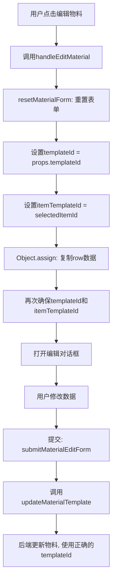

# 子系统物料编辑接口修复说明

## 📋 问题描述

在子系统模板详情页面中编辑物料时，需要确保 `templateId` 始终设置为当前子系统模板的 ID，以保证数据隔离原则。

## 🎯 修复目标

根据《子系统物料查询 API 对接文档》的要求，确保：

- ✅ 在子系统模板详情页面修改物料时，只影响该子系统的物料（`template_id` = 子系统模板 ID）
- ✅ 不会意外修改模板物料（`template_id` = NULL）或其他子系统的物料
- ✅ 数据隔离原则得到严格遵守

## 🔧 修复内容

### 文件：`src/views/erp/subsystem/template/components/ItemTemplateManagement.vue`

#### 1. 修改 `handleEditMaterial` 函数（第 538-547 行）

**修改前：**

```typescript
// 编辑物料
const handleEditMaterial = (row: SubsystemMaterialTemplateVO) => {
  resetMaterialForm();
  Object.assign(materialForm, row);
  materialEditDialog.visible = true;
};
```

**修改后：**

```typescript
// 编辑物料
const handleEditMaterial = (row: SubsystemMaterialTemplateVO) => {
  resetMaterialForm();
  Object.assign(materialForm, row);
  // ✅ 确保templateId始终为当前子系统模板ID，保证数据隔离
  materialForm.templateId = props.templateId;
  // ✅ 确保itemTemplateId正确设置
  materialForm.itemTemplateId = selectedItemId.value!;
  materialEditDialog.visible = true;
};
```

**修复说明：**

- 显式设置 `templateId` 为当前子系统模板 ID（`props.templateId`）
- 显式设置 `itemTemplateId` 为当前选中的子项 ID（`selectedItemId.value`）
- 确保即使 `row` 中的数据不正确，也能保证数据隔离

#### 2. 修改 `resetMaterialForm` 函数（第 590-602 行）

**修改前：**

```typescript
// 重置物料表单
const resetMaterialForm = () => {
  materialForm.id = undefined;
  materialForm.materialId = 0;
  materialForm.materialName = '';
  materialForm.defaultQuantity = 1;
  materialForm.isRequired = true;
  materialForm.remarks = '';
  materialFormRef.value?.clearValidate();
};
```

**修改后：**

```typescript
// 重置物料表单
const resetMaterialForm = () => {
  materialForm.id = undefined;
  // ✅ 重置时保留关联ID，确保数据隔离
  materialForm.templateId = props.templateId;
  materialForm.itemTemplateId = selectedItemId.value || 0;
  materialForm.materialId = 0;
  materialForm.materialName = '';
  materialForm.defaultQuantity = 1;
  materialForm.isRequired = true;
  materialForm.remarks = '';
  materialFormRef.value?.clearValidate();
};
```

**修复说明：**

- 在重置表单时，保留 `templateId` 和 `itemTemplateId` 的正确值
- 确保表单重置后，关联 ID 不会丢失
- 为后续的新增或编辑操作提供正确的关联上下文

## 🔄 工作流程

### 编辑物料流程



### 数据隔离保证

```typescript
// 物料数据结构
{
  id: "1986586568717946881",
  templateId: "1985928480973324290",  // ✅ 关键字段：子系统模板ID
  itemTemplateId: "1986239297161666561",
  materialId: "1985570844872421378",
  // ... 其他字段
}

// 编辑时确保
materialForm.templateId = props.templateId  // ✅ 始终使用当前子系统模板ID
```

## ✅ 验证要点

### 1. 数据隔离验证

**场景：有两个子系统模板 A 和 B，都包含相同的子项"桥架支架"**

1. 在子系统模板 A 的详情页面中：

   - 查看子项"桥架支架"的物料
   - 编辑物料"槽式桥架"，修改数量为 20 个
   - 保存成功

2. 在子系统模板 B 的详情页面中：
   - 查看子项"桥架支架"的物料
   - 物料"槽式桥架"的数量应该保持原值
   - ✅ 验证：A 的修改不影响 B

### 2. 后端日志验证

**编辑物料时的日志：**

```log
【物料模板更新】id=xxx, templateId=1985928480973324290, itemTemplateId=xxx
【SQL】UPDATE erp_subsystem_material_template
      SET default_quantity = ?, ...
      WHERE id = ? AND template_id = 1985928480973324290
```

**关键点：**

- `template_id` 在 SQL 的 WHERE 条件中
- 确保只更新当前子系统的物料记录

### 3. 前端调试验证

**在浏览器控制台中：**

```javascript
// 编辑物料前检查
console.log('props.templateId:', props.templateId);
console.log('selectedItemId:', selectedItemId.value);

// 提交时检查
console.log('materialForm:', materialForm);
// 应该输出：
// {
//   id: "...",
//   templateId: "1985928480973324290",  // ✅ 正确的子系统模板ID
//   itemTemplateId: "...",
//   ...
// }
```

## 📊 相关接口

### 查询接口

```typescript
// 查询子系统物料（带templateId参数）
GET /erp/subsystem/material-template/list-by-item/{itemTemplateId}?templateId={templateId}
```

### 更新接口

```typescript
// 更新物料模板
PUT /erp/subsystem/material-template

// 请求体
{
  "id": "1986586568717946881",
  "templateId": "1985928480973324290",  // ✅ 必须正确设置
  "itemTemplateId": "1986239297161666561",
  "materialId": "1985570844872421378",
  "defaultQuantity": 20,
  "isRequired": true,
  "remarks": ""
}
```

## 🎯 修复效果

### Before（修复前）

- ❌ 依赖于 `row` 数据中的 `templateId`
- ❌ 如果 `row` 数据不正确，可能导致数据隔离失效
- ❌ 重置表单时，关联 ID 可能丢失

### After（修复后）

- ✅ 显式设置 `templateId` 为当前子系统模板 ID
- ✅ 显式设置 `itemTemplateId` 为当前选中的子项 ID
- ✅ 重置表单时，保留关联 ID
- ✅ 确保数据隔离原则得到严格遵守

## 📝 注意事项

1. **不要混淆两种场景：**

   - 子系统模板详情页面：修改物料模板（`template_id` = 子系统模板 ID）
   - 子项模板管理页面：修改模板物料（`template_id` = NULL）

2. **始终使用正确的 API：**

   - 子系统模板物料：使用 `material-template.ts` 中的 API
   - 子系统实例物料：使用 `index.ts` 中的 `updateSubsystemMaterial`

3. **确保参数传递：**
   - 查询时：必须传递 `templateId` 参数
   - 修改时：必须在表单数据中包含 `templateId` 字段

## 📚 相关文档

- [子系统物料查询 API 对接文档](./子系统物料查询API对接文档.md)
- [子系统物料增删改操作数据隔离修复](./子系统物料增删改操作数据隔离修复.md)

## 🔍 代码位置

- **文件路径**: `src/views/erp/subsystem/template/components/ItemTemplateManagement.vue`
- **修改函数**:
  - `handleEditMaterial` (第 538-547 行)
  - `resetMaterialForm` (第 590-602 行)
- **API 文件**: `src/api/erp/subsystem/material-template.ts`

---

**修复日期**: 2025-11-07  
**修复人员**: 海棠开发团队  
**文档版本**: v1.0
