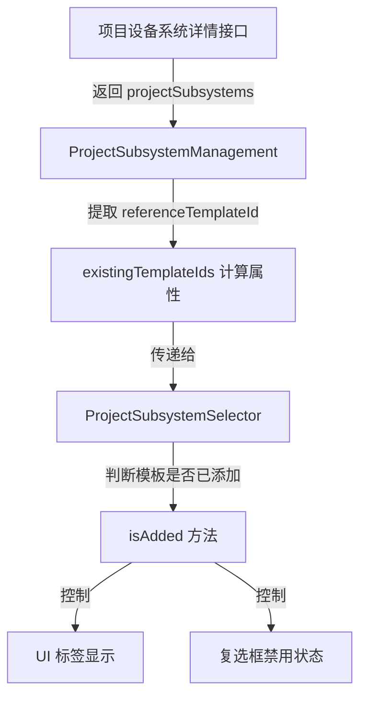

# 项目设备系统 - "已添加"状态标注功能说明

## 功能概述

在项目设备系统管理中，当用户为项目设备系统添加子系统时，系统会自动标注哪些子系统模板已经被添加到当前项目设备系统中，避免重复添加。

## 实现位置

### 1. 数据提取逻辑
**文件**: `src/views/erp/saltprocess/equipment-system/components/ProjectSubsystemManagement.vue`
**位置**: 第 249-259 行

```typescript
// 计算已添加的子系统模板ID列表（全部转为字符串，避免精度和类型不一致问题）
// 同时兼容后端返回的 referenceTemplateId 字段
const existingTemplateIds = computed(() => {
  const ids: string[] = [];
  subsystemList.value.forEach((item: ProjectSubsystemVO) => {
    const tid = (item as any).templateId ?? (item as any).referenceTemplateId;
    if (tid != null && tid !== '') ids.push(String(tid));
  });
  // 去重
  return Array.from(new Set(ids));
});
```

**功能说明**:
- 从项目子系统列表中提取模板ID
- 兼容 `templateId` 和 `referenceTemplateId` 两种字段名
- 统一转换为字符串类型，避免类型不一致问题
- 自动去重

### 2. 子系统选择器组件
**文件**: `src/views/erp/saltprocess/equipment-system/components/ProjectSubsystemSelector.vue`

#### 2.1 Props 定义（第 111-118 行）
```typescript
interface Props {
  modelValue: boolean;
  existingTemplateIds?: Array<string | number>; // 已添加的子系统模板ID列表
}
```

#### 2.2 判断逻辑（第 234-238 行）
```typescript
// 检查模板是否已添加（统一转为字符串比较，避免类型不一致）
const isAdded = (row: SubsystemTemplateVO): boolean => {
  const ids = (props.existingTemplateIds || []).map((v) => String(v));
  return ids.includes(String(row.id));
};
```

#### 2.3 禁用逻辑（第 240-243 行）
```typescript
// 检查行是否可选择（已添加的不能再选）
const checkSelectable = (row: SubsystemTemplateVO): boolean => {
  return !isAdded(row);
};
```

#### 2.4 UI 显示（第 77-81 行）
```vue
<el-table-column label="状态" width="100" align="center">
  <template #default="scope">
    <el-tag v-if="isAdded(scope.row)" type="success" size="small">已添加</el-tag>
    <el-tag v-else type="info" size="small">未添加</el-tag>
  </template>
</el-table-column>
```

## 数据流程



## 接口数据结构

### 项目设备系统详情接口
**接口路径**: `GET /saltprocess/projectEquipmentSystem/{id}`

**返回数据示例**:
```json
{
  "code": 200,
  "msg": "操作成功",
  "data": {
    "id": "1993205898788392962",
    "projectId": "1967857798821703681",
    "systemName": "化盐炉",
    "systemType": "LIQUID",
    "subsystemCount": 2,
    "totalItems": 4,
    "projectSubsystems": [
      {
        "id": "1993205898989719553",
        "subsystemName": "粉碎机1",
        "referenceTemplateId": "1986698980897005569",
        "itemCount": 2,
        "materialCount": 5
      },
      {
        "id": "1993205899472064513",
        "subsystemName": "平面输送机",
        "referenceTemplateId": "1985928480973324290",
        "itemCount": 2,
        "materialCount": 3
      }
    ]
  }
}
```

## 类型定义

### ProjectSubsystemVO
**文件**: `src/api/erp/saltprocess/equipment-system/types.ts`

```typescript
export interface ProjectSubsystemVO {
  id: string | number;
  projectSystemId: string | number;
  projectId: string | number;
  templateId?: string | number | null;
  referenceTemplateId?: string | number | null;  // 引用的模板ID
  subsystemCode: string;
  subsystemName: string;
  // ... 其他字段
}
```

## 使用场景

1. **用户操作**: 在项目设备系统详情页面，点击"添加子系统"按钮
2. **系统响应**: 打开子系统模板选择对话框
3. **状态显示**: 
   - 已添加的模板显示绿色"已添加"标签
   - 未添加的模板显示灰色"未添加"标签
4. **交互限制**: 已添加的模板复选框被禁用，无法重复选择

## 技术特点

1. **类型安全**: 统一转换为字符串类型进行比较，避免雪花算法ID精度丢失
2. **字段兼容**: 同时支持 `templateId` 和 `referenceTemplateId` 字段名
3. **响应式更新**: 使用 Vue 3 计算属性，数据变化自动更新UI
4. **用户体验**: 清晰的视觉标识和禁用状态，防止误操作

## 测试验证

### 测试步骤
1. 进入项目设备系统详情页面
2. 点击"添加子系统"按钮
3. 观察子系统模板列表中的"状态"列
4. 验证已添加的模板是否显示"已添加"标签
5. 验证已添加的模板是否无法被选中

### 预期结果
- ✅ 已添加的模板显示绿色"已添加"标签
- ✅ 已添加的模板复选框被禁用
- ✅ 未添加的模板显示灰色"未添加"标签
- ✅ 未添加的模板可以正常选择

## 相关文件

- `src/views/erp/saltprocess/equipment-system/components/ProjectSubsystemManagement.vue`
- `src/views/erp/saltprocess/equipment-system/components/ProjectSubsystemSelector.vue`
- `src/api/erp/saltprocess/equipment-system/types.ts`
- `src/api/erp/saltprocess/equipment-system/index.ts`

