# 化盐项目工艺流程管理模块 - 业务流程文档

## 1. 总体业务流程

### 1.1 化盐工艺总体流程图

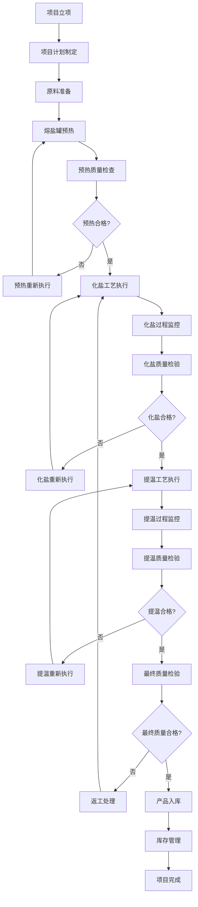

### 1.2 流程阶段说明

| 阶段 | 主要活动 | 关键控制点 | 责任人 |
|------|----------|------------|--------|
| 项目立项 | 项目需求分析、可行性评估 | 项目审批 | 项目经理 |
| 计划制定 | 工艺计划、资源计划、时间计划 | 计划审核 | 工艺工程师 |
| 原料准备 | 原料采购、质量检验、配比计算 | 原料质量合格 | 采购员、质检员 |
| 预热执行 | 设备预热、参数监控、巡检 | 温度压力达标 | 操作员 |
| 化盐执行 | 投料、反应、参数控制 | 配比精度、温度控制 | 操作员 |
| 提温执行 | 升温控制、保温、监控 | 温度曲线符合要求 | 操作员 |
| 质量检验 | 成分分析、物理性能测试 | 质量指标合格 | 质检员 |
| 产品入库 | 包装、标识、入库登记 | 库存记录准确 | 库管员 |

## 2. 熔盐罐预热业务流程

### 2.1 预热流程详图

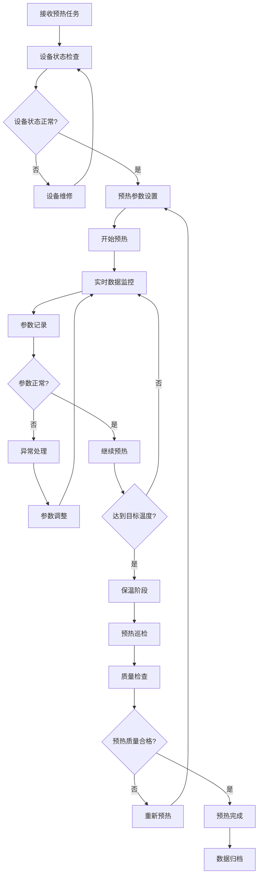

### 2.2 预热业务规则

#### 2.2.1 预热参数控制规则

| 参数类型 | 控制范围 | 报警阈值 | 处理措施 |
|----------|----------|----------|----------|
| 温度 | 200°C - 500°C | ±5°C | 自动调整加热功率 |
| 压力 | 0.1 - 3.0 MPa | ±0.1 MPa | 调整压力阀门 |
| 升温速率 | ≤5°C/min | >6°C/min | 降低加热功率 |
| 保温时间 | ≥30min | <30min | 延长保温时间 |

#### 2.2.2 预热质量检查标准

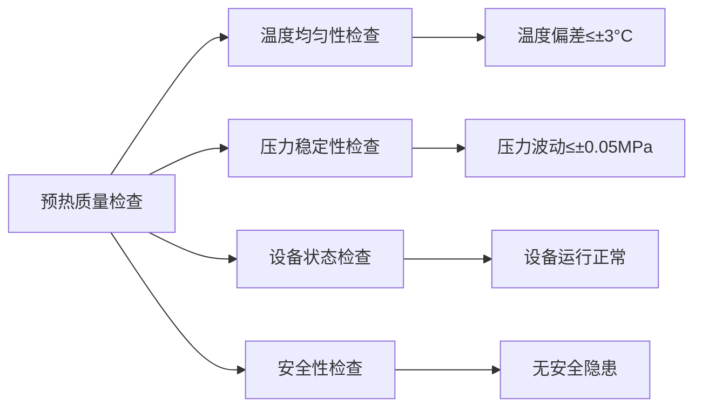

### 2.3 预热异常处理流程

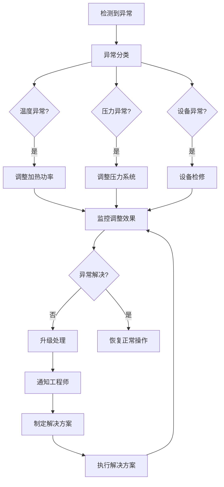

## 3. 化盐工艺业务流程

### 3.1 化盐工艺流程详图

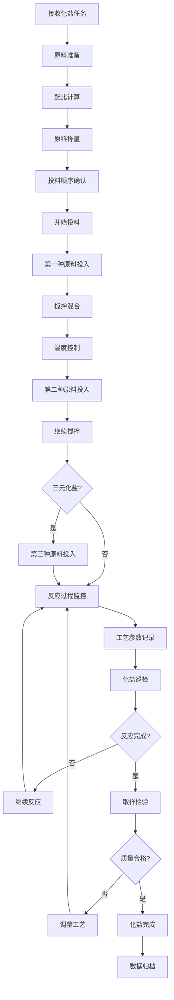

### 3.2 配比控制流程

#### 3.2.1 二元化盐配比控制

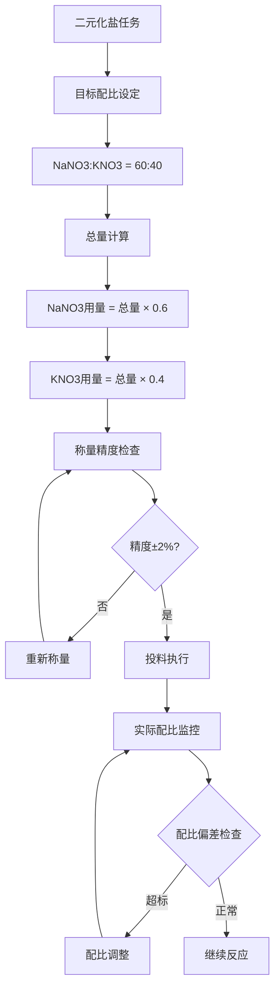

#### 3.2.2 三元化盐配比控制

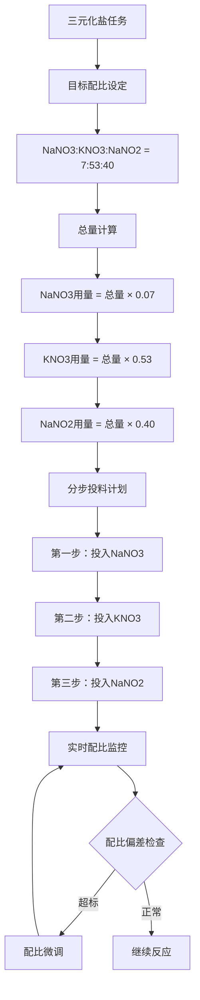

### 3.3 化盐质量控制流程

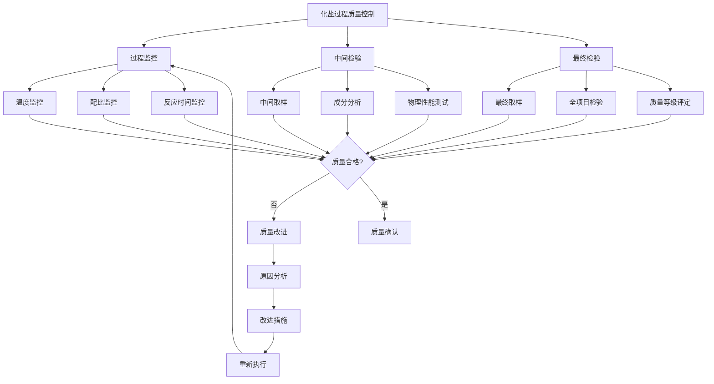

## 4. 提温工艺业务流程

### 4.1 提温工艺流程详图

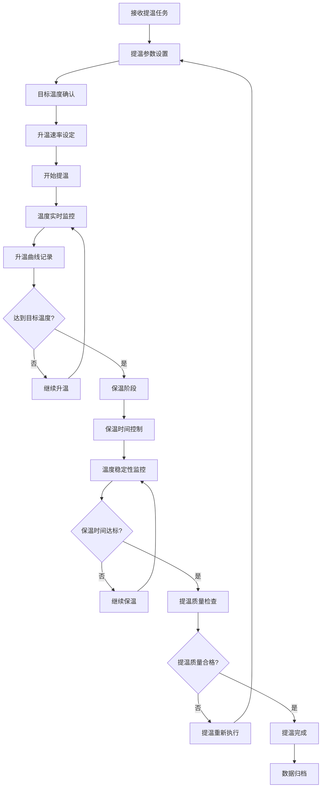

### 4.2 提温参数控制

#### 4.2.1 温度控制策略

| 阶段 | 温度范围 | 升温速率 | 控制精度 | 监控频率 |
|------|----------|----------|----------|----------|
| 初始升温 | 500-550°C | 3-5°C/min | ±2°C | 每分钟 |
| 中期升温 | 550-580°C | 2-3°C/min | ±2°C | 每分钟 |
| 最终升温 | 580-600°C | 1-2°C/min | ±1°C | 每30秒 |
| 保温阶段 | 600°C | 0°C/min | ±1°C | 每30秒 |

#### 4.2.2 提温异常处理

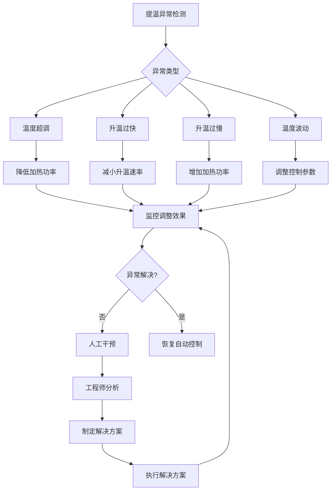

## 5. 库存管理业务流程

### 5.1 熔盐入库流程

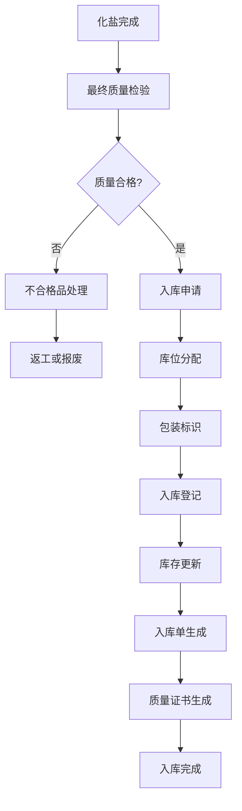

### 5.2 熔盐出库流程

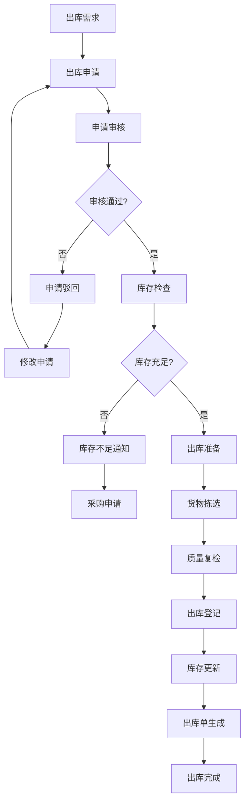

### 5.3 库存预警流程

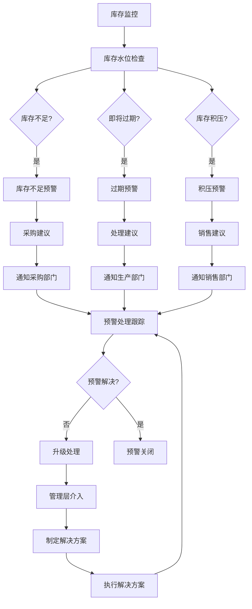

## 6. 质量管理业务流程

### 6.1 质量检验流程

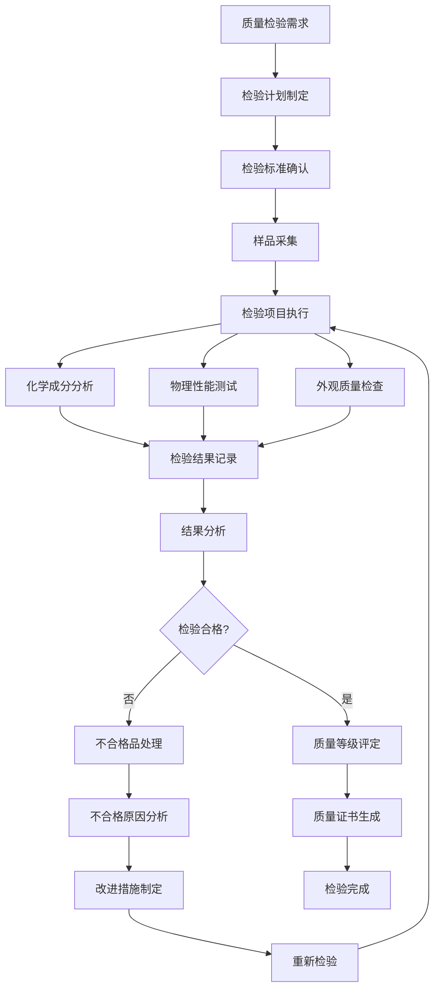

### 6.2 质量追溯流程

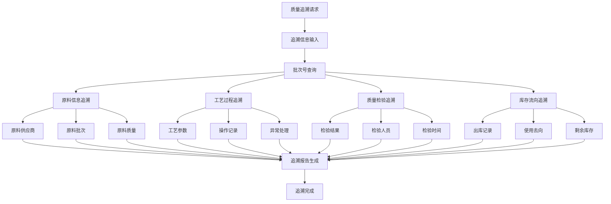

## 7. 异常处理业务流程

### 7.1 异常分类处理

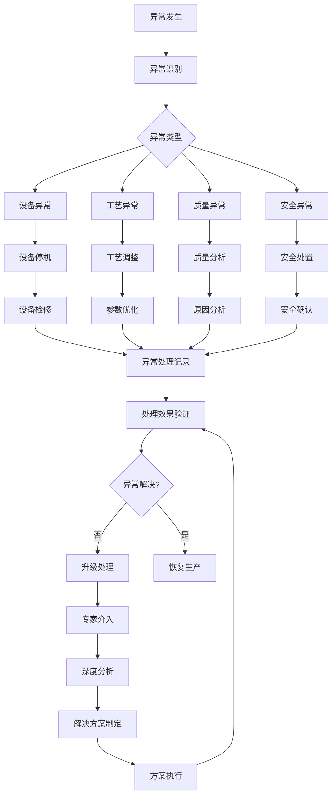

### 7.2 应急响应流程

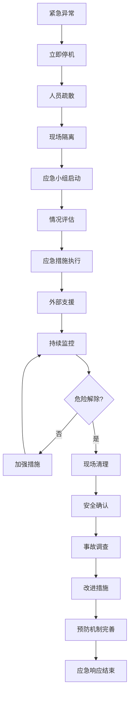

## 8. 数据流转规则

### 8.1 数据采集规则

- **实时数据**：温度、压力等关键参数每秒采集一次
- **过程数据**：工艺参数每分钟记录一次
- **检验数据**：质量检验完成后立即录入
- **操作数据**：操作行为实时记录

### 8.2 数据传递规则

- **上游传递**：下游工序自动接收上游完成信息
- **异常传递**：异常信息立即传递给相关责任人
- **状态同步**：工序状态变更实时同步到监控系统
- **报告生成**：关键节点自动生成阶段报告

### 8.3 数据存储规则

- **实时数据**：存储在时序数据库，保留1年
- **历史数据**：压缩存储，保留10年
- **关键数据**：多重备份，永久保存
- **日志数据**：滚动存储，保留3年
