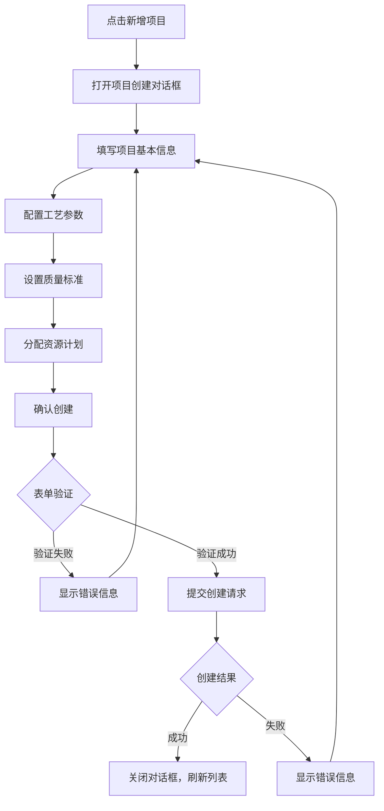
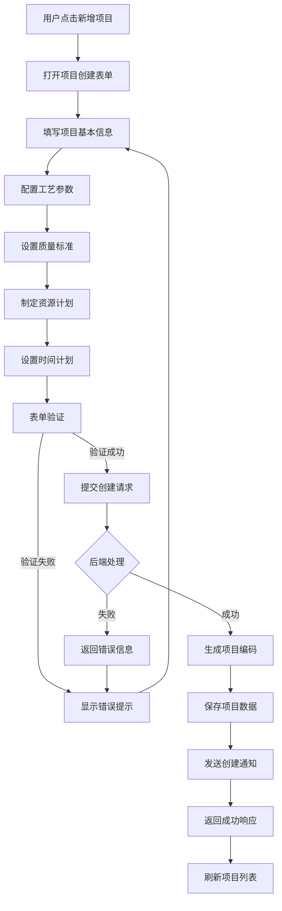
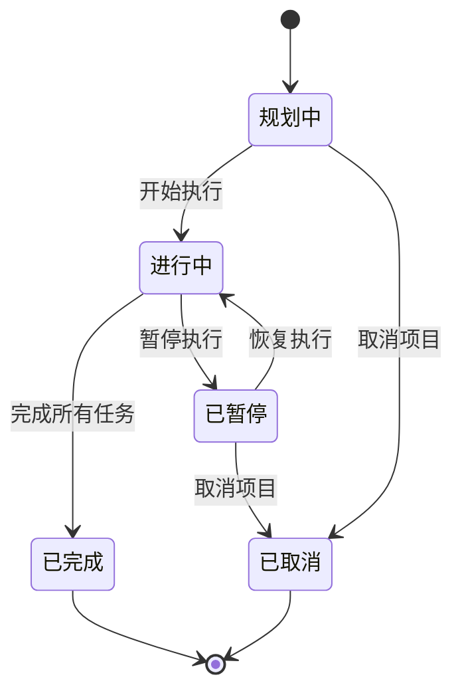

# 项目管理模块 - 子模块设计文档

## 1. 模块概述

### 1.1 功能定位
项目管理模块是化盐项目工艺流程管理系统的核心模块，负责化盐项目的全生命周期管理，包括项目创建、配置、监控和统计分析。该模块为其他所有子模块提供项目基础信息和统一的项目管理入口。

### 1.2 业务价值
- **项目标准化管理**：建立统一的项目管理标准和流程
- **资源优化配置**：合理分配人员、设备、原料等资源
- **进度可视化监控**：实时掌握项目执行状态和关键节点
- **决策数据支撑**：为管理层提供项目统计和分析数据

### 1.3 模块边界
- **上游依赖**：用户权限系统、基础数据管理
- **下游服务**：预热管理、化盐工艺、提温工艺、库存管理、质量管理
- **外部集成**：ERP系统、设备监控系统

## 2. 功能需求清单

### 2.1 项目基础管理
- **项目创建**：支持新建化盐项目，设置项目基本信息
- **项目编辑**：修改项目信息、状态变更、参数调整
- **项目删除**：逻辑删除项目，保留历史数据
- **项目查询**：多维度查询和筛选项目信息
- **项目复制**：基于现有项目创建新项目模板

### 2.2 项目配置管理
- **工艺参数配置**：设置预热、化盐、提温工艺参数
- **质量标准配置**：定义各阶段质量检验标准
- **资源计划配置**：配置人员、设备、原料需求
- **时间计划配置**：设置项目时间节点和里程碑

### 2.3 项目监控管理
- **实时状态监控**：项目执行状态实时展示
- **进度跟踪**：项目进度可视化展示和预警
- **异常预警**：项目异常情况自动预警
- **关键指标监控**：KPI指标实时监控

### 2.4 项目统计分析
- **项目统计报表**：生成各类项目统计报表
- **趋势分析**：项目数据趋势分析和预测
- **对比分析**：不同项目间的对比分析
- **绩效评估**：项目绩效评估和改进建议

## 3. 页面设计规范

### 3.1 页面布局设计

#### 3.1.1 项目列表页面
```
┌─────────────────────────────────────────────────────────────┐
│ 面包屑导航: 首页 > ERP管理 > 化盐工艺流程 > 项目管理          │
├─────────────────────────────────────────────────────────────┤
│ 搜索筛选区域                                                │
│ [项目名称] [项目状态] [创建时间] [项目经理] [搜索] [重置]     │
├─────────────────────────────────────────────────────────────┤
│ 操作按钮区域                                                │
│ [新增项目] [批量删除] [导出] [刷新]                         │
├─────────────────────────────────────────────────────────────┤
│ 项目列表表格                                                │
│ ☑ │项目编码│项目名称│项目类型│状态│进度│创建时间│操作        │
│ ☐ │SP001  │项目A  │二元化盐│进行中│60%│2024-01-01│查看编辑删除│
├─────────────────────────────────────────────────────────────┤
│ 分页组件                                                    │
│ 共100条 [10条/页] [上一页] 1 2 3 [下一页]                   │
└─────────────────────────────────────────────────────────────┘
```

#### 3.1.2 项目详情页面
```
┌─────────────────────────────────────────────────────────────┐
│ 项目基本信息卡片                                            │
│ 项目名称: 化盐项目A    项目编码: SP20240101001               │
│ 项目状态: 进行中       项目进度: 60%                        │
│ 项目经理: 张三         创建时间: 2024-01-01                 │
├─────────────────────────────────────────────────────────────┤
│ Tab页签: [基本信息] [工艺配置] [任务管理] [进度监控] [统计分析]│
├─────────────────────────────────────────────────────────────┤
│ Tab内容区域                                                 │
│ (根据选中的Tab显示对应内容)                                 │
└─────────────────────────────────────────────────────────────┘
```

### 3.2 组件设计规范

#### 3.2.1 项目状态标签组件
```vue
<template>
  <el-tag :type="getStatusType(status)" :effect="effect">
    {{ getStatusText(status) }}
  </el-tag>
</template>

<script setup lang="ts">
interface Props {
  status: ProjectStatus;
  effect?: 'dark' | 'light' | 'plain';
}

const props = withDefaults(defineProps<Props>(), {
  effect: 'light'
});

const getStatusType = (status: ProjectStatus) => {
  const statusMap = {
    [ProjectStatus.PLANNING]: 'info',
    [ProjectStatus.IN_PROGRESS]: 'warning', 
    [ProjectStatus.COMPLETED]: 'success',
    [ProjectStatus.SUSPENDED]: 'danger'
  };
  return statusMap[status] || 'info';
};
</script>
```

#### 3.2.2 项目进度组件
```vue
<template>
  <div class="project-progress">
    <el-progress 
      :percentage="percentage" 
      :status="getProgressStatus()"
      :stroke-width="8"
    />
    <div class="progress-info">
      <span>{{ currentPhase }}</span>
      <span>{{ percentage }}%</span>
    </div>
  </div>
</template>

<script setup lang="ts">
interface Props {
  percentage: number;
  currentPhase: string;
  status: ProjectStatus;
}

const props = defineProps<Props>();

const getProgressStatus = () => {
  if (props.status === ProjectStatus.COMPLETED) return 'success';
  if (props.status === ProjectStatus.SUSPENDED) return 'exception';
  return undefined;
};
</script>
```

### 3.3 交互流程设计

#### 3.3.1 项目创建流程


## 4. API接口设计

### 4.1 接口列表

#### 4.1.1 项目基础CRUD接口
```typescript
// 查询项目列表
GET /erp/saltprocess/project/list
// 权限: erp:saltprocess:project:list

// 获取项目详情  
GET /erp/saltprocess/project/{id}
// 权限: erp:saltprocess:project:query

// 创建项目
POST /erp/saltprocess/project
// 权限: erp:saltprocess:project:add

// 更新项目
PUT /erp/saltprocess/project
// 权限: erp:saltprocess:project:edit

// 删除项目
DELETE /erp/saltprocess/project/{ids}
// 权限: erp:saltprocess:project:remove
```

#### 4.1.2 项目业务接口
```typescript
// 更新项目状态
PUT /erp/saltprocess/project/{id}/status
// 权限: erp:saltprocess:project:edit

// 更新项目进度
PUT /erp/saltprocess/project/{id}/progress  
// 权限: erp:saltprocess:project:edit

// 项目统计信息
GET /erp/saltprocess/project/statistics
// 权限: erp:saltprocess:project:statistics

// 生成项目编码
GET /erp/saltprocess/project/generate-code
// 权限: erp:saltprocess:project:add
```

### 4.2 请求响应格式

#### 4.2.1 项目查询请求
```typescript
interface ProjectQuery {
  pageNum?: number;
  pageSize?: number;
  projectName?: string;
  projectCode?: string;
  status?: ProjectStatus;
  projectType?: ProjectType;
  managerId?: string;
  startDate?: string;
  endDate?: string;
}
```

#### 4.2.2 项目详情响应
```typescript
interface ProjectVO {
  id: string;
  projectCode: string;
  projectName: string;
  projectType: ProjectType;
  status: ProjectStatus;
  progress: number;
  currentPhase: string;
  managerId: string;
  managerName: string;
  startDate: string;
  endDate?: string;
  description?: string;
  processConfig: ProcessConfig;
  qualityStandards: QualityStandard[];
  resourcePlan: ResourcePlan;
  createTime: string;
  updateTime: string;
}
```

### 4.3 权限控制设计
```typescript
// 权限配置
const permissions = {
  'erp:saltprocess:project:list': '查询项目列表',
  'erp:saltprocess:project:query': '查询项目详情', 
  'erp:saltprocess:project:add': '新增项目',
  'erp:saltprocess:project:edit': '编辑项目',
  'erp:saltprocess:project:remove': '删除项目',
  'erp:saltprocess:project:export': '导出项目',
  'erp:saltprocess:project:statistics': '项目统计'
};
```

## 5. 数据模型设计

### 5.1 核心实体设计

#### 5.1.1 项目实体 (SaltProject)
```typescript
interface SaltProject {
  id: string;                    // 项目ID
  projectCode: string;           // 项目编码
  projectName: string;           // 项目名称
  projectType: ProjectType;      // 项目类型
  status: ProjectStatus;         // 项目状态
  progress: number;              // 项目进度(0-100)
  currentPhase: string;          // 当前阶段
  managerId: string;             // 项目经理ID
  startDate: Date;               // 开始日期
  endDate?: Date;                // 结束日期
  description?: string;          // 项目描述
  processConfigId?: string;      // 工艺配置ID
  qualityStandardId?: string;    // 质量标准ID
  resourcePlanId?: string;       // 资源计划ID
  createBy: string;              // 创建人
  createTime: Date;              // 创建时间
  updateBy?: string;             // 更新人
  updateTime?: Date;             // 更新时间
  delFlag: string;               // 删除标志
}
```

#### 5.1.2 枚举定义
```typescript
enum ProjectType {
  BINARY_SALT = 'BINARY_SALT',      // 二元化盐
  TERNARY_SALT = 'TERNARY_SALT'     // 三元化盐
}

enum ProjectStatus {
  PLANNING = 'PLANNING',             // 规划中
  IN_PROGRESS = 'IN_PROGRESS',       // 进行中
  COMPLETED = 'COMPLETED',           // 已完成
  SUSPENDED = 'SUSPENDED',           // 已暂停
  CANCELLED = 'CANCELLED'            // 已取消
}
```

### 5.2 业务规则设计

#### 5.2.1 项目编码规则
```typescript
// 项目编码格式: SP + YYYYMMDD + 3位序号
// 示例: SP20240101001
const generateProjectCode = (date: Date): string => {
  const dateStr = date.toISOString().slice(0, 10).replace(/-/g, '');
  const sequence = getNextSequence(dateStr); // 获取当日序号
  return `SP${dateStr}${sequence.toString().padStart(3, '0')}`;
};
```

#### 5.2.2 状态流转规则
```typescript
const statusTransitionRules = {
  [ProjectStatus.PLANNING]: [ProjectStatus.IN_PROGRESS, ProjectStatus.CANCELLED],
  [ProjectStatus.IN_PROGRESS]: [ProjectStatus.COMPLETED, ProjectStatus.SUSPENDED],
  [ProjectStatus.SUSPENDED]: [ProjectStatus.IN_PROGRESS, ProjectStatus.CANCELLED],
  [ProjectStatus.COMPLETED]: [], // 完成状态不可变更
  [ProjectStatus.CANCELLED]: []  // 取消状态不可变更
};
```

## 6. 前端技术实现

### 6.1 Vue组件结构

#### 6.1.1 页面组件结构
```
src/views/erp/saltprocess/project/
├── index.vue                    # 项目列表页面
├── detail.vue                   # 项目详情页面
├── form.vue                     # 项目表单页面
└── components/
    ├── ProjectCard.vue          # 项目卡片组件
    ├── ProjectProgress.vue      # 项目进度组件
    ├── ProjectStatus.vue        # 项目状态组件
    ├── ProcessConfig.vue        # 工艺配置组件
    └── ResourcePlan.vue         # 资源计划组件
```

#### 6.1.2 主要组件实现
```vue
<!-- src/views/erp/saltprocess/project/index.vue -->
<template>
  <div class="salt-project-container">
    <el-card class="search-card">
      <ProjectSearchForm
        v-model="queryParams"
        @search="handleSearch"
        @reset="handleReset"
      />
    </el-card>

    <el-card class="table-card">
      <template #header>
        <div class="card-header">
          <span>项目列表</span>
          <div class="header-buttons">
            <el-button
              type="primary"
              @click="handleAdd"
              v-hasPermi="['erp:saltprocess:project:add']"
            >
              新增项目
            </el-button>
            <el-button
              type="success"
              @click="handleExport"
              v-hasPermi="['erp:saltprocess:project:export']"
            >
              导出
            </el-button>
          </div>
        </div>
      </template>

      <el-table
        v-loading="loading"
        :data="projectList"
        @selection-change="handleSelectionChange"
      >
        <el-table-column type="selection" width="55" />
        <el-table-column prop="projectCode" label="项目编码" width="150" />
        <el-table-column prop="projectName" label="项目名称" />
        <el-table-column prop="projectType" label="项目类型" width="120">
          <template #default="{ row }">
            <el-tag>{{ getProjectTypeText(row.projectType) }}</el-tag>
          </template>
        </el-table-column>
        <el-table-column prop="status" label="状态" width="100">
          <template #default="{ row }">
            <ProjectStatus :status="row.status" />
          </template>
        </el-table-column>
        <el-table-column prop="progress" label="进度" width="150">
          <template #default="{ row }">
            <ProjectProgress
              :percentage="row.progress"
              :current-phase="row.currentPhase"
              :status="row.status"
            />
          </template>
        </el-table-column>
        <el-table-column prop="managerName" label="项目经理" width="120" />
        <el-table-column prop="createTime" label="创建时间" width="180" />
        <el-table-column label="操作" width="200" fixed="right">
          <template #default="{ row }">
            <el-button
              type="primary"
              link
              @click="handleDetail(row)"
              v-hasPermi="['erp:saltprocess:project:query']"
            >
              查看
            </el-button>
            <el-button
              type="primary"
              link
              @click="handleEdit(row)"
              v-hasPermi="['erp:saltprocess:project:edit']"
            >
              编辑
            </el-button>
            <el-button
              type="danger"
              link
              @click="handleDelete(row)"
              v-hasPermi="['erp:saltprocess:project:remove']"
            >
              删除
            </el-button>
          </template>
        </el-table-column>
      </el-table>

      <pagination
        v-show="total > 0"
        v-model:page="queryParams.pageNum"
        v-model:limit="queryParams.pageSize"
        :total="total"
        @pagination="getList"
      />
    </el-card>

    <!-- 项目表单对话框 -->
    <ProjectFormDialog
      v-model:visible="formVisible"
      :form-data="formData"
      :form-type="formType"
      @success="handleFormSuccess"
    />
  </div>
</template>

<script setup name="SaltProjectList" lang="ts">
import { ref, reactive, onMounted } from 'vue';
import { ElMessage, ElMessageBox } from 'element-plus';
import {
  listSaltProject,
  getSaltProject,
  delSaltProject
} from '@/api/erp/saltprocess/project';
import { SaltProjectVO, SaltProjectQuery } from '@/api/erp/saltprocess/project/types';

// 响应式数据
const loading = ref(false);
const projectList = ref<SaltProjectVO[]>([]);
const total = ref(0);
const formVisible = ref(false);
const formType = ref<'add' | 'edit'>('add');
const formData = ref<SaltProjectVO>({});
const selectedRows = ref<SaltProjectVO[]>([]);

// 查询参数
const queryParams = reactive<SaltProjectQuery>({
  pageNum: 1,
  pageSize: 10,
  projectName: '',
  status: '',
  projectType: '',
  managerId: ''
});

// 获取项目列表
const getList = async () => {
  loading.value = true;
  try {
    const { data } = await listSaltProject(queryParams);
    projectList.value = data.rows;
    total.value = data.total;
  } catch (error) {
    ElMessage.error('获取项目列表失败');
  } finally {
    loading.value = false;
  }
};

// 初始化
onMounted(() => {
  getList();
});
</script>
```

### 6.2 状态管理设计

#### 6.2.1 Pinia Store结构
```typescript
// src/store/modules/saltProcess.ts
import { defineStore } from 'pinia';
import { SaltProjectVO } from '@/api/erp/saltprocess/project/types';

interface SaltProcessState {
  // 项目相关状态
  currentProject: SaltProjectVO | null;
  projectList: SaltProjectVO[];
  projectStatistics: ProjectStatistics | null;

  // 缓存状态
  projectCache: Map<string, SaltProjectVO>;

  // UI状态
  loading: boolean;
  error: string | null;
}

export const useSaltProcessStore = defineStore('saltProcess', {
  state: (): SaltProcessState => ({
    currentProject: null,
    projectList: [],
    projectStatistics: null,
    projectCache: new Map(),
    loading: false,
    error: null
  }),

  getters: {
    // 获取当前项目
    getCurrentProject: (state) => state.currentProject,

    // 获取项目列表
    getProjectList: (state) => state.projectList,

    // 根据状态筛选项目
    getProjectsByStatus: (state) => (status: ProjectStatus) => {
      return state.projectList.filter(project => project.status === status);
    },

    // 获取项目统计信息
    getProjectStatistics: (state) => state.projectStatistics
  },

  actions: {
    // 设置当前项目
    setCurrentProject(project: SaltProjectVO | null) {
      this.currentProject = project;
      if (project) {
        this.projectCache.set(project.id, project);
      }
    },

    // 更新项目列表
    setProjectList(projects: SaltProjectVO[]) {
      this.projectList = projects;
      // 更新缓存
      projects.forEach(project => {
        this.projectCache.set(project.id, project);
      });
    },

    // 添加项目
    addProject(project: SaltProjectVO) {
      this.projectList.unshift(project);
      this.projectCache.set(project.id, project);
    },

    // 更新项目
    updateProject(project: SaltProjectVO) {
      const index = this.projectList.findIndex(p => p.id === project.id);
      if (index !== -1) {
        this.projectList[index] = project;
      }
      this.projectCache.set(project.id, project);

      // 如果是当前项目，也要更新
      if (this.currentProject?.id === project.id) {
        this.currentProject = project;
      }
    },

    // 删除项目
    removeProject(projectId: string) {
      this.projectList = this.projectList.filter(p => p.id !== projectId);
      this.projectCache.delete(projectId);

      // 如果删除的是当前项目，清空当前项目
      if (this.currentProject?.id === projectId) {
        this.currentProject = null;
      }
    }
  }
});
```

### 6.3 路由配置

#### 6.3.1 路由定义
```typescript
// src/router/modules/saltprocess.ts
import { RouteRecordRaw } from 'vue-router';
import Layout from '@/layout/index.vue';

const saltProcessRoutes: RouteRecordRaw = {
  path: '/erp/saltprocess',
  component: Layout,
  redirect: '/erp/saltprocess/project',
  name: 'SaltProcess',
  meta: {
    title: '化盐工艺流程',
    icon: 'chemistry',
    roles: ['admin', 'saltprocess']
  },
  children: [
    {
      path: 'project',
      component: () => import('@/views/erp/saltprocess/project/index.vue'),
      name: 'SaltProjectList',
      meta: {
        title: '项目管理',
        icon: 'project',
        permissions: ['erp:saltprocess:project:list']
      }
    },
    {
      path: 'project/detail/:id',
      component: () => import('@/views/erp/saltprocess/project/detail.vue'),
      name: 'SaltProjectDetail',
      meta: {
        title: '项目详情',
        hidden: true,
        activeMenu: '/erp/saltprocess/project',
        permissions: ['erp:saltprocess:project:query']
      }
    }
  ]
};

export default saltProcessRoutes;
```

## 7. 业务流程设计

### 7.1 项目创建流程


### 7.2 项目状态流转


### 7.3 异常处理流程

#### 7.3.1 项目创建异常处理
```typescript
const handleProjectCreation = async (projectData: SaltProjectForm) => {
  try {
    // 1. 表单验证
    await validateProjectForm(projectData);

    // 2. 业务规则验证
    await validateBusinessRules(projectData);

    // 3. 提交创建请求
    const result = await createSaltProject(projectData);

    // 4. 成功处理
    ElMessage.success('项目创建成功');
    return result;

  } catch (error) {
    // 异常分类处理
    if (error instanceof ValidationError) {
      // 表单验证错误
      ElMessage.error(`表单验证失败: ${error.message}`);
    } else if (error instanceof BusinessRuleError) {
      // 业务规则错误
      ElMessage.error(`业务规则验证失败: ${error.message}`);
    } else if (error instanceof NetworkError) {
      // 网络错误
      ElMessage.error('网络连接异常，请稍后重试');
    } else {
      // 其他未知错误
      ElMessage.error('项目创建失败，请联系管理员');
      console.error('Project creation error:', error);
    }
    throw error;
  }
};
```

## 8. 测试用例设计

### 8.1 功能测试用例

#### 8.1.1 项目创建测试
```typescript
describe('项目创建功能测试', () => {
  test('正常创建项目', async () => {
    const projectData = {
      projectName: '测试项目',
      projectType: 'BINARY_SALT',
      managerId: 'user001',
      startDate: '2024-01-01',
      description: '测试项目描述'
    };

    const result = await createSaltProject(projectData);

    expect(result.code).toBe(200);
    expect(result.data.projectCode).toMatch(/^SP\d{8}\d{3}$/);
    expect(result.data.status).toBe('PLANNING');
  });

  test('项目名称重复验证', async () => {
    const projectData = {
      projectName: '已存在的项目名称',
      projectType: 'BINARY_SALT',
      managerId: 'user001'
    };

    await expect(createSaltProject(projectData))
      .rejects
      .toThrow('项目名称已存在');
  });
});
```

### 8.2 集成测试用例

#### 8.2.1 项目生命周期集成测试
```typescript
describe('项目生命周期集成测试', () => {
  let projectId: string;

  test('创建项目', async () => {
    const projectData = {
      projectName: '集成测试项目',
      projectType: 'BINARY_SALT',
      managerId: 'user001',
      startDate: '2024-01-01'
    };

    const result = await createSaltProject(projectData);
    projectId = result.data.id;

    expect(result.code).toBe(200);
    expect(result.data.status).toBe('PLANNING');
  });

  test('更新项目状态', async () => {
    const result = await updateProjectStatus(projectId, 'IN_PROGRESS');

    expect(result.code).toBe(200);

    // 验证状态已更新
    const project = await getSaltProject(projectId);
    expect(project.data.status).toBe('IN_PROGRESS');
  });
});
```

### 8.3 用户验收测试

#### 8.3.1 用户场景测试
```typescript
describe('用户验收测试', () => {
  test('项目经理创建新项目场景', async () => {
    // 1. 登录系统
    await login('project_manager', 'password');

    // 2. 进入项目管理页面
    await navigateTo('/erp/saltprocess/project');

    // 3. 点击新增项目
    await clickButton('新增项目');

    // 4. 填写项目信息
    await fillForm({
      projectName: '用户验收测试项目',
      projectType: 'BINARY_SALT',
      description: '这是一个用户验收测试项目'
    });

    // 5. 提交表单
    await submitForm();

    // 6. 验证项目创建成功
    await expectToSee('项目创建成功');
    await expectProjectInList('用户验收测试项目');
  });
});
```

---

**文档版本**: v1.0
**创建日期**: 2024-01-01
**最后更新**: 2024-01-01
**文档状态**: 草稿
