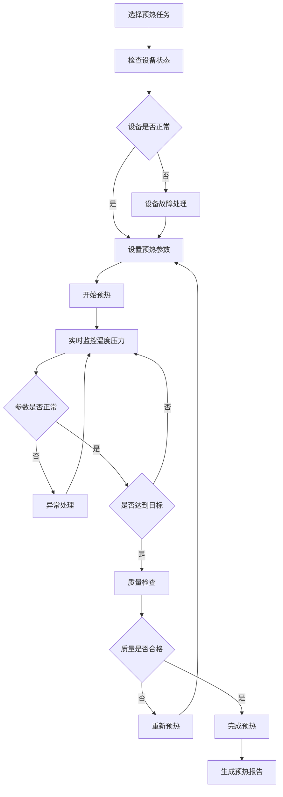
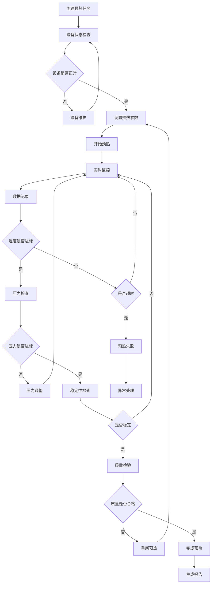

# 预热管理模块 - 子模块设计文档

## 1. 模块概述

### 1.1 功能定位
预热管理模块是化盐工艺流程的第一个关键环节，负责熔盐罐预热工艺的精确控制和监管。该模块确保熔盐罐在化盐工艺开始前达到合适的温度和压力条件，为后续化盐工艺提供稳定的基础环境。

### 1.2 业务价值
- **工艺安全保障**：确保预热过程的安全性，防止温度压力异常
- **参数精确控制**：实现温度、压力等关键参数的精确控制
- **质量标准化**：建立标准化的预热工艺流程和质量检查机制
- **数据可追溯**：完整记录预热过程数据，支持质量追溯和工艺优化

### 1.3 模块边界
- **上游依赖**：项目管理模块（项目信息、工艺配置）
- **下游服务**：化盐工艺管理模块（预热完成信号）
- **外部集成**：设备监控系统、温控系统、压力监控系统

## 2. 功能需求清单

### 2.1 预热任务管理
- **任务创建**：基于项目配置创建预热任务
- **任务调度**：合理安排预热任务的执行顺序和时间
- **任务监控**：实时监控预热任务的执行状态和进度
- **任务报告**：生成预热任务执行报告和统计分析

### 2.2 预热数据记录
- **温度记录**：实时记录预热过程中的温度变化曲线
  - 支持多点温度监控（罐体上部、中部、下部）
  - 温度异常自动报警（超出设定范围±5°C）
  - 温度趋势分析和预测
- **压力记录**：监控预热过程中的压力参数
  - 压力变化实时监控（精度0.01MPa）
  - 压力异常预警（超出0.1-3.0MPa范围）
  - 压力稳定性分析
- **时间记录**：记录预热开始时间、结束时间、持续时间
- **设备状态记录**：记录预热设备的运行状态和参数
- **操作记录**：记录操作人员信息和操作时间

### 2.3 预热巡检管理
- **巡检计划制定**：制定预热阶段的巡检计划和频次
- **巡检任务分配**：将巡检任务分配给具体巡检员
- **移动端巡检**：支持移动端录入巡检结果和发现的问题
- **异常处理流程**：异常情况的报告、处理、跟踪流程
- **巡检报告生成**：自动生成巡检报告和统计分析

### 2.4 预热质量控制
- **预热标准管理**：维护预热工艺的标准参数和控制范围
- **质量检查点设置**：设置关键质量检查点和检查标准
- **合格性自动判定**：基于标准参数自动判定预热质量合格性
- **质量追溯**：建立预热质量的完整追溯链条

## 3. 页面设计规范

### 3.1 页面布局设计

#### 3.1.1 预热任务列表页面
```
┌─────────────────────────────────────────────────────────────┐
│ 面包屑导航: 首页 > ERP管理 > 化盐工艺流程 > 预热管理          │
├─────────────────────────────────────────────────────────────┤
│ 搜索筛选区域                                                │
│ [项目名称] [任务状态] [熔盐罐] [操作员] [时间范围] [搜索] [重置]│
├─────────────────────────────────────────────────────────────┤
│ 操作按钮区域                                                │
│ [新增任务] [批量操作] [导出] [刷新]                         │
├─────────────────────────────────────────────────────────────┤
│ 任务列表表格                                                │
│ ☑ │任务编码│项目名称│熔盐罐│目标温度│状态│进度│操作员│操作    │
│ ☐ │PH001  │项目A  │Tank01│450°C│进行中│60%│张三│查看执行    │
├─────────────────────────────────────────────────────────────┤
│ 分页组件                                                    │
│ 共50条 [10条/页] [上一页] 1 2 3 [下一页]                    │
└─────────────────────────────────────────────────────────────┘
```

#### 3.1.2 预热执行监控页面
```
┌─────────────────────────────────────────────────────────────┐
│ 任务信息栏                                                  │
│ 任务编码: PH001  项目: 化盐项目A  熔盐罐: Tank01             │
│ 目标温度: 450°C  目标压力: 2.0MPa  操作员: 张三              │
├─────────────────────────────────────────────────────────────┤
│ 实时监控面板                                                │
│ ┌─────────────┐ ┌─────────────┐ ┌─────────────┐             │
│ │   当前温度   │ │   当前压力   │ │   执行时间   │             │
│ │   425°C     │ │   1.8MPa    │ │   2h 30m    │             │
│ │   ↗ 上升中   │ │   ↗ 上升中   │ │   剩余 30m   │             │
│ └─────────────┘ └─────────────┘ └─────────────┘             │
├─────────────────────────────────────────────────────────────┤
│ 温度压力曲线图                                              │
│ [温度曲线] [压力曲线] [设备状态] [操作记录]                  │
│ (实时更新的图表显示区域)                                    │
├─────────────────────────────────────────────────────────────┤
│ 操作控制区域                                                │
│ [开始预热] [暂停] [停止] [紧急停止] [记录数据] [完成预热]     │
└─────────────────────────────────────────────────────────────┘
```

### 3.2 组件设计规范

#### 3.2.1 温度监控组件
```vue
<template>
  <div class="temperature-monitor">
    <div class="temperature-display">
      <div class="current-temp">
        <span class="temp-value">{{ currentTemp }}°C</span>
        <span class="temp-trend" :class="getTrendClass()">
          {{ getTrendText() }}
        </span>
      </div>
      <div class="temp-range">
        目标: {{ targetTemp }}°C (±{{ tolerance }}°C)
      </div>
    </div>
    
    <div class="temperature-chart">
      <el-chart
        :option="chartOption"
        :height="200"
        auto-resize
      />
    </div>
    
    <div class="temp-alerts" v-if="hasAlert">
      <el-alert
        :title="alertMessage"
        :type="alertType"
        :closable="false"
        show-icon
      />
    </div>
  </div>
</template>

<script setup lang="ts">
interface Props {
  currentTemp: number;
  targetTemp: number;
  tolerance: number;
  temperatureHistory: TemperaturePoint[];
  alertThreshold: number;
}

interface TemperaturePoint {
  timestamp: string;
  temperature: number;
  location: 'top' | 'middle' | 'bottom';
}

const props = defineProps<Props>();

const getTrendClass = () => {
  const trend = calculateTrend();
  return {
    'trend-up': trend > 0,
    'trend-down': trend < 0,
    'trend-stable': trend === 0
  };
};

const getTrendText = () => {
  const trend = calculateTrend();
  if (trend > 0) return '↗ 上升中';
  if (trend < 0) return '↘ 下降中';
  return '→ 稳定';
};

const calculateTrend = () => {
  if (props.temperatureHistory.length < 2) return 0;
  const recent = props.temperatureHistory.slice(-2);
  return recent[1].temperature - recent[0].temperature;
};

const hasAlert = computed(() => {
  return Math.abs(props.currentTemp - props.targetTemp) > props.tolerance;
});

const alertType = computed(() => {
  const diff = Math.abs(props.currentTemp - props.targetTemp);
  if (diff > props.alertThreshold) return 'error';
  if (diff > props.tolerance) return 'warning';
  return 'info';
});

const alertMessage = computed(() => {
  const diff = props.currentTemp - props.targetTemp;
  if (Math.abs(diff) > props.alertThreshold) {
    return `温度严重偏离目标值 ${diff > 0 ? '过高' : '过低'} ${Math.abs(diff).toFixed(1)}°C`;
  }
  if (Math.abs(diff) > props.tolerance) {
    return `温度偏离目标值 ${diff > 0 ? '过高' : '过低'} ${Math.abs(diff).toFixed(1)}°C`;
  }
  return '';
});
</script>
```

#### 3.2.2 预热任务状态组件
```vue
<template>
  <div class="preheating-status">
    <el-tag 
      :type="getStatusType()" 
      :effect="effect"
      :icon="getStatusIcon()"
    >
      {{ getStatusText() }}
    </el-tag>
    
    <div class="status-progress" v-if="showProgress">
      <el-progress
        :percentage="progress"
        :status="getProgressStatus()"
        :stroke-width="6"
        :show-text="false"
      />
      <span class="progress-text">{{ progress }}%</span>
    </div>
  </div>
</template>

<script setup lang="ts">
import { PreheatingTaskStatus } from '@/api/erp/saltprocess/preheating/types';

interface Props {
  status: PreheatingTaskStatus;
  progress?: number;
  effect?: 'dark' | 'light' | 'plain';
  showProgress?: boolean;
}

const props = withDefaults(defineProps<Props>(), {
  effect: 'light',
  showProgress: true,
  progress: 0
});

const getStatusType = () => {
  const statusMap = {
    [PreheatingTaskStatus.PENDING]: 'info',
    [PreheatingTaskStatus.IN_PROGRESS]: 'warning',
    [PreheatingTaskStatus.COMPLETED]: 'success',
    [PreheatingTaskStatus.FAILED]: 'danger',
    [PreheatingTaskStatus.CANCELLED]: 'info'
  };
  return statusMap[props.status] || 'info';
};

const getStatusText = () => {
  const statusMap = {
    [PreheatingTaskStatus.PENDING]: '待开始',
    [PreheatingTaskStatus.IN_PROGRESS]: '进行中',
    [PreheatingTaskStatus.COMPLETED]: '已完成',
    [PreheatingTaskStatus.FAILED]: '失败',
    [PreheatingTaskStatus.CANCELLED]: '已取消'
  };
  return statusMap[props.status] || '未知';
};

const getStatusIcon = () => {
  const iconMap = {
    [PreheatingTaskStatus.PENDING]: 'Clock',
    [PreheatingTaskStatus.IN_PROGRESS]: 'Loading',
    [PreheatingTaskStatus.COMPLETED]: 'Check',
    [PreheatingTaskStatus.FAILED]: 'Close',
    [PreheatingTaskStatus.CANCELLED]: 'Remove'
  };
  return iconMap[props.status];
};

const getProgressStatus = () => {
  if (props.status === PreheatingTaskStatus.COMPLETED) return 'success';
  if (props.status === PreheatingTaskStatus.FAILED) return 'exception';
  return undefined;
};
</script>
```

### 3.3 交互流程设计

#### 3.3.1 预热任务执行流程


## 4. API接口设计

### 4.1 接口列表

#### 4.1.1 预热任务管理接口
```typescript
// 查询预热任务列表
GET /erp/saltprocess/preheating-task/list
// 权限: erp:saltprocess:preheating-task:list

// 获取预热任务详情
GET /erp/saltprocess/preheating-task/{id}
// 权限: erp:saltprocess:preheating-task:query

// 创建预热任务
POST /erp/saltprocess/preheating-task
// 权限: erp:saltprocess:preheating-task:add

// 更新预热任务
PUT /erp/saltprocess/preheating-task
// 权限: erp:saltprocess:preheating-task:edit

// 删除预热任务
DELETE /erp/saltprocess/preheating-task/{ids}
// 权限: erp:saltprocess:preheating-task:remove

// 开始预热任务
POST /erp/saltprocess/preheating-task/{id}/start
// 权限: erp:saltprocess:preheating-task:execute

// 完成预热任务
POST /erp/saltprocess/preheating-task/{id}/complete
// 权限: erp:saltprocess:preheating-task:execute
```

#### 4.1.2 预热数据管理接口
```typescript
// 记录预热数据
POST /erp/saltprocess/preheating-data
// 权限: erp:saltprocess:preheating-data:add

// 查询预热数据
GET /erp/saltprocess/preheating-data/task/{taskId}
// 权限: erp:saltprocess:preheating-data:query

// 获取实时温度数据
GET /erp/saltprocess/preheating-data/temperature/realtime/{taskId}
// 权限: erp:saltprocess:preheating-data:query

// 获取温度曲线数据
GET /erp/saltprocess/preheating-data/temperature/curve/{taskId}
// 权限: erp:saltprocess:preheating-data:query

// 获取压力监控数据
GET /erp/saltprocess/preheating-data/pressure/{taskId}
// 权限: erp:saltprocess:preheating-data:query
```

### 4.2 请求响应格式

#### 4.2.1 预热任务查询请求
```typescript
interface PreheatingTaskQuery {
  pageNum?: number;
  pageSize?: number;
  projectId?: string;
  taskCode?: string;
  status?: PreheatingTaskStatus;
  tankId?: string;
  operatorId?: string;
  startTime?: string;
  endTime?: string;
}
```

#### 4.2.2 预热任务详情响应
```typescript
interface PreheatingTaskVO {
  id: string;
  taskCode: string;
  projectId: string;
  projectName: string;
  tankId: string;
  tankName: string;
  targetTemperature: number;
  targetPressure: number;
  tolerance: number;
  status: PreheatingTaskStatus;
  progress: number;
  operatorId: string;
  operatorName: string;
  plannedStartTime: string;
  plannedEndTime: string;
  actualStartTime?: string;
  actualEndTime?: string;
  currentTemperature?: number;
  currentPressure?: number;
  remarks?: string;
  createTime: string;
  updateTime: string;
}
```

#### 4.2.3 预热数据记录请求
```typescript
interface PreheatingDataForm {
  taskId: string;
  recordTime: string;
  temperature: number;
  pressure: number;
  location: 'top' | 'middle' | 'bottom';
  equipmentStatus: string;
  operatorId: string;
  remarks?: string;
}
```

### 4.3 权限控制设计
```typescript
// 预热管理权限配置
const preheatingPermissions = {
  'erp:saltprocess:preheating-task:list': '查询预热任务列表',
  'erp:saltprocess:preheating-task:query': '查询预热任务详情',
  'erp:saltprocess:preheating-task:add': '新增预热任务',
  'erp:saltprocess:preheating-task:edit': '编辑预热任务',
  'erp:saltprocess:preheating-task:remove': '删除预热任务',
  'erp:saltprocess:preheating-task:execute': '执行预热任务',
  'erp:saltprocess:preheating-data:add': '记录预热数据',
  'erp:saltprocess:preheating-data:query': '查询预热数据',
  'erp:saltprocess:preheating-inspection:list': '查询预热巡检',
  'erp:saltprocess:preheating-inspection:add': '新增预热巡检'
};
```

## 5. 数据模型设计

### 5.1 核心实体设计

#### 5.1.1 预热任务实体 (PreheatingTask)
```typescript
interface PreheatingTask {
  id: string;                      // 任务ID
  taskCode: string;                // 任务编码
  projectId: string;               // 项目ID
  tankId: string;                  // 熔盐罐ID
  targetTemperature: number;       // 目标温度(°C)
  targetPressure: number;          // 目标压力(MPa)
  tolerance: number;               // 温度容差(°C)
  status: PreheatingTaskStatus;    // 任务状态
  progress: number;                // 执行进度(0-100)
  operatorId: string;              // 操作员ID
  plannedStartTime: Date;          // 计划开始时间
  plannedEndTime: Date;            // 计划结束时间
  actualStartTime?: Date;          // 实际开始时间
  actualEndTime?: Date;            // 实际结束时间
  remarks?: string;                // 备注
  createBy: string;                // 创建人
  createTime: Date;                // 创建时间
  updateBy?: string;               // 更新人
  updateTime?: Date;               // 更新时间
  delFlag: string;                 // 删除标志
}
```

#### 5.1.2 预热数据实体 (PreheatingData)
```typescript
interface PreheatingData {
  id: string;                      // 数据ID
  taskId: string;                  // 任务ID
  recordTime: Date;                // 记录时间
  temperature: number;             // 温度值(°C)
  pressure: number;                // 压力值(MPa)
  location: TemperatureLocation;   // 测温位置
  equipmentStatus: string;         // 设备状态
  isAbnormal: boolean;             // 是否异常
  abnormalReason?: string;         // 异常原因
  operatorId: string;              // 操作员ID
  remarks?: string;                // 备注
  createTime: Date;                // 创建时间
}
```

#### 5.1.3 预热巡检实体 (PreheatingInspection)
```typescript
interface PreheatingInspection {
  id: string;                      // 巡检ID
  taskId: string;                  // 任务ID
  inspectionCode: string;          // 巡检编码
  inspectorId: string;             // 巡检员ID
  inspectionTime: Date;            // 巡检时间
  checkPoints: CheckPoint[];       // 检查点列表
  overallResult: InspectionResult; // 总体结果
  issues: InspectionIssue[];       // 发现的问题
  photos: string[];                // 巡检照片
  remarks?: string;                // 备注
  createTime: Date;                // 创建时间
}
```

#### 5.1.4 枚举定义
```typescript
enum PreheatingTaskStatus {
  PENDING = 'PENDING',             // 待开始
  IN_PROGRESS = 'IN_PROGRESS',     // 进行中
  COMPLETED = 'COMPLETED',         // 已完成
  FAILED = 'FAILED',               // 失败
  CANCELLED = 'CANCELLED'          // 已取消
}

enum TemperatureLocation {
  TOP = 'TOP',                     // 罐体上部
  MIDDLE = 'MIDDLE',               // 罐体中部
  BOTTOM = 'BOTTOM'                // 罐体下部
}

enum InspectionResult {
  PASS = 'PASS',                   // 合格
  FAIL = 'FAIL',                   // 不合格
  WARNING = 'WARNING'              // 警告
}
```

### 5.2 业务规则设计

#### 5.2.1 预热任务编码规则
```typescript
// 预热任务编码格式: PH + YYYYMMDD + 3位序号
// 示例: PH20240101001
const generatePreheatingTaskCode = (date: Date): string => {
  const dateStr = date.toISOString().slice(0, 10).replace(/-/g, '');
  const sequence = getNextSequence('PH', dateStr);
  return `PH${dateStr}${sequence.toString().padStart(3, '0')}`;
};
```

#### 5.2.2 温度控制规则
```typescript
const temperatureControlRules = {
  // 温度范围控制
  minTemperature: 200,             // 最低温度 200°C
  maxTemperature: 500,             // 最高温度 500°C

  // 升温速率控制
  maxHeatingRate: 5,               // 最大升温速率 5°C/min

  // 温度偏差控制
  defaultTolerance: 5,             // 默认温度容差 ±5°C
  alertThreshold: 10,              // 报警阈值 ±10°C

  // 温度稳定性要求
  stabilityDuration: 30,           // 稳定持续时间 30分钟
  stabilityTolerance: 2            // 稳定期间容差 ±2°C
};
```

#### 5.2.3 压力控制规则
```typescript
const pressureControlRules = {
  // 压力范围控制
  minPressure: 0.1,                // 最低压力 0.1MPa
  maxPressure: 3.0,                // 最高压力 3.0MPa

  // 压力变化率控制
  maxPressureRate: 0.1,            // 最大压力变化率 0.1MPa/min

  // 压力监控精度
  measurementAccuracy: 0.01,       // 测量精度 0.01MPa

  // 安全压力限制
  safetyPressureLimit: 2.5         // 安全压力限制 2.5MPa
};
```

## 6. 前端技术实现

### 6.1 Vue组件结构

#### 6.1.1 页面组件结构
```
src/views/erp/saltprocess/preheating/
├── index.vue                    # 预热任务列表页面
├── execute.vue                  # 预热执行监控页面
├── data.vue                     # 预热数据查询页面
├── inspection.vue               # 预热巡检管理页面
└── components/
    ├── TaskCard.vue             # 任务卡片组件
    ├── TemperatureMonitor.vue   # 温度监控组件
    ├── PressureMonitor.vue      # 压力监控组件
    ├── TaskStatus.vue           # 任务状态组件
    ├── DataChart.vue            # 数据图表组件
    ├── InspectionForm.vue       # 巡检表单组件
    └── AlertPanel.vue           # 报警面板组件
```

#### 6.1.2 预热执行监控页面实现
```vue
<!-- src/views/erp/saltprocess/preheating/execute.vue -->
<template>
  <div class="preheating-execute-container">
    <!-- 任务信息栏 -->
    <el-card class="task-info-card">
      <div class="task-header">
        <div class="task-basic-info">
          <h3>{{ taskInfo.taskCode }} - {{ taskInfo.projectName }}</h3>
          <div class="task-details">
            <el-descriptions :column="4" size="small">
              <el-descriptions-item label="熔盐罐">
                {{ taskInfo.tankName }}
              </el-descriptions-item>
              <el-descriptions-item label="目标温度">
                {{ taskInfo.targetTemperature }}°C
              </el-descriptions-item>
              <el-descriptions-item label="目标压力">
                {{ taskInfo.targetPressure }}MPa
              </el-descriptions-item>
              <el-descriptions-item label="操作员">
                {{ taskInfo.operatorName }}
              </el-descriptions-item>
            </el-descriptions>
          </div>
        </div>
        <div class="task-status">
          <TaskStatus
            :status="taskInfo.status"
            :progress="taskInfo.progress"
          />
        </div>
      </div>
    </el-card>

    <!-- 实时监控面板 -->
    <el-row :gutter="20" class="monitor-panel">
      <el-col :span="8">
        <el-card class="monitor-card">
          <template #header>
            <span>温度监控</span>
          </template>
          <TemperatureMonitor
            :current-temp="realtimeData.temperature"
            :target-temp="taskInfo.targetTemperature"
            :tolerance="taskInfo.tolerance"
            :temperature-history="temperatureHistory"
            :alert-threshold="10"
          />
        </el-card>
      </el-col>

      <el-col :span="8">
        <el-card class="monitor-card">
          <template #header>
            <span>压力监控</span>
          </template>
          <PressureMonitor
            :current-pressure="realtimeData.pressure"
            :target-pressure="taskInfo.targetPressure"
            :pressure-history="pressureHistory"
            :safety-limit="2.5"
          />
        </el-card>
      </el-col>

      <el-col :span="8">
        <el-card class="monitor-card">
          <template #header>
            <span>执行状态</span>
          </template>
          <div class="execution-status">
            <div class="status-item">
              <span class="label">执行时间:</span>
              <span class="value">{{ formatDuration(executionTime) }}</span>
            </div>
            <div class="status-item">
              <span class="label">剩余时间:</span>
              <span class="value">{{ formatDuration(remainingTime) }}</span>
            </div>
            <div class="status-item">
              <span class="label">设备状态:</span>
              <el-tag :type="getEquipmentStatusType()">
                {{ realtimeData.equipmentStatus }}
              </el-tag>
            </div>
          </div>
        </el-card>
      </el-col>
    </el-row>

    <!-- 数据图表区域 -->
    <el-card class="chart-card">
      <template #header>
        <el-tabs v-model="activeTab" @tab-change="handleTabChange">
          <el-tab-pane label="温度曲线" name="temperature" />
          <el-tab-pane label="压力曲线" name="pressure" />
          <el-tab-pane label="设备状态" name="equipment" />
          <el-tab-pane label="操作记录" name="operations" />
        </el-tabs>
      </template>

      <div class="chart-content">
        <DataChart
          v-if="activeTab === 'temperature'"
          type="temperature"
          :data="temperatureChartData"
          :height="400"
        />
        <DataChart
          v-else-if="activeTab === 'pressure'"
          type="pressure"
          :data="pressureChartData"
          :height="400"
        />
        <EquipmentStatusPanel
          v-else-if="activeTab === 'equipment'"
          :equipment-data="equipmentData"
        />
        <OperationRecordTable
          v-else-if="activeTab === 'operations'"
          :operations="operationRecords"
        />
      </div>
    </el-card>

    <!-- 操作控制区域 -->
    <el-card class="control-card">
      <div class="control-buttons">
        <el-button
          v-if="taskInfo.status === 'PENDING'"
          type="primary"
          size="large"
          @click="handleStartTask"
          :loading="actionLoading"
        >
          开始预热
        </el-button>

        <el-button
          v-if="taskInfo.status === 'IN_PROGRESS'"
          type="warning"
          size="large"
          @click="handlePauseTask"
          :loading="actionLoading"
        >
          暂停
        </el-button>

        <el-button
          v-if="taskInfo.status === 'IN_PROGRESS'"
          type="danger"
          size="large"
          @click="handleStopTask"
          :loading="actionLoading"
        >
          停止
        </el-button>

        <el-button
          type="danger"
          size="large"
          @click="handleEmergencyStop"
          :loading="actionLoading"
        >
          紧急停止
        </el-button>

        <el-button
          type="success"
          size="large"
          @click="handleRecordData"
        >
          记录数据
        </el-button>

        <el-button
          v-if="canComplete"
          type="primary"
          size="large"
          @click="handleCompleteTask"
          :loading="actionLoading"
        >
          完成预热
        </el-button>
      </div>
    </el-card>

    <!-- 报警面板 -->
    <AlertPanel
      v-if="hasAlerts"
      :alerts="currentAlerts"
      @handle-alert="handleAlert"
    />
  </div>
</template>

<script setup name="PreheatingExecute" lang="ts">
import { ref, reactive, computed, onMounted, onUnmounted } from 'vue';
import { useRoute } from 'vue-router';
import { ElMessage, ElMessageBox } from 'element-plus';
import {
  getPreheatingTask,
  startPreheatingTask,
  completePreheatingTask,
  getRealtimeData
} from '@/api/erp/saltprocess/preheating';

// 路由参数
const route = useRoute();
const taskId = route.params.id as string;

// 响应式数据
const taskInfo = ref<PreheatingTaskVO>({});
const realtimeData = ref<RealtimeData>({});
const temperatureHistory = ref<TemperaturePoint[]>([]);
const pressureHistory = ref<PressurePoint[]>([]);
const currentAlerts = ref<Alert[]>([]);
const actionLoading = ref(false);
const activeTab = ref('temperature');

// 定时器
let realtimeTimer: NodeJS.Timeout | null = null;

// 计算属性
const executionTime = computed(() => {
  if (!taskInfo.value.actualStartTime) return 0;
  return Date.now() - new Date(taskInfo.value.actualStartTime).getTime();
});

const remainingTime = computed(() => {
  if (!taskInfo.value.plannedEndTime) return 0;
  const endTime = new Date(taskInfo.value.plannedEndTime).getTime();
  return Math.max(0, endTime - Date.now());
});

const canComplete = computed(() => {
  return taskInfo.value.status === 'IN_PROGRESS' &&
         taskInfo.value.progress >= 100 &&
         isTemperatureStable() &&
         isPressureStable();
});

const hasAlerts = computed(() => {
  return currentAlerts.value.length > 0;
});

// 方法
const loadTaskInfo = async () => {
  try {
    const { data } = await getPreheatingTask(taskId);
    taskInfo.value = data;
  } catch (error) {
    ElMessage.error('获取任务信息失败');
  }
};

const loadRealtimeData = async () => {
  try {
    const { data } = await getRealtimeData(taskId);
    realtimeData.value = data;

    // 更新历史数据
    updateHistoryData(data);

    // 检查报警条件
    checkAlerts(data);
  } catch (error) {
    console.error('获取实时数据失败:', error);
  }
};

const handleStartTask = async () => {
  try {
    await ElMessageBox.confirm('确认开始预热任务吗？', '系统提示');
    actionLoading.value = true;

    await startPreheatingTask(taskId);
    ElMessage.success('预热任务已开始');

    await loadTaskInfo();
    startRealtimeMonitoring();
  } catch (error) {
    if (error !== 'cancel') {
      ElMessage.error('开始任务失败');
    }
  } finally {
    actionLoading.value = false;
  }
};

const handleCompleteTask = async () => {
  try {
    await ElMessageBox.confirm('确认完成预热任务吗？', '系统提示');
    actionLoading.value = true;

    await completePreheatingTask(taskId);
    ElMessage.success('预热任务已完成');

    await loadTaskInfo();
    stopRealtimeMonitoring();
  } catch (error) {
    if (error !== 'cancel') {
      ElMessage.error('完成任务失败');
    }
  } finally {
    actionLoading.value = false;
  }
};

const startRealtimeMonitoring = () => {
  if (realtimeTimer) return;

  realtimeTimer = setInterval(() => {
    loadRealtimeData();
  }, 5000); // 每5秒更新一次
};

const stopRealtimeMonitoring = () => {
  if (realtimeTimer) {
    clearInterval(realtimeTimer);
    realtimeTimer = null;
  }
};

// 初始化
onMounted(async () => {
  await loadTaskInfo();

  if (taskInfo.value.status === 'IN_PROGRESS') {
    startRealtimeMonitoring();
  }
});

onUnmounted(() => {
  stopRealtimeMonitoring();
});
</script>
```

### 6.2 状态管理设计

#### 6.2.1 预热模块Store
```typescript
// src/store/modules/preheating.ts
import { defineStore } from 'pinia';
import { PreheatingTaskVO, RealtimeData } from '@/api/erp/saltprocess/preheating/types';

interface PreheatingState {
  // 任务相关状态
  currentTask: PreheatingTaskVO | null;
  taskList: PreheatingTaskVO[];

  // 实时数据
  realtimeData: Map<string, RealtimeData>;

  // 监控状态
  monitoringTasks: Set<string>;

  // 报警信息
  alerts: Alert[];

  // UI状态
  loading: boolean;
  error: string | null;
}

export const usePreheatingStore = defineStore('preheating', {
  state: (): PreheatingState => ({
    currentTask: null,
    taskList: [],
    realtimeData: new Map(),
    monitoringTasks: new Set(),
    alerts: [],
    loading: false,
    error: null
  }),

  getters: {
    // 获取当前任务
    getCurrentTask: (state) => state.currentTask,

    // 获取任务列表
    getTaskList: (state) => state.taskList,

    // 根据状态筛选任务
    getTasksByStatus: (state) => (status: PreheatingTaskStatus) => {
      return state.taskList.filter(task => task.status === status);
    },

    // 获取实时数据
    getRealtimeData: (state) => (taskId: string) => {
      return state.realtimeData.get(taskId);
    },

    // 获取活动报警
    getActiveAlerts: (state) => {
      return state.alerts.filter(alert => alert.status === 'ACTIVE');
    }
  },

  actions: {
    // 设置当前任务
    setCurrentTask(task: PreheatingTaskVO | null) {
      this.currentTask = task;
    },

    // 更新任务列表
    setTaskList(tasks: PreheatingTaskVO[]) {
      this.taskList = tasks;
    },

    // 更新实时数据
    updateRealtimeData(taskId: string, data: RealtimeData) {
      this.realtimeData.set(taskId, data);
    },

    // 开始监控任务
    startMonitoring(taskId: string) {
      this.monitoringTasks.add(taskId);
    },

    // 停止监控任务
    stopMonitoring(taskId: string) {
      this.monitoringTasks.delete(taskId);
    },

    // 添加报警
    addAlert(alert: Alert) {
      this.alerts.push(alert);
    },

    // 处理报警
    handleAlert(alertId: string, action: string) {
      const alert = this.alerts.find(a => a.id === alertId);
      if (alert) {
        alert.status = 'HANDLED';
        alert.handledTime = new Date();
        alert.handledAction = action;
      }
    },

    // 清空状态
    clearState() {
      this.currentTask = null;
      this.taskList = [];
      this.realtimeData.clear();
      this.monitoringTasks.clear();
      this.alerts = [];
      this.loading = false;
      this.error = null;
    }
  }
});
```

### 6.3 路由配置

#### 6.3.1 预热管理路由
```typescript
// src/router/modules/saltprocess.ts (预热部分)
const preheatingRoutes = [
  {
    path: 'preheating',
    component: () => import('@/views/erp/saltprocess/preheating/index.vue'),
    name: 'PreheatingTaskList',
    meta: {
      title: '预热管理',
      icon: 'heating',
      permissions: ['erp:saltprocess:preheating-task:list']
    }
  },
  {
    path: 'preheating/execute/:id',
    component: () => import('@/views/erp/saltprocess/preheating/execute.vue'),
    name: 'PreheatingExecute',
    meta: {
      title: '预热执行',
      hidden: true,
      activeMenu: '/erp/saltprocess/preheating',
      permissions: ['erp:saltprocess:preheating-task:execute']
    }
  },
  {
    path: 'preheating/data/:id',
    component: () => import('@/views/erp/saltprocess/preheating/data.vue'),
    name: 'PreheatingData',
    meta: {
      title: '预热数据',
      hidden: true,
      activeMenu: '/erp/saltprocess/preheating',
      permissions: ['erp:saltprocess:preheating-data:query']
    }
  },
  {
    path: 'preheating/inspection',
    component: () => import('@/views/erp/saltprocess/preheating/inspection.vue'),
    name: 'PreheatingInspection',
    meta: {
      title: '预热巡检',
      permissions: ['erp:saltprocess:preheating-inspection:list']
    }
  }
];
```

## 7. 业务流程设计

### 7.1 预热任务完整执行流程


### 7.2 异常处理流程

#### 7.2.1 温度异常处理
```typescript
const handleTemperatureException = async (taskId: string, currentTemp: number, targetTemp: number) => {
  const deviation = Math.abs(currentTemp - targetTemp);

  if (deviation > 10) {
    // 严重偏离，紧急停止
    await emergencyStop(taskId);
    await createAlert({
      taskId,
      type: 'TEMPERATURE_CRITICAL',
      message: `温度严重偏离目标值 ${deviation.toFixed(1)}°C`,
      level: 'CRITICAL'
    });
  } else if (deviation > 5) {
    // 轻微偏离，发出警告
    await createAlert({
      taskId,
      type: 'TEMPERATURE_WARNING',
      message: `温度偏离目标值 ${deviation.toFixed(1)}°C`,
      level: 'WARNING'
    });

    // 自动调整加热功率
    await adjustHeatingPower(taskId, calculateAdjustment(deviation));
  }
};
```

#### 7.2.2 设备故障处理
```typescript
const handleEquipmentFailure = async (taskId: string, failureType: string) => {
  // 1. 立即停止预热
  await pausePreheatingTask(taskId);

  // 2. 创建故障报警
  await createAlert({
    taskId,
    type: 'EQUIPMENT_FAILURE',
    message: `设备故障: ${failureType}`,
    level: 'CRITICAL'
  });

  // 3. 通知维护人员
  await notifyMaintenanceTeam(taskId, failureType);

  // 4. 记录故障日志
  await logEquipmentFailure(taskId, failureType);

  // 5. 更新任务状态
  await updateTaskStatus(taskId, 'FAILED');
};
```

## 8. 测试用例设计

### 8.1 功能测试用例

#### 8.1.1 预热任务创建测试
```typescript
describe('预热任务创建功能测试', () => {
  test('正常创建预热任务', async () => {
    const taskData = {
      projectId: 'project-001',
      tankId: 'tank-001',
      targetTemperature: 450,
      targetPressure: 2.0,
      operatorId: 'operator-001',
      plannedStartTime: '2024-01-01T08:00:00Z',
      plannedEndTime: '2024-01-01T12:00:00Z'
    };

    const result = await createPreheatingTask(taskData);

    expect(result.code).toBe(200);
    expect(result.data.taskCode).toMatch(/^PH\d{8}\d{3}$/);
    expect(result.data.status).toBe('PENDING');
    expect(result.data.progress).toBe(0);
  });

  test('温度参数验证', async () => {
    const taskData = {
      projectId: 'project-001',
      tankId: 'tank-001',
      targetTemperature: 600, // 超出最大温度500°C
      targetPressure: 2.0,
      operatorId: 'operator-001'
    };

    await expect(createPreheatingTask(taskData))
      .rejects
      .toThrow('目标温度不能超过500°C');
  });

  test('压力参数验证', async () => {
    const taskData = {
      projectId: 'project-001',
      tankId: 'tank-001',
      targetTemperature: 450,
      targetPressure: 3.5, // 超出最大压力3.0MPa
      operatorId: 'operator-001'
    };

    await expect(createPreheatingTask(taskData))
      .rejects
      .toThrow('目标压力不能超过3.0MPa');
  });
});
```

#### 8.1.2 预热执行监控测试
```typescript
describe('预热执行监控功能测试', () => {
  test('开始预热任务', async () => {
    const taskId = 'task-001';

    const result = await startPreheatingTask(taskId);

    expect(result.code).toBe(200);

    // 验证任务状态已更新
    const task = await getPreheatingTask(taskId);
    expect(task.data.status).toBe('IN_PROGRESS');
    expect(task.data.actualStartTime).toBeDefined();
  });

  test('实时数据监控', async () => {
    const taskId = 'task-001';

    const realtimeData = await getRealtimeData(taskId);

    expect(realtimeData.code).toBe(200);
    expect(realtimeData.data).toHaveProperty('temperature');
    expect(realtimeData.data).toHaveProperty('pressure');
    expect(realtimeData.data).toHaveProperty('equipmentStatus');
    expect(realtimeData.data.temperature).toBeGreaterThan(0);
  });

  test('温度异常报警', async () => {
    const taskId = 'task-001';
    const abnormalTemp = 600; // 异常高温

    // 模拟温度异常
    await simulateTemperatureChange(taskId, abnormalTemp);

    // 检查是否产生报警
    const alerts = await getTaskAlerts(taskId);
    expect(alerts.data.length).toBeGreaterThan(0);
    expect(alerts.data[0].type).toBe('TEMPERATURE_CRITICAL');
  });
});
```

### 8.2 集成测试用例

#### 8.2.1 预热流程集成测试
```typescript
describe('预热流程集成测试', () => {
  let taskId: string;

  test('创建并执行预热任务', async () => {
    // 1. 创建预热任务
    const taskData = {
      projectId: 'project-001',
      tankId: 'tank-001',
      targetTemperature: 450,
      targetPressure: 2.0,
      operatorId: 'operator-001'
    };

    const createResult = await createPreheatingTask(taskData);
    taskId = createResult.data.id;

    expect(createResult.code).toBe(200);

    // 2. 开始预热
    const startResult = await startPreheatingTask(taskId);
    expect(startResult.code).toBe(200);

    // 3. 模拟预热过程
    await simulatePreheatingProcess(taskId, 450, 2.0);

    // 4. 完成预热
    const completeResult = await completePreheatingTask(taskId);
    expect(completeResult.code).toBe(200);

    // 5. 验证最终状态
    const finalTask = await getPreheatingTask(taskId);
    expect(finalTask.data.status).toBe('COMPLETED');
    expect(finalTask.data.progress).toBe(100);
  });

  test('预热数据记录完整性', async () => {
    // 获取预热过程中的所有数据记录
    const dataRecords = await getPreheatingDataByTask(taskId);

    expect(dataRecords.code).toBe(200);
    expect(dataRecords.data.length).toBeGreaterThan(0);

    // 验证数据记录的完整性
    dataRecords.data.forEach(record => {
      expect(record.temperature).toBeGreaterThan(0);
      expect(record.pressure).toBeGreaterThan(0);
      expect(record.recordTime).toBeDefined();
      expect(record.operatorId).toBeDefined();
    });
  });
});
```

### 8.3 用户验收测试

#### 8.3.1 操作员执行预热任务场景
```typescript
describe('用户验收测试 - 预热任务执行', () => {
  test('操作员执行预热任务完整流程', async () => {
    // 1. 登录系统
    await login('operator', 'password');

    // 2. 进入预热管理页面
    await navigateTo('/erp/saltprocess/preheating');

    // 3. 查看待执行的预热任务
    await expectToSee('预热任务列表');
    const pendingTasks = await findTasksByStatus('PENDING');
    expect(pendingTasks.length).toBeGreaterThan(0);

    // 4. 选择任务并进入执行页面
    const task = pendingTasks[0];
    await clickButton('执行', task);
    await expectToSee('预热执行监控');

    // 5. 检查设备状态
    await expectToSee('设备状态: 正常');

    // 6. 开始预热
    await clickButton('开始预热');
    await expectToSee('预热任务已开始');

    // 7. 监控预热过程
    await waitForCondition(() => {
      return getCurrentTemperature() > 400;
    }, 30000);

    // 8. 验证实时数据显示
    await expectToSee('当前温度');
    await expectToSee('当前压力');
    await expectToSee('执行时间');

    // 9. 等待预热完成
    await waitForCondition(() => {
      return getTaskProgress() >= 100;
    }, 60000);

    // 10. 完成预热
    await clickButton('完成预热');
    await expectToSee('预热任务已完成');

    // 11. 验证任务状态更新
    await navigateTo('/erp/saltprocess/preheating');
    const completedTask = await findTaskById(task.id);
    expect(completedTask.status).toBe('COMPLETED');
  });

  test('异常情况处理场景', async () => {
    // 1. 模拟温度异常
    await simulateTemperatureAnomaly();

    // 2. 验证报警显示
    await expectToSee('温度异常报警');

    // 3. 处理异常
    await clickButton('处理异常');
    await fillForm({
      handlingAction: '调整加热功率',
      remarks: '温度偏高，降低加热功率'
    });
    await submitForm();

    // 4. 验证异常处理记录
    await expectToSee('异常已处理');
  });
});
```

---

**文档版本**: v1.0
**创建日期**: 2024-01-01
**最后更新**: 2024-01-01
**文档状态**: 草稿
```
