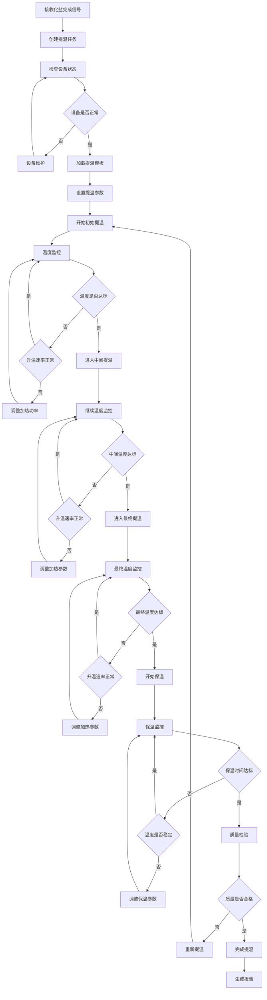
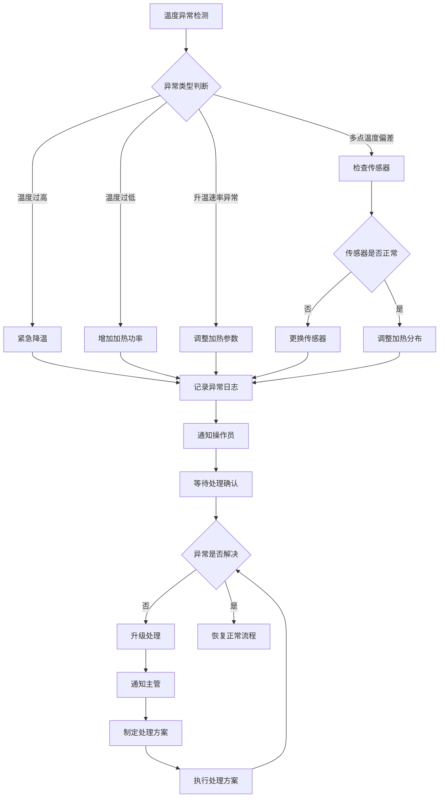

# 提温工艺管理模块 - 子模块设计文档

## 1. 模块概述

### 1.1 功能定位
提温工艺管理模块是化盐工艺流程的关键后续环节，负责在化盐完成后对熔盐进行精确的温度提升控制。该模块通过精确的温度梯度控制和保温管理，确保熔盐达到最佳的物理化学性能，为后续的质量检验和入库存储提供合格的产品。

### 1.2 业务价值
- **产品质量保障**：通过精确的提温控制确保熔盐的最终质量
- **工艺稳定性**：建立标准化的提温工艺流程，保证产品一致性
- **能耗优化**：通过智能温控算法优化能源消耗，降低生产成本
- **安全保障**：严格的温度控制和监控，防止过热等安全风险
- **效率提升**：自动化的提温控制减少人工干预，提高生产效率

### 1.3 模块边界
- **上游依赖**：化盐工艺管理模块（化盐完成信号）、项目管理模块（工艺配置）
- **下游服务**：质量管理模块（质量检验）、库存管理模块（入库管理）
- **外部集成**：温控系统、保温系统、温度监测系统、能耗监控系统

## 2. 功能需求清单

### 2.1 提温任务管理
- **任务创建**：基于化盐完成信号自动创建提温任务
- **任务调度**：智能调度提温任务，优化设备利用率和能耗
- **任务监控**：实时监控提温任务的执行状态和关键参数
- **任务报告**：生成详细的提温任务执行报告和能耗分析

### 2.2 温度控制管理
- **分段提温控制**：支持多段式温度提升控制
  - 初始提温阶段（480°C → 520°C，升温速率2°C/min）
  - 中间提温阶段（520°C → 560°C，升温速率1.5°C/min）
  - 最终提温阶段（560°C → 580°C，升温速率1°C/min）
  - 保温稳定阶段（580°C ± 2°C，保温30分钟）
- **温度梯度控制**：精确控制升温速率和温度梯度
- **多点温度监控**：支持罐体多点温度实时监控
- **温度均匀性控制**：确保罐体内温度分布均匀
- **自动温控算法**：基于PID算法的智能温度控制

### 2.3 保温管理
- **保温时间控制**：精确控制各阶段的保温时间
- **保温温度稳定性**：确保保温期间温度稳定性（±2°C）
- **保温效果监控**：监控保温系统的工作状态和效果
- **能耗优化**：优化保温过程的能源消耗

### 2.4 提温巡检管理
- **巡检计划制定**：制定提温过程的巡检计划和检查点
- **现场巡检执行**：支持移动端现场巡检和数据录入
- **温度异常记录**：记录巡检过程中发现的温度异常
- **设备状态检查**：检查提温设备的运行状态和性能

## 3. 页面设计规范

### 3.1 页面布局设计

#### 3.1.1 提温任务列表页面
```
┌─────────────────────────────────────────────────────────────┐
│ 面包屑导航: 首页 > ERP管理 > 化盐工艺流程 > 提温工艺          │
├─────────────────────────────────────────────────────────────┤
│ 搜索筛选区域                                                │
│ [项目名称] [任务状态] [熔盐罐] [目标温度] [时间范围] [搜索]   │
├─────────────────────────────────────────────────────────────┤
│ 操作按钮区域                                                │
│ [新增任务] [批量操作] [温控模板] [导出] [刷新]               │
├─────────────────────────────────────────────────────────────┤
│ 任务列表表格                                                │
│ ☑ │任务编码│项目│熔盐罐│目标温度│当前温度│状态│进度│操作员│操作│
│ ☐ │HT001  │项目A│Tank01│580°C │565°C │进行中│85%│张三│查看执行│
├─────────────────────────────────────────────────────────────┤
│ 分页组件                                                    │
│ 共60条 [10条/页] [上一页] 1 2 3 [下一页]                    │
└─────────────────────────────────────────────────────────────┘
```

#### 3.1.2 提温执行监控页面
```
┌─────────────────────────────────────────────────────────────┐
│ 任务信息栏                                                  │
│ 任务编码: HT001  项目: 化盐项目A  熔盐罐: Tank01             │
│ 目标温度: 580°C  当前阶段: 最终提温  操作员: 张三             │
├─────────────────────────────────────────────────────────────┤
│ 温度监控面板                                                │
│ ┌─────────────┐ ┌─────────────┐ ┌─────────────┐             │
│ │   当前温度   │ │   升温速率   │ │   保温时间   │             │
│ │   565°C     │ │   1.2°C/min │ │   15/30min  │             │
│ │   目标580°C  │ │   目标1°C/min│ │   剩余15min  │             │
│ └─────────────┘ └─────────────┘ └─────────────┘             │
├─────────────────────────────────────────────────────────────┤
│ 多点温度监控                                                │
│ ┌─────────────┐ ┌─────────────┐ ┌─────────────┐             │
│ │   上部温度   │ │   中部温度   │ │   下部温度   │             │
│ │   567°C     │ │   565°C     │ │   563°C     │             │
│ │   偏差+2°C   │ │   偏差 0°C   │ │   偏差-2°C   │             │
│ └─────────────┘ └─────────────┘ └─────────────┘             │
├─────────────────────────────────────────────────────────────┤
│ 提温曲线图表                                                │
│ [温度曲线] [升温速率] [能耗监控] [设备状态] [操作记录]        │
│ (实时更新的提温过程图表)                                    │
├─────────────────────────────────────────────────────────────┤
│ 操作控制区域                                                │
│ [开始提温] [暂停] [调整参数] [紧急停止] [完成提温]           │
└─────────────────────────────────────────────────────────────┘
```

### 3.2 组件设计规范

#### 3.2.1 温度控制组件
```vue
<template>
  <div class="temperature-control">
    <div class="control-header">
      <h4>温度控制</h4>
      <div class="control-mode">
        <el-tag :type="getModeTagType()">
          {{ controlMode === 'AUTO' ? '自动控制' : '手动控制' }}
        </el-tag>
        <el-switch
          v-model="autoMode"
          active-text="自动"
          inactive-text="手动"
          @change="handleModeChange"
        />
      </div>
    </div>
    
    <div class="temperature-display">
      <div class="current-temp-section">
        <div class="temp-value">
          <span class="value">{{ currentTemp }}°C</span>
          <span class="trend" :class="getTempTrendClass()">
            {{ getTempTrendText() }}
          </span>
        </div>
        <div class="temp-target">
          目标: {{ targetTemp }}°C
        </div>
        <div class="temp-stage">
          阶段: {{ getCurrentStageText() }}
        </div>
      </div>
      
      <div class="heating-rate-section">
        <div class="rate-value">
          <span class="value">{{ heatingRate.toFixed(1) }}°C/min</span>
          <span class="status" :class="getRateStatusClass()">
            {{ getRateStatusText() }}
          </span>
        </div>
        <div class="rate-target">
          目标速率: {{ targetHeatingRate }}°C/min
        </div>
      </div>
      
      <div class="holding-section" v-if="isHoldingStage">
        <div class="holding-time">
          <span class="value">{{ formatTime(holdingTime) }}</span>
          <span class="total">/ {{ formatTime(targetHoldingTime) }}</span>
        </div>
        <div class="holding-progress">
          <el-progress
            :percentage="(holdingTime / targetHoldingTime) * 100"
            :stroke-width="8"
            :show-text="false"
          />
        </div>
      </div>
    </div>
    
    <div class="multi-point-monitor">
      <h5>多点温度监控</h5>
      <div class="temp-points">
        <div 
          v-for="point in temperaturePoints" 
          :key="point.location"
          class="temp-point"
          :class="{ 'temp-warning': isPointWarning(point) }"
        >
          <div class="point-location">{{ point.locationName }}</div>
          <div class="point-temp">{{ point.temperature }}°C</div>
          <div class="point-deviation" :class="getDeviationClass(point.deviation)">
            偏差: {{ point.deviation > 0 ? '+' : '' }}{{ point.deviation.toFixed(1) }}°C
          </div>
        </div>
      </div>
    </div>
    
    <div class="control-panel" v-if="!autoMode">
      <div class="temp-adjustment">
        <el-input-number
          v-model="manualTargetTemp"
          :min="400"
          :max="650"
          :step="1"
          :precision="0"
          @change="handleTempChange"
        />
        <span class="unit">°C</span>
      </div>
      
      <div class="rate-adjustment">
        <el-input-number
          v-model="manualHeatingRate"
          :min="0.5"
          :max="5"
          :step="0.1"
          :precision="1"
          @change="handleRateChange"
        />
        <span class="unit">°C/min</span>
      </div>
      
      <div class="control-buttons">
        <el-button size="small" @click="adjustTemp(-5)">-5°C</el-button>
        <el-button size="small" @click="adjustTemp(5)">+5°C</el-button>
        <el-button size="small" @click="adjustRate(-0.1)">减速</el-button>
        <el-button size="small" @click="adjustRate(0.1)">加速</el-button>
      </div>
    </div>
    
    <div class="stage-progress">
      <h5>提温阶段进度</h5>
      <el-steps :active="currentStageIndex" align-center>
        <el-step 
          v-for="stage in heatingStages" 
          :key="stage.name"
          :title="stage.name"
          :description="`${stage.startTemp}°C → ${stage.endTemp}°C`"
        />
      </el-steps>
    </div>
  </div>
</template>

<script setup lang="ts">
interface Props {
  currentTemp: number;
  targetTemp: number;
  heatingRate: number;
  targetHeatingRate: number;
  controlMode: 'AUTO' | 'MANUAL';
  temperaturePoints: TemperaturePoint[];
  heatingStages: HeatingStage[];
  currentStageIndex: number;
  holdingTime?: number;
  targetHoldingTime?: number;
}

interface TemperaturePoint {
  location: string;
  locationName: string;
  temperature: number;
  deviation: number;
}

interface HeatingStage {
  name: string;
  startTemp: number;
  endTemp: number;
  targetRate: number;
  holdingTime?: number;
}

interface Emits {
  updateTemp: [temperature: number];
  updateRate: [rate: number];
  changeMode: [mode: 'AUTO' | 'MANUAL'];
}

const props = defineProps<Props>();
const emit = defineEmits<Emits>();

const autoMode = ref(props.controlMode === 'AUTO');
const manualTargetTemp = ref(props.targetTemp);
const manualHeatingRate = ref(props.targetHeatingRate);

const isHoldingStage = computed(() => {
  return props.holdingTime !== undefined && props.targetHoldingTime !== undefined;
});

const getCurrentStageText = () => {
  if (props.currentStageIndex < props.heatingStages.length) {
    return props.heatingStages[props.currentStageIndex].name;
  }
  return '已完成';
};

const getTempTrendClass = () => {
  if (props.heatingRate > 0.1) return 'trend-up';
  if (props.heatingRate < -0.1) return 'trend-down';
  return 'trend-stable';
};

const getTempTrendText = () => {
  if (props.heatingRate > 0.1) return '↗ 升温中';
  if (props.heatingRate < -0.1) return '↘ 降温中';
  return '→ 稳定';
};

const getRateStatusClass = () => {
  const diff = Math.abs(props.heatingRate - props.targetHeatingRate);
  if (diff > 0.5) return 'rate-error';
  if (diff > 0.2) return 'rate-warning';
  return 'rate-normal';
};

const getRateStatusText = () => {
  const diff = Math.abs(props.heatingRate - props.targetHeatingRate);
  if (diff > 0.5) return '速率异常';
  if (diff > 0.2) return '速率偏差';
  return '速率正常';
};

const isPointWarning = (point: TemperaturePoint) => {
  return Math.abs(point.deviation) > 5;
};

const getDeviationClass = (deviation: number) => {
  const abs = Math.abs(deviation);
  if (abs > 5) return 'deviation-error';
  if (abs > 3) return 'deviation-warning';
  return 'deviation-normal';
};

const handleModeChange = (auto: boolean) => {
  emit('changeMode', auto ? 'AUTO' : 'MANUAL');
};

const handleTempChange = (value: number) => {
  emit('updateTemp', value);
};

const handleRateChange = (value: number) => {
  emit('updateRate', value);
};

const adjustTemp = (delta: number) => {
  const newTemp = manualTargetTemp.value + delta;
  manualTargetTemp.value = Math.max(400, Math.min(650, newTemp));
  emit('updateTemp', manualTargetTemp.value);
};

const adjustRate = (delta: number) => {
  const newRate = manualHeatingRate.value + delta;
  manualHeatingRate.value = Math.max(0.5, Math.min(5, newRate));
  emit('updateRate', manualHeatingRate.value);
};

const formatTime = (minutes: number) => {
  const hours = Math.floor(minutes / 60);
  const mins = minutes % 60;
  return hours > 0 ? `${hours}h ${mins}m` : `${mins}m`;
};
</script>
```

#### 3.2.2 提温阶段进度组件
```vue
<template>
  <div class="heating-stage-progress">
    <div class="progress-header">
      <h4>提温阶段进度</h4>
      <div class="overall-progress">
        <span>总进度: {{ overallProgress }}%</span>
        <el-progress
          :percentage="overallProgress"
          :stroke-width="6"
          :show-text="false"
        />
      </div>
    </div>

    <div class="stages-container">
      <div
        v-for="(stage, index) in stages"
        :key="stage.id"
        class="stage-item"
        :class="getStageClass(index)"
      >
        <div class="stage-header">
          <div class="stage-number">{{ index + 1 }}</div>
          <div class="stage-info">
            <div class="stage-name">{{ stage.name }}</div>
            <div class="stage-temp-range">
              {{ stage.startTemp }}°C → {{ stage.endTemp }}°C
            </div>
            <div class="stage-rate">
              升温速率: {{ stage.targetRate }}°C/min
            </div>
          </div>
          <div class="stage-status">
            <el-tag :type="getStageStatusType(index)">
              {{ getStageStatusText(index) }}
            </el-tag>
          </div>
        </div>

        <div class="stage-progress" v-if="index === currentStageIndex">
          <div class="progress-info">
            <span>当前温度: {{ currentTemp }}°C</span>
            <span>目标温度: {{ stage.endTemp }}°C</span>
            <span>剩余: {{ getRemainingTemp(stage) }}°C</span>
          </div>
          <el-progress
            :percentage="getStageProgress(stage)"
            :status="getProgressStatus(index)"
            :stroke-width="8"
          />
          <div class="time-info" v-if="stage.holdingTime && isHoldingPhase(index)">
            <span>保温时间: {{ formatTime(currentHoldingTime) }} / {{ formatTime(stage.holdingTime) }}</span>
            <el-progress
              :percentage="(currentHoldingTime / stage.holdingTime) * 100"
              :stroke-width="6"
              :show-text="false"
            />
          </div>
        </div>

        <div class="stage-details" v-if="index === currentStageIndex">
          <div class="detail-item">
            <span class="label">实际升温速率:</span>
            <span class="value" :class="getRateClass(stage)">
              {{ actualHeatingRate.toFixed(1) }}°C/min
            </span>
          </div>
          <div class="detail-item" v-if="stage.estimatedTime">
            <span class="label">预计完成时间:</span>
            <span class="value">{{ getEstimatedCompletionTime(stage) }}</span>
          </div>
          <div class="detail-item">
            <span class="label">能耗:</span>
            <span class="value">{{ getCurrentEnergyConsumption() }}kWh</span>
          </div>
        </div>
      </div>
    </div>

    <div class="stage-controls" v-if="canControl">
      <el-button
        size="small"
        @click="handleSkipStage"
        :disabled="!canSkipStage"
      >
        跳过当前阶段
      </el-button>
      <el-button
        size="small"
        @click="handleExtendHolding"
        :disabled="!isHoldingPhase(currentStageIndex)"
      >
        延长保温
      </el-button>
      <el-button
        size="small"
        @click="handleAdjustStage"
      >
        调整参数
      </el-button>
    </div>
  </div>
</template>

<script setup lang="ts">
interface Props {
  stages: HeatingStage[];
  currentStageIndex: number;
  currentTemp: number;
  actualHeatingRate: number;
  currentHoldingTime?: number;
  overallProgress: number;
  canControl: boolean;
}

interface HeatingStage {
  id: string;
  name: string;
  startTemp: number;
  endTemp: number;
  targetRate: number;
  holdingTime?: number;
  estimatedTime?: number;
  status: 'PENDING' | 'IN_PROGRESS' | 'HOLDING' | 'COMPLETED';
}

interface Emits {
  skipStage: [stageIndex: number];
  extendHolding: [additionalTime: number];
  adjustStage: [stageIndex: number, adjustments: StageAdjustment];
}

const props = defineProps<Props>();
const emit = defineEmits<Emits>();

const canSkipStage = computed(() => {
  const currentStage = props.stages[props.currentStageIndex];
  return currentStage && currentStage.status === 'IN_PROGRESS' &&
         props.currentTemp >= currentStage.endTemp * 0.95;
});

const getStageClass = (index: number) => {
  if (index < props.currentStageIndex) return 'stage-completed';
  if (index === props.currentStageIndex) return 'stage-active';
  return 'stage-pending';
};

const getStageStatusType = (index: number) => {
  if (index < props.currentStageIndex) return 'success';
  if (index === props.currentStageIndex) {
    const stage = props.stages[index];
    if (stage.status === 'HOLDING') return 'warning';
    return 'primary';
  }
  return 'info';
};

const getStageStatusText = (index: number) => {
  if (index < props.currentStageIndex) return '已完成';
  if (index === props.currentStageIndex) {
    const stage = props.stages[index];
    if (stage.status === 'HOLDING') return '保温中';
    return '进行中';
  }
  return '待执行';
};

const getStageProgress = (stage: HeatingStage) => {
  const tempRange = stage.endTemp - stage.startTemp;
  const currentProgress = props.currentTemp - stage.startTemp;
  return Math.max(0, Math.min(100, (currentProgress / tempRange) * 100));
};

const getRemainingTemp = (stage: HeatingStage) => {
  return Math.max(0, stage.endTemp - props.currentTemp);
};

const isHoldingPhase = (index: number) => {
  const stage = props.stages[index];
  return stage && stage.status === 'HOLDING' && stage.holdingTime;
};

const getRateClass = (stage: HeatingStage) => {
  const diff = Math.abs(props.actualHeatingRate - stage.targetRate);
  if (diff > 0.5) return 'rate-error';
  if (diff > 0.2) return 'rate-warning';
  return 'rate-normal';
};

const getEstimatedCompletionTime = (stage: HeatingStage) => {
  const remainingTemp = getRemainingTemp(stage);
  const estimatedMinutes = remainingTemp / props.actualHeatingRate;
  const completionTime = new Date(Date.now() + estimatedMinutes * 60000);
  return completionTime.toLocaleTimeString();
};

const getCurrentEnergyConsumption = () => {
  // 模拟能耗计算
  return (props.currentTemp * 0.1).toFixed(1);
};

const formatTime = (minutes: number) => {
  const hours = Math.floor(minutes / 60);
  const mins = minutes % 60;
  return hours > 0 ? `${hours}h ${mins}m` : `${mins}m`;
};

const handleSkipStage = () => {
  emit('skipStage', props.currentStageIndex);
};

const handleExtendHolding = () => {
  // 弹出对话框让用户输入延长时间
  ElMessageBox.prompt('请输入延长的保温时间（分钟）', '延长保温', {
    confirmButtonText: '确定',
    cancelButtonText: '取消',
    inputPattern: /^\d+$/,
    inputErrorMessage: '请输入有效的数字'
  }).then(({ value }) => {
    emit('extendHolding', parseInt(value));
  });
};

const handleAdjustStage = () => {
  emit('adjustStage', props.currentStageIndex, {});
};
</script>
```

### 3.3 交互流程设计

#### 3.3.1 提温工艺执行流程


## 4. API接口设计

### 4.1 接口列表

#### 4.1.1 提温任务管理接口
```typescript
// 查询提温任务列表
GET /erp/saltprocess/heating-task/list
// 权限: erp:saltprocess:heating-task:list

// 获取提温任务详情
GET /erp/saltprocess/heating-task/{id}
// 权限: erp:saltprocess:heating-task:query

// 创建提温任务
POST /erp/saltprocess/heating-task
// 权限: erp:saltprocess:heating-task:add

// 更新提温任务
PUT /erp/saltprocess/heating-task
// 权限: erp:saltprocess:heating-task:edit

// 开始提温任务
POST /erp/saltprocess/heating-task/{id}/start
// 权限: erp:saltprocess:heating-task:execute

// 完成提温任务
POST /erp/saltprocess/heating-task/{id}/complete
// 权限: erp:saltprocess:heating-task:execute
```

#### 4.1.2 温度控制接口
```typescript
// 获取实时温度数据
GET /erp/saltprocess/temperature-control/realtime/{taskId}
// 权限: erp:saltprocess:temperature:query

// 更新温度控制参数
PUT /erp/saltprocess/temperature-control/{taskId}
// 权限: erp:saltprocess:temperature:control

// 获取温度历史曲线
GET /erp/saltprocess/temperature-control/history/{taskId}
// 权限: erp:saltprocess:temperature:query

// 执行温度调节
POST /erp/saltprocess/temperature-control/{taskId}/adjust
// 权限: erp:saltprocess:temperature:control

// 获取多点温度数据
GET /erp/saltprocess/temperature-control/multipoint/{taskId}
// 权限: erp:saltprocess:temperature:query
```

#### 4.1.3 提温阶段管理接口
```typescript
// 获取提温阶段信息
GET /erp/saltprocess/heating-stage/{taskId}
// 权限: erp:saltprocess:heating-stage:query

// 更新提温阶段
PUT /erp/saltprocess/heating-stage/{taskId}
// 权限: erp:saltprocess:heating-stage:control

// 跳过当前阶段
POST /erp/saltprocess/heating-stage/{taskId}/skip
// 权限: erp:saltprocess:heating-stage:control

// 延长保温时间
POST /erp/saltprocess/heating-stage/{taskId}/extend-holding
// 权限: erp:saltprocess:heating-stage:control
```

### 4.2 请求响应格式

#### 4.2.1 提温任务查询请求
```typescript
interface HeatingTaskQuery {
  pageNum?: number;
  pageSize?: number;
  projectId?: string;
  taskCode?: string;
  status?: HeatingTaskStatus;
  tankId?: string;
  targetTempMin?: number;
  targetTempMax?: number;
  operatorId?: string;
  startTime?: string;
  endTime?: string;
}
```

#### 4.2.2 提温任务详情响应
```typescript
interface HeatingTaskVO {
  id: string;
  taskCode: string;
  projectId: string;
  projectName: string;
  saltmakingTaskId: string;
  tankId: string;
  tankName: string;
  targetTemperature: number;
  currentTemperature?: number;
  heatingStages: HeatingStageVO[];
  currentStageIndex: number;
  status: HeatingTaskStatus;
  progress: number;
  operatorId: string;
  operatorName: string;
  plannedStartTime: string;
  plannedEndTime: string;
  actualStartTime?: string;
  actualEndTime?: string;
  energyConsumption?: number;
  remarks?: string;
  createTime: string;
  updateTime: string;
}
```

#### 4.2.3 温度控制响应
```typescript
interface TemperatureControlVO {
  taskId: string;
  currentTemperature: number;
  targetTemperature: number;
  heatingRate: number;
  targetHeatingRate: number;
  controlMode: 'AUTO' | 'MANUAL';
  temperaturePoints: TemperaturePointVO[];
  energyConsumption: number;
  equipmentStatus: string;
  recordTime: string;
}

interface TemperaturePointVO {
  location: string;
  locationName: string;
  temperature: number;
  deviation: number;
  status: 'NORMAL' | 'WARNING' | 'ERROR';
}
```

#### 4.2.4 提温阶段响应
```typescript
interface HeatingStageVO {
  id: string;
  stageName: string;
  stageOrder: number;
  startTemperature: number;
  endTemperature: number;
  targetHeatingRate: number;
  holdingTime?: number;
  currentHoldingTime?: number;
  status: HeatingStageStatus;
  estimatedDuration: number;
  actualDuration?: number;
  energyConsumption?: number;
}
```

### 4.3 权限控制设计
```typescript
// 提温工艺权限配置
const heatingPermissions = {
  'erp:saltprocess:heating-task:list': '查询提温任务列表',
  'erp:saltprocess:heating-task:query': '查询提温任务详情',
  'erp:saltprocess:heating-task:add': '新增提温任务',
  'erp:saltprocess:heating-task:edit': '编辑提温任务',
  'erp:saltprocess:heating-task:remove': '删除提温任务',
  'erp:saltprocess:heating-task:execute': '执行提温任务',
  'erp:saltprocess:temperature:query': '查询温度数据',
  'erp:saltprocess:temperature:control': '控制温度参数',
  'erp:saltprocess:heating-stage:query': '查询提温阶段',
  'erp:saltprocess:heating-stage:control': '控制提温阶段'
};
```

## 5. 数据模型设计

### 5.1 核心实体设计

#### 5.1.1 提温任务实体 (HeatingTask)
```typescript
interface HeatingTask {
  id: string;                          // 任务ID
  taskCode: string;                    // 任务编码
  projectId: string;                   // 项目ID
  saltmakingTaskId: string;            // 化盐任务ID
  tankId: string;                      // 熔盐罐ID
  targetTemperature: number;           // 目标温度(°C)
  currentTemperature?: number;         // 当前温度(°C)
  heatingStages: HeatingStage[];       // 提温阶段
  currentStageIndex: number;           // 当前阶段索引
  status: HeatingTaskStatus;           // 任务状态
  progress: number;                    // 执行进度(0-100)
  operatorId: string;                  // 操作员ID
  plannedStartTime: Date;              // 计划开始时间
  plannedEndTime: Date;                // 计划结束时间
  actualStartTime?: Date;              // 实际开始时间
  actualEndTime?: Date;                // 实际结束时间
  energyConsumption?: number;          // 能耗(kWh)
  remarks?: string;                    // 备注
  createBy: string;                    // 创建人
  createTime: Date;                    // 创建时间
  updateBy?: string;                   // 更新人
  updateTime?: Date;                   // 更新时间
  delFlag: string;                     // 删除标志
}
```

#### 5.1.2 提温阶段实体 (HeatingStage)
```typescript
interface HeatingStage {
  id: string;                          // 阶段ID
  taskId: string;                      // 任务ID
  stageName: string;                   // 阶段名称
  stageOrder: number;                  // 阶段顺序
  startTemperature: number;            // 起始温度(°C)
  endTemperature: number;              // 结束温度(°C)
  targetHeatingRate: number;           // 目标升温速率(°C/min)
  holdingTime?: number;                // 保温时间(分钟)
  currentHoldingTime?: number;         // 当前保温时间(分钟)
  status: HeatingStageStatus;          // 阶段状态
  estimatedDuration: number;           // 预计持续时间(分钟)
  actualDuration?: number;             // 实际持续时间(分钟)
  energyConsumption?: number;          // 阶段能耗(kWh)
  startTime?: Date;                    // 开始时间
  endTime?: Date;                      // 结束时间
  createTime: Date;                    // 创建时间
}
```

#### 5.1.3 温度控制实体 (TemperatureControl)
```typescript
interface TemperatureControl {
  id: string;                          // 控制ID
  taskId: string;                      // 任务ID
  recordTime: Date;                    // 记录时间
  currentTemperature: number;          // 当前温度(°C)
  targetTemperature: number;           // 目标温度(°C)
  heatingRate: number;                 // 升温速率(°C/min)
  targetHeatingRate: number;           // 目标升温速率(°C/min)
  controlMode: ControlMode;            // 控制模式
  heatingPower: number;                // 加热功率(kW)
  energyConsumption: number;           // 累计能耗(kWh)
  equipmentStatus: string;             // 设备状态
  isAbnormal: boolean;                 // 是否异常
  abnormalReason?: string;             // 异常原因
  operatorId: string;                  // 操作员ID
}
```

#### 5.1.4 多点温度监控实体 (TemperaturePoint)
```typescript
interface TemperaturePoint {
  id: string;                          // 监控点ID
  taskId: string;                      // 任务ID
  location: string;                    // 位置代码
  locationName: string;                // 位置名称
  temperature: number;                 // 温度值(°C)
  deviation: number;                   // 偏差(°C)
  status: TemperaturePointStatus;      // 监控点状态
  recordTime: Date;                    // 记录时间
  sensorId: string;                    // 传感器ID
  calibrationDate?: Date;              // 校准日期
}
```

#### 5.1.5 枚举定义
```typescript
enum HeatingTaskStatus {
  PENDING = 'PENDING',                 // 待开始
  IN_PROGRESS = 'IN_PROGRESS',         // 进行中
  HOLDING = 'HOLDING',                 // 保温中
  COMPLETED = 'COMPLETED',             // 已完成
  FAILED = 'FAILED',                   // 失败
  CANCELLED = 'CANCELLED'              // 已取消
}

enum HeatingStageStatus {
  PENDING = 'PENDING',                 // 待执行
  IN_PROGRESS = 'IN_PROGRESS',         // 进行中
  HOLDING = 'HOLDING',                 // 保温中
  COMPLETED = 'COMPLETED',             // 已完成
  SKIPPED = 'SKIPPED'                  // 已跳过
}

enum ControlMode {
  AUTO = 'AUTO',                       // 自动控制
  MANUAL = 'MANUAL'                    // 手动控制
}

enum TemperaturePointStatus {
  NORMAL = 'NORMAL',                   // 正常
  WARNING = 'WARNING',                 // 警告
  ERROR = 'ERROR'                      // 错误
}
```

### 5.2 业务规则设计

#### 5.2.1 提温任务编码规则
```typescript
// 提温任务编码格式: HT + YYYYMMDD + 3位序号
// 示例: HT20240101001
const generateHeatingTaskCode = (date: Date): string => {
  const dateStr = date.toISOString().slice(0, 10).replace(/-/g, '');
  const sequence = getNextSequence('HT', dateStr);
  return `HT${dateStr}${sequence.toString().padStart(3, '0')}`;
};
```

#### 5.2.2 提温阶段控制规则
```typescript
const heatingStageRules = {
  // 初始提温阶段
  initialHeating: {
    startTemp: 480,                    // 起始温度 480°C
    endTemp: 520,                      // 结束温度 520°C
    targetRate: 2.0,                   // 目标升温速率 2°C/min
    maxRate: 3.0,                      // 最大升温速率 3°C/min
    tolerance: 1.0                     // 温度容差 ±1°C
  },

  // 中间提温阶段
  intermediateHeating: {
    startTemp: 520,                    // 起始温度 520°C
    endTemp: 560,                      // 结束温度 560°C
    targetRate: 1.5,                   // 目标升温速率 1.5°C/min
    maxRate: 2.0,                      // 最大升温速率 2°C/min
    tolerance: 1.0                     // 温度容差 ±1°C
  },

  // 最终提温阶段
  finalHeating: {
    startTemp: 560,                    // 起始温度 560°C
    endTemp: 580,                      // 结束温度 580°C
    targetRate: 1.0,                   // 目标升温速率 1°C/min
    maxRate: 1.5,                      // 最大升温速率 1.5°C/min
    tolerance: 0.5                     // 温度容差 ±0.5°C
  },

  // 保温阶段
  holdingStage: {
    targetTemp: 580,                   // 保温温度 580°C
    holdingTime: 30,                   // 保温时间 30分钟
    tolerance: 2.0,                    // 温度容差 ±2°C
    maxDeviation: 5.0                  // 最大偏差 ±5°C
  }
};
```

#### 5.2.3 温度控制规则
```typescript
const temperatureControlRules = {
  // 温度范围控制
  temperatureRange: {
    minTemp: 400,                      // 最低温度 400°C
    maxTemp: 650,                      // 最高温度 650°C
    safetyLimit: 600                   // 安全温度限制 600°C
  },

  // 升温速率控制
  heatingRateControl: {
    minRate: 0.5,                      // 最小升温速率 0.5°C/min
    maxRate: 5.0,                      // 最大升温速率 5°C/min
    emergencyStopRate: 10.0            // 紧急停止升温速率 10°C/min
  },

  // 多点温度监控
  multipointMonitoring: {
    maxDeviation: 10.0,                // 最大温度偏差 10°C
    warningDeviation: 5.0,             // 警告温度偏差 5°C
    monitoringInterval: 30             // 监控间隔 30秒
  },

  // 能耗控制
  energyControl: {
    maxPowerConsumption: 100,          // 最大功率消耗 100kW
    energyEfficiencyTarget: 0.8        // 能效目标 80%
  }
};
```

## 6. 前端技术实现

### 6.1 Vue组件结构

#### 6.1.1 页面组件结构
```
src/views/erp/saltprocess/heating/
├── index.vue                    # 提温任务列表页面
├── execute.vue                  # 提温执行监控页面
├── temperature.vue              # 温度控制页面
├── stages.vue                   # 提温阶段管理页面
└── components/
    ├── TaskCard.vue             # 任务卡片组件
    ├── TemperatureControl.vue   # 温度控制组件
    ├── HeatingStageProgress.vue # 提温阶段进度组件
    ├── MultipointMonitor.vue    # 多点温度监控组件
    ├── TemperatureChart.vue     # 温度图表组件
    ├── EnergyMonitor.vue        # 能耗监控组件
    ├── TaskStatus.vue           # 任务状态组件
    └── AlertPanel.vue           # 报警面板组件
```

### 6.2 状态管理设计

#### 6.2.1 提温模块Store
```typescript
// src/store/modules/heating.ts
import { defineStore } from 'pinia';
import { HeatingTaskVO, TemperatureControlVO, HeatingStageVO } from '@/api/erp/saltprocess/heating/types';

interface HeatingState {
  // 任务相关状态
  currentTask: HeatingTaskVO | null;
  taskList: HeatingTaskVO[];

  // 温度控制数据
  temperatureControl: Map<string, TemperatureControlVO>;

  // 提温阶段数据
  heatingStages: Map<string, HeatingStageVO[]>;

  // 监控状态
  monitoringTasks: Set<string>;

  // 报警信息
  alerts: Alert[];

  // 提温模板
  heatingTemplates: HeatingTemplate[];

  // UI状态
  loading: boolean;
  error: string | null;
}

export const useHeatingStore = defineStore('heating', {
  state: (): HeatingState => ({
    currentTask: null,
    taskList: [],
    temperatureControl: new Map(),
    heatingStages: new Map(),
    monitoringTasks: new Set(),
    alerts: [],
    heatingTemplates: [],
    loading: false,
    error: null
  }),

  getters: {
    // 获取当前任务
    getCurrentTask: (state) => state.currentTask,

    // 获取任务列表
    getTaskList: (state) => state.taskList,

    // 根据状态筛选任务
    getTasksByStatus: (state) => (status: HeatingTaskStatus) => {
      return state.taskList.filter(task => task.status === status);
    },

    // 获取温度控制数据
    getTemperatureControl: (state) => (taskId: string) => {
      return state.temperatureControl.get(taskId);
    },

    // 获取提温阶段数据
    getHeatingStages: (state) => (taskId: string) => {
      return state.heatingStages.get(taskId) || [];
    },

    // 获取当前阶段
    getCurrentStage: (state) => (taskId: string) => {
      const task = state.taskList.find(t => t.id === taskId);
      const stages = state.heatingStages.get(taskId);
      if (task && stages) {
        return stages[task.currentStageIndex];
      }
      return null;
    },

    // 获取活动报警
    getActiveAlerts: (state) => {
      return state.alerts.filter(alert => alert.status === 'ACTIVE');
    }
  },

  actions: {
    // 设置当前任务
    setCurrentTask(task: HeatingTaskVO | null) {
      this.currentTask = task;
    },

    // 更新任务列表
    setTaskList(tasks: HeatingTaskVO[]) {
      this.taskList = tasks;
    },

    // 更新温度控制数据
    updateTemperatureControl(taskId: string, data: TemperatureControlVO) {
      this.temperatureControl.set(taskId, data);
    },

    // 更新提温阶段数据
    updateHeatingStages(taskId: string, stages: HeatingStageVO[]) {
      this.heatingStages.set(taskId, stages);
    },

    // 开始监控任务
    startMonitoring(taskId: string) {
      this.monitoringTasks.add(taskId);
    },

    // 停止监控任务
    stopMonitoring(taskId: string) {
      this.monitoringTasks.delete(taskId);
    },

    // 添加报警
    addAlert(alert: Alert) {
      this.alerts.push(alert);
    },

    // 处理报警
    handleAlert(alertId: string, action: string) {
      const alert = this.alerts.find(a => a.id === alertId);
      if (alert) {
        alert.status = 'HANDLED';
        alert.handledTime = new Date();
        alert.handledAction = action;
      }
    },

    // 清空状态
    clearState() {
      this.currentTask = null;
      this.taskList = [];
      this.temperatureControl.clear();
      this.heatingStages.clear();
      this.monitoringTasks.clear();
      this.alerts = [];
      this.heatingTemplates = [];
      this.loading = false;
      this.error = null;
    }
  }
});
```

### 6.3 路由配置

#### 6.3.1 提温工艺路由
```typescript
// src/router/modules/saltprocess.ts (提温部分)
const heatingRoutes = [
  {
    path: 'heating',
    component: () => import('@/views/erp/saltprocess/heating/index.vue'),
    name: 'HeatingTaskList',
    meta: {
      title: '提温工艺',
      icon: 'temperature',
      permissions: ['erp:saltprocess:heating-task:list']
    }
  },
  {
    path: 'heating/execute/:id',
    component: () => import('@/views/erp/saltprocess/heating/execute.vue'),
    name: 'HeatingExecute',
    meta: {
      title: '提温执行',
      hidden: true,
      activeMenu: '/erp/saltprocess/heating',
      permissions: ['erp:saltprocess:heating-task:execute']
    }
  },
  {
    path: 'heating/temperature/:id',
    component: () => import('@/views/erp/saltprocess/heating/temperature.vue'),
    name: 'HeatingTemperature',
    meta: {
      title: '温度控制',
      hidden: true,
      activeMenu: '/erp/saltprocess/heating',
      permissions: ['erp:saltprocess:temperature:control']
    }
  },
  {
    path: 'heating/stages/:id',
    component: () => import('@/views/erp/saltprocess/heating/stages.vue'),
    name: 'HeatingStages',
    meta: {
      title: '提温阶段',
      hidden: true,
      activeMenu: '/erp/saltprocess/heating',
      permissions: ['erp:saltprocess:heating-stage:query']
    }
  }
];
```

## 7. 业务流程设计

### 7.1 提温异常处理流程


### 7.2 能耗优化流程
```typescript
const energyOptimizationFlow = async (taskId: string) => {
  // 1. 获取当前能耗数据
  const currentEnergyData = await getCurrentEnergyConsumption(taskId);

  // 2. 分析能耗效率
  const efficiency = calculateEnergyEfficiency(currentEnergyData);

  // 3. 如果效率低于目标，执行优化
  if (efficiency < 0.8) {
    // 优化加热功率分配
    await optimizeHeatingPowerDistribution(taskId);

    // 调整升温速率
    await adjustHeatingRateForEfficiency(taskId);

    // 优化保温策略
    await optimizeHoldingStrategy(taskId);
  }

  // 4. 记录优化结果
  await recordOptimizationResult(taskId, efficiency);
};
```

## 8. 测试用例设计

### 8.1 功能测试用例

#### 8.1.1 提温任务创建测试
```typescript
describe('提温任务创建功能测试', () => {
  test('正常创建提温任务', async () => {
    const taskData = {
      projectId: 'project-001',
      saltmakingTaskId: 'sm-001',
      tankId: 'tank-001',
      targetTemperature: 580,
      operatorId: 'operator-001'
    };

    const result = await createHeatingTask(taskData);

    expect(result.code).toBe(200);
    expect(result.data.taskCode).toMatch(/^HT\d{8}\d{3}$/);
    expect(result.data.targetTemperature).toBe(580);
    expect(result.data.heatingStages).toHaveLength(4);
  });

  test('目标温度验证', async () => {
    const taskData = {
      projectId: 'project-001',
      saltmakingTaskId: 'sm-001',
      targetTemperature: 700, // 超出最大温度650°C
      operatorId: 'operator-001'
    };

    await expect(createHeatingTask(taskData))
      .rejects
      .toThrow('目标温度不能超过650°C');
  });
});
```

#### 8.1.2 温度控制测试
```typescript
describe('温度控制功能测试', () => {
  test('自动温度控制', async () => {
    const taskId = 'task-001';

    // 设置自动控制模式
    await setControlMode(taskId, 'AUTO');

    // 模拟温度变化
    await simulateTemperatureChange(taskId, 500);

    // 验证系统自动调节
    const controlData = await getTemperatureControl(taskId);
    expect(controlData.data.controlMode).toBe('AUTO');
    expect(controlData.data.heatingRate).toBeGreaterThan(0);
  });

  test('手动温度控制', async () => {
    const taskId = 'task-001';

    // 设置手动控制模式
    await setControlMode(taskId, 'MANUAL');

    // 手动调整目标温度
    await updateTargetTemperature(taskId, 520);

    // 验证温度更新
    const controlData = await getTemperatureControl(taskId);
    expect(controlData.data.targetTemperature).toBe(520);
    expect(controlData.data.controlMode).toBe('MANUAL');
  });

  test('多点温度监控', async () => {
    const taskId = 'task-001';

    const multipointData = await getMultipointTemperature(taskId);

    expect(multipointData.code).toBe(200);
    expect(multipointData.data.temperaturePoints).toHaveLength(3);

    // 验证温度点数据
    multipointData.data.temperaturePoints.forEach(point => {
      expect(point.temperature).toBeGreaterThan(0);
      expect(point.location).toBeDefined();
      expect(point.locationName).toBeDefined();
    });
  });
});
```

#### 8.1.3 提温阶段控制测试
```typescript
describe('提温阶段控制功能测试', () => {
  test('阶段自动切换', async () => {
    const taskId = 'task-001';

    // 模拟第一阶段完成
    await simulateStageCompletion(taskId, 0);

    // 验证自动切换到下一阶段
    const task = await getHeatingTask(taskId);
    expect(task.data.currentStageIndex).toBe(1);

    const stages = await getHeatingStages(taskId);
    expect(stages.data[0].status).toBe('COMPLETED');
    expect(stages.data[1].status).toBe('IN_PROGRESS');
  });

  test('跳过当前阶段', async () => {
    const taskId = 'task-001';
    const stageIndex = 1;

    const result = await skipHeatingStage(taskId, stageIndex);

    expect(result.code).toBe(200);

    // 验证阶段状态更新
    const stages = await getHeatingStages(taskId);
    expect(stages.data[stageIndex].status).toBe('SKIPPED');
  });

  test('延长保温时间', async () => {
    const taskId = 'task-001';
    const additionalTime = 15; // 延长15分钟

    const result = await extendHoldingTime(taskId, additionalTime);

    expect(result.code).toBe(200);

    // 验证保温时间更新
    const stages = await getHeatingStages(taskId);
    const holdingStage = stages.data.find(stage => stage.status === 'HOLDING');
    expect(holdingStage.holdingTime).toBeGreaterThan(30);
  });
});
```

### 8.2 集成测试用例

#### 8.2.1 提温流程集成测试
```typescript
describe('提温流程集成测试', () => {
  let taskId: string;

  test('完整提温流程', async () => {
    // 1. 创建提温任务
    const taskData = {
      projectId: 'project-001',
      saltmakingTaskId: 'sm-001',
      tankId: 'tank-001',
      targetTemperature: 580,
      operatorId: 'operator-001'
    };

    const createResult = await createHeatingTask(taskData);
    taskId = createResult.data.id;

    // 2. 开始提温
    const startResult = await startHeatingTask(taskId);
    expect(startResult.code).toBe(200);

    // 3. 模拟各阶段提温过程
    await simulateHeatingProcess(taskId, [520, 560, 580]);

    // 4. 模拟保温过程
    await simulateHoldingProcess(taskId, 30);

    // 5. 完成提温
    const completeResult = await completeHeatingTask(taskId);
    expect(completeResult.code).toBe(200);

    // 6. 验证最终状态
    const finalTask = await getHeatingTask(taskId);
    expect(finalTask.data.status).toBe('COMPLETED');
    expect(finalTask.data.currentTemperature).toBeCloseTo(580, 1);
  });

  test('温度控制与阶段管理联动', async () => {
    // 温度达到阶段目标时，验证阶段自动切换
    await simulateTemperatureReach(taskId, 520);

    const task = await getHeatingTask(taskId);
    expect(task.data.currentStageIndex).toBe(1);
  });
});
```

### 8.3 用户验收测试

#### 8.3.1 操作员执行提温任务场景
```typescript
describe('用户验收测试 - 提温任务执行', () => {
  test('操作员执行提温任务完整流程', async () => {
    // 1. 登录系统
    await login('operator', 'password');

    // 2. 进入提温工艺页面
    await navigateTo('/erp/saltprocess/heating');

    // 3. 查看待执行的提温任务
    await expectToSee('提温任务列表');
    const pendingTasks = await findTasksByStatus('PENDING');
    expect(pendingTasks.length).toBeGreaterThan(0);

    // 4. 选择任务并进入执行页面
    const task = pendingTasks[0];
    await clickButton('执行', task);
    await expectToSee('提温执行监控');

    // 5. 检查初始温度
    await expectToSee('当前温度');
    const initialTemp = await getCurrentTemperature();
    expect(initialTemp).toBeGreaterThan(400);

    // 6. 开始提温
    await clickButton('开始提温');
    await expectToSee('提温任务已开始');

    // 7. 监控提温过程
    await waitForCondition(() => {
      return getCurrentTemperature() > 500;
    }, 60000);

    // 8. 验证阶段进度
    await expectToSee('初始提温');
    await expectToSee('进行中');

    // 9. 切换到手动控制
    await clickSwitch('手动控制');
    await expectToSee('手动控制');

    // 10. 调整目标温度
    await setInputValue('目标温度', 525);
    await clickButton('确认调整');

    // 11. 等待提温完成
    await waitForCondition(() => {
      return getTaskProgress() >= 100;
    }, 180000);

    // 12. 完成提温
    await clickButton('完成提温');
    await expectToSee('提温任务已完成');

    // 13. 验证最终温度
    const finalTemp = await getCurrentTemperature();
    expect(finalTemp).toBeCloseTo(580, 5);
  });

  test('温度异常处理场景', async () => {
    // 1. 模拟温度异常
    await simulateTemperatureAnomaly(650);

    // 2. 验证报警显示
    await expectToSee('温度异常报警');

    // 3. 执行紧急降温
    await clickButton('紧急降温');
    await expectToSee('紧急降温已启动');

    // 4. 验证温度下降
    await waitForCondition(() => {
      return getCurrentTemperature() < 600;
    }, 30000);
  });
});
```

---

**文档版本**: v1.0
**创建日期**: 2024-01-01
**最后更新**: 2024-01-01
**文档状态**: 草稿
```
