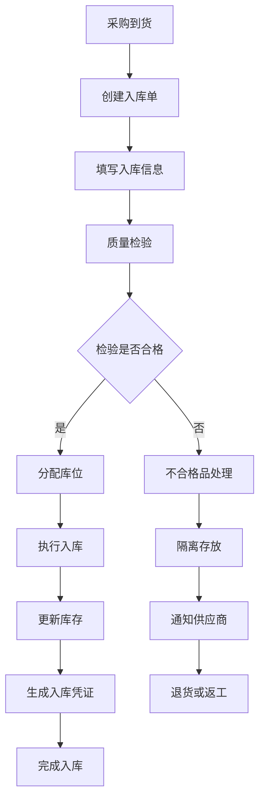
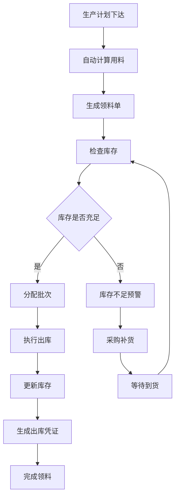
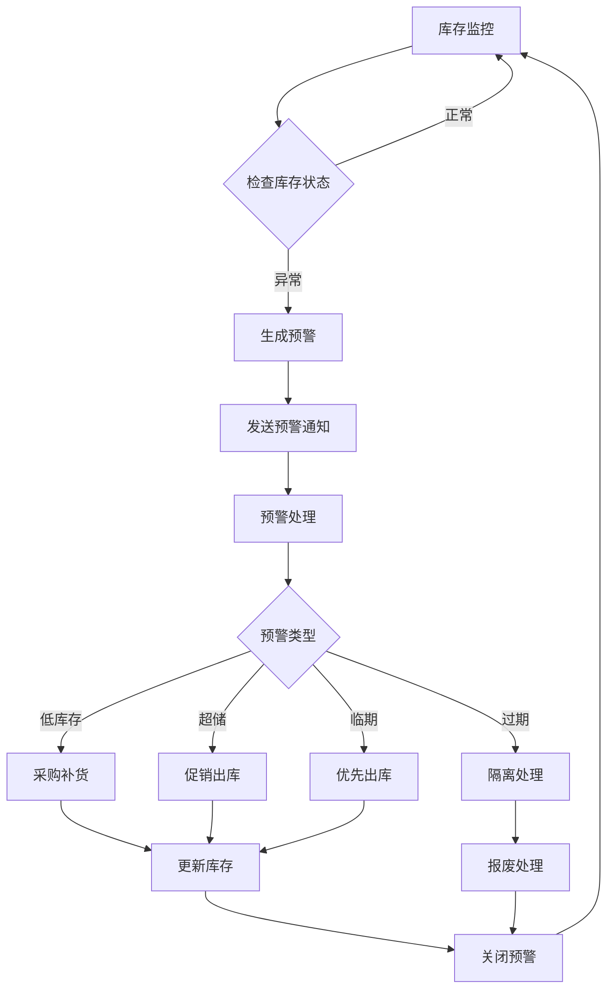

# 库存管理模块 - 子模块设计文档

## 1. 模块概述

### 1.1 功能定位
库存管理模块是化盐项目工艺流程的重要支撑模块，负责原料库存、成品库存、在制品库存的全面管理。该模块通过精确的库存控制、智能的补货策略和完善的出入库管理，确保化盐生产过程的原料供应和成品存储的有序进行。

### 1.2 业务价值
- **供应链保障**：确保原料供应充足，避免因缺料导致的生产中断
- **成本控制**：通过精确的库存管理降低库存成本和资金占用
- **质量追溯**：建立完整的库存批次追溯体系，支持质量问题追溯
- **效率提升**：自动化的库存监控和补货提醒，提高库存管理效率
- **数据决策**：提供库存分析报表，支持生产计划和采购决策

### 1.3 模块边界
- **上游依赖**：项目管理模块（生产计划）、提温工艺管理模块（成品入库）
- **下游服务**：质量管理模块（质量检验）、数据分析模块（库存分析）
- **外部集成**：采购系统、仓储管理系统、物流系统、财务系统

## 2. 功能需求清单

### 2.1 原料库存管理
- **原料入库管理**：管理NaNO3、KNO3、Ca(NO3)2等原料的入库流程
  - 入库单据管理（采购入库、调拨入库、退货入库）
  - 批次信息记录（生产厂家、生产日期、有效期、质量证书）
  - 质量检验集成（入库前质量检验，不合格品隔离）
  - 库位分配管理（自动分配库位，支持先进先出）
- **原料出库管理**：管理生产领料和其他出库业务
  - 生产领料单管理（按项目、按配方自动计算用料）
  - 出库审批流程（超额领料审批、特殊出库审批）
  - 批次追溯管理（记录原料使用批次，支持质量追溯）
- **原料库存监控**：实时监控原料库存状态
  - 库存数量监控（实时库存、可用库存、预留库存）
  - 安全库存预警（低于安全库存自动预警）
  - 有效期管理（临期预警、过期处理）
  - 库存盘点管理（定期盘点、差异处理）

### 2.2 成品库存管理
- **成品入库管理**：管理化盐成品的入库流程
  - 成品入库单管理（生产入库、返工入库）
  - 产品信息记录（产品类型、规格、质量等级、生产批次）
  - 质量检验集成（入库前质量检验，质量分级存储）
  - 包装管理（包装规格、包装数量、包装标识）
- **成品出库管理**：管理成品销售出库和其他出库
  - 销售出库单管理（按订单出库、批量出库）
  - 出库质量控制（出库前质量复检）
  - 发货管理（发货通知、物流跟踪）
- **成品库存监控**：实时监控成品库存状态
  - 库存分类统计（按产品类型、质量等级统计）
  - 销售库存分析（畅销品、滞销品分析）
  - 库龄管理（库存周转率、库龄分析）

### 2.3 在制品库存管理
- **在制品跟踪**：跟踪生产过程中的在制品状态
  - 工序在制品统计（各工序在制品数量）
  - 生产进度跟踪（在制品完成进度）
  - 质量状态跟踪（合格品、待检品、不合格品）
- **在制品转移**：管理在制品在工序间的转移
  - 工序间转移单（转移数量、质量状态）
  - 转移审批流程（异常转移审批）
  - 损耗管理（正常损耗、异常损耗记录）

### 2.4 库存分析与报表
- **库存统计分析**：提供多维度的库存统计分析
  - 库存结构分析（原料、成品、在制品占比）
  - 库存周转分析（周转率、周转天数）
  - 库存成本分析（库存价值、持有成本）
- **库存预警管理**：智能的库存预警机制
  - 安全库存预警（低库存、零库存预警）
  - 超储预警（库存超上限预警）
  - 异常变动预警（异常出入库预警）
- **库存报表管理**：生成各类库存管理报表
  - 库存明细报表（按物料、按库位、按批次）
  - 出入库汇总报表（日报、月报、年报）
  - 库存分析报表（ABC分析、库龄分析）

## 3. 页面设计规范

### 3.1 页面布局设计

#### 3.1.1 库存总览页面
```
┌─────────────────────────────────────────────────────────────┐
│ 面包屑导航: 首页 > ERP管理 > 化盐工艺流程 > 库存管理          │
├─────────────────────────────────────────────────────────────┤
│ 库存概览卡片                                                │
│ ┌─────────────┐ ┌─────────────┐ ┌─────────────┐             │
│ │   原料库存   │ │   成品库存   │ │   在制品     │             │
│ │   1,250t    │ │   850t      │ │   125t      │             │
│ │   ↗ +50t    │ │   ↘ -30t    │ │   → 持平     │             │
│ └─────────────┘ └─────────────┘ └─────────────┘             │
├─────────────────────────────────────────────────────────────┤
│ 预警信息面板                                                │
│ ⚠️ NaNO3库存不足，当前库存50t，安全库存100t                  │
│ ⚠️ 二元化盐成品库存超储，当前库存500t，上限400t              │
│ ℹ️ 批次BT20240101即将过期，剩余有效期15天                   │
├─────────────────────────────────────────────────────────────┤
│ 快捷操作区域                                                │
│ [原料入库] [成品入库] [生产领料] [库存盘点] [库存分析]       │
├─────────────────────────────────────────────────────────────┤
│ 库存动态图表                                                │
│ [库存趋势] [出入库统计] [周转率分析] [预警统计]              │
│ (实时更新的库存动态图表)                                    │
└─────────────────────────────────────────────────────────────┘
```

#### 3.1.2 原料库存管理页面
```
┌─────────────────────────────────────────────────────────────┐
│ 搜索筛选区域                                                │
│ [物料名称] [物料编码] [库位] [批次号] [库存状态] [搜索] [重置]│
├─────────────────────────────────────────────────────────────┤
│ 操作按钮区域                                                │
│ [原料入库] [生产领料] [库存调整] [库存盘点] [导出] [刷新]     │
├─────────────────────────────────────────────────────────────┤
│ 原料库存列表                                                │
│ ☑ │物料编码│物料名称│规格│库存数量│可用数量│安全库存│库位│状态│
│ ☐ │M001   │NaNO3  │工业级│150t   │120t   │100t   │A01│正常│
│ ☐ │M002   │KNO3   │工业级│80t    │60t    │100t   │A02│不足│
├─────────────────────────────────────────────────────────────┤
│ 批次详情区域                                                │
│ 选中物料的批次信息：                                        │
│ 批次号: BT20240101  数量: 50t  生产日期: 2024-01-01         │
│ 有效期: 2025-01-01  供应商: XX化工  质量等级: 优等品        │
├─────────────────────────────────────────────────────────────┤
│ 分页组件                                                    │
│ 共120条 [20条/页] [上一页] 1 2 3 [下一页]                   │
└─────────────────────────────────────────────────────────────┘
```

#### 3.1.3 成品库存管理页面
```
┌─────────────────────────────────────────────────────────────┐
│ 搜索筛选区域                                                │
│ [产品名称] [产品编码] [质量等级] [生产批次] [库位] [搜索]     │
├─────────────────────────────────────────────────────────────┤
│ 操作按钮区域                                                │
│ [成品入库] [销售出库] [库存调整] [质量复检] [导出] [刷新]     │
├─────────────────────────────────────────────────────────────┤
│ 成品库存列表                                                │
│ ☑ │产品编码│产品名称│规格│质量等级│库存数量│可用数量│库位│状态│
│ ☐ │P001   │二元化盐│50kg │优等品  │200t   │180t   │B01│正常│
│ ☐ │P002   │三元化盐│50kg │一等品  │150t   │130t   │B02│正常│
├─────────────────────────────────────────────────────────────┤
│ 生产批次详情区域                                            │
│ 选中产品的生产批次信息：                                    │
│ 生产批次: PB20240101  数量: 100t  生产日期: 2024-01-01      │
│ 项目编码: SP001  质量检验: 合格  包装规格: 50kg/袋          │
├─────────────────────────────────────────────────────────────┤
│ 分页组件                                                    │
│ 共80条 [20条/页] [上一页] 1 2 3 [下一页]                    │
└─────────────────────────────────────────────────────────────┘
```

### 3.2 组件设计规范

#### 3.2.1 库存概览卡片组件
```vue
<template>
  <div class="inventory-overview">
    <div class="overview-cards">
      <div 
        v-for="item in inventoryItems" 
        :key="item.type"
        class="overview-card"
        :class="getCardClass(item)"
      >
        <div class="card-header">
          <div class="card-title">
            <el-icon :class="item.icon">
              <component :is="item.icon" />
            </el-icon>
            <span>{{ item.title }}</span>
          </div>
          <div class="card-status" :class="getStatusClass(item.status)">
            {{ getStatusText(item.status) }}
          </div>
        </div>
        
        <div class="card-content">
          <div class="main-value">
            <span class="value">{{ formatQuantity(item.quantity) }}</span>
            <span class="unit">{{ item.unit }}</span>
          </div>
          
          <div class="trend-info">
            <span class="trend" :class="getTrendClass(item.trend)">
              {{ getTrendIcon(item.trend) }}
              {{ formatTrend(item.trend) }}
            </span>
            <span class="period">{{ item.period }}</span>
          </div>
          
          <div class="detail-info">
            <div class="detail-item">
              <span class="label">可用:</span>
              <span class="value">{{ formatQuantity(item.available) }}{{ item.unit }}</span>
            </div>
            <div class="detail-item">
              <span class="label">预留:</span>
              <span class="value">{{ formatQuantity(item.reserved) }}{{ item.unit }}</span>
            </div>
          </div>
        </div>
        
        <div class="card-actions">
          <el-button 
            size="small" 
            @click="handleViewDetail(item.type)"
          >
            查看详情
          </el-button>
          <el-button 
            size="small" 
            type="primary"
            @click="handleQuickAction(item.type)"
          >
            {{ getQuickActionText(item.type) }}
          </el-button>
        </div>
      </div>
    </div>
    
    <div class="alert-panel" v-if="hasAlerts">
      <h4>库存预警</h4>
      <div class="alert-list">
        <div 
          v-for="alert in inventoryAlerts" 
          :key="alert.id"
          class="alert-item"
          :class="getAlertClass(alert.level)"
        >
          <el-icon class="alert-icon">
            <component :is="getAlertIcon(alert.level)" />
          </el-icon>
          <div class="alert-content">
            <div class="alert-title">{{ alert.title }}</div>
            <div class="alert-message">{{ alert.message }}</div>
            <div class="alert-time">{{ formatTime(alert.createTime) }}</div>
          </div>
          <div class="alert-actions">
            <el-button 
              size="small" 
              @click="handleAlert(alert)"
            >
              处理
            </el-button>
          </div>
        </div>
      </div>
    </div>
  </div>
</template>

<script setup lang="ts">
interface Props {
  inventoryItems: InventoryOverviewItem[];
  inventoryAlerts: InventoryAlert[];
}

interface InventoryOverviewItem {
  type: 'material' | 'product' | 'wip';
  title: string;
  icon: string;
  quantity: number;
  available: number;
  reserved: number;
  unit: string;
  status: 'normal' | 'warning' | 'danger';
  trend: number;
  period: string;
}

interface InventoryAlert {
  id: string;
  title: string;
  message: string;
  level: 'info' | 'warning' | 'error';
  createTime: string;
}

interface Emits {
  viewDetail: [type: string];
  quickAction: [type: string];
  handleAlert: [alert: InventoryAlert];
}

const props = defineProps<Props>();
const emit = defineEmits<Emits>();

const hasAlerts = computed(() => {
  return props.inventoryAlerts.length > 0;
});

const getCardClass = (item: InventoryOverviewItem) => {
  return {
    'card-normal': item.status === 'normal',
    'card-warning': item.status === 'warning',
    'card-danger': item.status === 'danger'
  };
};

const getStatusClass = (status: string) => {
  return {
    'status-normal': status === 'normal',
    'status-warning': status === 'warning',
    'status-danger': status === 'danger'
  };
};

const getStatusText = (status: string) => {
  const statusMap = {
    normal: '正常',
    warning: '预警',
    danger: '异常'
  };
  return statusMap[status] || '未知';
};

const getTrendClass = (trend: number) => {
  if (trend > 0) return 'trend-up';
  if (trend < 0) return 'trend-down';
  return 'trend-stable';
};

const getTrendIcon = (trend: number) => {
  if (trend > 0) return '↗';
  if (trend < 0) return '↘';
  return '→';
};

const formatTrend = (trend: number) => {
  const abs = Math.abs(trend);
  if (trend > 0) return `+${abs}t`;
  if (trend < 0) return `-${abs}t`;
  return '持平';
};

const formatQuantity = (quantity: number) => {
  if (quantity >= 1000) {
    return (quantity / 1000).toFixed(1) + 'k';
  }
  return quantity.toString();
};

const getQuickActionText = (type: string) => {
  const actionMap = {
    material: '原料入库',
    product: '成品入库',
    wip: '查看进度'
  };
  return actionMap[type] || '操作';
};

const getAlertClass = (level: string) => {
  return {
    'alert-info': level === 'info',
    'alert-warning': level === 'warning',
    'alert-error': level === 'error'
  };
};

const getAlertIcon = (level: string) => {
  const iconMap = {
    info: 'InfoFilled',
    warning: 'WarningFilled',
    error: 'CircleCloseFilled'
  };
  return iconMap[level] || 'InfoFilled';
};

const handleViewDetail = (type: string) => {
  emit('viewDetail', type);
};

const handleQuickAction = (type: string) => {
  emit('quickAction', type);
};

const handleAlert = (alert: InventoryAlert) => {
  emit('handleAlert', alert);
};

const formatTime = (time: string) => {
  return new Date(time).toLocaleString();
};
</script>
```

#### 3.2.2 库存操作组件
```vue
<template>
  <div class="inventory-operation">
    <div class="operation-header">
      <h4>{{ operationTitle }}</h4>
      <div class="operation-info">
        <el-tag :type="getOperationTypeTag()">
          {{ operationType }}
        </el-tag>
        <span class="operation-time">{{ formatTime(new Date()) }}</span>
      </div>
    </div>

    <el-form
      ref="formRef"
      :model="formData"
      :rules="formRules"
      label-width="120px"
      class="operation-form"
    >
      <el-row :gutter="20">
        <el-col :span="12">
          <el-form-item label="物料/产品" prop="itemId">
            <el-select
              v-model="formData.itemId"
              placeholder="请选择物料或产品"
              filterable
              @change="handleItemChange"
            >
              <el-option
                v-for="item in availableItems"
                :key="item.id"
                :label="`${item.code} - ${item.name}`"
                :value="item.id"
              />
            </el-select>
          </el-form-item>
        </el-col>

        <el-col :span="12">
          <el-form-item label="操作数量" prop="quantity">
            <el-input-number
              v-model="formData.quantity"
              :min="0.01"
              :max="getMaxQuantity()"
              :step="0.01"
              :precision="2"
              placeholder="请输入数量"
            />
            <span class="unit">{{ selectedItem?.unit || 't' }}</span>
          </el-form-item>
        </el-col>
      </el-row>

      <el-row :gutter="20" v-if="showBatchInfo">
        <el-col :span="12">
          <el-form-item label="批次号" prop="batchNo">
            <el-input
              v-model="formData.batchNo"
              placeholder="请输入批次号"
              :disabled="operationType === '出库'"
            />
          </el-form-item>
        </el-col>

        <el-col :span="12">
          <el-form-item label="生产日期" prop="productionDate">
            <el-date-picker
              v-model="formData.productionDate"
              type="date"
              placeholder="请选择生产日期"
              :disabled="operationType === '出库'"
            />
          </el-form-item>
        </el-col>
      </el-row>

      <el-row :gutter="20" v-if="showQualityInfo">
        <el-col :span="12">
          <el-form-item label="质量等级" prop="qualityGrade">
            <el-select
              v-model="formData.qualityGrade"
              placeholder="请选择质量等级"
            >
              <el-option label="优等品" value="EXCELLENT" />
              <el-option label="一等品" value="FIRST_CLASS" />
              <el-option label="合格品" value="QUALIFIED" />
            </el-select>
          </el-form-item>
        </el-col>

        <el-col :span="12">
          <el-form-item label="供应商" prop="supplierId" v-if="operationType === '入库'">
            <el-select
              v-model="formData.supplierId"
              placeholder="请选择供应商"
              filterable
            >
              <el-option
                v-for="supplier in suppliers"
                :key="supplier.id"
                :label="supplier.name"
                :value="supplier.id"
              />
            </el-select>
          </el-form-item>
        </el-col>
      </el-row>

      <el-row :gutter="20">
        <el-col :span="12">
          <el-form-item label="库位" prop="locationId">
            <el-select
              v-model="formData.locationId"
              placeholder="请选择库位"
              filterable
            >
              <el-option
                v-for="location in availableLocations"
                :key="location.id"
                :label="`${location.code} - ${location.name}`"
                :value="location.id"
              />
            </el-select>
          </el-form-item>
        </el-col>

        <el-col :span="12">
          <el-form-item label="操作员" prop="operatorId">
            <el-select
              v-model="formData.operatorId"
              placeholder="请选择操作员"
            >
              <el-option
                v-for="operator in operators"
                :key="operator.id"
                :label="operator.name"
                :value="operator.id"
              />
            </el-select>
          </el-form-item>
        </el-col>
      </el-row>

      <el-form-item label="备注" prop="remarks">
        <el-input
          v-model="formData.remarks"
          type="textarea"
          :rows="3"
          placeholder="请输入备注信息"
        />
      </el-form-item>
    </el-form>

    <div class="current-inventory" v-if="selectedItem">
      <h5>当前库存信息</h5>
      <el-descriptions :column="3" size="small">
        <el-descriptions-item label="当前库存">
          {{ selectedItem.currentStock }}{{ selectedItem.unit }}
        </el-descriptions-item>
        <el-descriptions-item label="可用库存">
          {{ selectedItem.availableStock }}{{ selectedItem.unit }}
        </el-descriptions-item>
        <el-descriptions-item label="安全库存">
          {{ selectedItem.safetyStock }}{{ selectedItem.unit }}
        </el-descriptions-item>
      </el-descriptions>
    </div>

    <div class="operation-actions">
      <el-button @click="handleCancel">取消</el-button>
      <el-button @click="handleReset">重置</el-button>
      <el-button
        type="primary"
        @click="handleSubmit"
        :loading="submitting"
      >
        确认{{ operationType }}
      </el-button>
    </div>
  </div>
</template>

<script setup lang="ts">
interface Props {
  operationType: '入库' | '出库' | '调整';
  availableItems: InventoryItem[];
  availableLocations: Location[];
  suppliers: Supplier[];
  operators: Operator[];
}

interface InventoryItem {
  id: string;
  code: string;
  name: string;
  unit: string;
  currentStock: number;
  availableStock: number;
  safetyStock: number;
  type: 'material' | 'product';
}

interface Emits {
  submit: [data: InventoryOperationForm];
  cancel: [];
}

const props = defineProps<Props>();
const emit = defineEmits<Emits>();

const formRef = ref();
const submitting = ref(false);

const formData = reactive({
  itemId: '',
  quantity: 0,
  batchNo: '',
  productionDate: '',
  qualityGrade: '',
  supplierId: '',
  locationId: '',
  operatorId: '',
  remarks: ''
});

const formRules = {
  itemId: [{ required: true, message: '请选择物料或产品', trigger: 'change' }],
  quantity: [{ required: true, message: '请输入操作数量', trigger: 'blur' }],
  batchNo: [{ required: true, message: '请输入批次号', trigger: 'blur' }],
  qualityGrade: [{ required: true, message: '请选择质量等级', trigger: 'change' }],
  locationId: [{ required: true, message: '请选择库位', trigger: 'change' }],
  operatorId: [{ required: true, message: '请选择操作员', trigger: 'change' }]
};

const selectedItem = computed(() => {
  return props.availableItems.find(item => item.id === formData.itemId);
});

const operationTitle = computed(() => {
  return `库存${props.operationType}`;
});

const showBatchInfo = computed(() => {
  return props.operationType === '入库' || selectedItem.value?.type === 'material';
});

const showQualityInfo = computed(() => {
  return selectedItem.value?.type === 'product' || selectedItem.value?.type === 'material';
});

const getOperationTypeTag = () => {
  const typeMap = {
    '入库': 'success',
    '出库': 'warning',
    '调整': 'info'
  };
  return typeMap[props.operationType] || 'info';
};

const getMaxQuantity = () => {
  if (props.operationType === '出库' && selectedItem.value) {
    return selectedItem.value.availableStock;
  }
  return 9999;
};

const handleItemChange = (itemId: string) => {
  const item = props.availableItems.find(i => i.id === itemId);
  if (item && props.operationType === '入库') {
    // 自动生成批次号
    formData.batchNo = generateBatchNo(item.code);
  }
};

const generateBatchNo = (itemCode: string) => {
  const date = new Date().toISOString().slice(0, 10).replace(/-/g, '');
  const random = Math.floor(Math.random() * 1000).toString().padStart(3, '0');
  return `${itemCode}${date}${random}`;
};

const handleSubmit = async () => {
  try {
    await formRef.value.validate();
    submitting.value = true;

    emit('submit', {
      ...formData,
      operationType: props.operationType
    });
  } catch (error) {
    console.error('表单验证失败:', error);
  } finally {
    submitting.value = false;
  }
};

const handleCancel = () => {
  emit('cancel');
};

const handleReset = () => {
  formRef.value.resetFields();
};

const formatTime = (date: Date) => {
  return date.toLocaleString();
};
</script>
```

### 3.3 交互流程设计

#### 3.3.1 原料入库流程


#### 3.3.2 生产领料流程


## 4. API接口设计

### 4.1 接口列表

#### 4.1.1 库存查询接口
```typescript
// 查询库存概览
GET /erp/saltprocess/inventory/overview
// 权限: erp:saltprocess:inventory:overview

// 查询原料库存列表
GET /erp/saltprocess/inventory/material/list
// 权限: erp:saltprocess:inventory:material:list

// 查询成品库存列表
GET /erp/saltprocess/inventory/product/list
// 权限: erp:saltprocess:inventory:product:list

// 查询在制品库存
GET /erp/saltprocess/inventory/wip/list
// 权限: erp:saltprocess:inventory:wip:list

// 查询库存明细
GET /erp/saltprocess/inventory/detail/{itemId}
// 权限: erp:saltprocess:inventory:detail

// 查询批次信息
GET /erp/saltprocess/inventory/batch/{batchNo}
// 权限: erp:saltprocess:inventory:batch
```

#### 4.1.2 库存操作接口
```typescript
// 原料入库
POST /erp/saltprocess/inventory/material/inbound
// 权限: erp:saltprocess:inventory:material:inbound

// 原料出库
POST /erp/saltprocess/inventory/material/outbound
// 权限: erp:saltprocess:inventory:material:outbound

// 成品入库
POST /erp/saltprocess/inventory/product/inbound
// 权限: erp:saltprocess:inventory:product:inbound

// 成品出库
POST /erp/saltprocess/inventory/product/outbound
// 权限: erp:saltprocess:inventory:product:outbound

// 库存调整
POST /erp/saltprocess/inventory/adjust
// 权限: erp:saltprocess:inventory:adjust

// 库存盘点
POST /erp/saltprocess/inventory/stocktaking
// 权限: erp:saltprocess:inventory:stocktaking
```

#### 4.1.3 库存分析接口
```typescript
// 库存统计分析
GET /erp/saltprocess/inventory/analysis/statistics
// 权限: erp:saltprocess:inventory:analysis

// 库存周转分析
GET /erp/saltprocess/inventory/analysis/turnover
// 权限: erp:saltprocess:inventory:analysis

// 库存预警查询
GET /erp/saltprocess/inventory/alerts
// 权限: erp:saltprocess:inventory:alerts

// 库存报表生成
POST /erp/saltprocess/inventory/reports/generate
// 权限: erp:saltprocess:inventory:reports
```

### 4.2 请求响应格式

#### 4.2.1 库存概览响应
```typescript
interface InventoryOverviewVO {
  materialInventory: {
    totalQuantity: number;
    availableQuantity: number;
    reservedQuantity: number;
    totalValue: number;
    trend: number;
    status: 'NORMAL' | 'WARNING' | 'DANGER';
  };
  productInventory: {
    totalQuantity: number;
    availableQuantity: number;
    reservedQuantity: number;
    totalValue: number;
    trend: number;
    status: 'NORMAL' | 'WARNING' | 'DANGER';
  };
  wipInventory: {
    totalQuantity: number;
    inProcessQuantity: number;
    completedQuantity: number;
    trend: number;
    status: 'NORMAL' | 'WARNING' | 'DANGER';
  };
  alerts: InventoryAlertVO[];
}
```

#### 4.2.2 库存明细响应
```typescript
interface InventoryDetailVO {
  id: string;
  itemCode: string;
  itemName: string;
  itemType: 'MATERIAL' | 'PRODUCT';
  specification: string;
  unit: string;
  currentStock: number;
  availableStock: number;
  reservedStock: number;
  safetyStock: number;
  maxStock: number;
  locationId: string;
  locationName: string;
  batches: InventoryBatchVO[];
  lastInboundTime: string;
  lastOutboundTime: string;
  turnoverRate: number;
  stockAge: number;
  status: 'NORMAL' | 'LOW_STOCK' | 'OUT_OF_STOCK' | 'OVERSTOCK';
}
```

#### 4.2.3 批次信息响应
```typescript
interface InventoryBatchVO {
  batchNo: string;
  quantity: number;
  availableQuantity: number;
  productionDate: string;
  expiryDate?: string;
  qualityGrade: 'EXCELLENT' | 'FIRST_CLASS' | 'QUALIFIED';
  supplierId?: string;
  supplierName?: string;
  qualityCertificate?: string;
  status: 'NORMAL' | 'NEAR_EXPIRY' | 'EXPIRED' | 'QUARANTINE';
  locationId: string;
  locationName: string;
  inboundTime: string;
}
```

#### 4.2.4 库存操作请求
```typescript
interface InventoryOperationForm {
  operationType: 'INBOUND' | 'OUTBOUND' | 'ADJUST';
  itemId: string;
  quantity: number;
  batchNo?: string;
  productionDate?: string;
  expiryDate?: string;
  qualityGrade?: string;
  supplierId?: string;
  locationId: string;
  operatorId: string;
  projectId?: string;
  remarks?: string;
}
```

### 4.3 权限控制设计
```typescript
// 库存管理权限配置
const inventoryPermissions = {
  'erp:saltprocess:inventory:overview': '查看库存概览',
  'erp:saltprocess:inventory:material:list': '查询原料库存',
  'erp:saltprocess:inventory:product:list': '查询成品库存',
  'erp:saltprocess:inventory:wip:list': '查询在制品库存',
  'erp:saltprocess:inventory:detail': '查看库存明细',
  'erp:saltprocess:inventory:batch': '查看批次信息',
  'erp:saltprocess:inventory:material:inbound': '原料入库',
  'erp:saltprocess:inventory:material:outbound': '原料出库',
  'erp:saltprocess:inventory:product:inbound': '成品入库',
  'erp:saltprocess:inventory:product:outbound': '成品出库',
  'erp:saltprocess:inventory:adjust': '库存调整',
  'erp:saltprocess:inventory:stocktaking': '库存盘点',
  'erp:saltprocess:inventory:analysis': '库存分析',
  'erp:saltprocess:inventory:alerts': '库存预警',
  'erp:saltprocess:inventory:reports': '库存报表'
};
```

## 5. 数据模型设计

### 5.1 核心实体设计

#### 5.1.1 库存主表实体 (Inventory)
```typescript
interface Inventory {
  id: string;                          // 库存ID
  itemId: string;                      // 物料/产品ID
  itemCode: string;                    // 物料/产品编码
  itemName: string;                    // 物料/产品名称
  itemType: ItemType;                  // 物料类型
  specification: string;               // 规格型号
  unit: string;                        // 计量单位
  currentStock: number;                // 当前库存数量
  availableStock: number;              // 可用库存数量
  reservedStock: number;               // 预留库存数量
  safetyStock: number;                 // 安全库存数量
  maxStock: number;                    // 最大库存数量
  locationId: string;                  // 库位ID
  lastInboundTime?: Date;              // 最后入库时间
  lastOutboundTime?: Date;             // 最后出库时间
  turnoverRate: number;                // 周转率
  stockAge: number;                    // 库龄(天)
  status: InventoryStatus;             // 库存状态
  createTime: Date;                    // 创建时间
  updateTime: Date;                    // 更新时间
}
```

#### 5.1.2 库存批次实体 (InventoryBatch)
```typescript
interface InventoryBatch {
  id: string;                          // 批次ID
  batchNo: string;                     // 批次号
  inventoryId: string;                 // 库存ID
  quantity: number;                    // 批次数量
  availableQuantity: number;           // 可用数量
  productionDate: Date;                // 生产日期
  expiryDate?: Date;                   // 有效期
  qualityGrade: QualityGrade;          // 质量等级
  supplierId?: string;                 // 供应商ID
  qualityCertificate?: string;         // 质量证书
  status: BatchStatus;                 // 批次状态
  locationId: string;                  // 库位ID
  inboundTime: Date;                   // 入库时间
  createTime: Date;                    // 创建时间
}
```

#### 5.1.3 库存操作记录实体 (InventoryTransaction)
```typescript
interface InventoryTransaction {
  id: string;                          // 交易ID
  transactionNo: string;               // 交易单号
  transactionType: TransactionType;    // 交易类型
  inventoryId: string;                 // 库存ID
  batchNo?: string;                    // 批次号
  quantity: number;                    // 操作数量
  unitPrice?: number;                  // 单价
  totalAmount?: number;                // 总金额
  beforeStock: number;                 // 操作前库存
  afterStock: number;                  // 操作后库存
  locationId: string;                  // 库位ID
  operatorId: string;                  // 操作员ID
  projectId?: string;                  // 项目ID
  relatedTaskId?: string;              // 关联任务ID
  remarks?: string;                    // 备注
  transactionTime: Date;               // 交易时间
  createTime: Date;                    // 创建时间
}
```

#### 5.1.4 库存预警实体 (InventoryAlert)
```typescript
interface InventoryAlert {
  id: string;                          // 预警ID
  alertType: AlertType;                // 预警类型
  inventoryId: string;                 // 库存ID
  itemCode: string;                    // 物料编码
  itemName: string;                    // 物料名称
  alertLevel: AlertLevel;              // 预警级别
  alertMessage: string;                // 预警消息
  currentValue: number;                // 当前值
  thresholdValue: number;              // 阈值
  status: AlertStatus;                 // 预警状态
  handlerId?: string;                  // 处理人ID
  handleTime?: Date;                   // 处理时间
  handleResult?: string;               // 处理结果
  createTime: Date;                    // 创建时间
}
```

#### 5.1.5 枚举定义
```typescript
enum ItemType {
  MATERIAL = 'MATERIAL',               // 原料
  PRODUCT = 'PRODUCT',                 // 成品
  WIP = 'WIP'                          // 在制品
}

enum InventoryStatus {
  NORMAL = 'NORMAL',                   // 正常
  LOW_STOCK = 'LOW_STOCK',             // 低库存
  OUT_OF_STOCK = 'OUT_OF_STOCK',       // 零库存
  OVERSTOCK = 'OVERSTOCK'              // 超储
}

enum QualityGrade {
  EXCELLENT = 'EXCELLENT',             // 优等品
  FIRST_CLASS = 'FIRST_CLASS',         // 一等品
  QUALIFIED = 'QUALIFIED'              // 合格品
}

enum BatchStatus {
  NORMAL = 'NORMAL',                   // 正常
  NEAR_EXPIRY = 'NEAR_EXPIRY',         // 临期
  EXPIRED = 'EXPIRED',                 // 过期
  QUARANTINE = 'QUARANTINE'            // 隔离
}

enum TransactionType {
  PURCHASE_INBOUND = 'PURCHASE_INBOUND',     // 采购入库
  PRODUCTION_INBOUND = 'PRODUCTION_INBOUND', // 生产入库
  TRANSFER_INBOUND = 'TRANSFER_INBOUND',     // 调拨入库
  PRODUCTION_OUTBOUND = 'PRODUCTION_OUTBOUND', // 生产出库
  SALES_OUTBOUND = 'SALES_OUTBOUND',         // 销售出库
  TRANSFER_OUTBOUND = 'TRANSFER_OUTBOUND',   // 调拨出库
  ADJUST = 'ADJUST'                          // 库存调整
}

enum AlertType {
  LOW_STOCK = 'LOW_STOCK',             // 低库存
  OUT_OF_STOCK = 'OUT_OF_STOCK',       // 零库存
  OVERSTOCK = 'OVERSTOCK',             // 超储
  NEAR_EXPIRY = 'NEAR_EXPIRY',         // 临期
  EXPIRED = 'EXPIRED'                  // 过期
}

enum AlertLevel {
  INFO = 'INFO',                       // 信息
  WARNING = 'WARNING',                 // 警告
  ERROR = 'ERROR'                      // 错误
}

enum AlertStatus {
  ACTIVE = 'ACTIVE',                   // 活动
  HANDLED = 'HANDLED',                 // 已处理
  IGNORED = 'IGNORED'                  // 已忽略
}
```

### 5.2 业务规则设计

#### 5.2.1 库存编码规则
```typescript
// 库存交易单号编码格式:
// 入库: IN + YYYYMMDD + 4位序号 (IN20240101001)
// 出库: OUT + YYYYMMDD + 4位序号 (OUT20240101001)
// 调整: ADJ + YYYYMMDD + 4位序号 (ADJ20240101001)
const generateTransactionNo = (type: TransactionType, date: Date): string => {
  const dateStr = date.toISOString().slice(0, 10).replace(/-/g, '');
  let prefix = '';

  switch (type) {
    case TransactionType.PURCHASE_INBOUND:
    case TransactionType.PRODUCTION_INBOUND:
    case TransactionType.TRANSFER_INBOUND:
      prefix = 'IN';
      break;
    case TransactionType.PRODUCTION_OUTBOUND:
    case TransactionType.SALES_OUTBOUND:
    case TransactionType.TRANSFER_OUTBOUND:
      prefix = 'OUT';
      break;
    case TransactionType.ADJUST:
      prefix = 'ADJ';
      break;
  }

  const sequence = getNextSequence(prefix, dateStr);
  return `${prefix}${dateStr}${sequence.toString().padStart(4, '0')}`;
};
```

#### 5.2.2 库存控制规则
```typescript
const inventoryControlRules = {
  // 安全库存规则
  safetyStock: {
    // 原料安全库存 = 日均消耗量 × 安全天数
    materialSafetyDays: 15,            // 原料安全库存天数
    productSafetyDays: 7,              // 成品安全库存天数

    // 自动补货点 = 安全库存 + 采购周期消耗量
    autoReplenishmentPoint: true,

    // 最大库存 = 安全库存 × 最大库存系数
    maxStockMultiplier: 3
  },

  // 出库控制规则
  outboundControl: {
    // 先进先出原则
    fifoRequired: true,

    // 质量等级出库顺序：优等品 > 一等品 > 合格品
    qualityPriority: ['EXCELLENT', 'FIRST_CLASS', 'QUALIFIED'],

    // 临期产品优先出库
    nearExpiryPriority: true,

    // 最小出库单位
    minOutboundUnit: 0.01
  },

  // 库存预警规则
  alertRules: {
    // 低库存预警阈值
    lowStockThreshold: 1.2,            // 安全库存的1.2倍

    // 零库存预警
    zeroStockAlert: true,

    // 超储预警阈值
    overstockThreshold: 0.9,           // 最大库存的90%

    // 临期预警天数
    nearExpiryDays: 30,

    // 预警检查频率
    alertCheckInterval: 3600           // 每小时检查一次
  }
};
```

#### 5.2.3 批次管理规则
```typescript
const batchManagementRules = {
  // 批次号生成规则
  batchNoGeneration: {
    // 原料批次号: 物料编码 + 生产日期 + 3位序号
    materialBatchFormat: '{itemCode}{YYYYMMDD}{XXX}',

    // 成品批次号: 项目编码 + 生产日期 + 3位序号
    productBatchFormat: '{projectCode}{YYYYMMDD}{XXX}'
  },

  // 有效期管理
  expiryManagement: {
    // 原料有效期(月)
    materialExpiryMonths: {
      'NaNO3': 24,                     // 硝酸钠 24个月
      'KNO3': 24,                      // 硝酸钾 24个月
      'Ca(NO3)2': 18                   // 硝酸钙 18个月
    },

    // 成品有效期(月)
    productExpiryMonths: {
      'BINARY_SALT': 36,               // 二元化盐 36个月
      'TERNARY_SALT': 36               // 三元化盐 36个月
    },

    // 临期预警天数
    nearExpiryWarningDays: 30
  },

  // 批次追溯
  batchTraceability: {
    // 原料到成品的批次关联
    materialToProductTrace: true,

    // 质量问题批次隔离
    qualityIssueQuarantine: true,

    // 批次召回支持
    batchRecallSupport: true
  }
};
```

## 6. 前端技术实现

### 6.1 Vue组件结构

#### 6.1.1 页面组件结构
```
src/views/erp/saltprocess/inventory/
├── index.vue                    # 库存总览页面
├── material.vue                 # 原料库存管理页面
├── product.vue                  # 成品库存管理页面
├── wip.vue                      # 在制品库存页面
├── operation.vue                # 库存操作页面
├── analysis.vue                 # 库存分析页面
└── components/
    ├── InventoryOverview.vue    # 库存概览组件
    ├── InventoryOperation.vue   # 库存操作组件
    ├── InventoryTable.vue       # 库存列表组件
    ├── BatchInfo.vue            # 批次信息组件
    ├── InventoryChart.vue       # 库存图表组件
    ├── AlertPanel.vue           # 预警面板组件
    ├── StocktakingForm.vue      # 盘点表单组件
    └── InventoryReport.vue      # 库存报表组件
```

### 6.2 状态管理设计

#### 6.2.1 库存模块Store
```typescript
// src/store/modules/inventory.ts
import { defineStore } from 'pinia';
import { InventoryDetailVO, InventoryOverviewVO, InventoryAlertVO } from '@/api/erp/saltprocess/inventory/types';

interface InventoryState {
  // 库存概览
  overview: InventoryOverviewVO | null;

  // 库存列表
  materialInventory: InventoryDetailVO[];
  productInventory: InventoryDetailVO[];
  wipInventory: InventoryDetailVO[];

  // 库存预警
  alerts: InventoryAlertVO[];

  // 批次信息
  batchInfo: Map<string, InventoryBatchVO[]>;

  // 库存统计
  statistics: InventoryStatistics | null;

  // UI状态
  loading: boolean;
  error: string | null;
}

export const useInventoryStore = defineStore('inventory', {
  state: (): InventoryState => ({
    overview: null,
    materialInventory: [],
    productInventory: [],
    wipInventory: [],
    alerts: [],
    batchInfo: new Map(),
    statistics: null,
    loading: false,
    error: null
  }),

  getters: {
    // 获取库存概览
    getOverview: (state) => state.overview,

    // 获取原料库存
    getMaterialInventory: (state) => state.materialInventory,

    // 获取成品库存
    getProductInventory: (state) => state.productInventory,

    // 获取在制品库存
    getWipInventory: (state) => state.wipInventory,

    // 根据状态筛选库存
    getInventoryByStatus: (state) => (status: InventoryStatus) => {
      return [...state.materialInventory, ...state.productInventory]
        .filter(item => item.status === status);
    },

    // 获取低库存物料
    getLowStockItems: (state) => {
      return [...state.materialInventory, ...state.productInventory]
        .filter(item => item.currentStock <= item.safetyStock);
    },

    // 获取活动预警
    getActiveAlerts: (state) => {
      return state.alerts.filter(alert => alert.status === 'ACTIVE');
    },

    // 获取批次信息
    getBatchInfo: (state) => (itemId: string) => {
      return state.batchInfo.get(itemId) || [];
    },

    // 获取库存统计
    getStatistics: (state) => state.statistics
  },

  actions: {
    // 设置库存概览
    setOverview(overview: InventoryOverviewVO) {
      this.overview = overview;
    },

    // 设置原料库存
    setMaterialInventory(inventory: InventoryDetailVO[]) {
      this.materialInventory = inventory;
    },

    // 设置成品库存
    setProductInventory(inventory: InventoryDetailVO[]) {
      this.productInventory = inventory;
    },

    // 设置在制品库存
    setWipInventory(inventory: InventoryDetailVO[]) {
      this.wipInventory = inventory;
    },

    // 更新库存项
    updateInventoryItem(item: InventoryDetailVO) {
      const updateList = (list: InventoryDetailVO[]) => {
        const index = list.findIndex(i => i.id === item.id);
        if (index !== -1) {
          list[index] = item;
        }
      };

      if (item.itemType === 'MATERIAL') {
        updateList(this.materialInventory);
      } else if (item.itemType === 'PRODUCT') {
        updateList(this.productInventory);
      }
    },

    // 设置预警信息
    setAlerts(alerts: InventoryAlertVO[]) {
      this.alerts = alerts;
    },

    // 添加预警
    addAlert(alert: InventoryAlertVO) {
      this.alerts.unshift(alert);
    },

    // 处理预警
    handleAlert(alertId: string, result: string) {
      const alert = this.alerts.find(a => a.id === alertId);
      if (alert) {
        alert.status = 'HANDLED';
        alert.handleTime = new Date().toISOString();
        alert.handleResult = result;
      }
    },

    // 设置批次信息
    setBatchInfo(itemId: string, batches: InventoryBatchVO[]) {
      this.batchInfo.set(itemId, batches);
    },

    // 设置库存统计
    setStatistics(statistics: InventoryStatistics) {
      this.statistics = statistics;
    },

    // 清空状态
    clearState() {
      this.overview = null;
      this.materialInventory = [];
      this.productInventory = [];
      this.wipInventory = [];
      this.alerts = [];
      this.batchInfo.clear();
      this.statistics = null;
      this.loading = false;
      this.error = null;
    }
  }
});
```

### 6.3 路由配置

#### 6.3.1 库存管理路由
```typescript
// src/router/modules/saltprocess.ts (库存部分)
const inventoryRoutes = [
  {
    path: 'inventory',
    component: () => import('@/views/erp/saltprocess/inventory/index.vue'),
    name: 'InventoryOverview',
    meta: {
      title: '库存管理',
      icon: 'warehouse',
      permissions: ['erp:saltprocess:inventory:overview']
    }
  },
  {
    path: 'inventory/material',
    component: () => import('@/views/erp/saltprocess/inventory/material.vue'),
    name: 'MaterialInventory',
    meta: {
      title: '原料库存',
      permissions: ['erp:saltprocess:inventory:material:list']
    }
  },
  {
    path: 'inventory/product',
    component: () => import('@/views/erp/saltprocess/inventory/product.vue'),
    name: 'ProductInventory',
    meta: {
      title: '成品库存',
      permissions: ['erp:saltprocess:inventory:product:list']
    }
  },
  {
    path: 'inventory/wip',
    component: () => import('@/views/erp/saltprocess/inventory/wip.vue'),
    name: 'WipInventory',
    meta: {
      title: '在制品库存',
      permissions: ['erp:saltprocess:inventory:wip:list']
    }
  },
  {
    path: 'inventory/operation',
    component: () => import('@/views/erp/saltprocess/inventory/operation.vue'),
    name: 'InventoryOperation',
    meta: {
      title: '库存操作',
      permissions: ['erp:saltprocess:inventory:material:inbound']
    }
  },
  {
    path: 'inventory/analysis',
    component: () => import('@/views/erp/saltprocess/inventory/analysis.vue'),
    name: 'InventoryAnalysis',
    meta: {
      title: '库存分析',
      permissions: ['erp:saltprocess:inventory:analysis']
    }
  }
];
```

## 7. 业务流程设计

### 7.1 库存预警处理流程


### 7.2 库存盘点流程
```typescript
const stocktakingFlow = async (locationIds: string[]) => {
  // 1. 创建盘点任务
  const stocktakingTask = await createStocktakingTask({
    locationIds,
    planDate: new Date(),
    operatorIds: ['operator1', 'operator2']
  });

  // 2. 冻结库存操作
  await freezeInventoryOperations(locationIds);

  // 3. 生成盘点清单
  const stocktakingList = await generateStocktakingList(locationIds);

  // 4. 执行盘点
  const stocktakingResults = await executeStocktaking(stocktakingList);

  // 5. 差异分析
  const differences = await analyzeStocktakingDifferences(stocktakingResults);

  // 6. 差异处理
  if (differences.length > 0) {
    await handleStocktakingDifferences(differences);
  }

  // 7. 更新库存
  await updateInventoryFromStocktaking(stocktakingResults);

  // 8. 解冻库存操作
  await unfreezeInventoryOperations(locationIds);

  // 9. 完成盘点
  await completeStocktakingTask(stocktakingTask.id);
};
```

## 8. 测试用例设计

### 8.1 功能测试用例

#### 8.1.1 库存入库测试
```typescript
describe('库存入库功能测试', () => {
  test('原料入库', async () => {
    const inboundData = {
      itemId: 'material-001',
      quantity: 100,
      batchNo: 'BT20240101001',
      productionDate: '2024-01-01',
      qualityGrade: 'EXCELLENT',
      supplierId: 'supplier-001',
      locationId: 'location-A01',
      operatorId: 'operator-001'
    };

    const result = await materialInbound(inboundData);

    expect(result.code).toBe(200);
    expect(result.data.transactionNo).toMatch(/^IN\d{8}\d{4}$/);

    // 验证库存更新
    const inventory = await getInventoryDetail(inboundData.itemId);
    expect(inventory.data.currentStock).toBeGreaterThan(0);
  });

  test('成品入库', async () => {
    const inboundData = {
      itemId: 'product-001',
      quantity: 50,
      batchNo: 'PB20240101001',
      productionDate: '2024-01-01',
      qualityGrade: 'FIRST_CLASS',
      projectId: 'project-001',
      locationId: 'location-B01',
      operatorId: 'operator-001'
    };

    const result = await productInbound(inboundData);

    expect(result.code).toBe(200);

    // 验证批次信息
    const batch = await getBatchInfo(inboundData.batchNo);
    expect(batch.data.quantity).toBe(50);
    expect(batch.data.qualityGrade).toBe('FIRST_CLASS');
  });
});
```

#### 8.1.2 库存出库测试
```typescript
describe('库存出库功能测试', () => {
  test('生产领料', async () => {
    const outboundData = {
      itemId: 'material-001',
      quantity: 20,
      projectId: 'project-001',
      locationId: 'location-A01',
      operatorId: 'operator-001',
      remarks: '生产领料'
    };

    const result = await materialOutbound(outboundData);

    expect(result.code).toBe(200);
    expect(result.data.transactionNo).toMatch(/^OUT\d{8}\d{4}$/);

    // 验证库存减少
    const inventory = await getInventoryDetail(outboundData.itemId);
    expect(inventory.data.availableStock).toBeLessThan(100);
  });

  test('先进先出验证', async () => {
    // 创建多个批次
    await createTestBatches('material-001', [
      { batchNo: 'BT001', quantity: 50, productionDate: '2024-01-01' },
      { batchNo: 'BT002', quantity: 50, productionDate: '2024-01-02' }
    ]);

    // 出库30个
    const outboundData = {
      itemId: 'material-001',
      quantity: 30,
      locationId: 'location-A01',
      operatorId: 'operator-001'
    };

    const result = await materialOutbound(outboundData);

    // 验证先进先出
    const transactions = await getTransactionHistory(outboundData.itemId);
    const latestTransaction = transactions.data[0];
    expect(latestTransaction.batchNo).toBe('BT001'); // 应该先出最早的批次
  });
});
```

#### 8.1.3 库存预警测试
```typescript
describe('库存预警功能测试', () => {
  test('低库存预警', async () => {
    // 设置安全库存
    await updateSafetyStock('material-001', 50);

    // 模拟库存降低到安全库存以下
    await simulateStockDecrease('material-001', 40);

    // 检查预警
    const alerts = await getInventoryAlerts();
    const lowStockAlert = alerts.data.find(
      alert => alert.alertType === 'LOW_STOCK' &&
               alert.inventoryId === 'material-001'
    );

    expect(lowStockAlert).toBeDefined();
    expect(lowStockAlert.alertLevel).toBe('WARNING');
  });

  test('临期预警', async () => {
    // 创建临期批次
    const nearExpiryDate = new Date();
    nearExpiryDate.setDate(nearExpiryDate.getDate() + 15); // 15天后过期

    await createTestBatch('material-001', {
      batchNo: 'BT_EXPIRY',
      quantity: 30,
      expiryDate: nearExpiryDate.toISOString()
    });

    // 触发预警检查
    await checkExpiryAlerts();

    // 验证临期预警
    const alerts = await getInventoryAlerts();
    const expiryAlert = alerts.data.find(
      alert => alert.alertType === 'NEAR_EXPIRY'
    );

    expect(expiryAlert).toBeDefined();
    expect(expiryAlert.alertLevel).toBe('WARNING');
  });
});
```

### 8.2 集成测试用例

#### 8.2.1 库存流程集成测试
```typescript
describe('库存流程集成测试', () => {
  test('完整库存流程', async () => {
    // 1. 原料入库
    const materialInboundData = {
      itemId: 'material-001',
      quantity: 200,
      batchNo: 'BT20240101001',
      supplierId: 'supplier-001',
      locationId: 'location-A01',
      operatorId: 'operator-001'
    };

    await materialInbound(materialInboundData);

    // 2. 生产领料
    const outboundData = {
      itemId: 'material-001',
      quantity: 150,
      projectId: 'project-001',
      locationId: 'location-A01',
      operatorId: 'operator-001'
    };

    await materialOutbound(outboundData);

    // 3. 成品入库
    const productInboundData = {
      itemId: 'product-001',
      quantity: 100,
      batchNo: 'PB20240101001',
      projectId: 'project-001',
      locationId: 'location-B01',
      operatorId: 'operator-001'
    };

    await productInbound(productInboundData);

    // 4. 验证库存状态
    const materialInventory = await getInventoryDetail('material-001');
    const productInventory = await getInventoryDetail('product-001');

    expect(materialInventory.data.currentStock).toBe(50);
    expect(productInventory.data.currentStock).toBe(100);

    // 5. 验证批次追溯
    const traceability = await getBatchTraceability('PB20240101001');
    expect(traceability.data.sourceBatches).toContain('BT20240101001');
  });
});
```

### 8.3 用户验收测试

#### 8.3.1 库存管理员操作场景
```typescript
describe('用户验收测试 - 库存管理', () => {
  test('库存管理员日常操作流程', async () => {
    // 1. 登录系统
    await login('inventory_manager', 'password');

    // 2. 查看库存概览
    await navigateTo('/erp/saltprocess/inventory');
    await expectToSee('库存概览');

    // 3. 检查预警信息
    const alerts = await findElements('.alert-item');
    if (alerts.length > 0) {
      await clickButton('处理', alerts[0]);
      await expectToSee('预警处理');
    }

    // 4. 执行原料入库
    await navigateTo('/erp/saltprocess/inventory/material');
    await clickButton('原料入库');
    await fillForm({
      itemId: 'material-001',
      quantity: 100,
      batchNo: 'BT20240101001',
      supplierId: 'supplier-001',
      locationId: 'location-A01'
    });
    await submitForm();
    await expectToSee('入库成功');

    // 5. 查看库存变化
    await refreshPage();
    const inventory = await findInventoryItem('material-001');
    expect(inventory.currentStock).toBeGreaterThan(0);

    // 6. 执行库存盘点
    await clickButton('库存盘点');
    await selectLocations(['location-A01', 'location-B01']);
    await clickButton('开始盘点');
    await expectToSee('盘点任务已创建');

    // 7. 查看库存分析
    await navigateTo('/erp/saltprocess/inventory/analysis');
    await expectToSee('库存统计分析');
    await expectToSee('周转率分析');
  });
});
```

---

**文档版本**: v1.0
**创建日期**: 2024-01-01
**最后更新**: 2024-01-01
**文档状态**: 草稿
