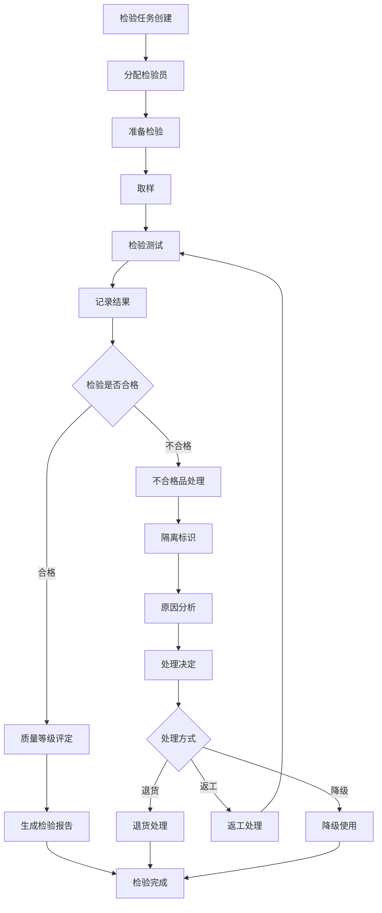
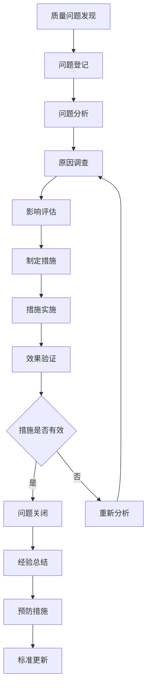
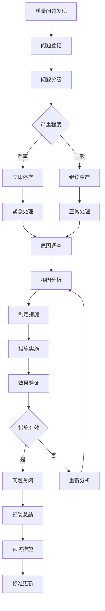

# 质量管理模块 - 子模块设计文档

## 1. 模块概述

### 1.1 功能定位
质量管理模块是化盐项目工艺流程的质量保障核心，负责原料质量检验、工艺过程质量控制、成品质量检测和质量追溯管理。该模块通过建立完善的质量管理体系，确保化盐产品的质量稳定性和一致性，满足客户要求和行业标准。

### 1.2 业务价值
- **质量保障**：建立全流程质量控制体系，确保产品质量符合标准
- **风险控制**：及时发现和处理质量问题，降低质量风险
- **成本控制**：减少质量缺陷导致的返工和废品损失
- **客户满意**：提供稳定可靠的产品质量，提升客户满意度
- **合规管理**：满足质量管理体系认证和法规要求

### 1.3 模块边界
- **上游依赖**：库存管理模块（原料入库）、提温工艺管理模块（成品产出）
- **下游服务**：库存管理模块（质量分级存储）、数据分析模块（质量分析）
- **外部集成**：检测设备系统、实验室管理系统、质量认证系统

## 2. 功能需求清单

### 2.1 质量检验管理
- **原料质量检验**：管理原料入库前的质量检验
  - 检验项目管理（化学成分、物理性能、外观质量）
  - 检验标准管理（国标、行标、企标、客户标准）
  - 检验流程管理（取样、检测、判定、记录）
  - 不合格品处理（隔离、退货、降级、返工）
- **过程质量控制**：监控工艺过程中的质量参数
  - 工艺参数监控（温度、压力、配比、时间）
  - 中间产品检验（半成品质量检查）
  - 过程异常处理（参数偏差、质量异常）
  - 工艺改进建议（基于质量数据的工艺优化）
- **成品质量检测**：管理成品的质量检测和评定
  - 成品检测项目（化学成分、熔点、纯度、水分）
  - 质量等级评定（优等品、一等品、合格品）
  - 检测报告生成（质量证书、检测报告）
  - 质量追溯记录（批次质量档案）

### 2.2 质量标准管理
- **检验标准维护**：维护各类质量检验标准
  - 原料检验标准（NaNO3、KNO3、Ca(NO3)2标准）
  - 成品检验标准（二元化盐、三元化盐标准）
  - 检验方法标准（检测方法、仪器要求、环境条件）
  - 标准版本管理（标准更新、历史版本）
- **质量指标管理**：管理质量控制指标和限值
  - 关键质量指标（KQI）定义
  - 控制限值设置（上限、下限、目标值）
  - 指标权重配置（重要性权重分配）
  - 指标监控预警（超限预警、趋势预警）

### 2.3 质量追溯管理
- **批次质量档案**：建立完整的批次质量档案
  - 原料质量记录（供应商、检验结果、使用批次）
  - 工艺质量记录（工艺参数、过程检验、异常记录）
  - 成品质量记录（检测结果、质量等级、出库记录）
  - 质量问题记录（问题描述、原因分析、处理措施）
- **质量追溯查询**：支持多维度的质量追溯查询
  - 正向追溯（原料到成品的质量传递）
  - 反向追溯（成品到原料的质量溯源）
  - 横向追溯（同批次产品的质量关联）
  - 问题追溯（质量问题的影响范围分析）

### 2.4 质量分析与改进
- **质量统计分析**：提供多维度的质量统计分析
  - 合格率统计（按时间、产品、工序统计）
  - 质量趋势分析（质量指标变化趋势）
  - 缺陷分析（缺陷类型、频次、原因分析）
  - 质量成本分析（检验成本、质量损失成本）
- **质量改进管理**：管理质量改进活动
  - 质量问题管理（问题登记、分析、整改）
  - 纠正预防措施（CAPA管理）
  - 质量改进项目（改进计划、实施跟踪）
  - 质量评审管理（定期质量评审、改进建议）

## 3. 页面设计规范

### 3.1 页面布局设计

#### 3.1.1 质量管理总览页面
```
┌─────────────────────────────────────────────────────────────┐
│ 面包屑导航: 首页 > ERP管理 > 化盐工艺流程 > 质量管理          │
├─────────────────────────────────────────────────────────────┤
│ 质量概览卡片                                                │
│ ┌─────────────┐ ┌─────────────┐ ┌─────────────┐             │
│ │   合格率     │ │   检验批次   │ │   质量问题   │             │
│ │   98.5%     │ │   156批次   │ │   3个       │             │
│ │   ↗ +0.3%   │ │   ↗ +12批次 │ │   ↘ -2个    │             │
│ └─────────────┘ └─────────────┘ └─────────────┘             │
├─────────────────────────────────────────────────────────────┤
│ 质量预警面板                                                │
│ ⚠️ 批次BT20240101的NaNO3纯度偏低，需要复检                   │
│ ⚠️ 成品PB20240102质量等级降为一等品                         │
│ ℹ️ 检验设备XRF-001需要校准，距离上次校准已90天               │
├─────────────────────────────────────────────────────────────┤
│ 快捷操作区域                                                │
│ [原料检验] [成品检测] [质量追溯] [质量分析] [标准管理]       │
├─────────────────────────────────────────────────────────────┤
│ 质量趋势图表                                                │
│ [合格率趋势] [缺陷分析] [质量成本] [改进跟踪]                │
│ (实时更新的质量统计图表)                                    │
└─────────────────────────────────────────────────────────────┘
```

#### 3.1.2 质量检验管理页面
```
┌─────────────────────────────────────────────────────────────┐
│ 搜索筛选区域                                                │
│ [检验类型] [检验状态] [产品类型] [批次号] [时间范围] [搜索]   │
├─────────────────────────────────────────────────────────────┤
│ 操作按钮区域                                                │
│ [新增检验] [批量检验] [检验报告] [导出] [刷新]               │
├─────────────────────────────────────────────────────────────┤
│ 检验任务列表                                                │
│ ☑ │检验编号│检验类型│产品名称│批次号│检验状态│检验员│操作     │
│ ☐ │QC001  │原料检验│NaNO3  │BT001 │已完成  │李四│查看报告   │
│ ☐ │QC002  │成品检测│二元化盐│PB001 │进行中  │王五│继续检验   │
├─────────────────────────────────────────────────────────────┤
│ 检验详情区域                                                │
│ 选中检验的详细信息：                                        │
│ 检验项目: 化学成分分析  检验方法: GB/T 1234-2020            │
│ 检验结果: 合格  质量等级: 优等品  检验时间: 2024-01-01       │
├─────────────────────────────────────────────────────────────┤
│ 分页组件                                                    │
│ 共200条 [20条/页] [上一页] 1 2 3 [下一页]                   │
└─────────────────────────────────────────────────────────────┘
```

#### 3.1.3 质量追溯查询页面
```
┌─────────────────────────────────────────────────────────────┐
│ 追溯查询条件                                                │
│ 追溯类型: ○正向追溯 ○反向追溯 ○横向追溯                     │
│ 查询条件: [批次号/产品编码] [开始日期] [结束日期] [查询]      │
├─────────────────────────────────────────────────────────────┤
│ 追溯结果展示                                                │
│ ┌─────────────────────────────────────────────────────────┐ │
│ │ 追溯路径图                                              │ │
│ │ 原料批次BT001 → 生产任务SM001 → 成品批次PB001           │ │
│ │     ↓              ↓              ↓                    │ │
│ │ 质量检验QC001   工艺监控PM001   成品检测QC002           │ │
│ └─────────────────────────────────────────────────────────┘ │
├─────────────────────────────────────────────────────────────┤
│ 质量信息详情                                                │
│ ┌─────────────┐ ┌─────────────┐ ┌─────────────┐             │
│ │   原料质量   │ │   工艺质量   │ │   成品质量   │             │
│ │ 纯度: 99.2%  │ │ 温度: 580°C  │ │ 等级: 优等品 │             │
│ │ 水分: 0.1%   │ │ 配比: 60:40  │ │ 纯度: 98.8%  │             │
│ └─────────────┘ └─────────────┘ └─────────────┘             │
└─────────────────────────────────────────────────────────────┘
```

### 3.2 组件设计规范

#### 3.2.1 质量检验表单组件
```vue
<template>
  <div class="quality-inspection-form">
    <div class="form-header">
      <h4>{{ inspectionTitle }}</h4>
      <div class="form-info">
        <el-tag :type="getInspectionTypeTag()">
          {{ inspectionType }}
        </el-tag>
        <span class="inspection-time">{{ formatTime(new Date()) }}</span>
      </div>
    </div>
    
    <el-form 
      ref="formRef"
      :model="formData"
      :rules="formRules"
      label-width="120px"
      class="inspection-form"
    >
      <el-row :gutter="20">
        <el-col :span="12">
          <el-form-item label="检验类型" prop="inspectionType">
            <el-select
              v-model="formData.inspectionType"
              placeholder="请选择检验类型"
              @change="handleTypeChange"
            >
              <el-option label="原料检验" value="MATERIAL" />
              <el-option label="过程检验" value="PROCESS" />
              <el-option label="成品检测" value="PRODUCT" />
            </el-select>
          </el-form-item>
        </el-col>
        
        <el-col :span="12">
          <el-form-item label="检验批次" prop="batchNo">
            <el-input
              v-model="formData.batchNo"
              placeholder="请输入批次号"
              @blur="handleBatchNoChange"
            />
          </el-form-item>
        </el-col>
      </el-row>
      
      <el-row :gutter="20">
        <el-col :span="12">
          <el-form-item label="产品名称" prop="productName">
            <el-input
              v-model="formData.productName"
              placeholder="产品名称"
              readonly
            />
          </el-form-item>
        </el-col>
        
        <el-col :span="12">
          <el-form-item label="检验员" prop="inspectorId">
            <el-select
              v-model="formData.inspectorId"
              placeholder="请选择检验员"
            >
              <el-option
                v-for="inspector in inspectors"
                :key="inspector.id"
                :label="inspector.name"
                :value="inspector.id"
              />
            </el-select>
          </el-form-item>
        </el-col>
      </el-row>
      
      <el-form-item label="检验项目">
        <div class="inspection-items">
          <div 
            v-for="item in inspectionItems" 
            :key="item.id"
            class="inspection-item"
          >
            <div class="item-header">
              <span class="item-name">{{ item.name }}</span>
              <span class="item-standard">标准: {{ item.standard }}</span>
              <span class="item-method">方法: {{ item.method }}</span>
            </div>
            
            <div class="item-content">
              <el-row :gutter="10">
                <el-col :span="8">
                  <el-form-item :label="`${item.name}值`" :prop="`items.${item.id}.value`">
                    <el-input-number
                      v-model="formData.items[item.id].value"
                      :min="item.minValue"
                      :max="item.maxValue"
                      :precision="item.precision"
                      :step="item.step"
                      placeholder="检测值"
                    />
                    <span class="unit">{{ item.unit }}</span>
                  </el-form-item>
                </el-col>
                
                <el-col :span="8">
                  <el-form-item :label="判定结果" :prop="`items.${item.id}.result`">
                    <el-select
                      v-model="formData.items[item.id].result"
                      placeholder="判定结果"
                    >
                      <el-option label="合格" value="PASS" />
                      <el-option label="不合格" value="FAIL" />
                      <el-option label="待复检" value="RETEST" />
                    </el-select>
                  </el-form-item>
                </el-col>
                
                <el-col :span="8">
                  <el-form-item :label="备注">
                    <el-input
                      v-model="formData.items[item.id].remarks"
                      placeholder="备注信息"
                    />
                  </el-form-item>
                </el-col>
              </el-row>
            </div>
          </div>
        </div>
      </el-form-item>
      
      <el-form-item label="总体判定" prop="overallResult">
        <el-radio-group v-model="formData.overallResult">
          <el-radio label="PASS">合格</el-radio>
          <el-radio label="FAIL">不合格</el-radio>
          <el-radio label="CONDITIONAL">有条件合格</el-radio>
        </el-radio-group>
      </el-form-item>
      
      <el-form-item label="质量等级" prop="qualityGrade" v-if="showQualityGrade">
        <el-select
          v-model="formData.qualityGrade"
          placeholder="请选择质量等级"
        >
          <el-option label="优等品" value="EXCELLENT" />
          <el-option label="一等品" value="FIRST_CLASS" />
          <el-option label="合格品" value="QUALIFIED" />
        </el-select>
      </el-form-item>
      
      <el-form-item label="检验结论" prop="conclusion">
        <el-input
          v-model="formData.conclusion"
          type="textarea"
          :rows="3"
          placeholder="请输入检验结论"
        />
      </el-form-item>
    </el-form>
    
    <div class="form-actions">
      <el-button @click="handleCancel">取消</el-button>
      <el-button @click="handleSaveDraft">保存草稿</el-button>
      <el-button 
        type="primary" 
        @click="handleSubmit"
        :loading="submitting"
      >
        提交检验
      </el-button>
    </div>
  </div>
</template>

<script setup lang="ts">
interface Props {
  inspectionType: 'MATERIAL' | 'PROCESS' | 'PRODUCT';
  inspectionItems: InspectionItem[];
  inspectors: Inspector[];
}

interface InspectionItem {
  id: string;
  name: string;
  standard: string;
  method: string;
  unit: string;
  minValue: number;
  maxValue: number;
  precision: number;
  step: number;
}

interface Emits {
  submit: [data: QualityInspectionForm];
  cancel: [];
  saveDraft: [data: QualityInspectionForm];
}

const props = defineProps<Props>();
const emit = defineEmits<Emits>();

const formRef = ref();
const submitting = ref(false);

const formData = reactive({
  inspectionType: props.inspectionType,
  batchNo: '',
  productName: '',
  inspectorId: '',
  items: {} as Record<string, InspectionItemResult>,
  overallResult: 'PASS',
  qualityGrade: '',
  conclusion: ''
});

const formRules = {
  inspectionType: [{ required: true, message: '请选择检验类型', trigger: 'change' }],
  batchNo: [{ required: true, message: '请输入批次号', trigger: 'blur' }],
  inspectorId: [{ required: true, message: '请选择检验员', trigger: 'change' }],
  overallResult: [{ required: true, message: '请选择总体判定', trigger: 'change' }],
  conclusion: [{ required: true, message: '请输入检验结论', trigger: 'blur' }]
};

const inspectionTitle = computed(() => {
  const typeMap = {
    MATERIAL: '原料质量检验',
    PROCESS: '过程质量检验',
    PRODUCT: '成品质量检测'
  };
  return typeMap[props.inspectionType] || '质量检验';
});

const showQualityGrade = computed(() => {
  return props.inspectionType === 'PRODUCT' && formData.overallResult === 'PASS';
});

// 初始化检验项目
onMounted(() => {
  props.inspectionItems.forEach(item => {
    formData.items[item.id] = {
      value: 0,
      result: 'PASS',
      remarks: ''
    };
  });
});

const getInspectionTypeTag = () => {
  const typeMap = {
    MATERIAL: 'primary',
    PROCESS: 'warning',
    PRODUCT: 'success'
  };
  return typeMap[props.inspectionType] || 'info';
};

const handleTypeChange = (type: string) => {
  // 根据检验类型加载对应的检验项目
  loadInspectionItems(type);
};

const handleBatchNoChange = async () => {
  if (formData.batchNo) {
    // 根据批次号获取产品信息
    const batchInfo = await getBatchInfo(formData.batchNo);
    if (batchInfo) {
      formData.productName = batchInfo.productName;
    }
  }
};

const handleSubmit = async () => {
  try {
    await formRef.value.validate();
    submitting.value = true;
    
    emit('submit', formData);
  } catch (error) {
    console.error('表单验证失败:', error);
  } finally {
    submitting.value = false;
  }
};

const handleCancel = () => {
  emit('cancel');
};

const handleSaveDraft = () => {
  emit('saveDraft', formData);
};

const formatTime = (date: Date) => {
  return date.toLocaleString();
};
</script>
```

#### 3.2.2 质量追溯组件
```vue
<template>
  <div class="quality-traceability">
    <div class="trace-search">
      <el-form :model="searchForm" inline>
        <el-form-item label="追溯类型">
          <el-radio-group v-model="searchForm.traceType">
            <el-radio label="FORWARD">正向追溯</el-radio>
            <el-radio label="BACKWARD">反向追溯</el-radio>
            <el-radio label="LATERAL">横向追溯</el-radio>
          </el-radio-group>
        </el-form-item>

        <el-form-item label="查询条件">
          <el-input
            v-model="searchForm.keyword"
            placeholder="请输入批次号或产品编码"
            style="width: 200px"
          />
        </el-form-item>

        <el-form-item>
          <el-button type="primary" @click="handleTrace">开始追溯</el-button>
          <el-button @click="handleReset">重置</el-button>
        </el-form-item>
      </el-form>
    </div>

    <div class="trace-result" v-if="traceResult">
      <div class="trace-path">
        <h4>追溯路径</h4>
        <div class="path-diagram">
          <div
            v-for="(node, index) in traceResult.path"
            :key="node.id"
            class="path-node"
            :class="getNodeClass(node.type)"
          >
            <div class="node-content">
              <div class="node-title">{{ node.title }}</div>
              <div class="node-info">{{ node.info }}</div>
              <div class="node-time">{{ formatTime(node.time) }}</div>
            </div>

            <div
              v-if="index < traceResult.path.length - 1"
              class="path-arrow"
            >
              →
            </div>
          </div>
        </div>
      </div>

      <div class="quality-details">
        <h4>质量信息详情</h4>
        <el-tabs v-model="activeTab">
          <el-tab-pane
            v-for="detail in traceResult.qualityDetails"
            :key="detail.stage"
            :label="detail.stageName"
            :name="detail.stage"
          >
            <div class="quality-detail-content">
              <el-descriptions :column="2" border>
                <el-descriptions-item
                  v-for="item in detail.items"
                  :key="item.name"
                  :label="item.name"
                >
                  <span :class="getQualityValueClass(item.status)">
                    {{ item.value }} {{ item.unit }}
                  </span>
                  <el-tag
                    v-if="item.status !== 'NORMAL'"
                    :type="getStatusTagType(item.status)"
                    size="small"
                    style="margin-left: 8px"
                  >
                    {{ getStatusText(item.status) }}
                  </el-tag>
                </el-descriptions-item>
              </el-descriptions>

              <div class="quality-conclusion" v-if="detail.conclusion">
                <h5>质量结论</h5>
                <p>{{ detail.conclusion }}</p>
              </div>

              <div class="quality-issues" v-if="detail.issues.length > 0">
                <h5>质量问题</h5>
                <el-alert
                  v-for="issue in detail.issues"
                  :key="issue.id"
                  :title="issue.title"
                  :description="issue.description"
                  :type="getIssueType(issue.severity)"
                  show-icon
                  style="margin-bottom: 8px"
                />
              </div>
            </div>
          </el-tab-pane>
        </el-tabs>
      </div>

      <div class="related-batches" v-if="traceResult.relatedBatches.length > 0">
        <h4>关联批次</h4>
        <el-table :data="traceResult.relatedBatches" border>
          <el-table-column prop="batchNo" label="批次号" />
          <el-table-column prop="productName" label="产品名称" />
          <el-table-column prop="qualityGrade" label="质量等级">
            <template #default="{ row }">
              <el-tag :type="getGradeTagType(row.qualityGrade)">
                {{ getGradeText(row.qualityGrade) }}
              </el-tag>
            </template>
          </el-table-column>
          <el-table-column prop="productionTime" label="生产时间">
            <template #default="{ row }">
              {{ formatTime(row.productionTime) }}
            </template>
          </el-table-column>
          <el-table-column label="操作">
            <template #default="{ row }">
              <el-button
                size="small"
                @click="handleViewBatch(row.batchNo)"
              >
                查看详情
              </el-button>
            </template>
          </el-table-column>
        </el-table>
      </div>
    </div>

    <div class="no-result" v-else-if="searched && !traceResult">
      <el-empty description="未找到追溯信息" />
    </div>
  </div>
</template>

<script setup lang="ts">
interface Props {
  // 可以传入初始查询条件
  initialKeyword?: string;
  initialTraceType?: 'FORWARD' | 'BACKWARD' | 'LATERAL';
}

interface TraceResult {
  path: TraceNode[];
  qualityDetails: QualityDetail[];
  relatedBatches: RelatedBatch[];
}

interface TraceNode {
  id: string;
  type: 'MATERIAL' | 'PROCESS' | 'PRODUCT';
  title: string;
  info: string;
  time: string;
}

interface QualityDetail {
  stage: string;
  stageName: string;
  items: QualityItem[];
  conclusion?: string;
  issues: QualityIssue[];
}

interface Emits {
  viewBatch: [batchNo: string];
}

const props = defineProps<Props>();
const emit = defineEmits<Emits>();

const searchForm = reactive({
  traceType: props.initialTraceType || 'FORWARD',
  keyword: props.initialKeyword || ''
});

const traceResult = ref<TraceResult | null>(null);
const activeTab = ref('');
const searched = ref(false);

const getNodeClass = (type: string) => {
  return {
    'node-material': type === 'MATERIAL',
    'node-process': type === 'PROCESS',
    'node-product': type === 'PRODUCT'
  };
};

const getQualityValueClass = (status: string) => {
  return {
    'value-normal': status === 'NORMAL',
    'value-warning': status === 'WARNING',
    'value-error': status === 'ERROR'
  };
};

const getStatusTagType = (status: string) => {
  const typeMap = {
    WARNING: 'warning',
    ERROR: 'danger',
    NORMAL: 'success'
  };
  return typeMap[status] || 'info';
};

const getStatusText = (status: string) => {
  const textMap = {
    WARNING: '预警',
    ERROR: '异常',
    NORMAL: '正常'
  };
  return textMap[status] || '未知';
};

const getIssueType = (severity: string) => {
  const typeMap = {
    HIGH: 'error',
    MEDIUM: 'warning',
    LOW: 'info'
  };
  return typeMap[severity] || 'info';
};

const getGradeTagType = (grade: string) => {
  const typeMap = {
    EXCELLENT: 'success',
    FIRST_CLASS: 'primary',
    QUALIFIED: 'warning'
  };
  return typeMap[grade] || 'info';
};

const getGradeText = (grade: string) => {
  const textMap = {
    EXCELLENT: '优等品',
    FIRST_CLASS: '一等品',
    QUALIFIED: '合格品'
  };
  return textMap[grade] || '未知';
};

const handleTrace = async () => {
  if (!searchForm.keyword.trim()) {
    ElMessage.warning('请输入查询条件');
    return;
  }

  try {
    const result = await performQualityTrace({
      traceType: searchForm.traceType,
      keyword: searchForm.keyword.trim()
    });

    traceResult.value = result;
    searched.value = true;

    if (result.qualityDetails.length > 0) {
      activeTab.value = result.qualityDetails[0].stage;
    }
  } catch (error) {
    console.error('追溯查询失败:', error);
    ElMessage.error('追溯查询失败');
    traceResult.value = null;
    searched.value = true;
  }
};

const handleReset = () => {
  searchForm.keyword = '';
  traceResult.value = null;
  searched.value = false;
};

const handleViewBatch = (batchNo: string) => {
  emit('viewBatch', batchNo);
};

const formatTime = (time: string) => {
  return new Date(time).toLocaleString();
};
</script>
```

### 3.3 交互流程设计

#### 3.3.1 质量检验流程


#### 3.3.2 质量问题处理流程


## 4. API接口设计

### 4.1 接口列表

#### 4.1.1 质量检验接口
```typescript
// 创建检验任务
POST /erp/saltprocess/quality/inspection/create
// 权限: erp:saltprocess:quality:inspection:create

// 查询检验任务列表
GET /erp/saltprocess/quality/inspection/list
// 权限: erp:saltprocess:quality:inspection:list

// 获取检验任务详情
GET /erp/saltprocess/quality/inspection/{id}
// 权限: erp:saltprocess:quality:inspection:detail

// 提交检验结果
POST /erp/saltprocess/quality/inspection/{id}/submit
// 权限: erp:saltprocess:quality:inspection:submit

// 审核检验结果
POST /erp/saltprocess/quality/inspection/{id}/review
// 权限: erp:saltprocess:quality:inspection:review

// 生成检验报告
POST /erp/saltprocess/quality/inspection/{id}/report
// 权限: erp:saltprocess:quality:inspection:report
```

#### 4.1.2 质量标准接口
```typescript
// 查询质量标准列表
GET /erp/saltprocess/quality/standard/list
// 权限: erp:saltprocess:quality:standard:list

// 创建质量标准
POST /erp/saltprocess/quality/standard/create
// 权限: erp:saltprocess:quality:standard:create

// 更新质量标准
PUT /erp/saltprocess/quality/standard/{id}
// 权限: erp:saltprocess:quality:standard:update

// 删除质量标准
DELETE /erp/saltprocess/quality/standard/{id}
// 权限: erp:saltprocess:quality:standard:delete
```

#### 4.1.3 质量追溯接口
```typescript
// 质量追溯查询
POST /erp/saltprocess/quality/trace/query
// 权限: erp:saltprocess:quality:trace:query

// 获取批次质量档案
GET /erp/saltprocess/quality/trace/batch/{batchNo}
// 权限: erp:saltprocess:quality:trace:batch

// 质量问题影响分析
POST /erp/saltprocess/quality/trace/impact
// 权限: erp:saltprocess:quality:trace:impact
```

#### 4.1.4 质量分析接口
```typescript
// 质量统计分析
GET /erp/saltprocess/quality/analysis/statistics
// 权限: erp:saltprocess:quality:analysis:statistics

// 质量趋势分析
GET /erp/saltprocess/quality/analysis/trend
// 权限: erp:saltprocess:quality:analysis:trend

// 缺陷分析
GET /erp/saltprocess/quality/analysis/defect
// 权限: erp:saltprocess:quality:analysis:defect

// 质量成本分析
GET /erp/saltprocess/quality/analysis/cost
// 权限: erp:saltprocess:quality:analysis:cost
```

### 4.2 请求响应格式

#### 4.2.1 检验任务创建请求
```typescript
interface InspectionTaskCreateForm {
  inspectionType: 'MATERIAL' | 'PROCESS' | 'PRODUCT';
  batchNo: string;
  productId: string;
  productName: string;
  inspectorId: string;
  planDate: string;
  priority: 'HIGH' | 'MEDIUM' | 'LOW';
  remarks?: string;
  inspectionItems: InspectionItemConfig[];
}

interface InspectionItemConfig {
  itemId: string;
  itemName: string;
  standardId: string;
  methodId: string;
  required: boolean;
}
```

#### 4.2.2 检验结果提交请求
```typescript
interface InspectionResultForm {
  inspectionId: string;
  inspectorId: string;
  inspectionTime: string;
  items: InspectionItemResult[];
  overallResult: 'PASS' | 'FAIL' | 'CONDITIONAL';
  qualityGrade?: 'EXCELLENT' | 'FIRST_CLASS' | 'QUALIFIED';
  conclusion: string;
  attachments?: string[];
}

interface InspectionItemResult {
  itemId: string;
  measuredValue: number;
  unit: string;
  result: 'PASS' | 'FAIL' | 'RETEST';
  remarks?: string;
}
```

#### 4.2.3 检验任务详情响应
```typescript
interface InspectionTaskVO {
  id: string;
  taskNo: string;
  inspectionType: 'MATERIAL' | 'PROCESS' | 'PRODUCT';
  batchNo: string;
  productId: string;
  productName: string;
  specification: string;
  inspectorId: string;
  inspectorName: string;
  status: InspectionStatus;
  priority: 'HIGH' | 'MEDIUM' | 'LOW';
  planDate: string;
  actualDate?: string;
  createTime: string;
  updateTime: string;
  items: InspectionItemVO[];
  result?: InspectionResultVO;
}

interface InspectionItemVO {
  id: string;
  itemName: string;
  standard: string;
  method: string;
  unit: string;
  minValue?: number;
  maxValue?: number;
  targetValue?: number;
  required: boolean;
  measuredValue?: number;
  result?: 'PASS' | 'FAIL' | 'RETEST';
  remarks?: string;
}

interface InspectionResultVO {
  overallResult: 'PASS' | 'FAIL' | 'CONDITIONAL';
  qualityGrade?: 'EXCELLENT' | 'FIRST_CLASS' | 'QUALIFIED';
  conclusion: string;
  inspectionTime: string;
  reviewerId?: string;
  reviewerName?: string;
  reviewTime?: string;
  reviewComments?: string;
  attachments: string[];
}
```

#### 4.2.4 质量追溯查询请求
```typescript
interface QualityTraceQuery {
  traceType: 'FORWARD' | 'BACKWARD' | 'LATERAL';
  keyword: string;
  startDate?: string;
  endDate?: string;
  includeQualityIssues?: boolean;
  includeRelatedBatches?: boolean;
}
```

#### 4.2.5 质量追溯结果响应
```typescript
interface QualityTraceResultVO {
  traceId: string;
  traceType: 'FORWARD' | 'BACKWARD' | 'LATERAL';
  keyword: string;
  path: TraceNodeVO[];
  qualityDetails: QualityDetailVO[];
  relatedBatches: RelatedBatchVO[];
  qualityIssues: QualityIssueVO[];
  summary: TraceSummaryVO;
}

interface TraceNodeVO {
  id: string;
  type: 'MATERIAL' | 'PROCESS' | 'PRODUCT';
  title: string;
  info: string;
  time: string;
  status: 'NORMAL' | 'WARNING' | 'ERROR';
  qualityGrade?: string;
}

interface QualityDetailVO {
  stage: string;
  stageName: string;
  batchNo: string;
  inspectionId?: string;
  items: QualityItemVO[];
  conclusion?: string;
  issues: QualityIssueVO[];
}

interface QualityItemVO {
  name: string;
  value: string;
  unit: string;
  standard: string;
  status: 'NORMAL' | 'WARNING' | 'ERROR';
  deviation?: number;
}
```

### 4.3 权限控制设计
```typescript
// 质量管理权限配置
const qualityPermissions = {
  'erp:saltprocess:quality:overview': '查看质量概览',
  'erp:saltprocess:quality:inspection:list': '查询检验任务',
  'erp:saltprocess:quality:inspection:detail': '查看检验详情',
  'erp:saltprocess:quality:inspection:create': '创建检验任务',
  'erp:saltprocess:quality:inspection:submit': '提交检验结果',
  'erp:saltprocess:quality:inspection:review': '审核检验结果',
  'erp:saltprocess:quality:inspection:report': '生成检验报告',
  'erp:saltprocess:quality:standard:list': '查询质量标准',
  'erp:saltprocess:quality:standard:create': '创建质量标准',
  'erp:saltprocess:quality:standard:update': '更新质量标准',
  'erp:saltprocess:quality:standard:delete': '删除质量标准',
  'erp:saltprocess:quality:trace:query': '质量追溯查询',
  'erp:saltprocess:quality:trace:batch': '查看批次质量档案',
  'erp:saltprocess:quality:trace:impact': '质量问题影响分析',
  'erp:saltprocess:quality:analysis:statistics': '质量统计分析',
  'erp:saltprocess:quality:analysis:trend': '质量趋势分析',
  'erp:saltprocess:quality:analysis:defect': '缺陷分析',
  'erp:saltprocess:quality:analysis:cost': '质量成本分析'
};
```

## 5. 数据模型设计

### 5.1 核心实体设计

#### 5.1.1 检验任务实体 (QualityInspectionTask)
```typescript
interface QualityInspectionTask {
  id: string;                          // 检验任务ID
  taskNo: string;                      // 检验任务编号
  inspectionType: InspectionType;      // 检验类型
  batchNo: string;                     // 批次号
  productId: string;                   // 产品ID
  productName: string;                 // 产品名称
  specification: string;               // 规格型号
  inspectorId: string;                 // 检验员ID
  status: InspectionStatus;            // 检验状态
  priority: Priority;                  // 优先级
  planDate: Date;                      // 计划检验日期
  actualDate?: Date;                   // 实际检验日期
  standardId: string;                  // 检验标准ID
  methodId: string;                    // 检验方法ID
  remarks?: string;                    // 备注
  createTime: Date;                    // 创建时间
  updateTime: Date;                    // 更新时间
  creatorId: string;                   // 创建人ID
}
```

#### 5.1.2 检验结果实体 (QualityInspectionResult)
```typescript
interface QualityInspectionResult {
  id: string;                          // 检验结果ID
  inspectionId: string;                // 检验任务ID
  inspectorId: string;                 // 检验员ID
  inspectionTime: Date;                // 检验时间
  overallResult: InspectionResult;     // 总体判定结果
  qualityGrade?: QualityGrade;         // 质量等级
  conclusion: string;                  // 检验结论
  reviewerId?: string;                 // 审核人ID
  reviewTime?: Date;                   // 审核时间
  reviewComments?: string;             // 审核意见
  attachments: string[];               // 附件列表
  createTime: Date;                    // 创建时间
}
```

#### 5.1.3 检验项目结果实体 (QualityInspectionItem)
```typescript
interface QualityInspectionItem {
  id: string;                          // 检验项目ID
  inspectionId: string;                // 检验任务ID
  itemName: string;                    // 检验项目名称
  standardValue?: string;              // 标准值
  minValue?: number;                   // 最小值
  maxValue?: number;                   // 最大值
  targetValue?: number;                // 目标值
  measuredValue?: number;              // 实测值
  unit: string;                        // 单位
  method: string;                      // 检验方法
  result?: InspectionResult;           // 判定结果
  deviation?: number;                  // 偏差值
  remarks?: string;                    // 备注
  required: boolean;                   // 是否必检
  createTime: Date;                    // 创建时间
}
```

#### 5.1.4 质量标准实体 (QualityStandard)
```typescript
interface QualityStandard {
  id: string;                          // 标准ID
  standardCode: string;                // 标准编码
  standardName: string;                // 标准名称
  standardType: StandardType;          // 标准类型
  productType: string;                 // 适用产品类型
  version: string;                     // 版本号
  effectiveDate: Date;                 // 生效日期
  expiryDate?: Date;                   // 失效日期
  status: StandardStatus;              // 标准状态
  content: string;                     // 标准内容
  items: QualityStandardItem[];        // 检验项目
  createTime: Date;                    // 创建时间
  updateTime: Date;                    // 更新时间
  creatorId: string;                   // 创建人ID
}
```

#### 5.1.5 质量标准项目实体 (QualityStandardItem)
```typescript
interface QualityStandardItem {
  id: string;                          // 标准项目ID
  standardId: string;                  // 质量标准ID
  itemName: string;                    // 项目名称
  itemCode: string;                    // 项目编码
  unit: string;                        // 单位
  minValue?: number;                   // 最小值
  maxValue?: number;                   // 最大值
  targetValue?: number;                // 目标值
  tolerance?: number;                  // 公差
  method: string;                      // 检验方法
  equipment?: string;                  // 检验设备
  required: boolean;                   // 是否必检
  weight: number;                      // 权重
  remarks?: string;                    // 备注
}
```

#### 5.1.6 质量问题实体 (QualityIssue)
```typescript
interface QualityIssue {
  id: string;                          // 问题ID
  issueNo: string;                     // 问题编号
  title: string;                       // 问题标题
  description: string;                 // 问题描述
  issueType: IssueType;                // 问题类型
  severity: IssueSeverity;             // 严重程度
  source: IssueSource;                 // 问题来源
  batchNo?: string;                    // 相关批次号
  productId?: string;                  // 相关产品ID
  inspectionId?: string;               // 相关检验ID
  discoveryTime: Date;                 // 发现时间
  reporterId: string;                  // 报告人ID
  status: IssueStatus;                 // 处理状态
  assigneeId?: string;                 // 负责人ID
  rootCause?: string;                  // 根本原因
  correctiveAction?: string;           // 纠正措施
  preventiveAction?: string;           // 预防措施
  closeTime?: Date;                    // 关闭时间
  createTime: Date;                    // 创建时间
  updateTime: Date;                    // 更新时间
}
```

### 5.2 枚举定义
```typescript
enum InspectionType {
  MATERIAL = 'MATERIAL',               // 原料检验
  PROCESS = 'PROCESS',                 // 过程检验
  PRODUCT = 'PRODUCT'                  // 成品检测
}

enum InspectionStatus {
  PENDING = 'PENDING',                 // 待检验
  IN_PROGRESS = 'IN_PROGRESS',         // 检验中
  COMPLETED = 'COMPLETED',             // 已完成
  REVIEWED = 'REVIEWED',               // 已审核
  CANCELLED = 'CANCELLED'              // 已取消
}

enum InspectionResult {
  PASS = 'PASS',                       // 合格
  FAIL = 'FAIL',                       // 不合格
  CONDITIONAL = 'CONDITIONAL',         // 有条件合格
  RETEST = 'RETEST'                    // 待复检
}

enum QualityGrade {
  EXCELLENT = 'EXCELLENT',             // 优等品
  FIRST_CLASS = 'FIRST_CLASS',         // 一等品
  QUALIFIED = 'QUALIFIED'              // 合格品
}

enum StandardType {
  NATIONAL = 'NATIONAL',               // 国家标准
  INDUSTRY = 'INDUSTRY',               // 行业标准
  ENTERPRISE = 'ENTERPRISE',           // 企业标准
  CUSTOMER = 'CUSTOMER'                // 客户标准
}

enum StandardStatus {
  DRAFT = 'DRAFT',                     // 草稿
  EFFECTIVE = 'EFFECTIVE',             // 有效
  EXPIRED = 'EXPIRED',                 // 已失效
  CANCELLED = 'CANCELLED'              // 已取消
}

enum Priority {
  HIGH = 'HIGH',                       // 高优先级
  MEDIUM = 'MEDIUM',                   // 中优先级
  LOW = 'LOW'                          // 低优先级
}

enum IssueType {
  QUALITY_DEFECT = 'QUALITY_DEFECT',   // 质量缺陷
  PROCESS_DEVIATION = 'PROCESS_DEVIATION', // 工艺偏差
  EQUIPMENT_FAILURE = 'EQUIPMENT_FAILURE', // 设备故障
  MATERIAL_ISSUE = 'MATERIAL_ISSUE',   // 原料问题
  HUMAN_ERROR = 'HUMAN_ERROR'          // 人为错误
}

enum IssueSeverity {
  CRITICAL = 'CRITICAL',               // 严重
  HIGH = 'HIGH',                       // 高
  MEDIUM = 'MEDIUM',                   // 中
  LOW = 'LOW'                          // 低
}

enum IssueSource {
  INSPECTION = 'INSPECTION',           // 检验发现
  CUSTOMER_COMPLAINT = 'CUSTOMER_COMPLAINT', // 客户投诉
  INTERNAL_AUDIT = 'INTERNAL_AUDIT',   // 内部审核
  PROCESS_MONITORING = 'PROCESS_MONITORING' // 过程监控
}

enum IssueStatus {
  OPEN = 'OPEN',                       // 开放
  IN_PROGRESS = 'IN_PROGRESS',         // 处理中
  RESOLVED = 'RESOLVED',               // 已解决
  CLOSED = 'CLOSED',                   // 已关闭
  CANCELLED = 'CANCELLED'              // 已取消
}
```

### 5.3 业务规则设计

#### 5.3.1 检验任务编码规则
```typescript
// 检验任务编号编码格式:
// QC + 检验类型 + YYYYMMDD + 4位序号
// 原料检验: QCM20240101001
// 过程检验: QCP20240101001
// 成品检测: QCR20240101001
const generateInspectionTaskNo = (type: InspectionType, date: Date): string => {
  const dateStr = date.toISOString().slice(0, 10).replace(/-/g, '');
  let typeCode = '';

  switch (type) {
    case InspectionType.MATERIAL:
      typeCode = 'QCM';
      break;
    case InspectionType.PROCESS:
      typeCode = 'QCP';
      break;
    case InspectionType.PRODUCT:
      typeCode = 'QCR';
      break;
  }

  const sequence = getNextSequence(typeCode, dateStr);
  return `${typeCode}${dateStr}${sequence.toString().padStart(4, '0')}`;
};
```

#### 5.3.2 质量等级评定规则
```typescript
const qualityGradeRules = {
  // 成品质量等级评定标准
  productGradeStandards: {
    'BINARY_SALT': {
      // 二元化盐等级标准
      EXCELLENT: {
        purity: { min: 99.0, max: 100.0 },      // 纯度 ≥ 99.0%
        moisture: { min: 0, max: 0.1 },         // 水分 ≤ 0.1%
        meltingPoint: { min: 580, max: 590 },   // 熔点 580-590°C
        appearance: 'WHITE_CRYSTAL'              // 外观：白色结晶
      },
      FIRST_CLASS: {
        purity: { min: 98.5, max: 99.0 },       // 纯度 98.5-99.0%
        moisture: { min: 0, max: 0.2 },         // 水分 ≤ 0.2%
        meltingPoint: { min: 575, max: 595 },   // 熔点 575-595°C
        appearance: 'WHITE_CRYSTAL'              // 外观：白色结晶
      },
      QUALIFIED: {
        purity: { min: 98.0, max: 98.5 },       // 纯度 98.0-98.5%
        moisture: { min: 0, max: 0.3 },         // 水分 ≤ 0.3%
        meltingPoint: { min: 570, max: 600 },   // 熔点 570-600°C
        appearance: 'WHITE_CRYSTAL'              // 外观：白色结晶
      }
    },
    'TERNARY_SALT': {
      // 三元化盐等级标准
      EXCELLENT: {
        purity: { min: 98.5, max: 100.0 },      // 纯度 ≥ 98.5%
        moisture: { min: 0, max: 0.15 },        // 水分 ≤ 0.15%
        meltingPoint: { min: 560, max: 580 },   // 熔点 560-580°C
        appearance: 'WHITE_CRYSTAL'              // 外观：白色结晶
      },
      FIRST_CLASS: {
        purity: { min: 98.0, max: 98.5 },       // 纯度 98.0-98.5%
        moisture: { min: 0, max: 0.25 },        // 水分 ≤ 0.25%
        meltingPoint: { min: 555, max: 585 },   // 熔点 555-585°C
        appearance: 'WHITE_CRYSTAL'              // 外观：白色结晶
      },
      QUALIFIED: {
        purity: { min: 97.5, max: 98.0 },       // 纯度 97.5-98.0%
        moisture: { min: 0, max: 0.35 },        // 水分 ≤ 0.35%
        meltingPoint: { min: 550, max: 590 },   // 熔点 550-590°C
        appearance: 'WHITE_CRYSTAL'              // 外观：白色结晶
      }
    }
  },

  // 自动等级评定算法
  evaluateQualityGrade: (productType: string, inspectionResults: InspectionItemResult[]): QualityGrade => {
    const standards = qualityGradeRules.productGradeStandards[productType];
    if (!standards) return QualityGrade.QUALIFIED;

    // 检查是否满足优等品标准
    if (meetsStandard(inspectionResults, standards.EXCELLENT)) {
      return QualityGrade.EXCELLENT;
    }

    // 检查是否满足一等品标准
    if (meetsStandard(inspectionResults, standards.FIRST_CLASS)) {
      return QualityGrade.FIRST_CLASS;
    }

    // 检查是否满足合格品标准
    if (meetsStandard(inspectionResults, standards.QUALIFIED)) {
      return QualityGrade.QUALIFIED;
    }

    // 不满足任何标准，判定为不合格
    throw new Error('产品不满足质量标准要求');
  }
};
```

#### 5.3.3 检验频次控制规则
```typescript
const inspectionFrequencyRules = {
  // 原料检验频次
  materialInspection: {
    'NaNO3': {
      frequency: 'EVERY_BATCH',          // 每批必检
      sampleSize: 3,                     // 取样数量
      retentionPeriod: 90                // 留样期(天)
    },
    'KNO3': {
      frequency: 'EVERY_BATCH',          // 每批必检
      sampleSize: 3,                     // 取样数量
      retentionPeriod: 90                // 留样期(天)
    },
    'Ca(NO3)2': {
      frequency: 'EVERY_BATCH',          // 每批必检
      sampleSize: 3,                     // 取样数量
      retentionPeriod: 90                // 留样期(天)
    }
  },

  // 过程检验频次
  processInspection: {
    'PREHEATING': {
      frequency: 'EVERY_2_HOURS',        // 每2小时检验
      parameters: ['temperature', 'pressure', 'flow_rate']
    },
    'SALT_MAKING': {
      frequency: 'EVERY_1_HOUR',         // 每1小时检验
      parameters: ['temperature', 'ratio', 'stirring_speed']
    },
    'HEATING': {
      frequency: 'EVERY_1_HOUR',         // 每1小时检验
      parameters: ['temperature', 'heating_rate', 'energy_consumption']
    }
  },

  // 成品检验频次
  productInspection: {
    'BINARY_SALT': {
      frequency: 'EVERY_BATCH',          // 每批必检
      sampleSize: 5,                     // 取样数量
      retentionPeriod: 180               // 留样期(天)
    },
    'TERNARY_SALT': {
      frequency: 'EVERY_BATCH',          // 每批必检
      sampleSize: 5,                     // 取样数量
      retentionPeriod: 180               // 留样期(天)
    }
  }
};
```

#### 5.3.4 不合格品处理规则
```typescript
const nonConformingProductRules = {
  // 不合格品处理决策矩阵
  handlingDecisionMatrix: {
    // 原料不合格处理
    MATERIAL: {
      MINOR_DEVIATION: 'CONDITIONAL_ACCEPTANCE',  // 轻微偏差：有条件接收
      MAJOR_DEVIATION: 'RETURN_TO_SUPPLIER',      // 重大偏差：退货
      CRITICAL_DEVIATION: 'REJECT'                // 严重偏差：拒收
    },

    // 过程不合格处理
    PROCESS: {
      PARAMETER_DRIFT: 'ADJUST_PROCESS',          // 参数漂移：调整工艺
      OUT_OF_CONTROL: 'STOP_PRODUCTION',          // 失控：停产
      EQUIPMENT_FAILURE: 'MAINTENANCE'            // 设备故障：维修
    },

    // 成品不合格处理
    PRODUCT: {
      GRADE_DOWNGRADE: 'RECLASSIFY',              // 等级降级：重新分级
      REWORK_POSSIBLE: 'REWORK',                  // 可返工：返工处理
      SCRAP_REQUIRED: 'SCRAP'                     // 需报废：报废处理
    }
  },

  // 隔离标识要求
  isolationRequirements: {
    labelContent: {
      status: '不合格品',
      batchNo: '',
      defectType: '',
      isolationDate: '',
      responsiblePerson: '',
      handlingDecision: ''
    },
    storageLocation: 'QUARANTINE_AREA',
    accessControl: 'RESTRICTED',
    reviewPeriod: 7                               // 7天内必须处理
  }
};
```

## 6. 前端技术实现

### 6.1 Vue组件结构

#### 6.1.1 页面组件结构
```
src/views/erp/saltprocess/quality/
├── index.vue                    # 质量管理总览页面
├── inspection.vue               # 质量检验管理页面
├── standard.vue                 # 质量标准管理页面
├── trace.vue                    # 质量追溯查询页面
├── analysis.vue                 # 质量分析页面
├── issue.vue                    # 质量问题管理页面
└── components/
    ├── QualityOverview.vue      # 质量概览组件
    ├── InspectionForm.vue       # 检验表单组件
    ├── InspectionResult.vue     # 检验结果组件
    ├── QualityTrace.vue         # 质量追溯组件
    ├── StandardForm.vue         # 标准表单组件
    ├── QualityChart.vue         # 质量图表组件
    ├── IssueForm.vue            # 问题表单组件
    └── QualityReport.vue        # 质量报表组件
```

### 6.2 状态管理设计

#### 6.2.1 质量模块Store
```typescript
// src/store/modules/quality.ts
import { defineStore } from 'pinia';
import { QualityInspectionTaskVO, QualityStandardVO, QualityIssueVO } from '@/api/erp/saltprocess/quality/types';

interface QualityState {
  // 检验任务
  inspectionTasks: QualityInspectionTaskVO[];
  currentInspection: QualityInspectionTaskVO | null;

  // 质量标准
  qualityStandards: QualityStandardVO[];
  currentStandard: QualityStandardVO | null;

  // 质量问题
  qualityIssues: QualityIssueVO[];

  // 质量统计
  qualityStatistics: QualityStatistics | null;

  // 追溯结果
  traceResult: QualityTraceResultVO | null;

  // UI状态
  loading: boolean;
  error: string | null;
}

export const useQualityStore = defineStore('quality', {
  state: (): QualityState => ({
    inspectionTasks: [],
    currentInspection: null,
    qualityStandards: [],
    currentStandard: null,
    qualityIssues: [],
    qualityStatistics: null,
    traceResult: null,
    loading: false,
    error: null
  }),

  getters: {
    // 获取检验任务列表
    getInspectionTasks: (state) => state.inspectionTasks,

    // 根据状态筛选检验任务
    getInspectionTasksByStatus: (state) => (status: InspectionStatus) => {
      return state.inspectionTasks.filter(task => task.status === status);
    },

    // 获取待检验任务
    getPendingInspections: (state) => {
      return state.inspectionTasks.filter(task =>
        task.status === 'PENDING' || task.status === 'IN_PROGRESS'
      );
    },

    // 获取质量标准列表
    getQualityStandards: (state) => state.qualityStandards,

    // 根据产品类型获取质量标准
    getStandardsByProductType: (state) => (productType: string) => {
      return state.qualityStandards.filter(standard =>
        standard.productType === productType && standard.status === 'EFFECTIVE'
      );
    },

    // 获取质量问题列表
    getQualityIssues: (state) => state.qualityIssues,

    // 获取未解决的质量问题
    getOpenIssues: (state) => {
      return state.qualityIssues.filter(issue =>
        issue.status === 'OPEN' || issue.status === 'IN_PROGRESS'
      );
    },

    // 获取质量统计
    getQualityStatistics: (state) => state.qualityStatistics,

    // 获取追溯结果
    getTraceResult: (state) => state.traceResult
  },

  actions: {
    // 设置检验任务列表
    setInspectionTasks(tasks: QualityInspectionTaskVO[]) {
      this.inspectionTasks = tasks;
    },

    // 添加检验任务
    addInspectionTask(task: QualityInspectionTaskVO) {
      this.inspectionTasks.unshift(task);
    },

    // 更新检验任务
    updateInspectionTask(task: QualityInspectionTaskVO) {
      const index = this.inspectionTasks.findIndex(t => t.id === task.id);
      if (index !== -1) {
        this.inspectionTasks[index] = task;
      }
    },

    // 设置当前检验任务
    setCurrentInspection(task: QualityInspectionTaskVO | null) {
      this.currentInspection = task;
    },

    // 设置质量标准列表
    setQualityStandards(standards: QualityStandardVO[]) {
      this.qualityStandards = standards;
    },

    // 添加质量标准
    addQualityStandard(standard: QualityStandardVO) {
      this.qualityStandards.unshift(standard);
    },

    // 更新质量标准
    updateQualityStandard(standard: QualityStandardVO) {
      const index = this.qualityStandards.findIndex(s => s.id === standard.id);
      if (index !== -1) {
        this.qualityStandards[index] = standard;
      }
    },

    // 设置质量问题列表
    setQualityIssues(issues: QualityIssueVO[]) {
      this.qualityIssues = issues;
    },

    // 添加质量问题
    addQualityIssue(issue: QualityIssueVO) {
      this.qualityIssues.unshift(issue);
    },

    // 更新质量问题
    updateQualityIssue(issue: QualityIssueVO) {
      const index = this.qualityIssues.findIndex(i => i.id === issue.id);
      if (index !== -1) {
        this.qualityIssues[index] = issue;
      }
    },

    // 设置质量统计
    setQualityStatistics(statistics: QualityStatistics) {
      this.qualityStatistics = statistics;
    },

    // 设置追溯结果
    setTraceResult(result: QualityTraceResultVO | null) {
      this.traceResult = result;
    },

    // 清空状态
    clearState() {
      this.inspectionTasks = [];
      this.currentInspection = null;
      this.qualityStandards = [];
      this.currentStandard = null;
      this.qualityIssues = [];
      this.qualityStatistics = null;
      this.traceResult = null;
      this.loading = false;
      this.error = null;
    }
  }
});
```

### 6.3 路由配置

#### 6.3.1 质量管理路由
```typescript
// src/router/modules/saltprocess.ts (质量部分)
const qualityRoutes = [
  {
    path: 'quality',
    component: () => import('@/views/erp/saltprocess/quality/index.vue'),
    name: 'QualityOverview',
    meta: {
      title: '质量管理',
      icon: 'quality',
      permissions: ['erp:saltprocess:quality:overview']
    }
  },
  {
    path: 'quality/inspection',
    component: () => import('@/views/erp/saltprocess/quality/inspection.vue'),
    name: 'QualityInspection',
    meta: {
      title: '质量检验',
      permissions: ['erp:saltprocess:quality:inspection:list']
    }
  },
  {
    path: 'quality/standard',
    component: () => import('@/views/erp/saltprocess/quality/standard.vue'),
    name: 'QualityStandard',
    meta: {
      title: '质量标准',
      permissions: ['erp:saltprocess:quality:standard:list']
    }
  },
  {
    path: 'quality/trace',
    component: () => import('@/views/erp/saltprocess/quality/trace.vue'),
    name: 'QualityTrace',
    meta: {
      title: '质量追溯',
      permissions: ['erp:saltprocess:quality:trace:query']
    }
  },
  {
    path: 'quality/analysis',
    component: () => import('@/views/erp/saltprocess/quality/analysis.vue'),
    name: 'QualityAnalysis',
    meta: {
      title: '质量分析',
      permissions: ['erp:saltprocess:quality:analysis:statistics']
    }
  },
  {
    path: 'quality/issue',
    component: () => import('@/views/erp/saltprocess/quality/issue.vue'),
    name: 'QualityIssue',
    meta: {
      title: '质量问题',
      permissions: ['erp:saltprocess:quality:issue:list']
    }
  }
];
```

## 7. 业务流程设计

### 7.1 质量检验完整流程
```typescript
const qualityInspectionFlow = async (batchNo: string, inspectionType: InspectionType) => {
  // 1. 创建检验任务
  const inspectionTask = await createInspectionTask({
    inspectionType,
    batchNo,
    priority: 'MEDIUM',
    planDate: new Date()
  });

  // 2. 分配检验员
  const inspector = await assignInspector(inspectionTask.id);

  // 3. 准备检验
  await prepareInspection(inspectionTask.id, {
    equipment: await getRequiredEquipment(inspectionType),
    standards: await getApplicableStandards(inspectionType),
    methods: await getInspectionMethods(inspectionType)
  });

  // 4. 执行检验
  const inspectionResults = await performInspection(inspectionTask.id);

  // 5. 结果判定
  const overallResult = await evaluateResults(inspectionResults);

  // 6. 质量等级评定（成品检验）
  let qualityGrade = null;
  if (inspectionType === InspectionType.PRODUCT && overallResult === 'PASS') {
    qualityGrade = await evaluateQualityGrade(inspectionResults);
  }

  // 7. 生成检验报告
  const report = await generateInspectionReport(inspectionTask.id, {
    overallResult,
    qualityGrade,
    conclusion: await generateConclusion(inspectionResults)
  });

  // 8. 审核检验结果
  await reviewInspectionResult(inspectionTask.id, report);

  // 9. 处理不合格品（如果需要）
  if (overallResult === 'FAIL') {
    await handleNonConformingProduct(batchNo, inspectionResults);
  }

  // 10. 更新库存状态
  await updateInventoryQualityStatus(batchNo, {
    qualityGrade,
    inspectionResult: overallResult
  });

  return {
    inspectionTask,
    report,
    qualityGrade
  };
};
```

### 7.2 质量问题处理流程


### 7.3 质量追溯查询流程
```typescript
const qualityTraceFlow = async (traceQuery: QualityTraceQuery) => {
  // 1. 验证查询条件
  await validateTraceQuery(traceQuery);

  // 2. 构建追溯路径
  const tracePath = await buildTracePath(traceQuery);

  // 3. 收集质量数据
  const qualityData = await collectQualityData(tracePath);

  // 4. 分析质量关联
  const qualityRelations = await analyzeQualityRelations(qualityData);

  // 5. 查找相关批次
  const relatedBatches = await findRelatedBatches(traceQuery);

  // 6. 识别质量问题
  const qualityIssues = await identifyQualityIssues(tracePath);

  // 7. 生成追溯报告
  const traceReport = await generateTraceReport({
    tracePath,
    qualityData,
    qualityRelations,
    relatedBatches,
    qualityIssues
  });

  return traceReport;
};
```

## 8. 测试用例设计

### 8.1 功能测试用例

#### 8.1.1 质量检验功能测试
```typescript
describe('质量检验功能测试', () => {
  test('创建检验任务', async () => {
    const taskData = {
      inspectionType: 'MATERIAL',
      batchNo: 'BT20240101001',
      productId: 'material-001',
      inspectorId: 'inspector-001',
      planDate: '2024-01-01'
    };

    const result = await createInspectionTask(taskData);

    expect(result.code).toBe(200);
    expect(result.data.taskNo).toMatch(/^QCM\d{8}\d{4}$/);
    expect(result.data.status).toBe('PENDING');
  });

  test('提交检验结果', async () => {
    const resultData = {
      inspectionId: 'inspection-001',
      inspectorId: 'inspector-001',
      items: [
        {
          itemId: 'purity',
          measuredValue: 99.2,
          result: 'PASS'
        },
        {
          itemId: 'moisture',
          measuredValue: 0.08,
          result: 'PASS'
        }
      ],
      overallResult: 'PASS',
      qualityGrade: 'EXCELLENT',
      conclusion: '产品质量符合优等品标准'
    };

    const result = await submitInspectionResult(resultData);

    expect(result.code).toBe(200);
    expect(result.data.overallResult).toBe('PASS');
    expect(result.data.qualityGrade).toBe('EXCELLENT');
  });

  test('质量等级自动评定', async () => {
    const inspectionResults = [
      { itemName: 'purity', measuredValue: 99.2, unit: '%' },
      { itemName: 'moisture', measuredValue: 0.08, unit: '%' },
      { itemName: 'meltingPoint', measuredValue: 585, unit: '°C' }
    ];

    const grade = await evaluateQualityGrade('BINARY_SALT', inspectionResults);

    expect(grade).toBe('EXCELLENT');
  });
});
```

#### 8.1.2 质量追溯功能测试
```typescript
describe('质量追溯功能测试', () => {
  test('正向追溯', async () => {
    const traceQuery = {
      traceType: 'FORWARD',
      keyword: 'BT20240101001',
      includeQualityIssues: true,
      includeRelatedBatches: true
    };

    const result = await performQualityTrace(traceQuery);

    expect(result.code).toBe(200);
    expect(result.data.path).toHaveLength(3); // 原料 -> 工艺 -> 成品
    expect(result.data.qualityDetails).toBeDefined();
    expect(result.data.relatedBatches).toBeDefined();
  });

  test('反向追溯', async () => {
    const traceQuery = {
      traceType: 'BACKWARD',
      keyword: 'PB20240101001'
    };

    const result = await performQualityTrace(traceQuery);

    expect(result.code).toBe(200);
    expect(result.data.path[0].type).toBe('PRODUCT');
    expect(result.data.path[result.data.path.length - 1].type).toBe('MATERIAL');
  });

  test('质量问题影响分析', async () => {
    const impactQuery = {
      issueId: 'issue-001',
      batchNo: 'BT20240101001',
      analysisScope: 'FULL'
    };

    const result = await analyzeQualityImpact(impactQuery);

    expect(result.code).toBe(200);
    expect(result.data.affectedBatches).toBeDefined();
    expect(result.data.riskLevel).toBeDefined();
  });
});
```

#### 8.1.3 质量标准管理测试
```typescript
describe('质量标准管理测试', () => {
  test('创建质量标准', async () => {
    const standardData = {
      standardCode: 'QS-BINARY-001',
      standardName: '二元化盐质量标准',
      standardType: 'ENTERPRISE',
      productType: 'BINARY_SALT',
      version: 'v1.0',
      items: [
        {
          itemName: '纯度',
          unit: '%',
          minValue: 99.0,
          targetValue: 99.5,
          method: 'XRF分析法'
        }
      ]
    };

    const result = await createQualityStandard(standardData);

    expect(result.code).toBe(200);
    expect(result.data.standardCode).toBe('QS-BINARY-001');
    expect(result.data.status).toBe('DRAFT');
  });

  test('标准版本管理', async () => {
    const updateData = {
      standardId: 'standard-001',
      version: 'v1.1',
      changeDescription: '调整纯度标准'
    };

    const result = await updateStandardVersion(updateData);

    expect(result.code).toBe(200);
    expect(result.data.version).toBe('v1.1');

    // 验证旧版本状态
    const oldVersion = await getQualityStandard('standard-001', 'v1.0');
    expect(oldVersion.data.status).toBe('EXPIRED');
  });
});
```

### 8.2 集成测试用例

#### 8.2.1 质量管理流程集成测试
```typescript
describe('质量管理流程集成测试', () => {
  test('完整质量检验流程', async () => {
    // 1. 原料入库触发检验
    const materialInbound = await simulateMaterialInbound({
      itemId: 'material-001',
      batchNo: 'BT20240101001',
      quantity: 100
    });

    // 2. 自动创建检验任务
    const inspectionTasks = await getInspectionTasks({
      batchNo: 'BT20240101001'
    });
    expect(inspectionTasks.data).toHaveLength(1);

    // 3. 执行检验
    const inspectionResult = await performInspection(inspectionTasks.data[0].id);
    expect(inspectionResult.code).toBe(200);

    // 4. 检验通过，更新库存状态
    const inventory = await getInventoryDetail('material-001');
    expect(inventory.data.qualityStatus).toBe('QUALIFIED');

    // 5. 生产使用，创建追溯记录
    await simulateProductionUse('BT20240101001');

    // 6. 成品检验
    const productInspection = await createProductInspection({
      batchNo: 'PB20240101001',
      sourceBatches: ['BT20240101001']
    });

    // 7. 质量追溯验证
    const traceResult = await performQualityTrace({
      traceType: 'FORWARD',
      keyword: 'BT20240101001'
    });

    expect(traceResult.data.path).toContain(
      expect.objectContaining({ type: 'PRODUCT' })
    );
  });
});
```

### 8.3 用户验收测试

#### 8.3.1 质量管理员操作场景
```typescript
describe('用户验收测试 - 质量管理', () => {
  test('质量管理员日常操作流程', async () => {
    // 1. 登录系统
    await login('quality_manager', 'password');

    // 2. 查看质量概览
    await navigateTo('/erp/saltprocess/quality');
    await expectToSee('质量管理总览');

    // 3. 检查待检验任务
    const pendingTasks = await findElements('.inspection-task[data-status="PENDING"]');
    expect(pendingTasks.length).toBeGreaterThan(0);

    // 4. 执行检验任务
    await clickButton('开始检验', pendingTasks[0]);
    await fillInspectionForm({
      purity: 99.2,
      moisture: 0.08,
      meltingPoint: 585
    });
    await submitForm();
    await expectToSee('检验完成');

    // 5. 审核检验结果
    await navigateTo('/erp/saltprocess/quality/inspection');
    const completedTasks = await findElements('.inspection-task[data-status="COMPLETED"]');
    await clickButton('审核', completedTasks[0]);
    await fillReviewForm({
      reviewComments: '检验结果准确，质量等级评定正确'
    });
    await submitReview();

    // 6. 查看质量追溯
    await navigateTo('/erp/saltprocess/quality/trace');
    await fillTraceForm({
      traceType: 'FORWARD',
      keyword: 'BT20240101001'
    });
    await clickButton('开始追溯');
    await expectToSee('追溯路径');
    await expectToSee('质量信息详情');

    // 7. 处理质量问题
    await navigateTo('/erp/saltprocess/quality/issue');
    const openIssues = await findElements('.quality-issue[data-status="OPEN"]');
    if (openIssues.length > 0) {
      await clickButton('处理', openIssues[0]);
      await fillIssueHandlingForm({
        rootCause: '原料纯度偏低',
        correctiveAction: '加强供应商质量控制',
        preventiveAction: '增加入厂检验频次'
      });
      await submitIssueHandling();
    }

    // 8. 查看质量分析报表
    await navigateTo('/erp/saltprocess/quality/analysis');
    await expectToSee('质量统计分析');
    await expectToSee('合格率趋势');
    await expectToSee('缺陷分析');
  });
});
```

---

**文档版本**: v1.0
**创建日期**: 2024-01-01
**最后更新**: 2024-01-01
**文档状态**: 草稿
