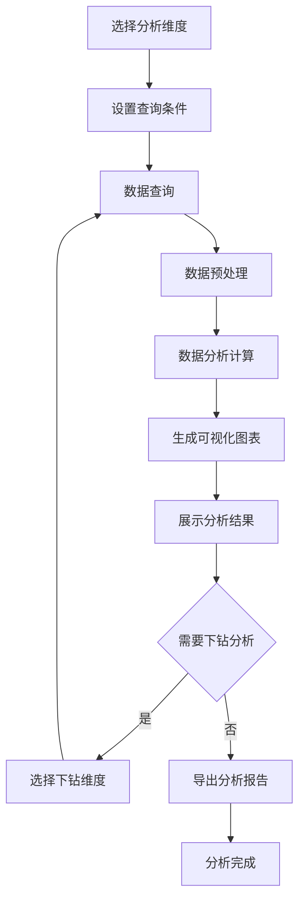
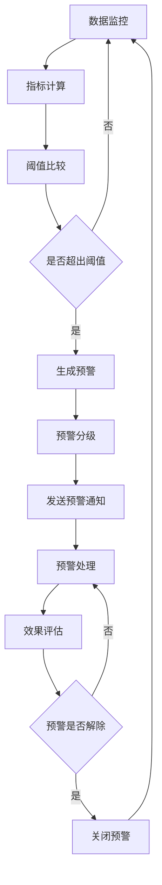
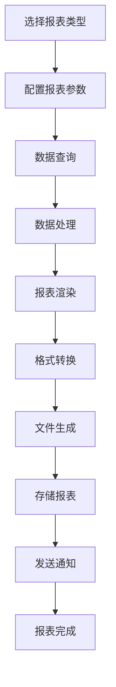

# 数据分析模块 - 子模块设计文档

## 1. 模块概述

### 1.1 功能定位
数据分析模块是化盐项目工艺流程管理的决策支持核心，负责收集、整合、分析各个业务模块的数据，为管理层提供全面的生产运营分析、趋势预测和决策支持。该模块通过先进的数据分析技术和可视化手段，将复杂的业务数据转化为直观的分析报表和决策建议。

### 1.2 业务价值
- **决策支持**：为管理层提供基于数据的科学决策依据
- **效率优化**：通过数据分析发现生产瓶颈和优化机会
- **成本控制**：分析成本构成和变化趋势，支持成本控制决策
- **质量提升**：通过质量数据分析持续改进产品质量
- **风险预警**：建立预警机制，提前识别和防范经营风险
- **绩效评估**：建立科学的绩效评估体系，支持绩效管理

### 1.3 模块边界
- **数据来源**：项目管理、预热管理、化盐工艺、提温工艺、库存管理、质量管理模块
- **数据输出**：分析报表、可视化图表、预警信息、决策建议
- **外部集成**：BI系统、财务系统、人力资源系统、客户管理系统

## 2. 功能需求清单

### 2.1 生产运营分析
- **生产效率分析**：分析生产效率指标和变化趋势
  - 产能利用率分析（设备利用率、时间利用率、产能达成率）
  - 生产周期分析（各工序耗时、总周期时间、周期优化建议）
  - 产量统计分析（日产量、月产量、年产量、产量趋势）
  - 设备效率分析（OEE分析、故障率分析、维护效率）
- **工艺参数分析**：分析工艺参数的稳定性和优化空间
  - 参数趋势分析（温度、压力、配比等关键参数趋势）
  - 参数相关性分析（参数间的关联关系分析）
  - 工艺优化建议（基于数据的工艺改进建议）
  - 异常参数预警（参数偏差预警和根因分析）
- **能耗成本分析**：分析能源消耗和成本构成
  - 能耗统计分析（电耗、气耗、水耗统计和趋势）
  - 单位能耗分析（单位产品能耗、能耗效率分析）
  - 成本构成分析（原料成本、能源成本、人工成本）
  - 成本趋势预测（基于历史数据的成本趋势预测）

### 2.2 质量数据分析
- **质量统计分析**：分析产品质量指标和趋势
  - 合格率统计（按时间、产品、工序的合格率统计）
  - 质量等级分布（优等品、一等品、合格品比例分析）
  - 质量趋势分析（质量指标的时间序列分析）
  - 质量对比分析（不同时期、不同产品的质量对比）
- **缺陷分析**：分析质量缺陷的类型、频次和原因
  - 缺陷类型统计（按缺陷类型统计频次和影响）
  - 缺陷根因分析（基于鱼骨图、5Why等方法的根因分析）
  - 缺陷成本分析（质量损失成本、返工成本分析）
  - 改进效果评估（质量改进措施的效果评估）
- **质量预测模型**：建立质量预测和预警模型
  - 质量风险预测（基于历史数据预测质量风险）
  - 质量控制建议（基于数据分析的质量控制建议）
  - 供应商质量评估（供应商质量表现评估和排名）

### 2.3 库存数据分析
- **库存结构分析**：分析库存构成和合理性
  - 库存分类分析（ABC分析、库存结构分析）
  - 库存周转分析（周转率、周转天数、库存效率）
  - 库存成本分析（持有成本、机会成本、总库存成本）
  - 安全库存优化（基于需求预测的安全库存优化）
- **需求预测分析**：预测原料需求和成品销售
  - 需求趋势分析（历史需求趋势和季节性分析）
  - 需求预测模型（基于时间序列、回归等方法的需求预测）
  - 补货策略优化（最优订货点、订货量优化）
  - 库存预警分析（库存不足、超储预警分析）

### 2.4 综合经营分析
- **经营绩效分析**：分析整体经营绩效指标
  - 生产绩效指标（产量达成率、质量达成率、成本控制率）
  - 财务绩效指标（收入、利润、成本费用分析）
  - 运营效率指标（设备利用率、人员效率、资源利用率）
  - 客户满意度分析（客户投诉、满意度调查分析）
- **对标分析**：与行业标杆和历史数据对比分析
  - 行业对标分析（与行业平均水平、领先企业对比）
  - 历史对比分析（与历史同期数据对比分析）
  - 目标达成分析（实际绩效与目标的对比分析）
  - 改进机会识别（基于对标分析的改进机会识别）

## 3. 页面设计规范

### 3.1 页面布局设计

#### 3.1.1 数据分析总览页面
```
┌─────────────────────────────────────────────────────────────┐
│ 面包屑导航: 首页 > ERP管理 > 化盐工艺流程 > 数据分析          │
├─────────────────────────────────────────────────────────────┤
│ 关键指标卡片                                                │
│ ┌─────────────┐ ┌─────────────┐ ┌─────────────┐             │
│ │   产量达成   │ │   质量合格率 │ │   成本控制率 │             │
│ │   95.8%     │ │   98.5%     │ │   102.3%    │             │
│ │   ↗ +2.3%   │ │   ↗ +0.5%   │ │   ↘ -1.2%   │             │
│ └─────────────┘ └─────────────┘ └─────────────┘             │
├─────────────────────────────────────────────────────────────┤
│ 实时监控面板                                                │
│ ┌─────────────────────────────────────────────────────────┐ │
│ │ 生产实时状态                                            │ │
│ │ 当前产量: 125t/h  目标产量: 130t/h  达成率: 96.2%       │ │
│ │ 设备状态: 正常运行  质量状态: 合格  库存状态: 充足       │ │
│ └─────────────────────────────────────────────────────────┘ │
├─────────────────────────────────────────────────────────────┤
│ 分析模块快捷入口                                            │
│ [生产分析] [质量分析] [库存分析] [成本分析] [绩效分析]       │
├─────────────────────────────────────────────────────────────┤
│ 趋势分析图表区域                                            │
│ ┌─────────────────┐ ┌─────────────────┐                     │
│ │   产量趋势图     │ │   质量趋势图     │                     │
│ │ (近30天产量变化) │ │ (近30天合格率)   │                     │
│ └─────────────────┘ └─────────────────┘                     │
│ ┌─────────────────┐ ┌─────────────────┐                     │
│ │   成本趋势图     │ │   库存趋势图     │                     │
│ │ (近30天成本变化) │ │ (近30天库存变化) │                     │
│ └─────────────────┘ └─────────────────┘                     │
└─────────────────────────────────────────────────────────────┘
```

#### 3.1.2 生产运营分析页面
```
┌─────────────────────────────────────────────────────────────┐
│ 分析维度选择                                                │
│ 时间范围: [日期选择器] 产品类型: [下拉选择] 分析粒度: [选择] │
├─────────────────────────────────────────────────────────────┤
│ 生产效率分析                                                │
│ ┌─────────────────────────────────────────────────────────┐ │
│ │ 产能利用率分析                                          │ │
│ │ ┌─────────────┐ ┌─────────────┐ ┌─────────────┐         │ │
│ │ │ 设备利用率   │ │ 时间利用率   │ │ 产能达成率   │         │ │
│ │ │   92.5%     │ │   88.3%     │ │   95.8%     │         │ │
│ │ └─────────────┘ └─────────────┘ └─────────────┘         │ │
│ │ [详细分析图表]                                          │ │
│ └─────────────────────────────────────────────────────────┘ │
├─────────────────────────────────────────────────────────────┤
│ 工艺参数分析                                                │
│ ┌─────────────────────────────────────────────────────────┐ │
│ │ 关键参数趋势                                            │ │
│ │ [温度趋势图] [压力趋势图] [配比趋势图] [流量趋势图]      │ │
│ │ 参数稳定性分析: CPK值、标准差、控制图                   │ │
│ └─────────────────────────────────────────────────────────┘ │
├─────────────────────────────────────────────────────────────┤
│ 能耗成本分析                                                │
│ ┌─────────────────────────────────────────────────────────┐ │
│ │ 能耗构成饼图    │ 单位能耗趋势图  │ 成本构成分析图        │ │
│ │ 电耗: 45%      │ 本月: 2.5kWh/t │ 原料: 60%            │ │
│ │ 气耗: 35%      │ 上月: 2.7kWh/t │ 能源: 25%            │ │
│ │ 水耗: 20%      │ 同比: -7.4%    │ 人工: 15%            │ │
│ └─────────────────────────────────────────────────────────┘ │
└─────────────────────────────────────────────────────────────┘
```

#### 3.1.3 质量数据分析页面
```
┌─────────────────────────────────────────────────────────────┐
│ 质量分析维度                                                │
│ 分析周期: [周/月/季/年] 产品类型: [全部/二元/三元] [分析]    │
├─────────────────────────────────────────────────────────────┤
│ 质量统计概览                                                │
│ ┌─────────────┐ ┌─────────────┐ ┌─────────────┐             │
│ │ 总体合格率   │ │ 优等品率     │ │ 客户投诉率   │             │
│ │   98.5%     │ │   75.2%     │ │   0.08%     │             │
│ │   ↗ +0.3%   │ │   ↗ +2.1%   │ │   ↘ -0.02%  │             │
│ └─────────────┘ └─────────────┘ └─────────────┘             │
├─────────────────────────────────────────────────────────────┤
│ 质量趋势分析                                                │
│ ┌─────────────────────────────────────────────────────────┐ │
│ │ 合格率趋势图 (近12个月)                                 │ │
│ │ [折线图显示月度合格率变化，包含目标线和控制限]           │ │
│ └─────────────────────────────────────────────────────────┘ │
├─────────────────────────────────────────────────────────────┤
│ 缺陷分析                                                    │
│ ┌─────────────────┐ ┌─────────────────┐                     │
│ │ 缺陷类型分布     │ │ 缺陷根因分析     │                     │
│ │ [帕累托图]      │ │ [鱼骨图/树状图]  │                     │
│ │ 纯度不足: 45%   │ │ 原料问题: 40%   │                     │
│ │ 水分超标: 30%   │ │ 工艺问题: 35%   │                     │
│ │ 外观缺陷: 25%   │ │ 设备问题: 25%   │                     │
│ └─────────────────┘ └─────────────────┘                     │
├─────────────────────────────────────────────────────────────┤
│ 质量改进跟踪                                                │
│ ┌─────────────────────────────────────────────────────────┐ │
│ │ 改进项目进度    │ 改进效果评估    │ 质量成本分析          │ │
│ │ 项目A: 80%     │ 合格率提升2.1% │ 质量成本率: 1.2%      │ │
│ │ 项目B: 60%     │ 缺陷率降低15%  │ 预防成本: 0.8%        │ │
│ │ 项目C: 90%     │ 客户满意度+5%  │ 检验成本: 0.4%        │ │
│ └─────────────────────────────────────────────────────────┘ │
└─────────────────────────────────────────────────────────────┘
```

### 3.2 组件设计规范

#### 3.2.1 数据分析仪表板组件
```vue
<template>
  <div class="data-analysis-dashboard">
    <div class="dashboard-header">
      <h3>{{ dashboardTitle }}</h3>
      <div class="dashboard-controls">
        <el-date-picker
          v-model="dateRange"
          type="daterange"
          range-separator="至"
          start-placeholder="开始日期"
          end-placeholder="结束日期"
          @change="handleDateChange"
        />
        <el-select
          v-model="selectedMetrics"
          multiple
          placeholder="选择指标"
          style="width: 200px; margin-left: 10px"
        >
          <el-option
            v-for="metric in availableMetrics"
            :key="metric.key"
            :label="metric.name"
            :value="metric.key"
          />
        </el-select>
        <el-button 
          type="primary" 
          @click="refreshData"
          :loading="loading"
          style="margin-left: 10px"
        >
          刷新数据
        </el-button>
      </div>
    </div>
    
    <div class="kpi-cards">
      <div 
        v-for="kpi in kpiData" 
        :key="kpi.key"
        class="kpi-card"
        :class="getKpiCardClass(kpi)"
      >
        <div class="kpi-header">
          <span class="kpi-title">{{ kpi.title }}</span>
          <el-icon class="kpi-icon">
            <component :is="kpi.icon" />
          </el-icon>
        </div>
        
        <div class="kpi-content">
          <div class="kpi-value">
            <span class="value">{{ formatValue(kpi.value, kpi.unit) }}</span>
            <span class="unit">{{ kpi.unit }}</span>
          </div>
          
          <div class="kpi-trend">
            <span class="trend" :class="getTrendClass(kpi.trend)">
              {{ getTrendIcon(kpi.trend) }}
              {{ formatTrend(kpi.trend) }}
            </span>
            <span class="period">{{ kpi.period }}</span>
          </div>
          
          <div class="kpi-target" v-if="kpi.target">
            <span class="label">目标:</span>
            <span class="target-value">{{ formatValue(kpi.target, kpi.unit) }}</span>
            <span class="achievement" :class="getAchievementClass(kpi.value, kpi.target)">
              {{ getAchievementRate(kpi.value, kpi.target) }}%
            </span>
          </div>
        </div>
        
        <div class="kpi-actions">
          <el-button 
            size="small" 
            @click="handleViewDetail(kpi.key)"
          >
            查看详情
          </el-button>
          <el-button 
            size="small" 
            type="primary"
            @click="handleDrillDown(kpi.key)"
          >
            下钻分析
          </el-button>
        </div>
      </div>
    </div>
    
    <div class="chart-container">
      <el-row :gutter="20">
        <el-col 
          v-for="chart in chartConfigs" 
          :key="chart.id"
          :span="chart.span || 12"
        >
          <div class="chart-card">
            <div class="chart-header">
              <h4>{{ chart.title }}</h4>
              <div class="chart-controls">
                <el-select
                  v-model="chart.selectedType"
                  size="small"
                  @change="handleChartTypeChange(chart.id, $event)"
                >
                  <el-option
                    v-for="type in chart.availableTypes"
                    :key="type.value"
                    :label="type.label"
                    :value="type.value"
                  />
                </el-select>
                <el-button 
                  size="small" 
                  @click="handleExportChart(chart.id)"
                >
                  导出
                </el-button>
              </div>
            </div>
            
            <div class="chart-content">
              <component 
                :is="getChartComponent(chart.type)"
                :chart-data="chart.data"
                :chart-options="chart.options"
                :height="chart.height || 300"
                @chart-click="handleChartClick"
              />
            </div>
            
            <div class="chart-summary" v-if="chart.summary">
              <div class="summary-item" v-for="item in chart.summary" :key="item.label">
                <span class="label">{{ item.label }}:</span>
                <span class="value" :class="item.class">{{ item.value }}</span>
              </div>
            </div>
          </div>
        </el-col>
      </el-row>
    </div>
    
    <div class="analysis-insights" v-if="insights.length > 0">
      <h4>数据洞察</h4>
      <div class="insights-list">
        <div 
          v-for="insight in insights" 
          :key="insight.id"
          class="insight-item"
          :class="getInsightClass(insight.type)"
        >
          <el-icon class="insight-icon">
            <component :is="getInsightIcon(insight.type)" />
          </el-icon>
          <div class="insight-content">
            <div class="insight-title">{{ insight.title }}</div>
            <div class="insight-description">{{ insight.description }}</div>
            <div class="insight-recommendation" v-if="insight.recommendation">
              <strong>建议:</strong> {{ insight.recommendation }}
            </div>
          </div>
          <div class="insight-actions">
            <el-button 
              size="small" 
              @click="handleInsightAction(insight)"
            >
              查看详情
            </el-button>
          </div>
        </div>
      </div>
    </div>
  </div>
</template>

<script setup lang="ts">
interface Props {
  dashboardTitle: string;
  kpiData: KpiItem[];
  chartConfigs: ChartConfig[];
  availableMetrics: MetricOption[];
  insights: DataInsight[];
}

interface KpiItem {
  key: string;
  title: string;
  value: number;
  unit: string;
  trend: number;
  period: string;
  target?: number;
  icon: string;
}

interface ChartConfig {
  id: string;
  title: string;
  type: string;
  data: any;
  options: any;
  span?: number;
  height?: number;
  selectedType: string;
  availableTypes: ChartTypeOption[];
  summary?: SummaryItem[];
}

interface DataInsight {
  id: string;
  type: 'OPPORTUNITY' | 'WARNING' | 'ACHIEVEMENT' | 'TREND';
  title: string;
  description: string;
  recommendation?: string;
}

interface Emits {
  viewDetail: [key: string];
  drillDown: [key: string];
  chartClick: [chartId: string, data: any];
  insightAction: [insight: DataInsight];
  dateChange: [dateRange: Date[]];
  refreshData: [];
}

const props = defineProps<Props>();
const emit = defineEmits<Emits>();

const dateRange = ref<Date[]>([]);
const selectedMetrics = ref<string[]>([]);
const loading = ref(false);

const getKpiCardClass = (kpi: KpiItem) => {
  if (kpi.target) {
    const achievement = (kpi.value / kpi.target) * 100;
    if (achievement >= 100) return 'kpi-excellent';
    if (achievement >= 90) return 'kpi-good';
    if (achievement >= 80) return 'kpi-warning';
    return 'kpi-danger';
  }
  return 'kpi-normal';
};

const getTrendClass = (trend: number) => {
  if (trend > 0) return 'trend-up';
  if (trend < 0) return 'trend-down';
  return 'trend-stable';
};

const getTrendIcon = (trend: number) => {
  if (trend > 0) return '↗';
  if (trend < 0) return '↘';
  return '→';
};

const formatValue = (value: number, unit: string) => {
  if (unit === '%') {
    return value.toFixed(1);
  }
  if (value >= 1000) {
    return (value / 1000).toFixed(1) + 'k';
  }
  return value.toFixed(2);
};

const formatTrend = (trend: number) => {
  const abs = Math.abs(trend);
  if (trend > 0) return `+${abs.toFixed(1)}%`;
  if (trend < 0) return `-${abs.toFixed(1)}%`;
  return '持平';
};

const getAchievementRate = (value: number, target: number) => {
  return ((value / target) * 100).toFixed(1);
};

const getAchievementClass = (value: number, target: number) => {
  const rate = (value / target) * 100;
  if (rate >= 100) return 'achievement-excellent';
  if (rate >= 90) return 'achievement-good';
  return 'achievement-poor';
};

const getChartComponent = (type: string) => {
  const componentMap = {
    line: 'LineChart',
    bar: 'BarChart',
    pie: 'PieChart',
    scatter: 'ScatterChart',
    heatmap: 'HeatmapChart'
  };
  return componentMap[type] || 'LineChart';
};

const getInsightClass = (type: string) => {
  return {
    'insight-opportunity': type === 'OPPORTUNITY',
    'insight-warning': type === 'WARNING',
    'insight-achievement': type === 'ACHIEVEMENT',
    'insight-trend': type === 'TREND'
  };
};

const getInsightIcon = (type: string) => {
  const iconMap = {
    OPPORTUNITY: 'Opportunity',
    WARNING: 'Warning',
    ACHIEVEMENT: 'Trophy',
    TREND: 'TrendCharts'
  };
  return iconMap[type] || 'InfoFilled';
};

const handleViewDetail = (key: string) => {
  emit('viewDetail', key);
};

const handleDrillDown = (key: string) => {
  emit('drillDown', key);
};

const handleChartClick = (chartId: string, data: any) => {
  emit('chartClick', chartId, data);
};

const handleInsightAction = (insight: DataInsight) => {
  emit('insightAction', insight);
};

const handleDateChange = (dateRange: Date[]) => {
  emit('dateChange', dateRange);
};

const refreshData = () => {
  loading.value = true;
  emit('refreshData');
  setTimeout(() => {
    loading.value = false;
  }, 1000);
};

const handleChartTypeChange = (chartId: string, type: string) => {
  // 处理图表类型变更
  console.log('Chart type changed:', chartId, type);
};

const handleExportChart = (chartId: string) => {
  // 处理图表导出
  console.log('Export chart:', chartId);
};
</script>
```

#### 3.2.2 数据可视化图表组件
```vue
<template>
  <div class="data-visualization-chart">
    <div class="chart-container" ref="chartContainer">
      <!-- 图表将在这里渲染 -->
    </div>

    <div class="chart-toolbar" v-if="showToolbar">
      <el-button-group>
        <el-button
          v-for="tool in chartTools"
          :key="tool.key"
          :type="tool.active ? 'primary' : 'default'"
          size="small"
          @click="handleToolClick(tool.key)"
        >
          <el-icon><component :is="tool.icon" /></el-icon>
          {{ tool.label }}
        </el-button>
      </el-button-group>
    </div>

    <div class="chart-legend" v-if="showLegend && legendData.length > 0">
      <div
        v-for="item in legendData"
        :key="item.name"
        class="legend-item"
        @click="handleLegendClick(item)"
      >
        <span
          class="legend-color"
          :style="{ backgroundColor: item.color }"
        ></span>
        <span class="legend-name">{{ item.name }}</span>
        <span class="legend-value">{{ item.value }}</span>
      </div>
    </div>
  </div>
</template>

<script setup lang="ts">
import * as echarts from 'echarts';

interface Props {
  chartType: 'line' | 'bar' | 'pie' | 'scatter' | 'heatmap' | 'gauge';
  chartData: any;
  chartOptions?: any;
  width?: string | number;
  height?: string | number;
  showToolbar?: boolean;
  showLegend?: boolean;
  theme?: string;
}

interface ChartTool {
  key: string;
  label: string;
  icon: string;
  active: boolean;
}

interface LegendItem {
  name: string;
  color: string;
  value: string;
}

interface Emits {
  chartClick: [data: any];
  toolClick: [tool: string];
  legendClick: [item: LegendItem];
}

const props = withDefaults(defineProps<Props>(), {
  width: '100%',
  height: 400,
  showToolbar: true,
  showLegend: true,
  theme: 'default'
});

const emit = defineEmits<Emits>();

const chartContainer = ref<HTMLElement>();
const chartInstance = ref<echarts.ECharts>();

const chartTools = ref<ChartTool[]>([
  { key: 'zoom', label: '缩放', icon: 'ZoomIn', active: false },
  { key: 'pan', label: '平移', icon: 'Rank', active: false },
  { key: 'select', label: '选择', icon: 'Select', active: false },
  { key: 'reset', label: '重置', icon: 'RefreshRight', active: false }
]);

const legendData = ref<LegendItem[]>([]);

onMounted(() => {
  initChart();
});

onUnmounted(() => {
  if (chartInstance.value) {
    chartInstance.value.dispose();
  }
});

watch(() => props.chartData, () => {
  updateChart();
}, { deep: true });

watch(() => props.chartOptions, () => {
  updateChart();
}, { deep: true });

const initChart = () => {
  if (!chartContainer.value) return;

  chartInstance.value = echarts.init(chartContainer.value, props.theme);

  // 监听图表点击事件
  chartInstance.value.on('click', (params) => {
    emit('chartClick', params);
  });

  // 监听图表选择事件
  chartInstance.value.on('selectchanged', (params) => {
    console.log('Chart selection changed:', params);
  });

  updateChart();

  // 监听窗口大小变化
  window.addEventListener('resize', handleResize);
};

const updateChart = () => {
  if (!chartInstance.value) return;

  const option = generateChartOption();
  chartInstance.value.setOption(option, true);

  // 更新图例数据
  updateLegendData(option);
};

const generateChartOption = () => {
  const baseOption = {
    title: {
      text: props.chartData.title || '',
      left: 'center',
      textStyle: {
        fontSize: 16,
        fontWeight: 'bold'
      }
    },
    tooltip: {
      trigger: 'axis',
      axisPointer: {
        type: 'cross'
      },
      formatter: (params: any) => {
        return generateTooltipContent(params);
      }
    },
    legend: {
      show: props.showLegend,
      top: 'bottom',
      data: props.chartData.legend || []
    },
    grid: {
      left: '3%',
      right: '4%',
      bottom: '10%',
      containLabel: true
    },
    toolbox: {
      show: props.showToolbar,
      feature: {
        dataZoom: {
          yAxisIndex: 'none'
        },
        dataView: { readOnly: false },
        magicType: { type: ['line', 'bar'] },
        restore: {},
        saveAsImage: {}
      }
    }
  };

  // 根据图表类型生成特定配置
  const typeSpecificOption = generateTypeSpecificOption();

  // 合并用户自定义选项
  const customOption = props.chartOptions || {};

  return {
    ...baseOption,
    ...typeSpecificOption,
    ...customOption
  };
};

const generateTypeSpecificOption = () => {
  switch (props.chartType) {
    case 'line':
      return generateLineChartOption();
    case 'bar':
      return generateBarChartOption();
    case 'pie':
      return generatePieChartOption();
    case 'scatter':
      return generateScatterChartOption();
    case 'heatmap':
      return generateHeatmapChartOption();
    case 'gauge':
      return generateGaugeChartOption();
    default:
      return {};
  }
};

const generateLineChartOption = () => {
  return {
    xAxis: {
      type: 'category',
      data: props.chartData.xAxis || [],
      boundaryGap: false
    },
    yAxis: {
      type: 'value',
      name: props.chartData.yAxisName || ''
    },
    series: (props.chartData.series || []).map((item: any) => ({
      ...item,
      type: 'line',
      smooth: true,
      symbol: 'circle',
      symbolSize: 6,
      lineStyle: {
        width: 2
      },
      areaStyle: item.areaStyle || null
    }))
  };
};

const generateBarChartOption = () => {
  return {
    xAxis: {
      type: 'category',
      data: props.chartData.xAxis || []
    },
    yAxis: {
      type: 'value',
      name: props.chartData.yAxisName || ''
    },
    series: (props.chartData.series || []).map((item: any) => ({
      ...item,
      type: 'bar',
      barWidth: '60%',
      itemStyle: {
        borderRadius: [4, 4, 0, 0]
      }
    }))
  };
};

const generatePieChartOption = () => {
  return {
    series: [{
      type: 'pie',
      radius: ['40%', '70%'],
      center: ['50%', '50%'],
      data: props.chartData.data || [],
      emphasis: {
        itemStyle: {
          shadowBlur: 10,
          shadowOffsetX: 0,
          shadowColor: 'rgba(0, 0, 0, 0.5)'
        }
      },
      label: {
        show: true,
        formatter: '{b}: {c} ({d}%)'
      }
    }]
  };
};

const generateScatterChartOption = () => {
  return {
    xAxis: {
      type: 'value',
      name: props.chartData.xAxisName || ''
    },
    yAxis: {
      type: 'value',
      name: props.chartData.yAxisName || ''
    },
    series: (props.chartData.series || []).map((item: any) => ({
      ...item,
      type: 'scatter',
      symbolSize: 8
    }))
  };
};

const generateHeatmapChartOption = () => {
  return {
    xAxis: {
      type: 'category',
      data: props.chartData.xAxis || []
    },
    yAxis: {
      type: 'category',
      data: props.chartData.yAxis || []
    },
    visualMap: {
      min: props.chartData.min || 0,
      max: props.chartData.max || 100,
      calculable: true,
      orient: 'horizontal',
      left: 'center',
      bottom: '15%'
    },
    series: [{
      type: 'heatmap',
      data: props.chartData.data || [],
      label: {
        show: true
      },
      emphasis: {
        itemStyle: {
          shadowBlur: 10,
          shadowColor: 'rgba(0, 0, 0, 0.5)'
        }
      }
    }]
  };
};

const generateGaugeChartOption = () => {
  return {
    series: [{
      type: 'gauge',
      center: ['50%', '60%'],
      startAngle: 200,
      endAngle: -40,
      min: props.chartData.min || 0,
      max: props.chartData.max || 100,
      splitNumber: 12,
      itemStyle: {
        color: '#58D9F9',
        shadowColor: 'rgba(0,138,255,0.45)',
        shadowBlur: 10,
        shadowOffsetX: 2,
        shadowOffsetY: 2
      },
      progress: {
        show: true,
        roundCap: true,
        width: 18
      },
      pointer: {
        icon: 'path://M2090.36389,615.30999 L2090.36389,615.30999 C2091.48372,615.30999 2092.40383,616.194028 2092.44859,617.312956 L2096.90698,728.755929 C2097.05155,732.369577 2094.2393,735.416212 2090.62566,735.56078 C2090.53845,735.564269 2090.45117,735.566014 2090.36389,735.566014 L2090.36389,735.566014 C2086.74736,735.566014 2083.81557,732.63423 2083.81557,729.017692 C2083.81557,728.930412 2083.81732,728.84314 2083.82081,728.755929 L2088.2792,617.312956 C2088.32396,616.194028 2089.24407,615.30999 2090.36389,615.30999 Z',
        length: '75%',
        width: 16,
        offsetCenter: [0, '5%']
      },
      axisLine: {
        roundCap: true,
        lineStyle: {
          width: 18
        }
      },
      axisTick: {
        splitNumber: 2,
        lineStyle: {
          width: 2,
          color: '#999'
        }
      },
      splitLine: {
        length: 12,
        lineStyle: {
          width: 3,
          color: '#999'
        }
      },
      axisLabel: {
        distance: 30,
        color: '#999',
        fontSize: 20
      },
      title: {
        show: false
      },
      detail: {
        backgroundColor: '#fff',
        borderColor: '#999',
        borderWidth: 2,
        width: '60%',
        lineHeight: 40,
        height: 40,
        borderRadius: 8,
        offsetCenter: [0, '35%'],
        valueAnimation: true,
        formatter: function (value: number) {
          return '{value|' + value.toFixed(0) + '}{unit|%}';
        },
        rich: {
          value: {
            fontSize: 50,
            fontWeight: 'bolder',
            color: '#777'
          },
          unit: {
            fontSize: 20,
            color: '#999',
            padding: [0, 0, -20, 10]
          }
        }
      },
      data: [{
        value: props.chartData.value || 0,
        name: props.chartData.name || ''
      }]
    }]
  };
};

const generateTooltipContent = (params: any) => {
  if (Array.isArray(params)) {
    let content = `<div class="chart-tooltip">`;
    content += `<div class="tooltip-title">${params[0].axisValueLabel}</div>`;
    params.forEach((param: any) => {
      content += `
        <div class="tooltip-item">
          <span class="tooltip-marker" style="background-color: ${param.color}"></span>
          <span class="tooltip-name">${param.seriesName}:</span>
          <span class="tooltip-value">${param.value}</span>
        </div>
      `;
    });
    content += `</div>`;
    return content;
  } else {
    return `
      <div class="chart-tooltip">
        <div class="tooltip-title">${params.name}</div>
        <div class="tooltip-item">
          <span class="tooltip-marker" style="background-color: ${params.color}"></span>
          <span class="tooltip-value">${params.value}</span>
        </div>
      </div>
    `;
  }
};

const updateLegendData = (option: any) => {
  if (option.series && Array.isArray(option.series)) {
    legendData.value = option.series.map((series: any, index: number) => ({
      name: series.name || `系列${index + 1}`,
      color: series.itemStyle?.color || `#${Math.floor(Math.random()*16777215).toString(16)}`,
      value: Array.isArray(series.data) ? series.data.length.toString() : '0'
    }));
  }
};

const handleToolClick = (tool: string) => {
  // 重置所有工具状态
  chartTools.value.forEach(t => t.active = false);

  // 激活当前工具
  const currentTool = chartTools.value.find(t => t.key === tool);
  if (currentTool) {
    currentTool.active = true;
  }

  // 处理工具功能
  switch (tool) {
    case 'zoom':
      enableZoom();
      break;
    case 'pan':
      enablePan();
      break;
    case 'select':
      enableSelect();
      break;
    case 'reset':
      resetChart();
      break;
  }

  emit('toolClick', tool);
};

const handleLegendClick = (item: LegendItem) => {
  emit('legendClick', item);
};

const enableZoom = () => {
  if (chartInstance.value) {
    chartInstance.value.dispatchAction({
      type: 'takeGlobalCursor',
      key: 'dataZoomSelect',
      dataZoomSelectActive: true
    });
  }
};

const enablePan = () => {
  if (chartInstance.value) {
    chartInstance.value.dispatchAction({
      type: 'takeGlobalCursor',
      key: 'pan',
      panActive: true
    });
  }
};

const enableSelect = () => {
  if (chartInstance.value) {
    chartInstance.value.dispatchAction({
      type: 'takeGlobalCursor',
      key: 'brush',
      brushActive: true
    });
  }
};

const resetChart = () => {
  if (chartInstance.value) {
    chartInstance.value.dispatchAction({
      type: 'restore'
    });
    // 重置所有工具状态
    chartTools.value.forEach(t => t.active = false);
  }
};

const handleResize = () => {
  if (chartInstance.value) {
    chartInstance.value.resize();
  }
};
</script>
```

### 3.3 交互流程设计

#### 3.3.1 数据分析查询流程


#### 3.3.2 预警分析流程


## 4. API接口设计

### 4.1 接口列表

#### 4.1.1 数据查询接口
```typescript
// 获取数据分析概览
GET /erp/saltprocess/analysis/overview
// 权限: erp:saltprocess:analysis:overview

// 生产运营分析
GET /erp/saltprocess/analysis/production
// 权限: erp:saltprocess:analysis:production

// 质量数据分析
GET /erp/saltprocess/analysis/quality
// 权限: erp:saltprocess:analysis:quality

// 库存数据分析
GET /erp/saltprocess/analysis/inventory
// 权限: erp:saltprocess:analysis:inventory

// 成本效益分析
GET /erp/saltprocess/analysis/cost
// 权限: erp:saltprocess:analysis:cost

// 综合绩效分析
GET /erp/saltprocess/analysis/performance
// 权限: erp:saltprocess:analysis:performance
```

#### 4.1.2 报表生成接口
```typescript
// 生成分析报表
POST /erp/saltprocess/analysis/report/generate
// 权限: erp:saltprocess:analysis:report:generate

// 获取报表列表
GET /erp/saltprocess/analysis/report/list
// 权限: erp:saltprocess:analysis:report:list

// 下载报表文件
GET /erp/saltprocess/analysis/report/download/{reportId}
// 权限: erp:saltprocess:analysis:report:download

// 删除报表
DELETE /erp/saltprocess/analysis/report/{reportId}
// 权限: erp:saltprocess:analysis:report:delete
```

#### 4.1.3 预警管理接口
```typescript
// 获取预警配置
GET /erp/saltprocess/analysis/alert/config
// 权限: erp:saltprocess:analysis:alert:config

// 更新预警配置
PUT /erp/saltprocess/analysis/alert/config
// 权限: erp:saltprocess:analysis:alert:config:update

// 获取预警列表
GET /erp/saltprocess/analysis/alert/list
// 权限: erp:saltprocess:analysis:alert:list

// 处理预警
POST /erp/saltprocess/analysis/alert/{alertId}/handle
// 权限: erp:saltprocess:analysis:alert:handle
```

### 4.2 请求响应格式

#### 4.2.1 数据分析概览响应
```typescript
interface AnalysisOverviewVO {
  // 关键指标
  kpiMetrics: KpiMetricVO[];

  // 实时状态
  realTimeStatus: {
    productionStatus: ProductionStatusVO;
    qualityStatus: QualityStatusVO;
    inventoryStatus: InventoryStatusVO;
    equipmentStatus: EquipmentStatusVO;
  };

  // 趋势数据
  trendData: {
    productionTrend: TrendDataVO;
    qualityTrend: TrendDataVO;
    costTrend: TrendDataVO;
    inventoryTrend: TrendDataVO;
  };

  // 预警信息
  alerts: AlertVO[];

  // 数据洞察
  insights: InsightVO[];
}

interface KpiMetricVO {
  key: string;
  name: string;
  value: number;
  unit: string;
  target?: number;
  trend: number;
  trendPeriod: string;
  status: 'EXCELLENT' | 'GOOD' | 'WARNING' | 'DANGER';
  description: string;
}

interface TrendDataVO {
  timeRange: string[];
  series: TrendSeriesVO[];
}

interface TrendSeriesVO {
  name: string;
  data: number[];
  unit: string;
  color?: string;
}
```

#### 4.2.2 生产运营分析响应
```typescript
interface ProductionAnalysisVO {
  // 生产效率分析
  efficiency: {
    capacityUtilization: EfficiencyMetricVO;
    timeUtilization: EfficiencyMetricVO;
    outputAchievement: EfficiencyMetricVO;
    oeeAnalysis: OeeAnalysisVO;
  };

  // 工艺参数分析
  processParameters: {
    parameterTrends: ParameterTrendVO[];
    parameterStability: ParameterStabilityVO[];
    correlationAnalysis: CorrelationAnalysisVO[];
    optimizationSuggestions: OptimizationSuggestionVO[];
  };

  // 能耗成本分析
  energyCost: {
    energyConsumption: EnergyConsumptionVO;
    unitEnergyCost: UnitEnergyCostVO;
    costStructure: CostStructureVO;
    costTrend: CostTrendVO;
  };

  // 设备分析
  equipment: {
    utilizationRate: number;
    failureRate: number;
    maintenanceEfficiency: number;
    performanceIndex: number;
  };
}

interface EfficiencyMetricVO {
  current: number;
  target: number;
  achievement: number;
  trend: number;
  benchmark: number;
  ranking: string;
}

interface OeeAnalysisVO {
  availability: number;
  performance: number;
  quality: number;
  oee: number;
  lossAnalysis: LossAnalysisVO[];
}

interface ParameterTrendVO {
  parameterName: string;
  unit: string;
  timeRange: string[];
  values: number[];
  controlLimits: {
    upper: number;
    lower: number;
    target: number;
  };
  stability: {
    cpk: number;
    standardDeviation: number;
    variationCoefficient: number;
  };
}
```

#### 4.2.3 质量数据分析响应
```typescript
interface QualityAnalysisVO {
  // 质量统计
  qualityStatistics: {
    overallPassRate: number;
    excellentRate: number;
    firstClassRate: number;
    qualifiedRate: number;
    defectRate: number;
    customerComplaintRate: number;
  };

  // 质量趋势
  qualityTrends: {
    passRateTrend: TrendDataVO;
    gradeDistributionTrend: TrendDataVO;
    defectTrend: TrendDataVO;
  };

  // 缺陷分析
  defectAnalysis: {
    defectTypes: DefectTypeVO[];
    paretoAnalysis: ParetoAnalysisVO;
    rootCauseAnalysis: RootCauseAnalysisVO;
    improvementTracking: ImprovementTrackingVO[];
  };

  // 质量成本
  qualityCost: {
    totalQualityCost: number;
    preventionCost: number;
    appraisalCost: number;
    internalFailureCost: number;
    externalFailureCost: number;
    qualityCostRate: number;
  };

  // 供应商质量
  supplierQuality: {
    supplierRanking: SupplierQualityVO[];
    qualityTrend: TrendDataVO;
    issueTracking: SupplierIssueVO[];
  };
}

interface DefectTypeVO {
  type: string;
  count: number;
  percentage: number;
  cost: number;
  trend: number;
}

interface ParetoAnalysisVO {
  categories: string[];
  counts: number[];
  cumulativePercentages: number[];
  significantCategories: string[];
}
```

#### 4.2.4 库存数据分析响应
```typescript
interface InventoryAnalysisVO {
  // 库存结构分析
  inventoryStructure: {
    abcAnalysis: AbcAnalysisVO;
    categoryDistribution: CategoryDistributionVO[];
    valueDistribution: ValueDistributionVO;
  };

  // 库存周转分析
  turnoverAnalysis: {
    overallTurnover: TurnoverMetricVO;
    categoryTurnover: CategoryTurnoverVO[];
    slowMovingItems: SlowMovingItemVO[];
    fastMovingItems: FastMovingItemVO[];
  };

  // 库存成本分析
  costAnalysis: {
    holdingCost: number;
    orderingCost: number;
    stockoutCost: number;
    totalInventoryCost: number;
    costOptimization: CostOptimizationVO;
  };

  // 需求预测
  demandForecast: {
    forecastModel: string;
    accuracy: number;
    forecastData: ForecastDataVO[];
    seasonalityAnalysis: SeasonalityAnalysisVO;
  };

  // 库存优化建议
  optimizationSuggestions: {
    safetyStockOptimization: SafetyStockOptimizationVO[];
    reorderPointOptimization: ReorderPointOptimizationVO[];
    inventoryReduction: InventoryReductionVO[];
  };
}

interface AbcAnalysisVO {
  aItems: AbcItemVO[];
  bItems: AbcItemVO[];
  cItems: AbcItemVO[];
  summary: {
    aItemsPercentage: number;
    bItemsPercentage: number;
    cItemsPercentage: number;
    aValuePercentage: number;
    bValuePercentage: number;
    cValuePercentage: number;
  };
}

interface TurnoverMetricVO {
  turnoverRate: number;
  turnoverDays: number;
  trend: number;
  benchmark: number;
  target: number;
}
```

### 4.3 权限控制设计
```typescript
// 数据分析权限配置
const analysisPermissions = {
  'erp:saltprocess:analysis:overview': '查看数据分析概览',
  'erp:saltprocess:analysis:production': '生产运营分析',
  'erp:saltprocess:analysis:quality': '质量数据分析',
  'erp:saltprocess:analysis:inventory': '库存数据分析',
  'erp:saltprocess:analysis:cost': '成本效益分析',
  'erp:saltprocess:analysis:performance': '综合绩效分析',
  'erp:saltprocess:analysis:report:generate': '生成分析报表',
  'erp:saltprocess:analysis:report:list': '查看报表列表',
  'erp:saltprocess:analysis:report:download': '下载报表文件',
  'erp:saltprocess:analysis:report:delete': '删除报表',
  'erp:saltprocess:analysis:alert:config': '查看预警配置',
  'erp:saltprocess:analysis:alert:config:update': '更新预警配置',
  'erp:saltprocess:analysis:alert:list': '查看预警列表',
  'erp:saltprocess:analysis:alert:handle': '处理预警'
};
```

## 5. 数据模型设计

### 5.1 核心实体设计

#### 5.1.1 分析报表实体 (AnalysisReport)
```typescript
interface AnalysisReport {
  id: string;                          // 报表ID
  reportNo: string;                    // 报表编号
  reportName: string;                  // 报表名称
  reportType: ReportType;              // 报表类型
  analysisType: AnalysisType;          // 分析类型
  timeRange: {                         // 时间范围
    startDate: Date;
    endDate: Date;
  };
  parameters: Record<string, any>;     // 分析参数
  status: ReportStatus;                // 报表状态
  fileUrl?: string;                    // 文件地址
  fileSize?: number;                   // 文件大小
  generateTime?: Date;                 // 生成时间
  creatorId: string;                   // 创建人ID
  createTime: Date;                    // 创建时间
  updateTime: Date;                    // 更新时间
}
```

#### 5.1.2 预警配置实体 (AlertConfig)
```typescript
interface AlertConfig {
  id: string;                          // 配置ID
  alertName: string;                   // 预警名称
  alertType: AlertType;                // 预警类型
  metricKey: string;                   // 指标键值
  metricName: string;                  // 指标名称
  thresholds: {                        // 阈值配置
    warningThreshold: number;          // 警告阈值
    criticalThreshold: number;         // 严重阈值
    operator: 'GT' | 'LT' | 'EQ' | 'GTE' | 'LTE'; // 比较操作符
  };
  enabled: boolean;                    // 是否启用
  checkInterval: number;               // 检查间隔(分钟)
  notificationConfig: {                // 通知配置
    emailEnabled: boolean;
    smsEnabled: boolean;
    systemEnabled: boolean;
    recipients: string[];
  };
  createTime: Date;                    // 创建时间
  updateTime: Date;                    // 更新时间
}
```

#### 5.1.3 预警记录实体 (AlertRecord)
```typescript
interface AlertRecord {
  id: string;                          // 预警记录ID
  alertConfigId: string;               // 预警配置ID
  alertLevel: AlertLevel;              // 预警级别
  metricKey: string;                   // 指标键值
  metricValue: number;                 // 指标值
  thresholdValue: number;              // 阈值
  alertMessage: string;                // 预警消息
  alertTime: Date;                     // 预警时间
  status: AlertRecordStatus;           // 处理状态
  handlerId?: string;                  // 处理人ID
  handleTime?: Date;                   // 处理时间
  handleResult?: string;               // 处理结果
  createTime: Date;                    // 创建时间
}
```

#### 5.1.4 数据洞察实体 (DataInsight)
```typescript
interface DataInsight {
  id: string;                          // 洞察ID
  insightType: InsightType;            // 洞察类型
  title: string;                       // 洞察标题
  description: string;                 // 洞察描述
  recommendation?: string;             // 建议措施
  confidence: number;                  // 置信度(0-1)
  impact: InsightImpact;               // 影响程度
  relatedMetrics: string[];            // 相关指标
  evidenceData: Record<string, any>;   // 证据数据
  status: InsightStatus;               // 洞察状态
  generateTime: Date;                  // 生成时间
  validUntil?: Date;                   // 有效期至
}
```

### 5.2 枚举定义
```typescript
enum ReportType {
  SCHEDULED = 'SCHEDULED',             // 定时报表
  ON_DEMAND = 'ON_DEMAND',             // 按需报表
  REAL_TIME = 'REAL_TIME'              // 实时报表
}

enum AnalysisType {
  PRODUCTION = 'PRODUCTION',           // 生产分析
  QUALITY = 'QUALITY',                 // 质量分析
  INVENTORY = 'INVENTORY',             // 库存分析
  COST = 'COST',                       // 成本分析
  PERFORMANCE = 'PERFORMANCE',         // 绩效分析
  COMPREHENSIVE = 'COMPREHENSIVE'      // 综合分析
}

enum ReportStatus {
  PENDING = 'PENDING',                 // 待生成
  GENERATING = 'GENERATING',           // 生成中
  COMPLETED = 'COMPLETED',             // 已完成
  FAILED = 'FAILED',                   // 生成失败
  EXPIRED = 'EXPIRED'                  // 已过期
}

enum AlertType {
  THRESHOLD = 'THRESHOLD',             // 阈值预警
  TREND = 'TREND',                     // 趋势预警
  ANOMALY = 'ANOMALY',                 // 异常预警
  PATTERN = 'PATTERN'                  // 模式预警
}

enum AlertLevel {
  INFO = 'INFO',                       // 信息
  WARNING = 'WARNING',                 // 警告
  CRITICAL = 'CRITICAL'                // 严重
}

enum AlertRecordStatus {
  ACTIVE = 'ACTIVE',                   // 活动
  ACKNOWLEDGED = 'ACKNOWLEDGED',       // 已确认
  RESOLVED = 'RESOLVED',               // 已解决
  IGNORED = 'IGNORED'                  // 已忽略
}

enum InsightType {
  OPPORTUNITY = 'OPPORTUNITY',         // 机会洞察
  RISK = 'RISK',                       // 风险洞察
  TREND = 'TREND',                     // 趋势洞察
  ANOMALY = 'ANOMALY',                 // 异常洞察
  CORRELATION = 'CORRELATION'          // 关联洞察
}

enum InsightImpact {
  HIGH = 'HIGH',                       // 高影响
  MEDIUM = 'MEDIUM',                   // 中影响
  LOW = 'LOW'                          // 低影响
}

enum InsightStatus {
  NEW = 'NEW',                         // 新洞察
  REVIEWED = 'REVIEWED',               // 已审阅
  ACTED = 'ACTED',                     // 已采取行动
  DISMISSED = 'DISMISSED'              // 已忽略
}
```

### 5.3 业务规则设计

#### 5.3.1 数据分析计算规则
```typescript
const analysisCalculationRules = {
  // 生产效率计算规则
  productionEfficiency: {
    // 设备利用率 = 实际运行时间 / 计划运行时间 × 100%
    equipmentUtilization: (actualRunTime: number, plannedRunTime: number): number => {
      return (actualRunTime / plannedRunTime) * 100;
    },

    // 产能达成率 = 实际产量 / 计划产量 × 100%
    capacityAchievement: (actualOutput: number, plannedOutput: number): number => {
      return (actualOutput / plannedOutput) * 100;
    },

    // OEE = 可用率 × 性能率 × 质量率
    oeeCalculation: (availability: number, performance: number, quality: number): number => {
      return (availability * performance * quality) / 10000; // 转换为百分比
    }
  },

  // 质量指标计算规则
  qualityMetrics: {
    // 合格率 = 合格品数量 / 总检验数量 × 100%
    passRate: (passedCount: number, totalCount: number): number => {
      return totalCount > 0 ? (passedCount / totalCount) * 100 : 0;
    },

    // 优等品率 = 优等品数量 / 合格品总数 × 100%
    excellentRate: (excellentCount: number, totalPassedCount: number): number => {
      return totalPassedCount > 0 ? (excellentCount / totalPassedCount) * 100 : 0;
    },

    // 缺陷率 = 缺陷品数量 / 总检验数量 × 100%
    defectRate: (defectCount: number, totalCount: number): number => {
      return totalCount > 0 ? (defectCount / totalCount) * 100 : 0;
    }
  },

  // 库存指标计算规则
  inventoryMetrics: {
    // 库存周转率 = 年度出库成本 / 平均库存价值
    turnoverRate: (annualCost: number, averageInventoryValue: number): number => {
      return averageInventoryValue > 0 ? annualCost / averageInventoryValue : 0;
    },

    // 库存周转天数 = 365 / 库存周转率
    turnoverDays: (turnoverRate: number): number => {
      return turnoverRate > 0 ? 365 / turnoverRate : 365;
    },

    // 库存持有成本率 = 库存持有成本 / 平均库存价值 × 100%
    holdingCostRate: (holdingCost: number, averageInventoryValue: number): number => {
      return averageInventoryValue > 0 ? (holdingCost / averageInventoryValue) * 100 : 0;
    }
  },

  // 成本分析计算规则
  costAnalysis: {
    // 单位产品成本 = 总成本 / 产量
    unitCost: (totalCost: number, output: number): number => {
      return output > 0 ? totalCost / output : 0;
    },

    // 成本变动率 = (当期成本 - 基期成本) / 基期成本 × 100%
    costVariationRate: (currentCost: number, baseCost: number): number => {
      return baseCost > 0 ? ((currentCost - baseCost) / baseCost) * 100 : 0;
    },

    // 成本控制率 = 实际成本 / 预算成本 × 100%
    costControlRate: (actualCost: number, budgetCost: number): number => {
      return budgetCost > 0 ? (actualCost / budgetCost) * 100 : 0;
    }
  }
};
```

#### 5.3.2 预警触发规则
```typescript
const alertTriggerRules = {
  // 预警级别判定规则
  determineAlertLevel: (value: number, config: AlertConfig): AlertLevel => {
    const { warningThreshold, criticalThreshold, operator } = config.thresholds;

    switch (operator) {
      case 'GT':
        if (value > criticalThreshold) return AlertLevel.CRITICAL;
        if (value > warningThreshold) return AlertLevel.WARNING;
        break;
      case 'LT':
        if (value < criticalThreshold) return AlertLevel.CRITICAL;
        if (value < warningThreshold) return AlertLevel.WARNING;
        break;
      case 'GTE':
        if (value >= criticalThreshold) return AlertLevel.CRITICAL;
        if (value >= warningThreshold) return AlertLevel.WARNING;
        break;
      case 'LTE':
        if (value <= criticalThreshold) return AlertLevel.CRITICAL;
        if (value <= warningThreshold) return AlertLevel.WARNING;
        break;
    }

    return AlertLevel.INFO;
  },

  // 趋势预警规则
  trendAlertRules: {
    // 连续下降预警
    continuousDecline: (values: number[], threshold: number): boolean => {
      if (values.length < 3) return false;

      let declineCount = 0;
      for (let i = 1; i < values.length; i++) {
        if (values[i] < values[i - 1]) {
          declineCount++;
        } else {
          declineCount = 0;
        }

        if (declineCount >= threshold) {
          return true;
        }
      }

      return false;
    },

    // 波动异常预警
    volatilityAlert: (values: number[], volatilityThreshold: number): boolean => {
      if (values.length < 5) return false;

      const mean = values.reduce((sum, val) => sum + val, 0) / values.length;
      const variance = values.reduce((sum, val) => sum + Math.pow(val - mean, 2), 0) / values.length;
      const standardDeviation = Math.sqrt(variance);
      const coefficientOfVariation = (standardDeviation / mean) * 100;

      return coefficientOfVariation > volatilityThreshold;
    }
  },

  // 异常检测规则
  anomalyDetectionRules: {
    // 3σ原则异常检测
    threeSigmaRule: (value: number, mean: number, standardDeviation: number): boolean => {
      const zScore = Math.abs((value - mean) / standardDeviation);
      return zScore > 3;
    },

    // 四分位数异常检测
    iqrOutlierDetection: (value: number, q1: number, q3: number): boolean => {
      const iqr = q3 - q1;
      const lowerBound = q1 - 1.5 * iqr;
      const upperBound = q3 + 1.5 * iqr;
      return value < lowerBound || value > upperBound;
    }
  }
};
```

## 6. 前端技术实现

### 6.1 Vue组件结构

#### 6.1.1 页面组件结构
```
src/views/erp/saltprocess/analysis/
├── index.vue                    # 数据分析总览页面
├── production.vue               # 生产运营分析页面
├── quality.vue                  # 质量数据分析页面
├── inventory.vue                # 库存数据分析页面
├── cost.vue                     # 成本效益分析页面
├── performance.vue              # 综合绩效分析页面
├── report.vue                   # 分析报表管理页面
└── components/
    ├── AnalysisDashboard.vue    # 分析仪表板组件
    ├── DataVisualization.vue    # 数据可视化组件
    ├── KpiCard.vue              # KPI卡片组件
    ├── TrendChart.vue           # 趋势图表组件
    ├── ComparisonChart.vue      # 对比图表组件
    ├── AlertPanel.vue           # 预警面板组件
    ├── InsightPanel.vue         # 洞察面板组件
    ├── ReportGenerator.vue      # 报表生成器组件
    └── DataFilter.vue           # 数据筛选组件
```

### 6.2 状态管理设计

#### 6.2.1 数据分析模块Store
```typescript
// src/store/modules/analysis.ts
import { defineStore } from 'pinia';
import { AnalysisOverviewVO, ProductionAnalysisVO, QualityAnalysisVO } from '@/api/erp/saltprocess/analysis/types';

interface AnalysisState {
  // 分析概览
  overview: AnalysisOverviewVO | null;

  // 各类分析数据
  productionAnalysis: ProductionAnalysisVO | null;
  qualityAnalysis: QualityAnalysisVO | null;
  inventoryAnalysis: InventoryAnalysisVO | null;
  costAnalysis: CostAnalysisVO | null;
  performanceAnalysis: PerformanceAnalysisVO | null;

  // 报表数据
  reports: AnalysisReportVO[];

  // 预警数据
  alerts: AlertRecordVO[];
  alertConfigs: AlertConfigVO[];

  // 数据洞察
  insights: DataInsightVO[];

  // 查询条件
  currentFilters: AnalysisFilters;

  // UI状态
  loading: boolean;
  error: string | null;
}

export const useAnalysisStore = defineStore('analysis', {
  state: (): AnalysisState => ({
    overview: null,
    productionAnalysis: null,
    qualityAnalysis: null,
    inventoryAnalysis: null,
    costAnalysis: null,
    performanceAnalysis: null,
    reports: [],
    alerts: [],
    alertConfigs: [],
    insights: [],
    currentFilters: {
      timeRange: [],
      productTypes: [],
      analysisGranularity: 'DAY'
    },
    loading: false,
    error: null
  }),

  getters: {
    // 获取分析概览
    getOverview: (state) => state.overview,

    // 获取关键指标
    getKpiMetrics: (state) => {
      return state.overview?.kpiMetrics || [];
    },

    // 获取实时状态
    getRealTimeStatus: (state) => {
      return state.overview?.realTimeStatus;
    },

    // 获取趋势数据
    getTrendData: (state) => {
      return state.overview?.trendData;
    },

    // 获取活动预警
    getActiveAlerts: (state) => {
      return state.alerts.filter(alert => alert.status === 'ACTIVE');
    },

    // 获取未读洞察
    getUnreadInsights: (state) => {
      return state.insights.filter(insight => insight.status === 'NEW');
    },

    // 根据类型获取分析数据
    getAnalysisByType: (state) => (type: AnalysisType) => {
      switch (type) {
        case 'PRODUCTION':
          return state.productionAnalysis;
        case 'QUALITY':
          return state.qualityAnalysis;
        case 'INVENTORY':
          return state.inventoryAnalysis;
        case 'COST':
          return state.costAnalysis;
        case 'PERFORMANCE':
          return state.performanceAnalysis;
        default:
          return null;
      }
    },

    // 获取报表列表
    getReports: (state) => state.reports,

    // 获取预警配置
    getAlertConfigs: (state) => state.alertConfigs,

    // 获取当前筛选条件
    getCurrentFilters: (state) => state.currentFilters
  },

  actions: {
    // 设置分析概览
    setOverview(overview: AnalysisOverviewVO) {
      this.overview = overview;
    },

    // 设置生产分析数据
    setProductionAnalysis(analysis: ProductionAnalysisVO) {
      this.productionAnalysis = analysis;
    },

    // 设置质量分析数据
    setQualityAnalysis(analysis: QualityAnalysisVO) {
      this.qualityAnalysis = analysis;
    },

    // 设置库存分析数据
    setInventoryAnalysis(analysis: InventoryAnalysisVO) {
      this.inventoryAnalysis = analysis;
    },

    // 设置成本分析数据
    setCostAnalysis(analysis: CostAnalysisVO) {
      this.costAnalysis = analysis;
    },

    // 设置绩效分析数据
    setPerformanceAnalysis(analysis: PerformanceAnalysisVO) {
      this.performanceAnalysis = analysis;
    },

    // 设置报表列表
    setReports(reports: AnalysisReportVO[]) {
      this.reports = reports;
    },

    // 添加报表
    addReport(report: AnalysisReportVO) {
      this.reports.unshift(report);
    },

    // 更新报表状态
    updateReportStatus(reportId: string, status: ReportStatus) {
      const report = this.reports.find(r => r.id === reportId);
      if (report) {
        report.status = status;
      }
    },

    // 设置预警列表
    setAlerts(alerts: AlertRecordVO[]) {
      this.alerts = alerts;
    },

    // 添加预警
    addAlert(alert: AlertRecordVO) {
      this.alerts.unshift(alert);
    },

    // 处理预警
    handleAlert(alertId: string, result: string) {
      const alert = this.alerts.find(a => a.id === alertId);
      if (alert) {
        alert.status = 'RESOLVED';
        alert.handleTime = new Date();
        alert.handleResult = result;
      }
    },

    // 设置预警配置
    setAlertConfigs(configs: AlertConfigVO[]) {
      this.alertConfigs = configs;
    },

    // 设置数据洞察
    setInsights(insights: DataInsightVO[]) {
      this.insights = insights;
    },

    // 标记洞察为已读
    markInsightAsRead(insightId: string) {
      const insight = this.insights.find(i => i.id === insightId);
      if (insight && insight.status === 'NEW') {
        insight.status = 'REVIEWED';
      }
    },

    // 更新筛选条件
    updateFilters(filters: Partial<AnalysisFilters>) {
      this.currentFilters = { ...this.currentFilters, ...filters };
    },

    // 清空状态
    clearState() {
      this.overview = null;
      this.productionAnalysis = null;
      this.qualityAnalysis = null;
      this.inventoryAnalysis = null;
      this.costAnalysis = null;
      this.performanceAnalysis = null;
      this.reports = [];
      this.alerts = [];
      this.alertConfigs = [];
      this.insights = [];
      this.loading = false;
      this.error = null;
    }
  }
});
```

### 6.3 路由配置

#### 6.3.1 数据分析路由
```typescript
// src/router/modules/saltprocess.ts (数据分析部分)
const analysisRoutes = [
  {
    path: 'analysis',
    component: () => import('@/views/erp/saltprocess/analysis/index.vue'),
    name: 'AnalysisOverview',
    meta: {
      title: '数据分析',
      icon: 'data-analysis',
      permissions: ['erp:saltprocess:analysis:overview']
    }
  },
  {
    path: 'analysis/production',
    component: () => import('@/views/erp/saltprocess/analysis/production.vue'),
    name: 'ProductionAnalysis',
    meta: {
      title: '生产分析',
      permissions: ['erp:saltprocess:analysis:production']
    }
  },
  {
    path: 'analysis/quality',
    component: () => import('@/views/erp/saltprocess/analysis/quality.vue'),
    name: 'QualityAnalysis',
    meta: {
      title: '质量分析',
      permissions: ['erp:saltprocess:analysis:quality']
    }
  },
  {
    path: 'analysis/inventory',
    component: () => import('@/views/erp/saltprocess/analysis/inventory.vue'),
    name: 'InventoryAnalysis',
    meta: {
      title: '库存分析',
      permissions: ['erp:saltprocess:analysis:inventory']
    }
  },
  {
    path: 'analysis/cost',
    component: () => import('@/views/erp/saltprocess/analysis/cost.vue'),
    name: 'CostAnalysis',
    meta: {
      title: '成本分析',
      permissions: ['erp:saltprocess:analysis:cost']
    }
  },
  {
    path: 'analysis/performance',
    component: () => import('@/views/erp/saltprocess/analysis/performance.vue'),
    name: 'PerformanceAnalysis',
    meta: {
      title: '绩效分析',
      permissions: ['erp:saltprocess:analysis:performance']
    }
  },
  {
    path: 'analysis/report',
    component: () => import('@/views/erp/saltprocess/analysis/report.vue'),
    name: 'AnalysisReport',
    meta: {
      title: '分析报表',
      permissions: ['erp:saltprocess:analysis:report:list']
    }
  }
];
```

## 7. 业务流程设计

### 7.1 数据分析完整流程
```typescript
const dataAnalysisFlow = async (analysisRequest: AnalysisRequest) => {
  // 1. 验证分析请求
  await validateAnalysisRequest(analysisRequest);

  // 2. 数据收集
  const rawData = await collectAnalysisData(analysisRequest);

  // 3. 数据清洗和预处理
  const cleanedData = await preprocessData(rawData);

  // 4. 数据分析计算
  const analysisResults = await performAnalysisCalculation(cleanedData, analysisRequest.analysisType);

  // 5. 生成可视化配置
  const visualizationConfig = await generateVisualizationConfig(analysisResults);

  // 6. 异常检测和预警
  const anomalies = await detectAnomalies(analysisResults);
  if (anomalies.length > 0) {
    await triggerAlerts(anomalies);
  }

  // 7. 生成数据洞察
  const insights = await generateDataInsights(analysisResults);

  // 8. 缓存分析结果
  await cacheAnalysisResults(analysisRequest, {
    results: analysisResults,
    visualizationConfig,
    insights
  });

  return {
    analysisResults,
    visualizationConfig,
    insights,
    anomalies
  };
};
```

### 7.2 报表生成流程


## 8. 测试用例设计

### 8.1 功能测试用例

#### 8.1.1 数据分析功能测试
```typescript
describe('数据分析功能测试', () => {
  test('获取分析概览', async () => {
    const params = {
      timeRange: ['2024-01-01', '2024-01-31'],
      analysisGranularity: 'DAY'
    };

    const result = await getAnalysisOverview(params);

    expect(result.code).toBe(200);
    expect(result.data.kpiMetrics).toBeDefined();
    expect(result.data.realTimeStatus).toBeDefined();
    expect(result.data.trendData).toBeDefined();
  });

  test('生产效率分析', async () => {
    const params = {
      timeRange: ['2024-01-01', '2024-01-31'],
      productTypes: ['BINARY_SALT', 'TERNARY_SALT']
    };

    const result = await getProductionAnalysis(params);

    expect(result.code).toBe(200);
    expect(result.data.efficiency).toBeDefined();
    expect(result.data.processParameters).toBeDefined();
    expect(result.data.energyCost).toBeDefined();
  });

  test('质量数据分析', async () => {
    const params = {
      timeRange: ['2024-01-01', '2024-01-31'],
      analysisType: 'QUALITY'
    };

    const result = await getQualityAnalysis(params);

    expect(result.code).toBe(200);
    expect(result.data.qualityStatistics).toBeDefined();
    expect(result.data.qualityTrends).toBeDefined();
    expect(result.data.defectAnalysis).toBeDefined();
  });
});
```

#### 8.1.2 报表生成测试
```typescript
describe('报表生成功能测试', () => {
  test('生成生产分析报表', async () => {
    const reportRequest = {
      reportType: 'ON_DEMAND',
      analysisType: 'PRODUCTION',
      timeRange: {
        startDate: '2024-01-01',
        endDate: '2024-01-31'
      },
      format: 'PDF',
      includeCharts: true
    };

    const result = await generateAnalysisReport(reportRequest);

    expect(result.code).toBe(200);
    expect(result.data.reportId).toBeDefined();
    expect(result.data.status).toBe('GENERATING');
  });

  test('下载报表文件', async () => {
    const reportId = 'report-001';

    const result = await downloadReport(reportId);

    expect(result.status).toBe(200);
    expect(result.headers['content-type']).toContain('application/pdf');
  });
});
```

### 8.2 用户验收测试

#### 8.2.1 数据分析师操作场景
```typescript
describe('用户验收测试 - 数据分析', () => {
  test('数据分析师日常分析流程', async () => {
    // 1. 登录系统
    await login('data_analyst', 'password');

    // 2. 查看分析概览
    await navigateTo('/erp/saltprocess/analysis');
    await expectToSee('数据分析总览');

    // 3. 查看关键指标
    const kpiCards = await findElements('.kpi-card');
    expect(kpiCards.length).toBeGreaterThan(0);

    // 4. 进行生产分析
    await navigateTo('/erp/saltprocess/analysis/production');
    await setDateRange('2024-01-01', '2024-01-31');
    await clickButton('分析');
    await expectToSee('生产效率分析');
    await expectToSee('工艺参数分析');

    // 5. 下钻分析
    const efficiencyChart = await findElement('.efficiency-chart');
    await clickElement(efficiencyChart);
    await expectToSee('详细分析');

    // 6. 生成分析报表
    await clickButton('生成报表');
    await selectReportFormat('PDF');
    await clickButton('确认生成');
    await expectToSee('报表生成中');

    // 7. 查看数据洞察
    await navigateTo('/erp/saltprocess/analysis');
    const insights = await findElements('.insight-item');
    if (insights.length > 0) {
      await clickElement(insights[0]);
      await expectToSee('洞察详情');
    }

    // 8. 处理预警
    const alerts = await findElements('.alert-item[data-status="ACTIVE"]');
    if (alerts.length > 0) {
      await clickButton('处理', alerts[0]);
      await fillForm({
        handleResult: '已确认异常，正在处理'
      });
      await submitForm();
    }
  });
});
```

---

**文档版本**: v1.0
**创建日期**: 2024-01-01
**最后更新**: 2024-01-01
**文档状态**: 草稿
