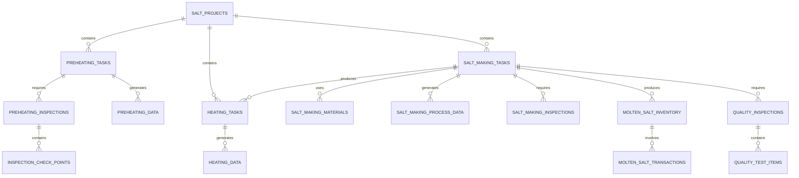
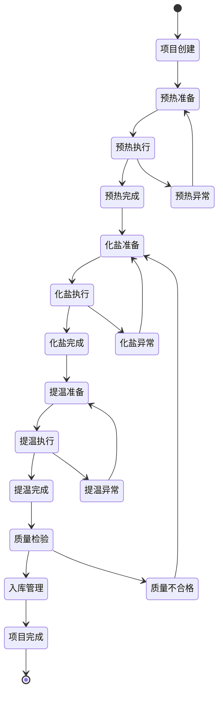

# 化盐项目工艺流程管理模块 - 技术设计文档

## 1. 模块架构设计

### 1.1 整体架构

```
┌─────────────────────────────────────────────────────────────────────────────┐
│                              Controller Layer                              │
├─────────────────────────────────────────────────────────────────────────────┤
│ SaltProjectController    │ PreheatingController    │ SaltMakingController   │
│ HeatingController        │ InventoryController     │ QualityController      │
│ TransferController       │ AnalyticsController     │                        │
└─────────────────────────────────────────────────────────────────────────────┘
                                        │
┌─────────────────────────────────────────────────────────────────────────────┐
│                               Service Layer                                │
├─────────────────────────────────────────────────────────────────────────────┤
│ ISaltProjectService      │ IPreheatingService      │ ISaltMakingService     │
│ IHeatingService          │ IInventoryService       │ IQualityService        │
│ ITransferService         │ IAnalyticsService       │                        │
└─────────────────────────────────────────────────────────────────────────────┘
                                        │
┌─────────────────────────────────────────────────────────────────────────────┐
│                               Mapper Layer                                 │
├─────────────────────────────────────────────────────────────────────────────┤
│ SaltProjectMapper        │ PreheatingTaskMapper    │ SaltMakingTaskMapper   │
│ HeatingTaskMapper        │ InventoryMapper         │ QualityInspectionMapper│
│ TransferRecordMapper     │ ProcessDataMapper       │                        │
└─────────────────────────────────────────────────────────────────────────────┘
                                        │
┌─────────────────────────────────────────────────────────────────────────────┐
│                              Database Layer                                │
├─────────────────────────────────────────────────────────────────────────────┤
│ salt_projects            │ preheating_tasks        │ salt_making_tasks      │
│ heating_tasks            │ molten_salt_inventory   │ quality_inspections    │
│ molten_salt_transactions │ process_data_records    │                        │
└─────────────────────────────────────────────────────────────────────────────┘
```

### 1.2 包结构设计

```
com.haitang.erp.saltprocess
├── controller/                          # 控制器层
│   ├── SaltProjectController.java       # 项目管理控制器
│   ├── PreheatingController.java        # 预热管理控制器
│   ├── SaltMakingController.java        # 化盐工艺控制器
│   ├── HeatingController.java           # 提温工艺控制器
│   ├── InventoryController.java         # 库存管理控制器
│   ├── QualityController.java           # 质量管理控制器
│   ├── TransferController.java          # 转运管理控制器
│   └── AnalyticsController.java         # 数据分析控制器
├── service/                             # 服务层
│   ├── ISaltProjectService.java         # 项目服务接口
│   ├── IPreheatingService.java          # 预热服务接口
│   ├── ISaltMakingService.java          # 化盐服务接口
│   ├── IHeatingService.java             # 提温服务接口
│   ├── IInventoryService.java           # 库存服务接口
│   ├── IQualityService.java             # 质量服务接口
│   ├── ITransferService.java            # 转运服务接口
│   ├── IAnalyticsService.java           # 分析服务接口
│   └── impl/                            # 服务实现
│       ├── SaltProjectServiceImpl.java
│       ├── PreheatingServiceImpl.java
│       ├── SaltMakingServiceImpl.java
│       ├── HeatingServiceImpl.java
│       ├── InventoryServiceImpl.java
│       ├── QualityServiceImpl.java
│       ├── TransferServiceImpl.java
│       └── AnalyticsServiceImpl.java
├── mapper/                              # 数据访问层
│   ├── SaltProjectMapper.java
│   ├── PreheatingTaskMapper.java
│   ├── PreheatingDataMapper.java
│   ├── PreheatingInspectionMapper.java
│   ├── SaltMakingTaskMapper.java
│   ├── SaltMakingMaterialMapper.java
│   ├── SaltMakingProcessDataMapper.java
│   ├── SaltMakingInspectionMapper.java
│   ├── HeatingTaskMapper.java
│   ├── HeatingDataMapper.java
│   ├── MoltenSaltInventoryMapper.java
│   ├── MoltenSaltTransactionMapper.java
│   ├── QualityInspectionMapper.java
│   ├── QualityTestItemMapper.java
│   └── InspectionCheckPointMapper.java
├── domain/                              # 领域对象
│   ├── SaltProject.java                 # 化盐项目实体
│   ├── PreheatingTask.java              # 预热任务实体
│   ├── PreheatingData.java              # 预热数据实体
│   ├── PreheatingInspection.java        # 预热巡检实体
│   ├── SaltMakingTask.java              # 化盐任务实体
│   ├── SaltMakingMaterial.java          # 化盐原料实体
│   ├── SaltMakingProcessData.java       # 化盐工艺数据实体
│   ├── SaltMakingInspection.java        # 化盐巡检实体
│   ├── HeatingTask.java                 # 提温任务实体
│   ├── HeatingData.java                 # 提温数据实体
│   ├── MoltenSaltInventory.java         # 熔盐库存实体
│   ├── MoltenSaltTransaction.java       # 熔盐交易实体
│   ├── QualityInspection.java           # 质量检验实体
│   ├── QualityTestItem.java             # 质量检验项目实体
│   ├── InspectionCheckPoint.java        # 巡检检查点实体
│   ├── bo/                              # 业务对象
│   │   ├── SaltProjectBo.java
│   │   ├── PreheatingTaskBo.java
│   │   ├── SaltMakingTaskBo.java
│   │   ├── HeatingTaskBo.java
│   │   ├── InventoryBo.java
│   │   └── QualityInspectionBo.java
│   └── vo/                              # 视图对象
│       ├── SaltProjectVo.java
│       ├── PreheatingTaskVo.java
│       ├── SaltMakingTaskVo.java
│       ├── HeatingTaskVo.java
│       ├── InventoryVo.java
│       ├── QualityInspectionVo.java
│       └── ProcessAnalyticsVo.java
├── convert/                             # 对象转换
│   ├── SaltProjectConvert.java
│   ├── PreheatingConvert.java
│   ├── SaltMakingConvert.java
│   ├── HeatingConvert.java
│   ├── InventoryConvert.java
│   └── QualityConvert.java
├── enums/                               # 枚举类
│   ├── ProjectType.java                 # 项目类型枚举
│   ├── ProjectStatus.java               # 项目状态枚举
│   ├── TaskStatus.java                  # 任务状态枚举
│   ├── EquipmentStatus.java             # 设备状态枚举
│   ├── ProcessStage.java                # 工艺阶段枚举
│   ├── InspectionStatus.java            # 巡检状态枚举
│   ├── QualityGrade.java                # 质量等级枚举
│   ├── TransactionType.java             # 交易类型枚举
│   └── InventoryStatus.java             # 库存状态枚举
├── utils/                               # 工具类
│   ├── ProcessCalculator.java           # 工艺计算工具
│   ├── TemperatureCurveAnalyzer.java    # 温度曲线分析工具
│   ├── QualityAnalyzer.java             # 质量分析工具
│   ├── InventoryCalculator.java         # 库存计算工具
│   └── ProcessDataValidator.java        # 工艺数据验证工具
└── config/                              # 配置类
    ├── ProcessConfig.java               # 工艺配置
    ├── QualityStandardConfig.java       # 质量标准配置
    └── AlertConfig.java                 # 预警配置
```

## 2. 数据模型设计

### 2.1 核心实体关系图



### 2.2 主要实体设计

#### 2.2.1 化盐项目实体 (SaltProject)

```java
@Data
@EqualsAndHashCode(callSuper = true)
@TableName("salt_projects")
public class SaltProject extends BaseEntity {
    
    /** 项目ID */
    @TableId(value = "id", type = IdType.ASSIGN_ID)
    private String id;
    
    /** 项目名称 */
    @NotBlank(message = "项目名称不能为空")
    @Size(max = 100, message = "项目名称长度不能超过100个字符")
    private String projectName;
    
    /** 项目编码 */
    @NotBlank(message = "项目编码不能为空")
    @Size(max = 50, message = "项目编码长度不能超过50个字符")
    private String projectCode;
    
    /** 项目类型 */
    @NotNull(message = "项目类型不能为空")
    private ProjectType projectType;
    
    /** 开始日期 */
    @NotNull(message = "开始日期不能为空")
    private LocalDate startDate;
    
    /** 结束日期 */
    private LocalDate endDate;
    
    /** 项目状态 */
    private ProjectStatus status;
    
    /** 项目经理ID */
    @NotBlank(message = "项目经理不能为空")
    private String managerId;
    
    /** 项目描述 */
    private String description;
}
```

#### 2.2.2 预热任务实体 (PreheatingTask)

```java
@Data
@EqualsAndHashCode(callSuper = true)
@TableName("preheating_tasks")
public class PreheatingTask extends BaseEntity {
    
    /** 任务ID */
    @TableId(value = "id", type = IdType.ASSIGN_ID)
    private String id;
    
    /** 项目ID */
    @NotBlank(message = "项目ID不能为空")
    private String projectId;
    
    /** 任务编码 */
    @NotBlank(message = "任务编码不能为空")
    private String taskCode;
    
    /** 熔盐罐ID */
    @NotBlank(message = "熔盐罐ID不能为空")
    private String tankId;
    
    /** 计划开始时间 */
    @NotNull(message = "计划开始时间不能为空")
    private LocalDateTime plannedStartTime;
    
    /** 计划结束时间 */
    @NotNull(message = "计划结束时间不能为空")
    private LocalDateTime plannedEndTime;
    
    /** 实际开始时间 */
    private LocalDateTime actualStartTime;
    
    /** 实际结束时间 */
    private LocalDateTime actualEndTime;
    
    /** 目标温度(°C) */
    @NotNull(message = "目标温度不能为空")
    @DecimalMin(value = "0", message = "目标温度不能小于0")
    @DecimalMax(value = "1000", message = "目标温度不能大于1000")
    private BigDecimal targetTemperature;
    
    /** 目标压力(MPa) */
    @NotNull(message = "目标压力不能为空")
    @DecimalMin(value = "0", message = "目标压力不能小于0")
    private BigDecimal targetPressure;
    
    /** 任务状态 */
    private TaskStatus status;
    
    /** 操作员ID */
    @NotBlank(message = "操作员ID不能为空")
    private String operatorId;
    
    /** 备注 */
    private String remarks;
}
```

#### 2.2.3 化盐任务实体 (SaltMakingTask)

```java
@Data
@EqualsAndHashCode(callSuper = true)
@TableName("salt_making_tasks")
public class SaltMakingTask extends BaseEntity {
    
    /** 任务ID */
    @TableId(value = "id", type = IdType.ASSIGN_ID)
    private String id;
    
    /** 项目ID */
    @NotBlank(message = "项目ID不能为空")
    private String projectId;
    
    /** 任务编码 */
    @NotBlank(message = "任务编码不能为空")
    private String taskCode;
    
    /** 批次号 */
    @NotBlank(message = "批次号不能为空")
    private String batchNumber;
    
    /** 工艺类型 */
    @NotNull(message = "工艺类型不能为空")
    private ProcessType processType;
    
    /** 计划开始时间 */
    @NotNull(message = "计划开始时间不能为空")
    private LocalDateTime plannedStartTime;
    
    /** 计划结束时间 */
    @NotNull(message = "计划结束时间不能为空")
    private LocalDateTime plannedEndTime;
    
    /** 实际开始时间 */
    private LocalDateTime actualStartTime;
    
    /** 实际结束时间 */
    private LocalDateTime actualEndTime;
    
    /** 目标产量(kg) */
    @NotNull(message = "目标产量不能为空")
    @DecimalMin(value = "0", message = "目标产量不能小于0")
    private BigDecimal targetQuantity;
    
    /** 实际产量(kg) */
    private BigDecimal actualQuantity;
    
    /** 目标配比 */
    @NotBlank(message = "目标配比不能为空")
    private String targetRatio;
    
    /** 任务状态 */
    private TaskStatus status;
    
    /** 操作员ID */
    @NotBlank(message = "操作员ID不能为空")
    private String operatorId;
    
    /** 备注 */
    private String remarks;
}
```

## 3. 接口设计规范

### 3.1 RESTful API 设计标准

#### 3.1.1 URL 命名规范

```
基础路径: /erp/salt-process/v1

项目管理:
- GET    /projects                    # 获取项目列表
- POST   /projects                    # 创建项目
- GET    /projects/{id}               # 获取项目详情
- PUT    /projects/{id}               # 更新项目
- DELETE /projects/{id}               # 删除项目

预热管理:
- GET    /projects/{projectId}/preheating/tasks     # 获取预热任务列表
- POST   /projects/{projectId}/preheating/tasks     # 创建预热任务
- GET    /preheating/tasks/{id}                     # 获取预热任务详情
- PUT    /preheating/tasks/{id}                     # 更新预热任务
- POST   /preheating/tasks/{id}/data                # 记录预热数据
- GET    /preheating/tasks/{id}/data                # 获取预热数据
- POST   /preheating/tasks/{id}/inspections         # 创建预热巡检
- GET    /preheating/tasks/{id}/inspections         # 获取预热巡检记录

化盐管理:
- GET    /projects/{projectId}/salt-making/tasks    # 获取化盐任务列表
- POST   /projects/{projectId}/salt-making/tasks    # 创建化盐任务
- GET    /salt-making/tasks/{id}                    # 获取化盐任务详情
- PUT    /salt-making/tasks/{id}                    # 更新化盐任务
- POST   /salt-making/tasks/{id}/process-data       # 记录工艺数据
- GET    /salt-making/tasks/{id}/process-data       # 获取工艺数据
- POST   /salt-making/tasks/{id}/inspections        # 创建化盐巡检
- GET    /salt-making/tasks/{id}/inspections        # 获取化盐巡检记录

提温管理:
- GET    /projects/{projectId}/heating/tasks        # 获取提温任务列表
- POST   /projects/{projectId}/heating/tasks        # 创建提温任务
- GET    /heating/tasks/{id}                        # 获取提温任务详情
- PUT    /heating/tasks/{id}                        # 更新提温任务
- POST   /heating/tasks/{id}/data                   # 记录提温数据
- GET    /heating/tasks/{id}/data                   # 获取提温数据
- GET    /heating/tasks/{id}/temperature-curve      # 获取温度曲线

库存管理:
- GET    /inventory/stock                           # 获取库存列表
- POST   /inventory/inbound                         # 熔盐入库
- POST   /inventory/outbound-request                # 熔盐出库申请
- PUT    /inventory/outbound/{requestId}/approve    # 出库审批
- POST   /inventory/transfer                        # 熔盐转运
- GET    /inventory/alerts                          # 库存预警

质量管理:
- POST   /quality/inspections                       # 创建质量检验
- GET    /quality/inspections/{id}                  # 获取质量检验详情
- GET    /quality/reports/{batchNumber}             # 获取质量报告

数据分析:
- GET    /analytics/process-efficiency              # 工艺效率分析
- GET    /analytics/energy-consumption              # 能耗分析
- GET    /analytics/production-stats                # 生产统计
```

#### 3.1.2 请求响应格式

**统一响应格式:**
```java
@Data
public class R<T> {
    /** 响应码 */
    private Integer code;
    
    /** 响应消息 */
    private String message;
    
    /** 响应数据 */
    private T data;
    
    /** 时间戳 */
    private Long timestamp;
    
    /** 请求ID */
    private String requestId;
}
```

**分页响应格式:**
```java
@Data
public class TableDataInfo<T> {
    /** 总记录数 */
    private Long total;
    
    /** 当前页码 */
    private Long page;
    
    /** 每页大小 */
    private Long size;
    
    /** 数据列表 */
    private List<T> rows;
}
```

### 3.2 数据转换规范

#### 3.2.1 MapStruct 转换器设计

```java
@Mapper(componentModel = "spring")
public interface SaltProjectConvert {
    
    SaltProjectConvert INSTANCE = Mappers.getMapper(SaltProjectConvert.class);
    
    /**
     * Entity转VO
     */
    SaltProjectVo toVo(SaltProject entity);
    
    /**
     * Entity列表转VO列表
     */
    List<SaltProjectVo> toVo(List<SaltProject> entityList);
    
    /**
     * Bo转Entity
     */
    SaltProject toEntity(SaltProjectBo bo);
    
    /**
     * VO转Bo
     */
    SaltProjectBo toBo(SaltProjectVo vo);
}
```

#### 3.2.2 复杂类型转换处理

对于JSON字段和复杂类型转换，使用专门的转换器：

```java
@Component
public class ProcessDataConverter {
    
    private static final ObjectMapper objectMapper = new ObjectMapper();
    
    @Named("jsonToRatioMap")
    public static Map<String, BigDecimal> jsonToRatioMap(String ratioJson) {
        if (StringUtils.isBlank(ratioJson)) {
            return new HashMap<>();
        }
        try {
            return objectMapper.readValue(ratioJson, 
                new TypeReference<Map<String, BigDecimal>>() {});
        } catch (JsonProcessingException e) {
            log.warn("解析配比JSON失败: {}", ratioJson, e);
            return new HashMap<>();
        }
    }
    
    @Named("ratioMapToJson")
    public static String ratioMapToJson(Map<String, BigDecimal> ratioMap) {
        if (ratioMap == null || ratioMap.isEmpty()) {
            return "{}";
        }
        try {
            return objectMapper.writeValueAsString(ratioMap);
        } catch (JsonProcessingException e) {
            log.error("转换配比Map为JSON失败", e);
            return "{}";
        }
    }
}
```

## 4. 业务逻辑设计

### 4.1 工艺流程状态机



### 4.2 核心业务规则

#### 4.2.1 预热管理业务规则

1. **温度控制规则**
   - 预热温度范围：200°C - 500°C
   - 升温速率：不超过5°C/min
   - 温度偏差：±5°C

2. **压力控制规则**
   - 压力范围：0.1 - 3.0 MPa
   - 压力变化率：不超过0.1 MPa/min

3. **时间控制规则**
   - 最短预热时间：2小时
   - 最长预热时间：8小时

#### 4.2.2 化盐工艺业务规则

1. **配比控制规则**
   - 二元化盐：NaNO3:KNO3 = 60:40 (±2%)
   - 三元化盐：NaNO3:KNO3:NaNO2 = 7:53:40 (±2%)

2. **温度控制规则**
   - 化盐温度：550°C - 600°C
   - 温度稳定性：±3°C

3. **质量控制规则**
   - 纯度要求：≥99%
   - 水分含量：≤0.1%
   - 杂质含量：≤0.5%

#### 4.2.3 库存管理业务规则

1. **安全库存规则**
   - 二元化盐：最低库存500kg
   - 三元化盐：最低库存300kg

2. **保质期规则**
   - 标准保质期：12个月
   - 预警期：保质期前30天

3. **出库优先级规则**
   - 先进先出(FIFO)
   - 质量等级优先
   - 保质期优先

## 5. 异常处理设计

### 5.1 异常分类

```java
public class SaltProcessException extends ServiceException {
    
    /** 工艺参数异常 */
    public static final String PROCESS_PARAMETER_ERROR = "PROCESS_PARAMETER_ERROR";
    
    /** 温度异常 */
    public static final String TEMPERATURE_ABNORMAL = "TEMPERATURE_ABNORMAL";
    
    /** 压力异常 */
    public static final String PRESSURE_ABNORMAL = "PRESSURE_ABNORMAL";
    
    /** 配比异常 */
    public static final String RATIO_ERROR = "RATIO_ERROR";
    
    /** 质量检验失败 */
    public static final String QUALITY_CHECK_FAILED = "QUALITY_CHECK_FAILED";
    
    /** 库存不足 */
    public static final String INSUFFICIENT_INVENTORY = "INSUFFICIENT_INVENTORY";
}
```

### 5.2 异常处理策略

```java
@RestControllerAdvice
public class SaltProcessExceptionHandler {
    
    @ExceptionHandler(SaltProcessException.class)
    public R<Void> handleSaltProcessException(SaltProcessException e) {
        log.error("化盐工艺异常: {}", e.getMessage(), e);
        return R.fail(e.getCode(), e.getMessage());
    }
    
    @ExceptionHandler(ProcessParameterException.class)
    public R<Void> handleProcessParameterException(ProcessParameterException e) {
        log.error("工艺参数异常: {}", e.getMessage(), e);
        // 触发工艺参数调整流程
        processParameterAdjustmentService.handleParameterException(e);
        return R.fail("工艺参数异常，已启动自动调整流程");
    }
}
```

## 6. 性能优化设计

### 6.1 数据库优化

1. **索引设计**
   - 项目查询索引：(project_code, status)
   - 时间范围查询索引：(timestamp, task_id)
   - 批次查询索引：(batch_number, product_type)

2. **分表策略**
   - 工艺数据按月分表
   - 历史数据定期归档

3. **缓存策略**
   - 项目基础信息缓存
   - 工艺标准参数缓存
   - 实时数据Redis缓存

### 6.2 接口性能优化

1. **异步处理**
   - 大批量数据导入异步处理
   - 复杂统计分析异步计算

2. **数据压缩**
   - 历史数据压缩存储
   - API响应数据压缩

3. **分页优化**
   - 深度分页优化
   - 游标分页支持

## 7. 安全设计

### 7.1 权限控制

```java
@PreAuthorize("hasPermission('salt:project:view')")
public class SaltProjectController {
    
    @SaCheckPermission("salt:project:list")
    @GetMapping("/list")
    public TableDataInfo<SaltProjectVo> list(SaltProjectBo bo, PageQuery pageQuery) {
        return saltProjectService.queryPageList(bo, pageQuery);
    }
    
    @SaCheckPermission("salt:project:add")
    @PostMapping()
    public R<Void> add(@Validated(AddGroup.class) @RequestBody SaltProjectBo bo) {
        return toAjax(saltProjectService.insertByBo(bo));
    }
}
```

### 7.2 数据安全

1. **敏感数据加密**
   - 工艺配方数据加密存储
   - 质量检验数据加密传输

2. **操作审计**
   - 关键操作日志记录
   - 数据变更审计跟踪

3. **访问控制**
   - IP白名单限制
   - 操作时间窗口控制
